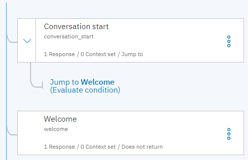

---

copyright:
  years: 2015, 2019
lastupdated: "2019-01-11"

subcollection: assistant

---

{:shortdesc: .shortdesc}
{:new_window: target="_blank"}
{:deprecated: .deprecated}
{:important: .important}
{:note: .note}
{:tip: .tip}
{:pre: .pre}
{:codeblock: .codeblock}
{:screen: .screen}
{:javascript: .ph data-hd-programlang='javascript'}
{:java: .ph data-hd-programlang='java'}
{:python: .ph data-hd-programlang='python'}
{:swift: .ph data-hd-programlang='swift'}

# Dialogmodul starten
{: #dialog-start}

Der integrierte Knoten 'welcome' kann nicht dazu verwendet werden, das Dialogmodul für alle Integrationen auf dieselbe Weise zu starten. Verwenden Sie stattdessen die folgende Ausweichlösung.
{: shortdesc}

Die Antwort, die Sie für den Knoten 'welcome' im Dialogmodul definieren, wird angezeigt, um einen Dialog über den Fensterbereich 'Ausprobieren' des Tools und über das Chat-Widget der Vorschaulink-Integration einzuleiten. Dieser Knoten wird in den meisten anderen Kanalintegrationen jedoch nicht angezeigt, da Knoten mit der Sonderbedingung `welcome` in Dialogabläufen, die von Benutzern gestartet wurden, übersprungen werden. Außerdem warten bereitgestellte Assistenten normalerweise darauf, dass der Dialog von einem Benutzer gestartet wird und nicht umgekehrt.

Im Unterschied zur Sonderbedingung `welcome` wird die Sonderbedingung `conversation_start` immer am Anfang eines Dialogmoduls ausgelöst. Sie können eine Kombination aus Knoten mit diesen beiden Sonderbedingungen (`welcome` und `conversation_start`) verwenden, damit Ihr Dialogmodul auf konsistente Weise gestartet wird.

So steuern Sie den Startvorgang für Ihr Dialogmodul: 

1.  Fügen Sie einen Dialogknoten vor dem Knoten 'welcome' hinzu, der beim Erstellen des Dialogmoduls automatisch am Anfang der Baumstruktur des Dialogmoduls eingefügt wird. 

1.  Geben Sie für den neu hinzugefügten Knoten die Knotenbedingung `conversation_start` (eine der zuvor beschriebenen Sonderbedingungen) an. 

1.  Definieren Sie alle Kontextvariablen, die Sie festlegen möchten, mit Standardwerten für das Dialogmodul im Knoten `conversation_start`.

1.  Definieren Sie für diesen Knoten keine Textantwort.

1.  Konfigurieren Sie den Knoten so, dass er den direkt untergeordneten Knoten `welcome` in der Baumstruktur des Dialogmoduls aufruft, und wählen Sie die Einstellung **Bei Erkennung durch Bot (Bedingung)** aus.

Dadurch entsteht ein Dialogmodul, das wie folgt funktioniert: 

- Der Knoten `conversation_start` wird unabhängig vom Integrationstyp verarbeitet, d. h. alle Kontextvariablen, die Sie in dem Knoten definieren, werden initialisiert.
- Bei Integrationen, in denen der Assistent den Dialogablauf startet, wird der Knoten `welcome` ausgelöst und die zugehörige Textantwort angezeigt. 
- Bei Integrationen, in denen der Benutzer den Dialogablauf startet, wird die erste Benutzereingabe ausgewertet und anschließend von dem Knoten verarbeitet, der die beste Antwort liefern kann. 
