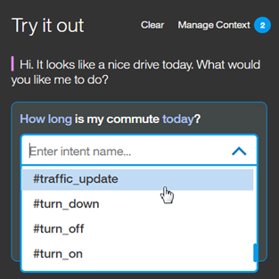
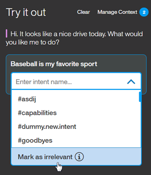
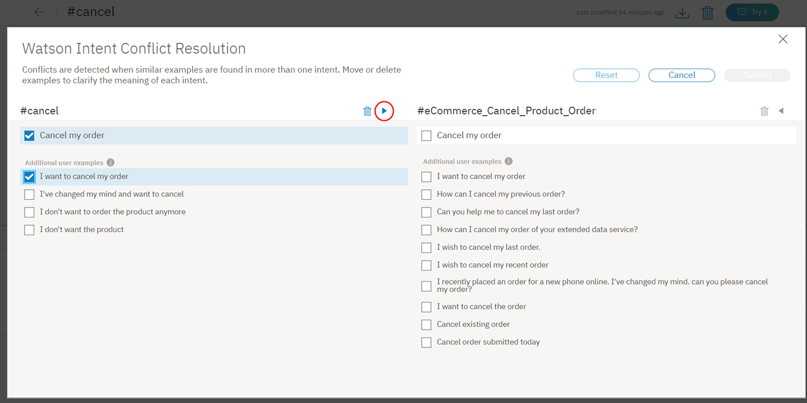
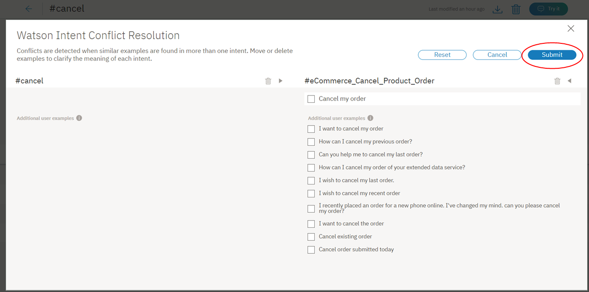

---

copyright:
  years: 2015, 2019
lastupdated: "2019-02-28"

subcollection: assistant

---

{:shortdesc: .shortdesc}
{:new_window: target="_blank"}
{:deprecated: .deprecated}
{:important: .important}
{:note: .note}
{:tip: .tip}
{:pre: .pre}
{:codeblock: .codeblock}
{:screen: .screen}
{:javascript: .ph data-hd-programlang='javascript'}
{:java: .ph data-hd-programlang='java'}
{:python: .ph data-hd-programlang='python'}
{:swift: .ph data-hd-programlang='swift'}

# Absichten definieren
{: #intents}

***Absichten*** sind Zwecke oder Ziele, die in der Eingabe eines Kunden ausgedrückt werden, beispielsweise die Beantwortung einer Frage oder die Verarbeitung einer Rechnungszahlung. Indem der Service '{{site.data.keyword.conversationshort}}' die in einer Kundeneingabe ausgedrückte Absicht erkennt, kann er den korrekten Dialogmodulablauf für ihre Beantwortung auswählen.
{: shortdesc}

<iframe class="embed-responsive-item" id="youtubeplayer" title="Mit Absichten arbeiten" type="text/html" width="640" height="390" src="https://www.youtube.com/embed/OPdOCUPGMIQ" frameborder="0" webkitallowfullscreen mozallowfullscreen allowfullscreen> </iframe>

## Absichtserstellung im Überblick
{: #intents-described}

- Planen Sie die Absichten für Ihre Anwendung.

  Überlegen Sie, welche Intentionen Ihre Kunden vermutlich haben, und welche Vorgänge Ihre Anwendung im Auftrag der Kunden ausführen können soll. Ihre Anwendung könnte beispielsweise Ihre Kunden dabei unterstützen, einen Einkauf zu tätigen. Wenn dies der Fall ist, können Sie eine Absicht `#buy_something` hinzufügen. (Das Präfix `#` vor dem Absichtsnamen unterstützt die eindeutige Identifizierung des Elements als eine Absicht.)

- Teilen Sie Watson Ihre Absichten mit.

  Sobald Sie festgelegt haben, welche Geschäftsanforderungen Ihre Anwendung im Namen Ihrer Kunden abwickeln soll, müssen Sie Watson davon in Kenntnis setzen. Für jedes Geschäftsziel (z. B. `#buy_something`) müssen Sie mindestens 10 Beispiele für Äußerungen bereitstellen, mit denen Ihre Kunden in der Regel ihre Intention ausdrücken. Beispiel: `Ich möchte etwas kaufen.`
  
  Ideal sind Beispiele für realistische Äußerungen. Diese können aus bereits vorhandenen Geschäftsprozessen extrahiert werden. Die Benutzerbeispiele sollten auf Ihr spezifisches Geschäftsfeld abgestimmt sein. Wenn es zum Beispiel um eine Versicherungsgesellschft geht, sehen Ihre Benutzerbeispiele möglicherweise so aus: `Ich möchte eine neue XYZ-Versicherung abschließen.`
  
  Anhand der von Ihnen bereitgestellten Beispiele erstellt der Service ein Modell für maschinelles Lernen, dass diese und ähnliche Äußerungen erkennen und der entsprechenden Absicht zuordnen kann. 

Beginnen Sie mit wenigen Absichten, testen Sie diese und erweitern Sie schrittweise den Einsatzbereich der Anwendung.

## Absichten erstellen
{: #intents-create-task}

Zum Erstellen von Absichten verwenden Sie das {{site.data.keyword.conversationshort}}-Tool.

1.  Öffnen Sie Ihren Dialogskill im {{site.data.keyword.conversationshort}}-Tool. Die Seite **Absichten** für den Skill wird geöffnet.

1.  Wählen Sie **Neue erstellen** aus.

1.  Geben Sie im Feld **Name der Absicht** einen Namen für die Absicht ein.
    - Der Name der Absicht kann Buchstaben (in Unicode), Ziffern, Unterstreichungszeichen, Bindestriche und Punkte enthalten.
    - Der Name kann aus `..` oder einer beliebigen anderen Zeichenfolge ausschließlich mit Zeichen bestehen.
    - Namen von Absichten dürfen keine Leerzeichen enthalten und nicht länger als 128 Zeichen sein. Beispiele für Namen von Absichten:
        - `#wetterlage`
        - `#rechnung_zahlen`
        - `#eskalation_an_agenten`

    Das Tool fügt automatisch das Zeichen `#` in den Absichtsnamen ein. Sie müssen dieses Zeichen also nicht selbst hinzufügen.
    {: tip}

    Geben Sie eine Beschreibung der Absicht in das Feld **Beschreibung** ein.

1.  Wählen Sie **Absicht erstellen** aus, um den Namen der Absicht zu speichern.

    

1.  Geben Sie als nächstes im Feld **Benutzerbeispiele hinzufügen** den Text eines Benutzerbeispiels für die Absicht ein. Ein Beispiel kann bis zu 1024 Zeichen lang sein. Mögliche Beispiele für die Absicht `#rechnung_zahlen`:
    - `Ich muss meine Rechnung zahlen.`
    - `Kontostand ausgleichen`
    - `Zahlung vornehmen`

    Informationen zum Hinzufügen von Benutzerbeispielen, die aus realen Support-Anfragen Ihrer Kunden extrahiert wurden, enthält der Abschnitt [Beispiele aus Protokolldateien hinzufügen](#intents-intent-recommendations).

    Informationen dazu, wie sich das Einfügen von Entitätsreferenzen in Ihre Benutzerbeispiele auswirkt, enthält der Abschnitt [Behandlung von Entitätsreferenzen](#intents-entity-references).
    {: tip}

    Absichtsnamen und Beispieltext können in URLs zugänglich gemacht werden, wenn eine Anwendung mit dem Service interagiert. Verwenden Sie in diesen Artefakten keine vertraulichen oder persönlichen Daten.
    {: important}

1.  Klicken Sie auf **Beispiel hinzufügen**, um das Beispiel zu speichern.

1.  Wiederholen Sie diesen Prozess, um weitere Beispiele hinzuzufügen. Mit der Tabulatortaste können Sie zwischen den einzelnen Beispielen wechseln. Geben Sie für jede Absicht mindestens fünf Beispiele an. Je mehr Beispiele Sie angeben, desto präziser kann die Anwendung arbeiten.

    Informationen zum Anfordern von Hilfe für die Erstellung von Benutzerbeispielen enthält der Abschnitt [Empfehlungen für Benutzerbeispiele für Absichten anfordern](/docs/services/assistant?topic=assistant-intent-recommendations#intent-recommendations-get-example-recommendations).

1.  Nachdem Sie Beispiele hinzugefügt haben, klicken Sie auf den , um das Erstellen der Absicht abzuschließen.

Das System beginnt damit, sich selbst mit der Absicht und den Benutzerbeispielen zu trainieren, die Sie hinzugefügt haben. 

## Behandlung von Entitätsreferenzen
{: #intents-entity-references}

Wenn Sie eine Entitätserwähnung in ein Benutzerbeispiel einfügen, werden diese Informationen vom Modell für maschinelles Lernen in den vorliegenden Szenarios auf unterschiedliche Weise verwendet: 

- [Entitätswerte und -synonyme in Beispielen für Absichten referenzieren](#intents-related-entities)
- [Annotierte Erwähnungen](#intents-annotated-mentions)
- [Einen Entitätsnamen in einem Beispiel für eine Absicht direkt referenzieren](#intents-entity-as-example)

### Entiätswerte und -synonyme in Beispielen für Absichten direkt referenzieren
{: #intents-related-entities}

Wenn Sie zugehörige Entitäten für diese Absicht definiert haben oder definieren möchten, erwähnen Sie die Entitätswerte oder -synonyme in einigen der Beispiele. Dies fördert den Aufbau einer Beziehung zwischen der Absicht und den Entitäten. Auch eine schwache Beziehung trainiert das Modell.


*Wichtig*:

  - Die Beispieldaten für Absichten sollen repräsentativ und typisch für die von Benutzern bereitgestellten Daten sein. Beispiele können aus tatsächlichen Benutzereingaben extrahiert oder von Fachleuten des betreffenden Gebiets gesammelt werden. Wichtig ist, dass die Daten repräsentativ und zuverlässig sind.
  - Sowohl die Trainings- als auch die Testdaten (für Auswertungszwecke) sollen die Verteilung der Absichten im tatsächlichen Gebrauch widerspiegeln. Generell gilt: Für häufiger verwendete Absichten werden mehr Beispiele angegeben und sie werden in den Antworten stärker berücksichtigt.
  - Die Interpunktion im Beispieltext soll dem üblichen Sprachgebrauch entsprechen. Wenn Sie der Meinung sind, dass manche Benutzer Ihre Absichten durch Beispiele mit Interpunktion ausdrücken und andere Benutzer nicht, dann schließen Sie beide Versionen ein. Je mehr unterschiedliche Musterbeispiele vorliegen, umso besser die Antwort.

### Annotierte Erwähnungen
{: #intents-annotated-mentions}

Beim Definieren von Entitäten können Sie Erwähnungen der Entität in Ihren Benutzerbeispielen für Absichten direkt annotieren. Eine Beziehung zwischen der Absicht und der Entität, die Sie auf diese Weise angeben, wird *nicht* im Klassifizierungsmodell für Absichten verwendet. Wenn Sie die Erwähnung jedoch zu der Entität hinzufügen, wird sie auch als neuer Wert zu dieser Entität hinzugefügt. Und wenn Sie die Erwähnung zu einem vorhandenen Entitätswert hinzufügen, wird sie auch als neues Synonym zu dieser Entität hinzugefügt. Wörterverzeichnisreferenzen dieser Art in Benutzerbeisielen für Absichten werden bei der Absichtsklassifizierung verwendet, um einen schwachen Bezug zwischen einer Absicht und einer Entität herzustellen.

Weitere Informationen zu kontextbasierten Entitäten enthält der Abschnitt [Kontextbasierte Entitäten hinzufügen](/docs/services/assistant?topic=assistant-entities#entities-create-annotation-based). 

### Einen Entitätsnamen in einem Beispiel für eine Absicht direkt referenzieren 
{: #intents-entity-as-example}

Wenn dieser erweiterte Ansatz verwendet wird, muss er durchgängig verwendet werden.
{: note}

Sie können Entitäten in Ihren Beispielen für Absichten direkt referenzieren. Angenommen, Sie verfügen über eine Entität namens `@PhoneModelName` mit den darin enthaltenen Werten *Galaxy S8*, *Moto Z2*, *LG G6* und *Google Pixel 2*. Beim Erstellen der Absicht `#order_phone` könnten Sie die folgenden Trainingsdaten bereitstellen:

- Bieten Sie das `@PhoneModelName` an?
- Helfen Sie mir, ein `@PhoneModelName` zu bestellen.
- Haben Sie das `@PhoneModelName` vorrätig?
- Das `@PhoneModelName` zu meiner Bestellung hinzufügen.


Gegenwärtig können Sie nur von Ihnen definierte Synonymentitäten direkt referenzieren (Musterwerte werden ignoriert). Sie können keine [Systementitäten](/docs/services/assistant?topic=assistant-system-entities) verwenden.

Wenn Sie eine Entität (z. B. `@PhoneModelName`) als Beispiel für eine Absicht *anywhere* in Ihren Trainingsdaten referenzieren, wird dadurch der Wert einer direkten Referenz (z. B. *Galaxy S8*) in einem Beispiel für eine Absicht an jeder anderen Position ausgeschlossen. Daraufhin wird für alle Absichten das Konzept 'Entität als Beispiel für Absicht' verwendet. Es ist nicht möglich, dieses Konzept nur auf eine bestimmte Absicht anzuwenden.
{: important}

In der Praxis bedeutet dies: Wenn Sie bisher die meisten Absichten unter Verwendung direkter Referenzen (z. B. *Galaxy S8*) trainiert haben und jetzt nur für eine einzige Absicht Entitätsreferenzen verwenden (z. B. `@PhoneModelName`), dann wirkt sich diese Änderung auf Ihre vorherigen Trainingsvorgänge aus. Wenn Sie sich entschließen, Referenzen des Typs `@Entity` zu verwenden, müssen Sie alle vorherigen direkten Referenzen durch Referenzen des Typs `@Entity` ersetzen.

Das Definieren einer Beispielabsicht mit einer Entität (`@Entity`), für die 10 Werte definiert sind, bedeutet **nicht**, dass diese Beispielabsicht zehnmal angegeben wird. Der {{site.data.keyword.conversationshort}}-Service ordnet dieser einen Beispielabsichtssyntax keine derart hohe Gewichtung zu.

## Absichten testen
{: #intents-test}

Nachdem Sie die neuen Absichten erstellt haben, können Sie das System testen und feststellen, ob es Ihre Absichten wie erwartet erkennt.

1.  Klicken Sie im {{site.data.keyword.conversationshort}}-Tool auf das Symbol .

1.  Geben Sie im Fenster *Ausprobieren* eine Frage oder eine andere Textzeichenfolge ein und drücken Sie die Eingabetaste, um zu ermitteln, welche Absicht erkannt wird. Sollte die falsche Absicht erkannt werden, können Sie Ihr Modell verbessern, indem Sie den entsprechenden Text als Beispiel zur passenden Absicht hinzufügen.

    Falls Sie kürzlich Änderungen am Skill vorgenommen haben, wird möglicherweise in einer Nachricht darauf hingewiesen, dass das System noch mit dem erneuten Training beschäftigt ist. Wenn diese Nachricht ausgegeben wird, warten Sie mit dem Test, bis das Training abgeschlossen ist:
    {: tip}

    

    Die Antwort gibt Aufschluss darüber, welche Absicht aus Ihrer Eingabe erkannt wurde.

    

1.  Falls das System nicht dir richtige Absicht erkennt, können Sie dies korrigieren. Zur Korrektur der erkannten Absicht wählen Sie die angezeigte Absicht und anschließend die richtige Absicht in der Liste aus. Nachdem Sie die Korrektur übergeben haben, trainiert sich das System automatisch selbst, um die neuen Daten zu integrieren.

    

1.  Wenn die Eingabe zu keiner der Absichten in Ihrer Anwendung gehört, können Sie den Service trainieren, indem Sie die angezeigte Absicht auswählen und anschließend auf **Als irrelevant markieren** klicken.

    

    *Als irrelevant markieren*
    {: #intents-mark-irrelevant}

    Die Option *Als irrelevant markieren* ist nicht in allen Sprachen verfügbar. Details enthält der Abschnitt [Unterstützte Sprachen](/docs/services/assistant?topic=assistant-language-support).

    **Wichtig**: Als irrelevant markierte Absichten werden im JSON-Arbeitsbereich als Gegenbeispiele gespeichert und in die Trainingsdaten einbezogen. Vergewissern Sie sich sorgfältig, bevor Sie eine Eingabe als irrelevant markieren. 

      - Die Eingaben können im Tool später nicht mehr aufgerufen oder geändert werden. 
      - Die Kennzeichnung einer Eingabe als irrelevant kann nur rückgängig gemacht werden, indem dieselbe Eingabe in der Anzeige *Ausprobieren* erneut verwendet und diesmal einer Absicht zugewiesen wird.

Wenn Ihre Absichten nicht korrekt erkannt werden, kann es sinnvoll sein, die folgenden Änderungen vorzunehmen:

- Fügen Sie den nicht erkannten Text als Beispiel zur entsprechenden Absicht hinzu.
- Verschieben Sie vorhandene Beispiele von einer Absicht zu einer anderen Absicht.
- Denken Sie darüber nach, ob Ihre Absichten zu ähnlich sind, und definieren Sie sie entsprechend neu.

## Absolute Bewertung
{: #intents-absolute-scoring}

Der {{site.data.keyword.conversationshort}}-Service bewertet die Konfidenz jeder Absicht separat und nicht in Relation zu anderen Absichten. Dieser Ansatz bietet mehr Flexibilität, da in einer einzigen Benutzereingabe mehrere Absichten erkannt werden können. Außerdem bedeutet es, dass das System möglicherweise auch gar keine Absicht zurückgibt. Wenn die häufigste Absicht einen niedrigen Konfidenzwert (kleiner als 0,2) unter allen Absichten hat, wird sie in das von der API zurückgegebene Array für Absichten einbezogen, aber Knoten, die sich auf diese Absicht beziehen, werden nicht ausgelöst. Wenn Sie Fälle ermitteln möchten, in denen keine Absichten mit hoher Konfidenzbewertung erkannt wurden, verwenden Sie die Sonderbedingung `irrelevant` in Ihrem Dialogmodulknoten. Weitere Informationen enthält der Abschnitt [Sonderbedingungen](/docs/services/assistant?topic=assistant-dialog-overview#dialog-overview-special-conditions).

Wenn sich die Konfidenzbewertung von Absichten ändert, müssen Ihre Dialogmodule möglicherweise neu strukturiert werden. Wenn in der Bedingung für einen Dialogmodulknoten eine Absicht verwendet wird und die Konfidenzbewertung der Absicht ständig unter den Wert 0,2 fällt, wird die Verarbeitung des Dialogmodulknotens ausgesetzt. Wenn sich die Konfidenzbewertung ändert, kann sich auch das Verhalten des Dialogmoduls ändern.

## Begrenzungen für Absichten
{: #intents-limits}

Die Anzahl der Absichten und Beispiele, die Sie erstellen können, richtet sich nach Ihrem {{site.data.keyword.conversationshort}}-Serviceplan:

| Serviceplan     | Absichten pro Skilll | Beispiele pro Skill |
|------------------|------------------:|-------------------:|
| Premium          |             2.000 |             25.000 |
| Plus             |             2.000 |             25.000 |
| Standard         |             2.000 |             25.000 |
| Lite             |               100 |             25.000 |
{: caption="Serviceplandetails" caption-side="top"}

## Absichten bearbeiten
{: #intents-edit}

Sie können auf jede Absicht in der Liste klicken, um sie zu öffnen und zu bearbeiten. Hierbei können Sie die folgenden Änderungen vornehmen:

- Sie können die Absicht umbenennen.
- Sie können die Absicht löschen.
- Sie können Beispiele hinzufügen, bearbeiten oder löschen.
- Sie können ein Beispiel in eine andere Absicht verschieben.

Mit der Tabulatortaste können Sie vom Namen der Absicht zu den einzelnen Beispielen springen und die Beispiele bei Bedarf bearbeiten. 

Um ein Beispiel zu verschieben oder zu löschen, wählen Sie das zugehörige Kontrollkästchen aus und klicken Sie anschließend auf **Verschieben** oder **Löschen**.

  

## Absichten suchen
{: #intents-search}

Verwenden Sie die Suchfunktion, um Benutzerbeispiele, Namen von Absichten und Beschreibungen zu finden.

1.  Klicken Sie auf der Seite **Absichten** auf das Symbol 'Suche'.

    

1.  Geben Sie einen Suchbegriff oder -ausdruck ein.

    

Absichten, die Ihren Suchbegriff enthalten, und entsprechende Beispiele werden angezeigt.

  

## Absichten exportieren
{: #intents-export}

Sie können mehrere Absichten in eine CSV-Datei exportieren, um sie später zu importieren und für eine andere {{site.data.keyword.conversationshort}}-Anwendung wiederzuverwenden.

1.  Wählen Sie in der Liste auf der Seite **Absichten** die gewünschten Absichten aus und wählen Sie dann **Exportieren** aus.

    

## Absichten und Beispiele importieren
{: #intents-import}

Bei einer großen Anzahl von Absichten und Beispielen kann es einfacher sein, diese aus einer CSV-Datei zu importieren, als sie einzeln im {{site.data.keyword.conversationshort}}-Tool zu definieren. Stellen Sie sicher, dass alle sensiblen Daten aus den Äußerungen entfernt wurden, die Sie in die Datei aufnehmen. 

Alternativ können Sie eine Datei mit unformatierten Benutzeräußerungen (z. B. aus Call-Center-Protokollen) hochladen und die Daten vom Service nach Kandidaten für Benutzerbeispiele durchsuchen lassen. Weitere Informationen enthält der Abschnitt [Beispiele aus Protokolldateien hinzufügen](/docs/services/assistant?topic=assistant-intent-recommendations#intent-recommendations-get-example-recommendations). Dieses Feature ist nur für Benutzer des Plus- oder des Premium-Plans verfügbar.

1.  Erfassen Sie die Absichten und Beispiele in einer CSV-Datei oder exportieren Sie sie aus einem Tabellenkalkulationsprogramm in eine CSV-Datei. Jede Zeile in der Datei muss das folgende erforderliche Format aufweisen:

    ```
    <beispiel>,<absicht>
    ```
    {: screen}

    Hierbei steht `<example>` für den Text eines Benutzerbeispiels und `<intent>` für den Namen der Absicht, zu der das Beispiel gehören soll. Beispiel:

    ```
    Ich möchte Informationen zur aktuellen Wetterlage.,wetterlage
    Regnet es?,wetterlage
    Wie hoch ist die Temperatur?,wetterlage
    Wo ist Ihre nächste Filiale?,filialsuche
    Haben Sie einen Laden in Berlin?,filialsuche
    ```
    {: screen}

    **Wichtig:** Speichern Sie die CSV-Datei in UTF-8-Codierung und ohne Byteanordnungsmarkierung.

1.  Klicken Sie auf der Seite **Absichten** auf das Symbol *Importieren*  und ziehen dann eine Datei. Alternativ können Sie auf Ihrem Computer nach einer Datei suchen und sie auswählen. 

    

    **Wichtig:** Die maximale Größe der CSV-Datei beträgt 10 MB. Wenn Ihre CSV-Datei größer ist, können Sie sie in mehrere Dateien aufteilen und diese dann einzeln importieren.

    Die Datei wird validiert und importiert. Anschließend beginnt das System damit, sich selbst mit den neuen Daten zu trainieren.

Sie können die importierten Absichten und die entsprechenden Beispiele auf der Registerkarte **Absichten** einsehen. Möglicherweise müssen Sie die Seite aktualisieren, damit die neuen Absichten und Beispiele angezeigt werden.

## Absichtskonflikte lösen 
{: #intents-resolve-conflicts}

Dieses Feature ist nur für Benutzer des Plus- oder des Premium-Plans verfügbar.
{: tip}

Die {{site.data.keyword.conversationshort}}-Anwendung erkennt einen Konflikt, wenn zwei oder mehr Absichtsbeispiele in *separaten* Absichten so ähnlich sind, dass {{site.data.keyword.conversationshort}} nicht festlegen kann, welche Absicht verwendet werden soll. 

So lösen Sie Konflikte:

1.  Überprüfen Sie auf der Seite **Absichten** alle Absichten, für die Konflikte bestehen.

    

    Aktivieren Sie das Umschaltsteuerelement **Nur Konflikte anzeigen**, damit nur diejenigen Absichten angezeigt werden, für die Konflikte bestehen.
    {: tip}

    

1.  Öffnen Sie einen Absichtskonflikt. Klicken Sie auf **Konflikt lösen** für das Absichtsbeispiel, das den Konflikt verursacht.

    

1.  Sie können jetzt ein Beispiel mit Konflikt entweder in eine andere Absicht verschieben oder vollständig löschen.

    In diesem Fall sind die Beispiele `Stornieren Sie meine Bestellung` und `Ich möchte meine Bestellung stornieren` sowohl in der Absicht `#cancel` als auch in der Absicht `#eCommerce_Cancel_Product_Order` enthalten.

    

    Weitere Benutzerbeispiele sind Trainingsbeispiele, die zwar nicht unbedingt in Konflikt stehen, aber den Beispielen mit Konflikt ähnlich sind. Sie werden angezeigt, um Kontext zum Lösen des Konflikts bereitzustellen. 

1.  Wählen Sie die Beispiele `Stornieren Sie meine Bestellung` und `Ich möchte meine Bestellung stornieren` aus und verschieben Sie sie aus der Absicht `#cancel` in die Absicht `#eCommerce_Cancel_Product_Order`:

    

1.  Suchen Sie zum Festlegen der Position für ein Beispiel nach der Absicht, die synonyme oder nahezu synonyme Beispiele enthält. 

    Sorgen Sie dafür, dass jede Absicht so eindeutig und zielgerichtet wie möglich bleibt. Wenn Sie über zwei Absichten mit mehreren Beispielen verfügen, die sich überschneiden, dann sind keine zwei separaten Absichten erforderlich. Sie können Benutzerbeispiele, die sich nicht direkt überschneiden, entweder löschen oder in eine Absicht verschieben und anschließend die andere Absicht löschen.{: tip}

    Wählen Sie die anderen Beispiele in der Absicht `#cancel` aus und löschen Sie sie:

    

1.  Klicken Sie auf die Schaltfläche **Senden**, um die Konflikte zu löschen:

    

    Die Option *Zurücksetzen* gibt Ihnen die Möglichkeit, mit dem Verschieben des Konfliktbeispiels zwischen Absichten neu zu beginnen. Die Option *Abbrechen* ruft wieder die Seite mit der Absicht auf.

Sie haben einen Konflikt gelöst und können mit dem Überprüfen weiterer Absichten mit Konflikt fortfahren.

In diesem Video erfahren Sie mehr.

<iframe class="embed-responsive-item" id="youtubeplayer0" title="Lösen von Absichtskonflikten im Überblick" type="text/html" width="640" height="390" src="https://www.youtube.com/embed/9gQtjCBxjdc?rel=0" frameborder="0" webkitallowfullscreen mozallowfullscreen allowfullscreen> </iframe>

## Absichten löschen
{: #intents-delete}

Sie können eine gewünschte Anzahl von Absichten auswählen, um sie anschließend zu löschen.

**WICHTIG**: Beim Löschen von Absichten werden auch alle zugehörigen Beispiele gelöscht. Diese Einträge können später nicht mehr abgerufen werden. Alle Dialogmodulknoten, die diese Absichten referenzieren, müssen manuell aktualisiert werden, damit der gelöschte Inhalt nicht mehr referenziert wird.

1.  Wählen Sie in der Liste auf der Seite **Absichten** die gewünschten Absichten aus und klicken Sie dann auf **Löschen**.

    
