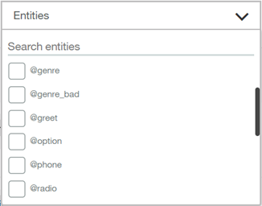
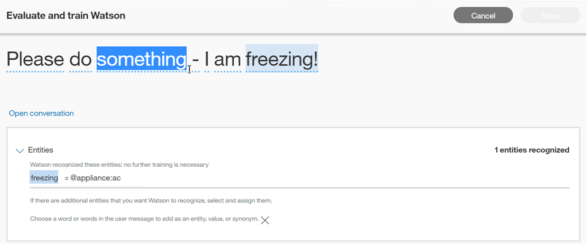

---

copyright:
  years: 2015, 2019
lastupdated: "2019-02-28"

subcollection: assistant

---

{:shortdesc: .shortdesc}
{:new_window: target="_blank"}
{:deprecated: .deprecated}
{:important: .important}
{:note: .note}
{:tip: .tip}
{:pre: .pre}
{:codeblock: .codeblock}
{:screen: .screen}
{:javascript: .ph data-hd-programlang='javascript'}
{:java: .ph data-hd-programlang='java'}
{:python: .ph data-hd-programlang='python'}
{:swift: .ph data-hd-programlang='swift'}

# Aus Dialogen lernen
{: #logs}

Um eine Liste der ausgetauschten Nachrichten zwischen Benutzern und dem Assistenten aufzurufen, der diesen Dialogskill verwendet, wählen Sie in der Navigationsleiste die Option **Benutzerdialoge** aus.
{: shortdesc}

Wenn Sie die Seite **Benutzerdialoge** öffnen, wird standardmäßig die Ansicht mit der Ergebnisliste für den letzten  Tag angezeigt; an erster Position befinden sich hierbei die neuesten Ergebnisse. Verfügbar sind die häufigste Absicht (#intent), alle erkannten Entitätswerte (@entity), die in einer Nachricht verwendet wurden, und der Nachrichtentext. Für nicht erkannte Absichten wird der Wert *Irrelevant* angezeigt. Falls eine Entität nicht erkannt oder nicht angegeben wurde, wird der Wert *Keine Entitäten gefunden* angezeigt.


Beachten Sie, dass auf der Seite **Benutzerdialoge** die Gesamtzahl der *Nachrichten* zwischen Benutzern und Ihrer Anwendung angezeigt wird. Eine Nachricht ist eine einzelne Äußerung, die der Benutzer an die Anwendung sendet. Jeder Dialog kann mehrere Nachrichten umfassen. Daher weicht die Zahl der Ergebnisse auf dieser Seite **Benutzerdialoge** von der Anzahl der Dialoge ab, die auf der Seite [Übersicht](/docs/services/assistant?topic=assistant-logs-overview)  angezeigt wird.

## Begrenzungen für Protokolle
{: #logs-limits}

Die Dauer des Zeitraums, für den Nachrichten aufbewahrt werden, richtet sich nach Ihrem {{site.data.keyword.conversationshort}}-Serviceplan:

  Serviceplan                         | Chatnachrichtenspeicherung
  ------------------------------------ | ------------------------------------
  Premium                              | Letzte 90 Tage
  Plus                                 | Letzte 30 Tage
  Standard                             | Letzte 30 Tage
  Lite                                 | Letzte 7 Tage

## Nachrichten filtern
{: #logs-filter-messages}

Sie können Nachrichten nach den Kriterien *Benutzeranweisungen suchen*, *Absichten*, *Entitäten* und *Letzte* n *Tage* filtern:

*Benutzeranweisungen suchen*: Geben Sie in der Suchleiste ein Wort ein. Hiermit werden die Eingaben des Benutzers durchsucht, jedoch nicht die Antworten Ihrer Anwendung. 

*Absichten*: Wählen Sie das Dropdown-Menü aus und geben Sie im Eingabefeld eine Absicht ein oder treffen Sie eine Auswahl in der gefüllten Liste. Sie können mehrere Absichten auswählen, wodurch die Ergebnisse unter Verwendung aller ausgewählten Absichten gefiltert werden; die Auswahl von *Irrelevant* ist ebenfalls möglich.


*Entitäten*: Wählen Sie das Dropdown-Menü aus und geben Sie im Eingabefeld einen Entitätsnamen ein oder treffen Sie eine Auswahl in der gefüllten Liste. Sie können mehrere Entitäten auswählen, wodurch die Ergebnisse unter Verwendung aller ausgewählten Entitäten gefiltert werden. Falls Sie nach Absicht *und* Entität filtern, enthalten die Ergebnisse diejenigen Nachrichten, die beide Werte aufweisen. Sie können die Ergebnisse auch durch Auswahl von *Keine Entitäten gefunden* filtern.



Möglicherweise dauert es etwas, bis die Nachrichten aktualisiert sind. Warten Sie nach einer Benutzerinteraktion mit Ihrer Anwendung mindestens 30 Minuten, bevor Sie versuchen, diesen Inhalt zu filtern. 

## Einzelne Nachricht anzeigen
{: #logs-see-message}

Sie können jeden Nachrichteneintrag erweitern, um die Äußerungen des Benutzers und die Antworten Ihrer Anwendung während des gesamten Dialogs anzuzeigen. Wählen Sie hierzu die Option **Dialog öffnen** aus. Sie werden automatisch zu der Nachricht in diesem Dialog geführt, die Sie ausgewählt haben. 

Die am Anfang jedes Dialogs angegebene Zeit wird an die lokale Zeitzone Ihres Browsers angepasst. Diese Zeitangabe kann von der Zeitmarke abweichen, die beim Anfordern desselben Dialogprotokolls über einen API-Aufruf angezeigt wird. Für API-Protokollaufrufe wird immer die UTC-Zeit verwendet.


Anschließend können Sie die Klassifizierung(en) für die ausgewählte Nachricht anzeigen. 


## Verbesserungen für mehrere Assistenten
{: #logs-deploy-id}

Das Erstellen eines Dialogskills ist ein iterativer Prozess. Beim Entwickeln Ihres Skills überprüfen Sie in der Anzeige *Ausprobieren*,  dass der Service die Absichten und Entitäten in den Testeingaben richtig erkennt, und nehmen bei Bedarf Korrekturen vor.

Auf der Seite 'Benutzerdialoge' können Sie die tatsächlichen Interaktionen zwischen dem Assistenten, den Sie zum Bereitstellen des Skills verwendet haben, und Ihren Benutzern analysieren. Auf der Grundlage dieser Interaktionen können Sie Korrekturen vornehmen, um die Erkennungsgenauigkeit für Absichten und Entitäten in Ihrem Dialogskill zu verbessern. Es ist schwer vorauszusehen, *wie* Ihre Benutzer Fragen formulieren oder welche Nachrichten sie vielleicht eingeben werden. Aus diesem Grund sollten Sie häufig reale Dialoge analysieren, um Ihre Dialogskills zu verbessern.

Bei einer {{site.data.keyword.conversationshort}}-Instanz, die mehrere Assistenten enthält, kann es durchaus hilfreich sein, Nachrichtendaten aus dem Dialogskill eines Assistenten zu verwenden, um den von einem anderen Assistenten innerhalb derselben Instanz verwendeten Dialogskill zu verbessern. 

 Wenn Sie ein Benutzer von {{site.data.keyword.conversationshort}} Premium sind, können Ihre Instanzen optional so konfiguriert werden, dass der Zugriff auf die Protokolldaten über Assistenten Ihrer anderen Premiuminstanzen möglich ist.

Angenommen, Sie verfügen über eine {{site.data.keyword.conversationshort}}-Instanz namens *HelpDesk*, die einen Assistenten 'Production' (Produktion) und einen Assistenten 'Development' (Entwicklung) enthält. Beim Arbeiten mit dem Dialogskill für den Assistenten 'Development' können Sie Protokolle der Nachrichten aus dem Assistenten 'Production' verwenden, um den Dialogskill im Assistenten 'Development' zu verbessern.

Alle Änderungen, die Sie anschließend im Dialogskill für den Assistenten 'Development' vornehmen, wirken Sich ausschließlich auf den Dialogskill im Assistenten 'Development' aus, obwohl Sie Daten aus Nachrichten verwenden, die an den Assistenten 'Production' gesendet wurden. 

Ebenso kann es beim Erstellen von mehreren Skillversion sinnvoll sein, Nachrichtendaten aus einer Version zu verwenden, um die Trainingsdaten für eine andere Version zu verbessern. 

### Datenquelle auswählen
{: #logs-pick-data-source}

Der Begriff *Datenquelle* bezeichnet die erfassten Protokolle aus Dialogen zwischen Kunden und dem Assistenten bzw. der angepassten Anwendung, von dem bzw. der ein Dialogskill bereitgestellt wurde.

Wenn Sie die Registerkarte *Analyse* öffnen, werden Metriken angezeigt, die aus Benutzerinteraktionen mit dem aktuellen Dialogskill generiert wurden. Wenn der aktuelle Skill noch nicht bereitgestellt und von Benutzern verwendet wurde, werden keine Metriken angezeigt. 

So füllen Sie die Metriken mit Nachrichtendaten aus einem Dialogskill bzw. einer Skillversion, der bzw. die einem anderen Assistenten oder einer anderen angepassten Anwendung hinzugefügt wurde und für den bzw. Kundeninteraktionen vorliegen:

1.  Klicken Sie auf das Feld **Datenquelle**, um eine Liste der Assistenten mit Protokolldaten anzuzeigen, die verwendet werden können. 

    Die Liste enthält Assistenten, die bereitgestellt wurden und auf die Sie zugreifen können. Weitere Informationen zu dieser Option enthält der Abschnitt [*Bereitstellungs-IDs anzeigen* (mit Erläuterungen)](#logs-deployment-id-explained).

1.  Wählen Sie eine Datenquelle aus.

Statistische Informationen  zu der ausgewählten Datenquelle werden angezeigt. 

Beachten Sie, dass die Liste keine Skillversionen enthält. Um zugehörige Daten für eine bestimmte Skillversion abzurufen, müssen Sie wissen, in welchem Zeitraum die betreffende Skillversion von einem bereitgestellten Assistenten verwendet wurde. Sie können den Assistenten als Datenquelle auswählen und anschließend die Metrikdaten nach dem jeweiligen Zeitraum filtern.

### *Bereitstellungs-IDs anzeigen* (mit Erläuterungen)
{: #logs-deployment-id-explained}

Anwendungen, die die API der Version 1 verwenden, müssen in jeder Nachricht, die mithilfe der API `/message` gesendet wurde, eine Bereitstellungs-ID angeben. Diese ID identifiziert die bereitgestellte App, über die der Aufruf abgesetzt wurde. Auf der Seite 'Analyse' kann diese Bereitstellungs-ID verwendet werden, um Protokolle abzurufen und anzuzeigen, die einer bestimmten aktiven Anwendung zugeordnet sind.

Für Assistenten oder angepasste Apps, die die API der Version 2 verwenden, fügt der Service automatisch eine System-ID und eine Skill-ID in jeden API-Aufruf '/message' ein,  call, damit Sie die Datenquelle nach dem Assistentennamen auswählen können, anstatt die Bereitstellungs-ID zu verwenden. 

Zum Hinzufügen der Bereitstellungs-ID geben Benutzer der API der Version 2 die Bereitstellungseigenschaft in den Metadaten für den [Kontext ](https://cloud.ibm.com/apidocs/assistant?curl=#get-response-to-user-input){: new_window} an, wie im folgenden Beispiel gezeigt:

```json
"context" : {
  "metadata" : {
       "deployment": "HelpDesk-Production"
  }
}
```
{: codeblock}

## Trainingsdaten verbessern
{: #logs-fix-data}

Nutzen Sie die Erkenntnisse aus realen Benutzerdialogen, um das zugehörige Modell für Ihren Dialogskill zu korrigieren.

Wenn Sie Daten aus einer anderen Datenquelle verwenden, werden alle Verbesserungen, die Sie an dem Modell vornehmen, ausschließlich auf den aktuellen Dialogskill angewendet. Im Feld **Datenquelle** wird die Quelle der Nachrichten angezeigt, die Sie zum Verbessern dieses Dialogskills verwenden. Oben auf der Seite wird der Dialogskill angegeben, an dem Sie Änderungen vornehmen. 

### Absicht korrigieren
{: #logs-correct-intent}

1.  Um eine Absicht zu korrigieren, wählen Sie das Bearbeitungssymbol  neben der ausgewählten Absicht (#abc) aus.
1.  Wählen Sie in der angezeigten Liste die korrekte Absicht für diese Eingabe aus.
    - Beginnen Sie mit der Eingabe im Eingabefeld. Daraufhin wird die Liste der Absichten gefiltert.
    - In diesem Menü können Sie auch die Option **Als irrelevant markieren** auswählen. (Weitere Informationen enthält der Abschnitt [Als irrelevant markieren](/docs/services/assistant?topic=assistant-intents#intents-mark-irrelevant).) Sie können auch die Option **Nicht für Absicht trainieren** auswählen. In diesem Fall wird diese Nachricht nicht als Beispiel für das Training gespeichert. 

    
1.  Wählen Sie **Speichern** aus.

    

    Der {{site.data.keyword.conversationshort}}-Service unterstützt das Hinzufügen *unveränderter* Benutzereingaben als Beispiele zu einer Absicht. Wenn Sie Entitätsverweise (@entity) als Beispiele in Ihren Trainingsdaten für Absichten verwenden und eine Benutzernachricht, die Sie speichern möchten, einen Entitätswert oder ein Synonym aus Ihren Trainingsdaten enthält, dann müssen Sie die Nachricht später bearbeiten. Bearbeiten Sie nach dem Speichern die Nachricht auf der Seite 'Absichten' und ersetzen Sie die von ihr referenzierte Entität. Weitere Informationen finden Sie unter [Eine Entität als Beispiel für eine Absicht direkt referenzieren](/docs/services/assistant?topic=assistant-intents#intents-entity-as-example).
    {: tip}

### Entitätswert oder Synonym hinzufügen
{: #logs-add-entity}

1.  Um einen Entitätswert oder ein Synonym hinzuzufügen, wählen Sie das Bearbeitungssymbol  neben der ausgewählten Entität (@xyz) aus.
1.  Wählen Sie **Entität hinzufügen** aus.

    
1.  Wählen Sie nun in der unterstrichenen Benutzereingabe ein Wort oder einen Ausdruck aus.

    
1.  Wählen Sie eine Entität aus, zu der der hervorgehobene Ausdruck als Wert hinzugefügt werden soll.
    - Beginnen Sie mit der Eingabe im Eingabefeld. Daraufhin wird die Liste der Entitäten und Werte gefiltert.
    - Um den hervorgehobenen Ausdruck als Synonym für einen vorhandenen Wert hinzuzufügen, wählen Sie den Eintrag mit dem Format `@entität:wert` in der Dropdown-Liste aus.

    
1.  Wählen Sie **Speichern** aus.

    
