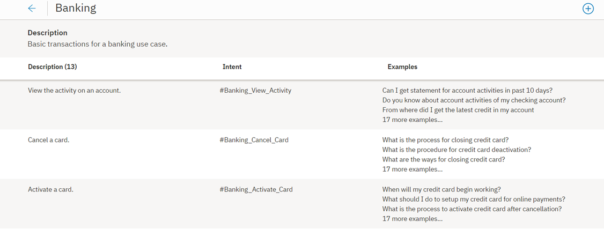

---

copyright:
  years: 2015, 2019
lastupdated: "2019-02-28"

subcollection: assistant

---

{:shortdesc: .shortdesc}
{:new_window: target="_blank"}
{:deprecated: .deprecated}
{:important: .important}
{:note: .note}
{:tip: .tip}
{:pre: .pre}
{:codeblock: .codeblock}
{:screen: .screen}
{:javascript: .ph data-hd-programlang='javascript'}
{:java: .ph data-hd-programlang='java'}
{:python: .ph data-hd-programlang='python'}
{:swift: .ph data-hd-programlang='swift'}

# Utilización de catálogos de contenido
{: #catalog}

Los ***catálogos de contenido*** ofrecen un método sencillo para añadir intenciones comunes al conocimiento de diálogo de {{site.data.keyword.conversationshort}}.
{: shortdesc}

Las intenciones que añade desde el catálogo están pensadas para proporcionar un punto de partida. Añada o edite intenciones de catálogo para adaptarlas a su caso de uso.

## Adición de un catálogo de contenido al conocimiento de diálogo
{: #catalog-add}

Utilice la herramienta {{site.data.keyword.conversationshort}} para añadir catálogos de contenido.

1.  En la herramienta {{site.data.keyword.conversationshort}}, abra el conocimiento de diálogo y luego pulse el separador **Catálogo de contenido**.

1.  Seleccione un catálogo de contenido, como por ejemplo *Banking*, para ver las intenciones que se proporcionan con el mismo.

    

    Verá información sobre las intenciones que se incluyen en el catálogo.

    

    Es posible distinguir las intenciones que se añaden desde un catálogo de contenido de otras intenciones por sus nombres. Cada nombre de intención viene precedida del nombre del catálogo de contenido.

1.  Seleccione  para volver al separador **Catálogo de contenido**.

1.  A continuación, añada un catálogo de contenido a su conocimiento de diálogo pulsando el botón `Añadir a conocimiento`.

1.  Luego seleccione el separador **Intenciones** y verifique que las intenciones del catálogo se han añadido y están disponibles.

    

El sistema empieza a formarse a sí mismo con los nuevos datos.

Después de añadir un catálogo a su conocimiento, las intenciones pasan a formar parte de los datos de entrenamiento. Si IBM realiza actualizaciones posteriores en un catálogo de contenido, los cambios no se aplican automáticamente a las intenciones que haya añadido de un catálogo.
{: note}

## Edición de ejemplos de catálogo de contenido
{: #catalog-edit-content}

Al igual que cualquier otra intención, después de añadir intenciones del catálogo de contenido a su conocimiento, puede realizar los cambios siguientes en las mismas:

- Cambiar el nombre de la intención.
- Suprimir la intención.
- Añadir, editar o suprimir ejemplos.
- Mover un ejemplo a otra intención.
