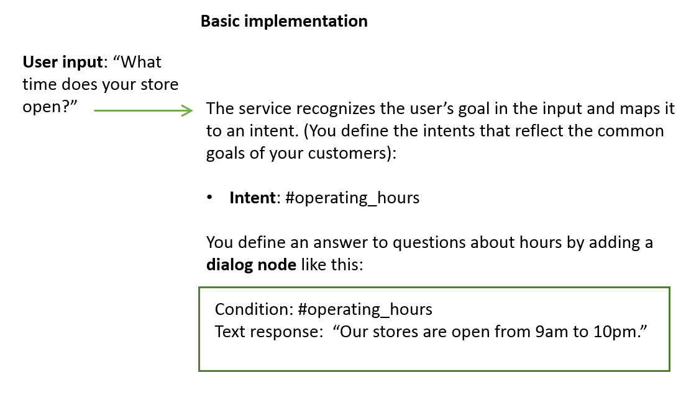

---

copyright:
  years: 2015, 2019
lastupdated: "2019-08-02"

subcollection: assistant

---

{:shortdesc: .shortdesc}
{:new_window: target="_blank"}
{:deprecated: .deprecated}
{:important: .important}
{:note: .note}
{:tip: .tip}
{:pre: .pre}
{:codeblock: .codeblock}
{:screen: .screen}
{:javascript: .ph data-hd-programlang='javascript'}
{:java: .ph data-hd-programlang='java'}
{:python: .ph data-hd-programlang='python'}
{:swift: .ph data-hd-programlang='swift'}

# Conocimientos
{: #skills}

Un conocimiento es un contenedor para la inteligencia artificial que permite a un asistente ayudar a sus clientes.
{: shortdesc}

Un asistente dirige solicitudes siguiendo la ruta óptima para resolver un problema de cliente. Añada conocimientos para que su asistente pueda proporcionar una respuesta directa a una pregunta común o hacer referencia a resultados de búsqueda más generalizados para algo más complejo.

## Tipos de conocimientos
{: #skills-types}

Puede añadir el siguiente tipo de conocimiento a su asistente:

- **[Conocimiento de diálogo](#skills-dialog-skill)**: Entiende las preguntas o solicitudes típicas de los usuarios y las responde o las satisface siguiendo un diálogo desarrollado por usted.

 Si es un usuario del plan Plus o Premium, también puede crear este tipo de conocimientos:

- **[Conocimiento de búsqueda](#skills-search-skill)**: responde a la pregunta de un usuario buscando información relevante de un origen de datos externo, extrayéndolo y devolviéndolo como respuesta del asistente.

### Conocimiento de diálogo
{: #skills-dialog-skill}

Un conocimiento de diálogo contiene los datos de entrenamiento y la lógica que permite a un asistente ayudar a sus clientes. Contiene los siguientes tipos de artefactos:

- [**Intenciones**](/docs/services/assistant?topic=assistant-intents): Una *intención* representa la finalidad de una entrada de usuario, como por ejemplo una pregunta sobre las ubicaciones de un negocio o el pago de una factura. El usuario define una intención para cada tipo de solicitud de usuario a la que desea que la aplicación dé soporte. Al nombre de una intención siempre se le antepone el carácter `#`. Para preparar el conocimiento de diálogo para que reconozca sus intenciones, debe especificar muchos ejemplos de entradas de usuario e indicar con qué intenciones se correlacionan.

  Se proporciona un *catálogo de contenido* que contiene las intenciones comunes creadas previamente que puede añadir a la aplicación en lugar de crear las suyas propias. Por ejemplo, la mayoría de las aplicaciones necesitan una intención de saludo que inicia un diálogo con el usuario. Puede añadir el catálogo de contenido **General** para añadir una intención que saluda al usuario y hace otras cosas útiles, como finalizar la conversación.

- [**Diálogo**](/docs/services/assistant?topic=assistant-dialog-build): Un *diálogo* es un flujo de conversación que define la forma en que la aplicación responde cuando reconoce intenciones y entidades definidas. Puede utilizar el editor de diálogos para crear conversaciones con los usuarios, proporcionando respuestas basadas en intenciones y entidades que se reconoce en su entrada.

  

Para permitir que su conocimiento de diálogo maneje preguntas más matizadas, defina entidades y hacer referencia a las mismas desde el diálogo.

- [**Entidades**](/docs/services/assistant?topic=assistant-entities): Una *entidad* representa un objeto que sea relevante para las intenciones y que ofrezca un contexto específico para una intención. Por ejemplo, una entidad podría representar una ciudad donde el usuario desea buscar la ubicación de un negocio o el importe del pago de una factura. Al nombre de una entidad siempre se le antepone el carácter `@`.

  Puede entrenar el conocimiento para que reconozca sus entidades proporcionando valores de términos de entidad y sinónimos y patrones de entidad, o identificando el contexto en el que se utiliza normalmente una entidad en una frase. Para ajustar el diálogo, vuelva y añada nodos que comprueben si hay menciones de la entidad en la entrada de usuario, además de las intenciones.

A medida que añade información, el conocimiento utiliza estos datos exclusivos para crear un modelo de aprendizaje de máquina que pueda reconocer estas y otras entradas de usuario similares. Cada vez que añade o cambia los datos de entrenamiento, el proceso de formación se activa para garantizar que el modelo subyacente permanece actualizado a medida que cambian las necesidades de sus clientes y los temas sobre los que desean debatir.

Para obtener ayuda para crear un conocimiento de diálogo, consulte [Creación de un conocimiento de diálogo](/docs/services/assistant?topic=assistant-skill-dialog-add).

### Conocimiento de búsqueda 
{: #skills-search-skill}

Cuando Watson Assistant no tiene una solución explícita a un problema, direcciona la pregunta del usuario a un conocimiento de búsqueda para encontrar una respuesta a través de las distintas fuentes de contenido de autoservicio. El conocimiento de búsqueda interactúa con el servicio de {{site.data.keyword.discoveryfull}} para extraer esta información de una colección de datos configurada.

Si ya utiliza el servicio de {{site.data.keyword.discoveryshort}}, puede extraer las recopilaciones de datos existentes como material de origen que puede compartir con los clientes para abordar sus preguntas.

Sin embargo, no es necesario que tenga una instancia de servicio de {{site.data.keyword.discoveryshort}}. Si elige crear un conocimiento de búsqueda, se le proporciona gratuitamente una instancia de {{site.data.keyword.discoveryshort}}. A continuación, puede crear una colección a partir de un origen de datos y configurar el conocimiento de búsqueda para buscar en esta colección para encontrar respuestas a las consultas del cliente.

El diagrama siguiente muestra cómo se procesa la entrada de usuario cuando se añaden tanto un conocimiento de diálogo como un conocimiento de búsqueda a un asistente. Las preguntas que el diálogo no está diseñado para responder se envían al conocimiento de búsqueda, que busca una respuesta relevante en una recopilación de datos de {{site.data.keyword.discoveryshort}}.

Para obtener ayuda para crear un conocimiento de búsqueda, consulte [Creación de un conocimiento de búsqueda](/docs/services/assistant?topic=assistant-skill-search-add).
