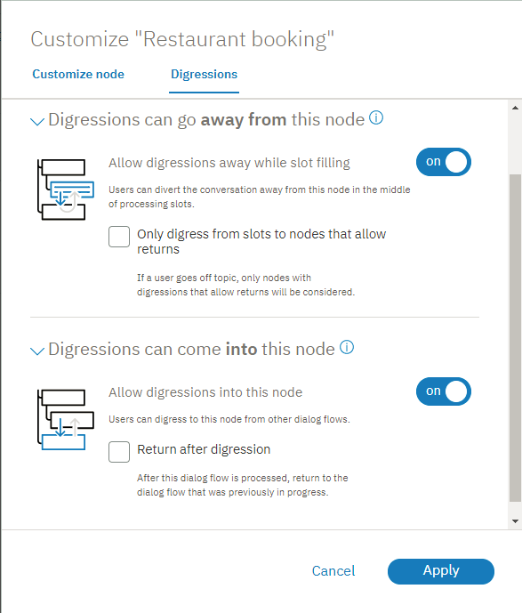
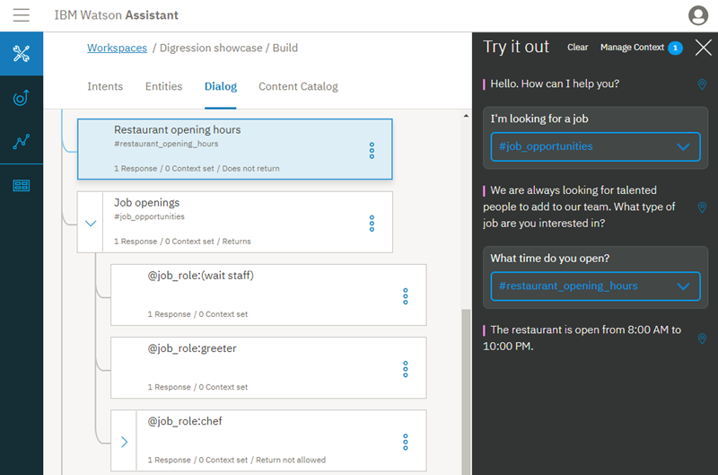

---

copyright:
  years: 2015, 2019
lastupdated: "2019-04-12"

subcollection: assistant

---

{:shortdesc: .shortdesc}
{:new_window: target="_blank"}
{:deprecated: .deprecated}
{:important: .important}
{:note: .note}
{:tip: .tip}
{:pre: .pre}
{:codeblock: .codeblock}
{:screen: .screen}
{:javascript: .ph data-hd-programlang='javascript'}
{:java: .ph data-hd-programlang='java'}
{:python: .ph data-hd-programlang='python'}
{:swift: .ph data-hd-programlang='swift'}

# Guía de aprendizaje: Visión general de las digresiones
{: #tutorial-digressions}

En esta guía de aprendizaje verá cómo funcionan las digresiones.
{: shortdesc}

## Objetivos del aprendizaje
{: #tutorial-digressions-objectives}

Cuando termine la guía de aprendizaje, sabrá cómo:

- se diseñan las digresiones para que funcionen
- los valores de digresión afectan al flujo del diálogo
- probar valores de digresión para un diálogo

### Duración
{: #tutorial-digressions-duration}

Le llevará aproximadamente 20 minutos el completar esta guía de aprendizaje.

### Requisito previo
{: #tutorial-digressions-prereqs}

Si no tiene una instancia de {{site.data.keyword.conversationshort}}, siga el paso **Antes de empezar** de la [Guía de aprendizaje de iniciación](/docs/services/assistant?topic=assistant-getting-started#getting-started-prerequisites) para crear una.

## Paso 1: Importar el conocimiento de diálogo de muestra de digresión
{: #tutorial-digressions-import-json}

En primer lugar, tiene que importar el conocimiento de diálogo de *muestra de digresión* en la instancia de {{site.data.keyword.conversationshort}}.

1.  Descargue el archivo [digression-showcase.json](https://github.com/watson-developer-cloud/community/raw/master/watson-assistant/digression-showcase.json).
1.  En la instancia de {{site.data.keyword.conversationshort}}, pulse el icono .
1.  Pulse **Elegir un archivo** y luego seleccione el archivo **digression-showcase.json** que ha descargado anteriormente.
1.  Pulse **Importar** para terminar de importar el conocimiento de diálogo.

## Paso 2: Digresión temporal hacia fuera del diálogo
{: #tutorial-digressions-temporarily-digress-away}

Las digresiones permiten al usuario alejarse de una rama del diálogo para cambiar temporalmente de tema antes de volver al flujo de diálogo original. En este paso, empezará por hacer una reserva en un restaurante y luego realizará una digresión hacia fuera para preguntar el horario del restaurante. Después de proporcionar la información sobre las horas de apertura, su asistente regresará al flujo de diálogo de reserva de restaurante.

1.  Pulse **Diálogo** para ir a la página con intenciones a una vista del árbol de diálogo.

1.  Pulse el icono  para abrir el panel "Pruébelo".
1.  Escriba `Book me a restaurant` (Hacer una reserva en un restaurante) en el campo de texto.

    Su asistente responde solicitando qué día desea hacer la reserva, `When do you want to go?` (¿Cuándo quiere ir?).

1.  Pulse el icono de **Ubicación**  que hay junto a la respuesta para resaltar el nodo que activa la respuesta, el nodo **Restaurant booking** en el árbol de diálogo.

    
1.  Escriba `Tomorrow` (Mañana).

    Su asistente responde solicitando a qué hora desea hacer la reserva, `What time do you want to go?` (¿A qué hora quiere ir?).

1.  No sabe a qué hora cierra el restaurante, así que pregunta `What time do you close?` (¿A qué hora cierran?).

    El bot realiza una digresión hacia fuera del nodo de reservas del restaurante para procesar el nodo **Restaurant opening hours**. Responde `The restaurant is open from 8:00 AM to 10:00 PM.` (El restaurante abre de 8:00 de la mañana a 10:00 de la noche). Luego su asistente regresa al nodo de reservas de restaurante y le vuelve a preguntar la hora de la reserva.

    
1.  **Opcional**: Para completar el flujo de diálogo, escriba `8pm` para la hora de la reserva y `2` para el número de comensales.

¡Enhorabuena! Ha creado correctamente una digresión del flujo de diálogo y ha regresado al mismo.

## Paso 3: Inhabilitar las digresiones de ranuras
{: #tutorial-digressions-disable-slot}

En este paso, editará el valor de digresión para el nodo de reserva de restaurante para evitar que los usuarios se desvíen del mismo y verá cómo afecta el cambio de valor al flujo de diálogo.

1.  Vamos a examinar los valores de digresión actuales para el nodo **Restaurant booking**. Pulse el nodo para abrirlo en la vista de edición.

1.  Pulse **Personalizar** y, a continuación, pulse el separador **Digresiones**.

    

1.  Cambie el valor de **Permitir digresiones hacia fuera** de activo a **inactivo** y pulse **Aplicar**.

1.  Pulse  para cerrar la vista de edición del nodo.

1.  Pulse **Borrar** en el panel "Pruébelo" para restablecer el diálogo.

1.  Escriba `Book me a restaurant` (Hacer una reserva en un restaurante).

    Su asistente responde solicitando qué día desea hacer la reserva, `When do you want to go?` (¿Cuándo quiere ir?).

1.  Escriba `Tomorrow` (Mañana).

    Su asistente responde solicitando a qué hora desea hacer la reserva, `What time do you want to go?` (¿A qué hora quiere ir?).

1.  Pregunte `What time do you close?` (¿A qué hora cierran?).

    Su asistente reconoce que la pregunta activa la intención #restaurant_opening_hours, pero lo pasa por alto y muestra de nuevo la solicitud asociada con la ranura @sys-time.

Ha impedido correctamente que el usuario se desvíe del proceso de reserva del restaurante.

## Paso 4: Digresión a un nodo que no regresa
{: #tutorial-digressions-digress-without-return}

Puede configurar un nodo de diálogo de modo que no regrese al nodo fuera del cual se ha desviado su asistente para que se procese el nodo actual. Para demostrarlo, cambiará el valor de digresión para el nodo de horario del restaurante. En el paso 2 ha visto que, después de desviarse del nodo de reserva del restaurante para ir al nodo de horario de apertura del restaurante, su asistente ha vuelto al nodo de reserva del restaurante para continuar con el proceso de reserva. En este ejercicio, después de cambiar el valor, realizará una digresión hacia fuera del diálogo **Job opportunities** para preguntar sobre el horario de apertura del restaurante y verá que su asistente no regresa al punto en el que se desvió.

1.  Pulse para abrir el nodo **Restaurant opening hours** (Horario de apertura del restaurante).

1.  Pulse **Personalizar** y, a continuación, pulse el separador **Digresiones**.

1.  Amplíe la sección **En este nodo pueden entrar digresiones** y elimine la marca del recuadro de selección **Volver después de digresión**. Pulse **Aplicar** y luego  para cerrar la vista de edición del nodo.

1.  Pulse **Borrar** en el panel "Pruébelo" para restablecer el diálogo.

1.  Para ir al nodo de diálogo **Job opportunities** (Ofertas de trabajo), escriba `I'm looking for a job` (Estoy buscando trabajo).

    Su asistente responde `We are always looking for talented people to add to our team. What type of job are you interested in?` (Siempre buscamos gente con talento para que se unan a nuestro equipo. ¿Qué tipo de trabajo le interesa?).

1.  En lugar de responder a esta pregunta, realice al bot una pregunta que no esté relacionada. Escriba `What time do you open?` (¿A qué hora abren?).

    Su asistente realiza una digresión hacia fuera del nodo Job opportunities al nodo Restaurant opening hours para responder a su pregunta. Su asistente responde `The restaurant is open from 8:00 AM to 10:00 PM.` (El restaurante abre de 8:00 de la mañana a 10:00 de la noche).

    A diferencia de la prueba anterior, esta vez el diálogo no se regresa al punto en el que se desvió en el nodo **Job opportunities**. Su asistente no vuelve al diálogo que estaba en curso porque ha cambiado el valor en el nodo **Restaurant opening hours** para que no se regrese.

    

¡Enhorabuena! Ha creado correctamente una digresión de un diálogo sin que se regrese.

## Resumen
{: #tutorial-digressions-summary}

En esta guía de aprendizaje ha visto el funcionamiento de las digresiones y cómo los valores de los nodos de diálogo individuales pueden afectar al comportamiento de las digresiones.

## Siguientes pasos
{: #tutorial-digressions-next-steps}

Para obtener ayuda para configurar digresiones para su propio diálogo, consulte el apartado sobre [Digresiones](/docs/services/assistant?topic=assistant-dialog-runtime#dialog-runtime-digressions).
