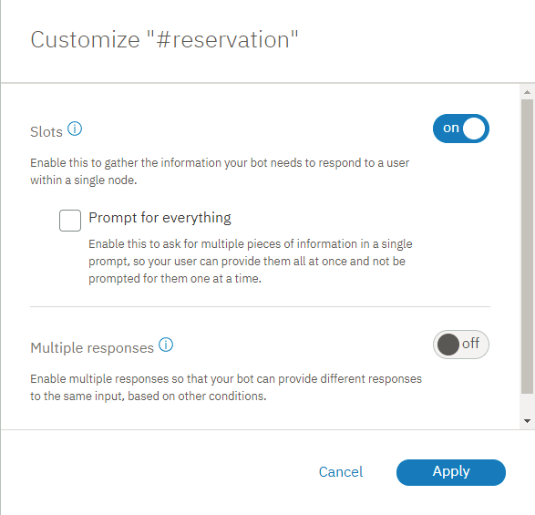
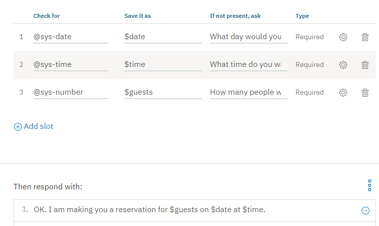

---

copyright:
  years: 2015, 2019
lastupdated: "2019-04-12"

subcollection: assistant

---

{:shortdesc: .shortdesc}
{:new_window: target="_blank"}
{:deprecated: .deprecated}
{:important: .important}
{:note: .note}
{:tip: .tip}
{:pre: .pre}
{:codeblock: .codeblock}
{:screen: .screen}
{:javascript: .ph data-hd-programlang='javascript'}
{:java: .ph data-hd-programlang='java'}
{:python: .ph data-hd-programlang='python'}
{:swift: .ph data-hd-programlang='swift'}

# Guía de aprendizaje: Adición de un nodo con ranuras a un diálogo
{: #tutorial-slots}

En esta guía de aprendizaje, añadirá ranuras a un nodo de diálogo para recopilar varios elementos de información de un usuario dentro de un único nodo. El nodo que cree recopilará la información que se necesita para realizar una reserva de un restaurante.
{: shortdesc}

## Objetivos del aprendizaje
{: #tutorial-slots-objectives}

Cuando termine la guía de aprendizaje, habrá aprendido a:

- Definir las intenciones y entidades necesarias para el diálogo
- Añadir ranuras a un nodo de diálogo
- Probar el nodo con ranuras

### Duración
{: #tutorial-slots-duration}

Le llevará aproximadamente 30 minutos el completar esta guía de aprendizaje.

### Requisito previo
{: #tutorial-slots-prereqs}

Antes de empezar, complete la [Guía de aprendizaje de iniciación](/docs/services/assistant?topic=assistant-getting-started). Utilizará el conocimiento de la guía de aprendizaje de {{site.data.keyword.conversationshort}} que ha creado y añadirá nodos al diálogo simple que ha creado como parte del ejercicio de iniciación.

Si lo desea, también puede empezar con un nuevo conocimiento de diálogo. Tan sólo asegúrese de crear el conocimiento antes de empezar esta guía de aprendizaje.
{: note}

## Paso 1: Añadir intenciones y ejemplos
{: #tutorial-slots-add-intent}

Añada una intención en el separador Intenciones. Una intención es la finalidad u objetivo que la entrada del usuario expresa. Necesitará añadir una intención #reservation que reconozca la entrada de usuario que indica que quiere realizar una reserva en un restaurante.

1.  En la página **Intenciones** del conocimiento de la guía de aprendizaje, pulse **Añadir intención**.
1.  Añada el siguiente nombre de intención y, a continuación, pulse **Crear intención**:

    ```json
    reservation
    ```
    {: screen}

    Se añade la intención #reservation. Se añade un símbolo de almohadilla (`#`) al principio del nombre de la intención para etiquetarla como tal. Este convenio de denominación ayuda a reconocer a las intenciones. Todavía no tendrán asociadas expresiones de usuario de ejemplo.
1.  En **Añadir ejemplos de usuario**, escriba la siguiente expresión y, a continuación, pulse **Añadir ejemplo**:

    ```json
    i'd like to make a reservation
    ```
    {: screen}

1.  Añada estos ejemplos adicionales para ayudar a Watson a reconocer la intención de realizar una reserva (`#reservation`).

    ```json
    I want to reserve a table for dinner
    Can 3 of us get a table for lunch?
    do you have openings for next Wednesday at 7?
    Is there availability for 4 on Tuesday night?
    i'd like to come in for brunch tomorrow
    can i reserve a table?
    ```
    {: screen}

1.  Pulse el icono **Cerrar**  para finalizar la adición de la intención `#reservation` y sus expresiones de ejemplo.

## Paso 2: Añadir entidades
{: #tutorial-slots-add-entity}

Una definición de entidad incluye un conjunto de *valores* de entidad que representan vocabulario que se utiliza a menudo en el contexto de una determinada intención. Al definir entidades, ayuda a su asistente a identificar referencias en la entrada de usuario que están relacionadas con las intenciones de interés. En este paso, habilitará las entidades del sistema que permiten reconocer referencias a horas, fechas y números.

1.  Pulse **Entidades** para abrir la página de Entidades.
1.  Habilite las entidades del sistema que permiten reconocer referencias a fechas, horas y números en la entrada de usuario. Pulse el separador **Entidades del sistema** y, a continuación active estas entidades:

    - `@sys-time`
    - `@sys-date`
    - `@sys-number`

Habrá habilitado de forma satisfactoria las entidades de sistema @sys-date, @sys-time y @sys-number. Ahora podrá utilizarlas en su diálogo.

## Paso 3: Añadir un nodo de diálogo con ranuras
{: #tutorial-slots-add-dialog-with-slots}

Un nodo de diálogo representa el inicio de una hebra del diálogo entre su asistente y el usuario. Contiene una condición que debe cumplirse para que su asistente procese el nodo. Como mínimo, también contiene una respuesta. Por ejemplo, una condición de nodo podría buscar la intención `#hello` en la entrada del usuario, y responder con, `Hi. How can I help you?` (Hola. ¿Cómo puedo ayudarle). Este ejemplo representa la forma más simple de un nodo de diálogo, donde el nodo posee una única condición y una única respuesta. Es posible definir diálogos más complejos añadiendo respuestas condicionales a un nodo individual o añadiendo nodos hijo que prolongan el intercambio con el usuario (entre otras opciones). (Si desea obtener más información sobre diálogos complejos, complete la guía de aprendizaje [Creación de un diálogo complejo](/docs/services/assistant?topic=assistant-tutorial)).

El nodo que añadirá en este paso es uno que contendrá ranuras. Las ranuras proporcionan un formato estructurado a través del cual es posible solicitar y guardar varios tipos de información desde un usuario dentro de un nodo individual. Son más útiles cuando tiene en mente una tarea específica y necesita por parte del usuario elementos clave de información para poder realizar dicha tarea. Consulte [Obtención de información con ranuras](/docs/services/assistant?topic=assistant-dialog-slots) para obtener más información.

El nodo añada recopilará la información necesaria para formular una reserva en un restaurante.

1.  Pulse el separador **Diálogos** para abrir el árbol de diálogos.
1.  Pulse el icono Más  en el nodo **#General_Greetings** y seleccione **Añadir nodo debajo**.
1.  Empiece escribiendo `#reservation` en el campo de condición y luego selecciónelo en la lista.
    Este nodo se evaluará si la entrada de usuario coincide con la intención `#reservation`.
1.  Pulse **Personalizar**, pulse el conmutador **Ranuras** para **activarlo** y, a continuación, pulse **Aplicar**.

    
1.  Defina las siguientes ranuras:

    <table>
    <caption>Detalles de ranura</caption>
    <tr>
      <th>Comprobar</th>
      <th>Guardar como</th>
      <th>Si no está presente, preguntar</th>
    </tr>
    <tr>
      <td>@sys-date</td>
      <td>$date</td>
      <td>What day would you like to come in? (¿Qué día le gustaría venir?)</td>
    </tr>
    <tr>
      <td>@sys-time</td>
      <td>$time</td>
      <td>What time do you want the reservation to be made for? (¿A qué hora desea realizar la reserva?)</td>
    </tr>
    </tr>
    <tr>
      <td>@sys-number</td>
      <td>$guests</td>
      <td>How many people will be dining? (¿Cuántas personas vendrán?)</td>
    </tr>
    </table>

1.  Como respuesta, especifique `OK. I am making you a reservation for $guests on $date at $time.` (De acuerdo. Hago una reserva para $guests el $date a las $time.).

    

1.  Pulse  para cerrar la vista de edición del nodo.

## Paso 4: Probar el diálogo
{: #tutorial-slots-test}

1.  Seleccione el icono  para abrir el panel de la conversación.
1.  Estriba `i want to make a reservation` (quiero hacer una reserva).

    El asistente reconoce la intención #reservation y responde con la solicitud para la primera ranura, `What day would you like to come in? (¿Qué día le gustaría venir?)`.

1.  Escriba `Friday` (Viernes).

    El asistente reconoce el valor y lo utiliza para cumplimentar la variable de contexto $date para la primera ranura. A continuación, muestra la solicitud para la siguiente ranura, `What time do you want the reservation to be made for?`.

1.  Escriba `5pm`.

    El asistente reconoce el valor y lo utiliza para cumplimentar la variable de contexto $time para la segunda ranura. A continuación, muestra la solicitud para la siguiente ranura, `How many people will be dining?`.

1.  Escriba `6`.

    El asistente reconoce el valor y lo utiliza para cumplimentar la variable de contexto $guests para la tercera ranura. Ahora que se han completado todas las ranuras, muestra la respuesta del nodo, `Ok. I am making you a reservation for 6 on 2017-12-29 at 17:00:00.`


¡Ha funcionado! Enhorabuena. Ha creado correctamente un nodo con ranuras.

## Resumen
{: #tutorial-slots-summary}

En esta guía de aprendizaje ha creado un nodo con ranuras que puede capturar la información necesaria para reservar una mesa en un restaurante.

## Siguientes pasos
{: #tutorial-slots-next-steps}

Mejorar la experiencia de los usuarios que interactúan con el nodo. Complete la siguiente guía de aprendizaje, [Cómo mejorar un nodo con ranuras](/docs/services/assistant?topic=assistant-tutorial-slots-complex). Trata de mejoras simples, como por ejemplo cambiar el formato de los valores de fecha (2017-12-28) y la hora (17:00:00) que el sistema devuelve. Pero también trata sobre tareas más complejas, como lo que es posible hacer cuando el usuario no proporciona el tipo de valor que el diálogo espera para una ranura.
