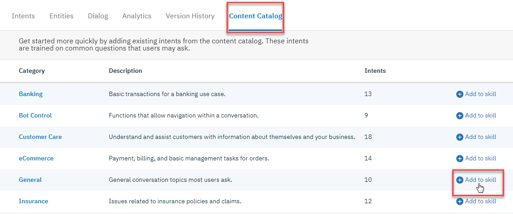
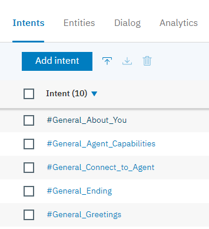

---

copyright:
  years: 2015, 2019
lastupdated: "2019-03-01"

subcollection: assistant

---

{:shortdesc: .shortdesc}
{:new_window: target="_blank"}
{:deprecated: .deprecated}
{:important: .important}
{:note: .note}
{:deprecated: .deprecated}
{:important: .important}
{:note: .note}
{:tip: .tip}
{:pre: .pre}
{:codeblock: .codeblock}
{:screen: .screen}
{:javascript: .ph data-hd-programlang='javascript'}
{:java: .ph data-hd-programlang='java'}
{:python: .ph data-hd-programlang='python'}
{:swift: .ph data-hd-programlang='swift'}
{:hide-dashboard: .hide-dashboard}
{:download: .download}
{:gif: data-image-type='gif'}

# Tutoriel d'initiation
{: #getting-started}

Ce tutoriel rapide vous présente l'outil {{site.data.keyword.conversationshort}} et vous accompagne dans le processus de création de votre premier assistant.
{: shortdesc}

## Avant de commencer
{: #getting-started-prerequisites}
{: hide-dashboard}

Vous avez besoin d'une instance de service pour commencer.
{: hide-dashboard}

1.  {: hide-dashboard} Accédez à la page [{{site.data.keyword.conversationshort}} ](https://cloud.ibm.com/catalog/services/watson-assistant) dans le catalogue {{site.data.keyword.cloud_notm}}.

    L'instance de service sera créée dans le groupe de ressources **par défaut** si vous n'en choisissez pas un autre et elle *ne pourra pas* être modifiée ultérieurement. Ce groupe est suffisant pour tester le service. 

    Si vous créez une instance pour une utilisation plus robuste, renseignez-vous sur les [groupes de ressources ](https://{DomainName}/docs/resources/bestpractice_rgs#bp_resourcegroups){: new_window}.
1.  {: hide-dashboard} Inscrivez-vous pour un compte {{site.data.keyword.cloud_notm}} gratuit ou connectez-vous.
1.  {: hide-dashboard} Cliquez sur **Create**.

## Etape 1 : Ouverture de l’outil
{: #getting-started-launch-tool}

Après avoir créé une instance de service {{site.data.keyword.conversationshort}}, vous accédez à la page **Manage** du tableau de bord du service.
{: hide-dashboard}

1.  Cliquez sur **Launch tool**. Si vous êtes invité à vous connecter à l'outil, entrez vos données d'identification {{site.data.keyword.cloud_notm}}. 

<!-- Remove this text after dedicated instances have the developer console: begin -->

{{site.data.keyword.Bluemix_dedicated_notm}} : sélectionnez votre instance de service dans le tableau de bord pour lancer l'outil. 

<!-- Remove this text after dedicated instances have the Developer Console: end -->

## Etape 2 : Création d'une compétence de dialogue 
{: #getting-started-add-skill}

Votre première étape dans l'outil {{site.data.keyword.conversationshort}} consiste à créer une compétence.

Une *compétence de dialogue* est un conteneur pour les artefacts qui définissent le flux d'une conversation que votre assistant peut avoir avec vos clients.

1.  Dans la page d'accueil de l'outil {{site.data.keyword.conversationshort}}, cliquez sur **Create a Skill**.

    

1.  Cliquez sur **Create new**.

    

1.  Nommez votre compétence `Tutoriel de compétence conversationnelle`. 
1.  **Facultatif**. Si le dialogue que vous prévoyez de créer utilisera une autre langue que l'anglais, choisissez cette langue dans la liste.
1.  Cliquez sur **Create**.

    

Vous arrivez sur la page Intents de l'outil.  

## Etape 3 : Ajout d'intentions à partir d'un catalogue de contenu
{: #getting-started-add-catalog}

Ajoutez à votre compétence des données d'apprentissage qui ont été créées par IBM en ajoutant des intentions à partir d'un catalogue de contenu. En particulier, vous allez donner à votre assistant l’accès au catalogue de contenu **General** afin que votre dialogue puisse accueillir les utilisateurs et mettre fin aux conversations avec eux.  

1.  Dans l'outil {{site.data.keyword.conversationshort}}, cliquez sur l'onglet **Content Catalog**. 
1.  Recherchez **General** dans la liste, puis cliquez sur **Add to skill**.

    
1.  Ouvrez l'onglet **Intents** pour passer en revue les intentions et les exemples d'énoncé associés ayant été ajoutés à vos données d'apprentissage. Vous les reconnaîtrez facilement car chaque nom d'intention commence par le préfixe `#General_`. Vous allez ajouter les intentions `#General_Greetings` et `#General_Ending` à votre dialogue dans l'étape suivante.

    

Vous avez commencé à créer vos données d'apprentissage en ajoutant du contenu préconfiguré à partir de {{site.data.keyword.IBM_notm}}.

## Etape 4 : Création d'un dialogue
{: #getting-started-build-dialog}

Un [dialogue](/docs/services/assistant?topic=assistant-dialog-overview) définit le flux de votre conversation sous la forme d'une arborescence logique. Le dialogue fait correspondre les intentions (ce que disent les utilisateurs) aux réponses (ce que le bot dit en retour). Chaque noeud de l'arborescence comporte une condition qui le déclenche, en fonction d'une entrée utilisateur.

Nous allons créer un dialogue simple qui gère nos intentions greeting et ending, chacune d'elles ayant un seul noeud.

### Ajout d'un noeud de début

1.  Dans l'outil {{site.data.keyword.conversationshort}}, cliquez sur l'onglet **Dialog**.
1.  Cliquez sur **Create**. Deux noeuds s'affichent :
    - **Welcome** : contient un message d'accueil qui s'affiche lorsque vos utilisateurs interagissent pour la première fois avec l'assistant.
    - **Anything else** : contient les phrases qui sont utilisées pour répondre aux utilisateurs lorsque leur entrée n'est pas reconnue.

    
1.  Cliquez sur le noeud **Welcome** pour l'ouvrir dans la vue d'édition.
1.  Remplacez la réponse par défaut par le texte `Welcome to the Watson Assistant tutorial!`. 

    
1.  Cliquez sur l'icône de  pour fermer la vue d'édition.

Vous avez créé un noeud de dialogue déclenché par la condition `welcome`. (`welcome` est une condition spéciale qui fonctionne comme une intention, mais ne commence pas par le signe `#`.) Elle est déclenchée lorsqu'une nouvelle conversation démarre. Votre noeud spécifie que lorsqu'une nouvelle conversation démarre, le système doit répondre avec le message d’accueil que vous ajoutez à la section de réponse de ce premier noeud.

### Test du noeud de début

Vous pouvez tester votre dialogue à tout moment afin de le vérifier. Nous allons le tester maintenant.

- Cliquez sur l'icône  pour ouvrir le panneau "Try it out". Vous devriez voir votre message d’accueil apparaître.

### Ajout de noeuds pour gérer des intentions

A présent, nous allons ajouter des noeuds afin de gérer vos intentions entre le noeud `Welcome` et le noeud `Anything else`.

1.  Cliquez sur l'icône Autres options  sur le noeud **Welcome**, puis sélectionnez **Add node below**.
1.  Tapez `#General_Greetings` dans la zone **Enter a condition** de ce noeud. Ensuite, sélectionnez l'option **`#General_Greetings`**.
1.  Ajoutez la réponse `Good day to you!`
1.  Cliquez sur l'icône de  pour fermer la vue d'édition.

   

1.  Cliquez sur l'icône Autres options  sur le noeud hello, puis sélectionnez **Add node below** pour créer un noeud homologue. Dans le noeud homologue, spécifiez `#General_Ending` comme condition, et `OK. See you later.` comme réponse.

   

1.  Cliquez sur l'icône de  pour fermer la vue d'édition.

   

### Test de la reconnaissance des intentions

Vous avez créé un dialogue simple pour reconnaître et répondre aux entrées greeting et ending. Voyons comment il fonctionne.

1.  Cliquez sur l'icône  pour ouvrir le panneau "Try it out". Le rassurant message d'accueil s'affiche.
1.  Au bas du panneau, tapez `Hello` et appuyez sur Entrée. La sortie indique que l'intention #hello a été reconnue, et la réponse appropriée (`Good day to you.`) apparaît.
1.  Essayez les entrées suivantes :
    - `bye`
    - `howdy`
    - `see ya`
    - `good morning`
    - `sayonara`

{: gif}

{{site.data.keyword.watson}} reconnaît vos intentions même lorsque vos entrées ne correspondent pas exactement aux exemples que vous avez ajoutés. Le dialogue utilise des intentions pour identifier l'objectif des entrées utilisateur, quelle que soit la formulation précise utilisée, puis il répond de la manière que vous avez définie.

### Résultat de la création d'un dialogue

C'est terminé. Vous avez créé une conversation simple avec deux intentions et un dialogue afin de les reconnaître.

## Etape 5 : Création d'un assistant
{: #getting-started-create-assistant}

Un [*assistant*](/docs/services/assistant?topic=assistant-assistants) est un bot cognitif auquel vous ajoutez une compétence. Cela lui permet d'interagir avec vos clients de manière utile.

1.  Cliquez sur l'onglet **Assistants**.
1.  Cliquez sur **Create new**.

    
1.  Nommez l'assistant `Tutoriel Watson Assistant`.
1.  Dans la zone Description, entrez `Ceci est un exemple d'assistant que je crée pour m'aider à apprendre.`
1.  Cliquez sur **Create**.

    

## Etape 6 : Ajout de votre compétence à votre assistant
{: #getting-started-add-skill-to-assistant}

Ajoutez la compétence de dialogue que vous avez créée à l’assistant que vous avez créé. 

1.  Dans la page du nouvel assistant, cliquez sur **Add skill**.

    Si vous avez créé ou reçu un accès de rôle de développeur à des espaces de travail construits avec la version généralement disponible du service {{site.data.keyword.conversationshort}}, vous les verrez énumérés en tant que compétences conversationnelles dans la page Skills.
    {: tip}

    
1.  Choisissez d'ajouter à l'assistant la compétence que vous avez créée précédemment. 

## Etape 7 : Intégration de l'assistant 
{: #getting-started-integrate-assistant}

Maintenant que vous disposez d'un assistant capable de participer à un échange conversationnel simple, publiez-le sur une page Web publique où vous pourrez le tester. Le service fournit une intégration incorporée appelée Preview Link. Lorsque vous créez ce type d'intégration, votre assistant est intégré à un widget de discussion hébergé sur une page Web de marque IBM. Vous pouvez ouvrir la page Web et discuter avec votre assistant pour le tester. 

1.  Cliquez sur l'onglet **Assistants**, recherchez l'assistant `Tutoriel Watson Assistant` que vous avez créé et ouvrez-le.
1.  Dans la zone *Integrations*, cliquez sur **Add integration**.
1.  Recherchez **Preview Link** et cliquez sur **Select integration**.

1.  Cliquez sur l'URL affichée sur la page. 

    La page s'ouvre dans un nouvel onglet.
1.  Dites `hello` à votre assistant et observez-le répondre. Vous pouvez partager l’URL avec d’autres personnes susceptibles de tester votre assistant. 

## Etapes suivantes
{: #getting-started-next-steps}

Ce tutoriel s'appuie sur un exemple simple. Dans le cas d'une application réelle, vous devez définir des intentions plus intéressantes, quelques entités et un dialogue plus complexe qui les utilise toutes. Lorsque vous disposez d'une version optimisée de l'assistant, vous pouvez l'intégrer aux canaux utilisés par vos clients, tels que Slack. A mesure que le trafic augmente entre l’assistant et vos clients, vous pouvez utiliser les outils fournis dans l’onglet**Analytics** pour analyser les conversations réelles et identifier les points à améliorer.

- Elaborez des tutoriels de suivi qui construisent des dialogues plus avancés :  
    - Ajoutez des noeuds standard à l'aide du tutoriel [Création d'un dialogue complexe](/docs/services/assistant?topic=assistant-tutorial).
    - Découvrez les attributs avec le tutoriel [Ajout d'un noeud avec attributs](/docs/services/assistant?topic=assistant-tutorial-slots).
- Examinez d'autres [exemples d'application](/docs/services/assistant?topic=assistant-sample-apps) pour trouver des idées.
