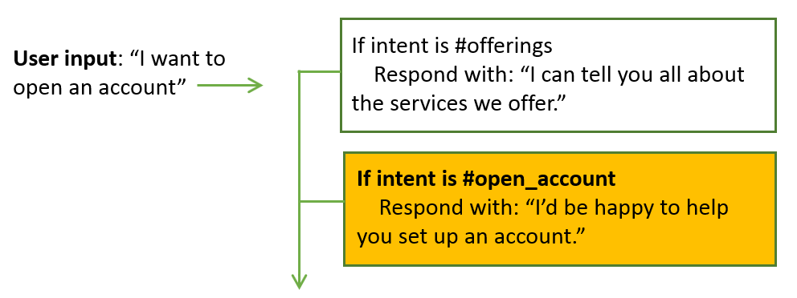

---

copyright:
  years: 2015, 2019
lastupdated: "2019-02-21"

subcollection: assistant

---

{:shortdesc: .shortdesc}
{:new_window: target="_blank"}
{:deprecated: .deprecated}
{:important: .important}
{:note: .note}
{:tip: .tip}
{:pre: .pre}
{:codeblock: .codeblock}
{:screen: .screen}
{:javascript: .ph data-hd-programlang='javascript'}
{:java: .ph data-hd-programlang='java'}
{:python: .ph data-hd-programlang='python'}
{:swift: .ph data-hd-programlang='swift'}

# Assistenti
{: #assistants}

Un assistente è un bot cognitivo che puoi personalizzare per le tue esigenze aziendali e distribuire attraverso più canali per fornire supporto ai tuoi clienti dove e quando ne hanno bisogno.
{: shortdesc}

  Puoi personalizzare l'assistente aggiungendo ad esso le capacità di cui necessita per soddisfare gli obiettivi dei tuoi clienti. 

Aggiungi una capacità di dialogo che possa comprendere e far fronte alle domande o alle richieste per le quali i tuoi clienti hanno bisogno di supporto. Devi fornire le informazioni sugli argomenti o sulle attività che i tuoi clienti richiederanno e il modo in cui le richiederanno e il servizio creerà dinamicamente un modello di machine learning personalizzato per comprendere le richieste uguali e simili dell'utente. 

| Struttura ad albero di dialogo | GUI   |
|-------------|-------------------------:|
| Puoi utilizzare strumenti grafici per creare un dialogo da cui può leggere il tuo assistente nell'interazione con i tuoi clienti, un dialogo che simula una conversazione reale. Il dialogo sfrutta gli obiettivi comuni del cliente che gli hai insegnato a riconoscere e fornisce risposte utili. |  |

La capacità di dialogo, di per sé, viene definita nel testo, ma puoi integrarla con i servizi Watson Speech to Text e Watson Text to Speech che consentono agli utenti di interagire verbalmente con il tuo assistente. 

  Se desideri iniziare rapidamente, aggiungi i dati di apprendimento precostruiti alla tua capacità di dialogo in modo che il tuo assistente possa iniziare ad aiutare i tuoi clienti con le nozioni di base. 

  L'assistente è un bot ospitato completo gestito da {{site.data.keyword.cloud_notm}}, ciò significa che non devi preoccuparti della configurazione o della manutenzione dell'infrastruttura per supportarlo. 

| Integrazioni       | Canali    |
|--------------------|:----------|
| Puoi distribuire l'assistente attraverso più interfacce, inclusi i canali di messaggistica esistenti, come Slack e Facebook Messenger, in pochi passi. Oppure, se desideri progettare un'applicazione personalizzata che lo incorpora, puoi eseguire chiamate dirette alle API sottostanti per raggiungere tale scopo. |  |

Per iniziare, vedi [Creazione di un assistente](/docs/services/assistant?topic=assistant-assistant-add).
