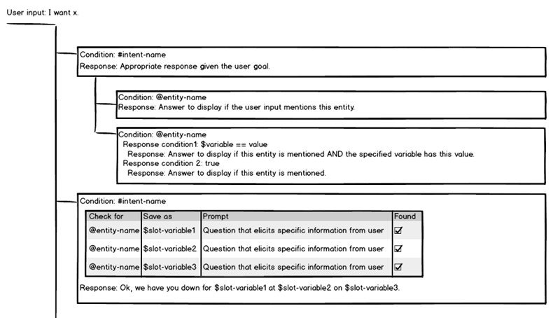

---

copyright:
  years: 2015, 2019
lastupdated: "2019-02-21"

subcollection: assistant

---

{:shortdesc: .shortdesc}
{:new_window: target="_blank"}
{:deprecated: .deprecated}
{:important: .important}
{:note: .note}
{:tip: .tip}
{:pre: .pre}
{:codeblock: .codeblock}
{:screen: .screen}
{:javascript: .ph data-hd-programlang='javascript'}
{:java: .ph data-hd-programlang='java'}
{:python: .ph data-hd-programlang='python'}
{:swift: .ph data-hd-programlang='swift'}

# Rappresentazione di un dialogo
{: #dialog-depiction}

Questo diagramma mostra un mockup di una struttura ad albero di dialogo creata con lo strumento di editor del dialogo della GUI. Contiene due nodi di dialogo root. Una tipica struttura ad albero di dialogo probabilmente avrebbe molti più nodi, ma questa rappresentazione offre un'idea di come potrebbe apparire una sottoserie di nodi. 

- Il primo nodo root condiziona un valore di intento. Ha due nodi figlio ciascuno dei quali condiziona un valore di entità. Il secondo nodo figlio definisce due risposte. La prima risposta viene restituita all'utente se il valore della variabile di contesto corrisponde al valore specificato nella condizione. In caso contrario, viene restituita la seconda risposta. 

  Questo tipo standard di nodo è utile per acquisire domande su un determinato argomento e poi, nella risposta root, porre una domanda di follow-up di cui si occuperanno i nodi figlio. Ad esempio, potresti riconoscere una domanda utente relativa agli sconti e porre una domanda di follow-up per chiedere se l'utente fa parte di associazioni con cui l'azienda ha accordi speciali di scontistica. I nodi figlio forniscono risposte diverse in base alla risposta dell'utente alla domanda sull'appartenenza all'associazione. 

- Il secondo nodo root è un nodo con slot. Condiziona anche un valore di intento. Definisce una serie di slot, uno per ogni parte di informazioni che desideri raccogliere dall'utente. Ciascuno slot pone una domanda che induce l'utente a rispondere. Ricerca un valore di entità specifico nella risposta dell'utente alla richiesta, tale valore viene poi salvato in una variabile di contesto dello slot. 

  Questo tipo di nodo è utile per raccogliere i dettagli di cui potresti aver bisogno per eseguire una transazione al posto dell'utente. Ad esempio, se l'intento dell'utente è quello di prenotare un volo, gli slot possono raccogliere le informazioni sul luogo di partenza e su quello di destinazione, sulle date del viaggio e così via. 
