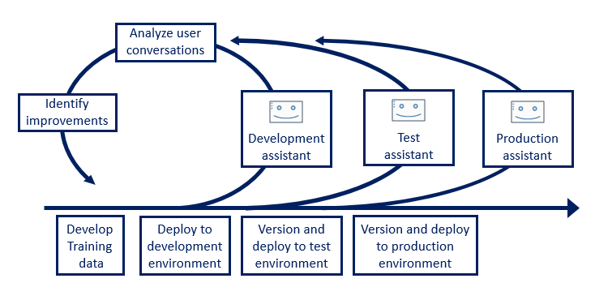

---

copyright:
  years: 2015, 2019
lastupdated: "2019-02-28"

subcollection: assistant

---

{:shortdesc: .shortdesc}
{:new_window: target="_blank"}
{:deprecated: .deprecated}
{:important: .important}
{:note: .note}
{:tip: .tip}
{:pre: .pre}
{:codeblock: .codeblock}
{:screen: .screen}
{:javascript: .ph data-hd-programlang='javascript'}
{:java: .ph data-hd-programlang='java'}
{:python: .ph data-hd-programlang='python'}
{:swift: .ph data-hd-programlang='swift'}

# 開発プロセス
{: #dev-process}

{{site.data.keyword.conversationshort}} ツールを使用すると、AI を活用して、会話アシスタントの作成、デプロイ、および段階的な改善を行うことができます。
{: shortdesc}

## ワークフロー
{: #dev-process-workflow}

アシスタント・プロジェクトの典型的なワークフローには、以下のステップが含まれます。

1.  自分の代わりにアシスタントに対処させる主要な顧客ニーズ (顧客のために開始または完了できるビジネス・プロセスなど) の小規模なセットを定義します。
1.  前のステップで特定した顧客ニーズを表すインテントを作成します。例えば、`About_company` や `#Place_order` などのインテントです。

    インテント例の推奨機能を使用して、コール・センターの既存のログをマイニングして、最適なインテント・ユーザー例を見つけます。
    {: tip}

1.  ダイアログを作成します。その中では、定義されたインテントを検出し、単純な応答でそれに対処するか、または最初に詳細情報を収集するダイアログ・フローを使用して対処します。
1.  ユーザーの意図をさらに明確に理解するために必要なエンティティーを定義します。

    既存のインテント・ユーザー例をマイニングして、一般的なエンティティー値の言及を調べます。アノテーションを使用してエンティティーを定義すると、エンティティー値のテキストだけではなく、そのエンティティー値がセンテンス内で一般的に使用されるコンテキストも取り込まれます。

    辞書ベースのエンティティーの場合は、同義語の推奨を使用して、エンティティー定義を拡張します。
    {: tip}

1.  作業を進める際に、「Try it」ペインでアシスタントに追加した各機能を段階的にテストします。
1.  主要なタスクを正常に処理できる稼働中のアシスタントがある場合、そのアシスタントを開発環境にデプロイする統合を追加します。デプロイされたアシスタントをテストして、改良を加えます。

1.  効果的なアシスタントを作成したら、ダイアログ・スキルのスナップショットを取って、1 つのバージョンとして保存します。

    開発マイルストーンに達したときにバージョンを保存すると、後でスキルに変更を行って効果が低下した場合に、元に戻って作業することができます。[スキル・バージョンの作成](/docs/services/assistant?topic=assistant-versions)を参照してください。
1.  アシスタントのバージョンをテスト環境にデプロイして、テストします。

    Web ホストされたチャット・ウィジェットを使用する場合、他のメンバーと URL を共有し、テストを行う際に支援を受けることができます。
1.  「Analytics」タブにあるメトリックを使用して、改善の余地のある分野を特定し、調整を行います。

    問題に対処するための代わりのアプローチをテストする必要がある場合、各ソリューションのバージョンを作成し、それぞれを単独でデプロイおよびテストして、結果を比較できるようにします。
1.  アシスタントのパフォーマンスに問題がない場合、最も良いバージョンのアシスタントを実稼働環境にデプロイします。
1.  デプロイしたアシスタントとユーザーの間の会話から得られたログをモニターします。

    開発バージョンのスキルの「Analytics」タブから、実稼働環境で実行されているスキルのバージョンのログを表示できます。誤分類などの問題が見つかった場合は、開発バージョンのスキルでその問題を修正し、改善されたバージョンをテストした後に実稼働環境にデプロイします。詳しくは、[アシスタント間での改善](/docs/services/assistant?topic=assistant-logs#logs-deploy-id)を参照してください。

ログの分析とダイアログ・スキルの改善は継続的なプロセスです。時間の経過とともに、アシスタントに処理させるタスクを増やすこともできます。顧客ニーズも変化します。新しいニーズが発生したときに、デプロイ済みのアシスタントで生成されたメトリックを使用すれば、以降の反復でそれらのニーズを容易に特定して対処することが可能になります。
