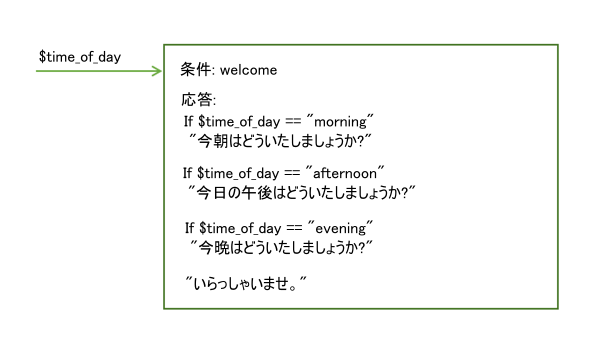
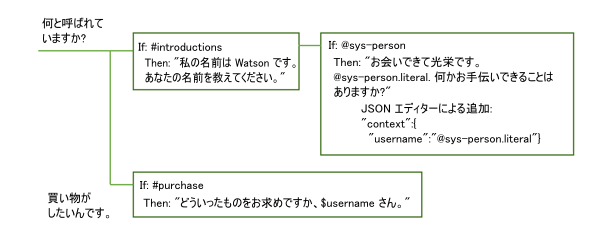
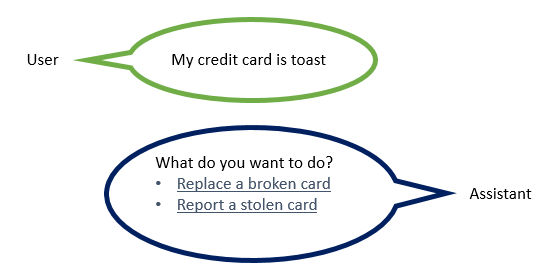

---

copyright:
  years: 2015, 2019
lastupdated: "2018-02-21"

subcollection: assistant

---

{:shortdesc: .shortdesc}
{:new_window: target="_blank"}
{:deprecated: .deprecated}
{:important: .important}
{:note: .note}
{:tip: .tip}
{:pre: .pre}
{:codeblock: .codeblock}
{:screen: .screen}
{:javascript: .ph data-hd-programlang='javascript'}
{:java: .ph data-hd-programlang='java'}
{:python: .ph data-hd-programlang='python'}
{:swift: .ph data-hd-programlang='swift'}
{:gif: data-image-type='gif'}

# ダイアログの処理方法
{: #dialog-runtime}

デプロイされた {{site.data.keyword.conversationshort}} サービスのインスタンスとユーザーが実行時に対話するときのダイアログの処理方法について説明します。
{: shortdesc}

## ダイアログ呼び出しの構造
{: #dialog-runtime-message-anatomy}

各ユーザーの発話は、/message API 呼び出しとしてダイアログに渡されます。 これには、詳細情報を要求するダイアログのプロンプトへの応答としてユーザーが行う発話も含まれます。 一部のサブスクリプション・プランには、設定された数の API 呼び出しが含まれているため、呼び出しの構成要素を理解するのに役立ちます。 単一の /message API 呼び出しは、ユーザーからの入力とそれに対応するダイアログからの応答で構成されたダイアログの単一のターンに相当します。

/message API 呼び出しの要求および応答の本文には、以下のオブジェクトが含まれます。

- `context`: 保持する必要のある変数が含まれます。 ある呼び出しから次の呼び出しに情報を渡すには、アプリケーション開発者が、前の API 呼び出しの応答のコンテキストを後続の各 API 呼び出しに渡す必要があります。 例えば、ダイアログがユーザーの名前を収集し、後続のノード内でそのユーザーを名前で参照できます。

  ```json
  {
    "context" : {
      "user_name" : "<? @sys-person.literal ?>"
    }
  ```
  {: codeblock}

  詳しくは、[ダイアログのターンをまたいで情報を保持する](#dialog-runtime-context)を参照してください。

- `input`: ユーザーから送信されたテキストの文字列。 テキスト文字列には最大 2,048 文字まで含めることができます。

  ```json
  {
    "input" : {
      "text" : "Where's your nearest store?"
    }
  ```
  {: codeblock}

- `output`: ユーザーに返すダイアログ応答。

  ```json
  {
  "output": {
    "generic":[
      {
        "values": [
        {
            "text": "This is my response text."
          }
        ],
      "response_type": "text",
      "selection_policy": "sequential"
    }
    ]
  }
  }
  ```
  {: codeblock}

結果の API /message 応答の、テキスト応答の形式は次のとおりです。

```json
{
   "text": "This is my response text.",
   "response_type": "text"
}
```

後方互換性のために、次の `output` オブジェクト形式がサポートされています。この形式を使用してテキスト応答を指定するすべてのワークスペースが、引き続き適切に機能します。リッチ応答タイプの導入により、テキストに加えて、他のタイプの応答がサポートされるように、`output.text` 構造が `output.generic` 構造によって拡張されました。応答タイプは必要に応じて後で変更できるため、柔軟性を確保できるよう、新しいノードを作成するときは新しい形式を使用してください。
{: note}

  ```json
  {
  "output": {
    "text": {
      "values": [
        "This is my response text."
      ]
    }
  }
  ```
  {: codeblock}

テキスト応答以外の応答タイプを定義できます。詳しくは、[応答](/docs/services/assistant?topic=assistant-dialog-overview#dialog-overview-responses)を参照してください。

/message API 呼び出しについて詳しくは、[API リファレンス ](https://{DomainName}/apidocs/assistant-v2){: new_window} を参照してください。

### ダイアログのターンをまたいで情報を保持する
{: #dialog-runtime-context}

ダイアログ・スキルのダイアログはステートレスです。つまり、ある対話でユーザーから取得した情報は次の対話まで保持されません。アシスタントにダイアログ・スキルを追加してデプロイすると、アシスタントによって 1 つのメッセージ呼び出しからのコンテキストが保存されて、現行セッション全体の次回の要求で再送信されます。現行セッションは、ユーザーがアシスタントと対話する限り続き、操作がない場合でも、プラス・プランまたはプレミアム・プランの場合は 60 分 (ライト・プランまたは標準プランの場合は 5 分) 続きます。アシスタントにダイアログ・スキルを追加しない場合は、アプリケーションが必要とする継続情報をカスタム・アプリケーション開発者が維持する必要があります。アプリケーションは、メッセージ API 応答内のコンテキスト・オブジェクトを探して保管し、会話フローの一部として生成された次の /message API 要求のコンテキスト・オブジェクトに渡す必要があります。

情報を独自に保持する方法の 1 つとして、コンテキスト・オブジェクト全体をクライアント・アプリケーション (Web ブラウザーなど) のメモリーに保管する方法があります。より複雑なアプリケーションの場合、または、個人情報を渡して保管する必要がある場合は、情報の保管と取り出しにデータベースを使用できます。 もちろん、最も簡単なアプローチは、コンテキストを一切保管する必要がないようにすることです。このアプローチを実装するには、アシスタントにダイアログ・スキルを追加して、アシスタントでコンテキストを追跡できるようにします。

アプリケーションからダイアログに情報を渡すことができます。また、ダイアログでその情報を更新してアプリケーションに戻したり、後続のノードに渡したりすることもできます。 そのために、ダイアログは*コンテキスト変数* を使用します。

## コンテキスト変数
{: #dialog-runtime-context-variables}

コンテキスト変数は、ノード内で定義する変数です。 これにはデフォルト値を指定できます。コンテキスト変数の値は、後から他のノード、アプリケーション・ロジック、またはユーザー入力で設定したり変更したりできます。

ダイアログ・ノード条件でコンテキスト変数を参照してノードを実行するかどうかを決定することで、コンテキスト変数値を条件として使用できます。 ダイアログ・ノードの応答条件からコンテキスト変数を参照し、外部サービスまたはユーザーから提供された値に応じて応答を変えることもできます。

詳細情報:

- [アプリケーションからコンテキストを渡す](#dialog-runtime-context-from-app)
- [ノードからノードへコンテキストを渡す](#dialog-runtime-context-node-to-node)
- [コンテキスト変数の定義](#dialog-runtime-context-var-define)
- [コンテキスト変数の一般的な作業](#dialog-runtime-context-common-tasks)
- [コンテキスト変数の削除](#dialog-runtime-context-delete)
- [コンテキスト変数値の更新](#dialog-runtime-context-update)
- [コンテキスト変数の処理方法](#dialog-runtime-context-processing)
- [処理の順序](#dialog-runtime-context-order-of-ops)
- [スロットを含むノードへのコンテキスト変数の追加](#dialog-runtime-context-var-slots)

### アプリケーションからコンテキストを渡す
{: #dialog-runtime-context-from-app}

アプリケーションからダイアログに情報を渡すには、コンテキスト変数を設定し、コンテキスト変数をダイアログに渡します。

例えば、アプリケーションが設定してダイアログに渡した $time_of_day コンテキスト変数を基に、ダイアログがユーザーに表示するあいさつを決定することができます。



この例では、アプリケーションが変数を *morning*、*afternoon*、*evening* のどの値に設定したかを、ダイアログが認識します。 ダイアログは各値をチェックし、設定された値に応じて適切なあいさつを返します。 変数が渡されないか、変数値がどの期待値とも一致しない場合は、より一般的なあいさつがユーザーに表示されます。

### ノードからノードへコンテキストを渡す
{: #dialog-runtime-context-node-to-node}

ダイアログではコンテキスト変数を追加して、あるノードから別のノードに情報を渡したり、コンテキスト変数の値を更新したりすることもできます。 ダイアログでユーザーに質問して情報を取得したら、その情報を記録し、後でダイアログで参照することができます。

例えば、あるノードでユーザーに名前を尋ね、後から別のノードでユーザーを名前で呼ぶことができます。



この例では、システム・エンティティー @sys-person を使用して、ユーザー入力からユーザー名を抽出します。 JSON エディターで、username コンテキスト変数を定義し、@sys-person 値に設定します。 それ以降のノードでは、$username コンテキスト変数を応答に指定して、ユーザーを名前で呼んでいます。

### コンテキスト変数の定義
{: #dialog-runtime-context-var-define}

ノードの編集ビューで、**「変数 (Variable)」**フィールドに変数名を追加して、**「値 (Value)」**フィールドにそのデフォルト値を追加することによって、コンテキスト変数を定義します。

1.  コンテキスト変数を追加するダイアログ・ノードをクリックして開きます。

1.  ノード応答に関連付けられている**「オプション (Options)」**  アイコンをクリックし、**「コンテキスト・エディターを開く (Open context editor)」**をクリックします。

      

      ノードの**「複数の応答 (Multiple responses)」**設定が**「オン (On)」**の場合は、まず、コンテキスト変数を関連付ける応答に対して、**「応答の編集 (Edit response)」**  アイコンをクリックする必要があります。

      

1.  変数の名前と値のペアを**「変数 (Variable)」**フィールドおよび**「値 (Value)」**フィールドに追加します。

    - `name` には、英字の大小文字、数字 (0 から 9 まで)、下線を使用できます。

      名前にはピリオドやハイフンなど、その他の文字も使用できます。 ただし、その場合は、後で変数を参照するとき、省略表現構文 `$(variable-name)` を毎回指定する必要があります。詳しくは、[オブジェクトにアクセスするための式](/docs/services/assistant?topic=assistant-expression-language#expression-language-shorthand-context)を参照してください。
      {:tip}

    - `value` には、単純な文字列変数、数値、JSON 配列、JSON オブジェクトなど、サポートされている任意の JSON 型を使用できます。

以下の表は、さまざまな値のタイプの名前と値のペアを定義する方法のいくつかの例を示しています。

| 変数       | 値                         |値タイプ|
|:---------------|-------------------------------|------------|
| dessert        | "cake"                        | ストリング     |
| age            | 18                            | Number     |
| toppings_array | ["onions","olives"]            | JSON 配列 |
| full_name      | {"first":"John","last":"Doe"} | JSON オブジェクト |

これらのコンテキスト変数を後から参照するには、`$name` という構文を使用します。ここで、*name* は定義したコンテキスト変数の名前です。

例えば、ダイアログの応答として次の式を指定できます。

`The customer, $age-year-old <? $full_name.first ?>, wants a pizza with <? $toppings_array.join(' and ') ?>, and then $dessert.`

結果の出力は以下のように表示されます。

`The customer, 18-year-old John, wants a pizza with onions and olives, and then cake.`

JSON エディターを使用してコンテキスト変数を定義することもできます。複合式を変数値として追加する場合は JSON エディターを使用することをお勧めします。詳しくは、[JSON エディターでのコンテキスト変数](#dialog-runtime-context-var-json)を参照してください。

### コンテキスト変数の一般的な作業
{: #dialog-runtime-context-common-tasks}

ユーザーから入力として提供された文字列全体を保管するには、`input.text` を使用します。

| 変数 | 値            |
|----------|------------------|
| repeat   | `<?input.text?>` |

例えば、ユーザー入力が `I want to order a device.` であるとします。ノード応答が `You said: $repeat` の場合、応答は `You said: I want to order a device.` として表示されます。

エンティティーの値をコンテキスト変数に格納するには、次の構文を使用します。

| 変数 | 値            |
|----------|------------------|
| place    | `@place`         |

例えば、ユーザー入力が `I want to go to Paris.` であるとします。@place エンティティーで `Paris` が認識される場合、サービスによって `$place` コンテキスト変数に `Paris` が保存されます。

ユーザー入力から抽出した文字列の値を格納するには、ユーザー入力に正規表現を適用する`抽出`メソッドを使用する SpEL 式を含めることができます。 以下の式は、ユーザー入力から数値を抽出し、`$number` コンテキスト変数に保存します。

| 変数 | 値                               |
|----------|-------------------------------------|
| 数値   | `<?input.text.extract('[\d]+',0)?>` |

パターン・エンティティーの値を保管するには、エンティティー名に .literal を付加します。 この構文を使用すると、ユーザー入力のうち、指定したパターンと一致する正確な範囲のテキストが変数に格納されます。

| 変数 | 値                  |
|----------|------------------------|
| email    | `<? @email.literal ?>` |

例えば、ユーザー入力が `Contact me at joe@example.com.` であるとします。`@email` というエンティティーで `name@domain.com` E メール形式が認識されます。`@email.literal` を保管するようにコンテキスト変数を構成して、パターンに一致した入力の一部を保管することを指定します。値式から `.literal` プロパティーを省略すると、パターンに一致したユーザー入力のセグメントではなく、パターンに指定したエンティティー値名が返されます。

これらの多くの値の例では、ユーザー入力のさまざまな部分を取り込むメソッドが使用されています。使用可能なメソッドについて詳しくは、[式言語のメソッド](/docs/services/assistant?topic=assistant-dialog-methods)を参照してください。

### コンテキスト変数の削除
{: #dialog-runtime-context-delete}

コンテキスト変数を削除するには、変数を NULL に設定します。

| 変数   | 値            |
|------------|------------------|
| order_form | `null`           |

また、アプリケーション・ロジックでコンテキスト変数を削除することもできます。 変数を完全に削除する方法について詳しくは、[JSON のコンテキスト変数の削除](#dialog-runtime-context-delete-json)を参照してください。

### コンテキスト変数値の更新
{: #dialog-runtime-context-update}

コンテキスト変数の値を更新するには、前のコンテキスト変数と同じ名前のコンテキスト変数を定義して、異なる値を指定します。

複数のノードで同じコンテキスト変数の値が設定されている場合、ユーザーとの会話の最中にコンテキスト変数の値が変わる場合があります。特定の時点でどの値が適用されるかは、会話の最中にユーザーによってトリガーされるノードに依存します。処理される最後のノードのコンテキスト変数に指定された値によって、以前に処理されたノードによって変数に設定された値が上書きされます。

値が JSON オブジェクトまたは JSON 配列データ・タイプであるときに、コンテキスト変数の値を更新する方法について詳しくは、[JSON のコンテキスト変数値の更新](#dialog-runtime-context-update-json)を参照してください。

### コンテキスト変数の処理方法
{: #dialog-runtime-context-processing}

コンテキスト変数を定義する場所が重要です。サービスによって、コンテキスト変数を定義したダイアログ・ノードの部分が処理されるまで、コンテキスト変数が作成されることも、指定した値に設定されることもありません。多くの場合、ノード応答の一部としてコンテキスト変数を定義します。このようにする場合、サービスからノード応答が返されたときに、コンテキスト変数が作成されて、指定した値が付与されます。

ノードで条件付き応答を使用する場合、特定の応答の条件が満たされて、その応答が処理されるときに、コンテキスト変数が作成されて設定されます。例えば、条件付き応答 #1 のコンテキスト変数を定義し、サービスによって条件付き応答 #2 のみが処理される場合は、条件付き応答 #1 に定義したコンテキスト変数は作成されることも設定されることもありません。

ユーザーがスロットを持つノードと対話するときの、サービスによって作成および設定するコンテキスト変数の追加場所について詳しくは、[スロットを含むノードへのコンテキスト変数の追加](#dialog-runtime-context-var-slots)を参照してください。

### 処理の順序
{: #dialog-runtime-context-order-of-ops}

まとめて処理される複数の変数を定義した場合、それらは、定義した順序どおりにサービスで評価されるわけではありません。サービスではランダムな順序で変数が評価されます。最初のコンテキスト変数が 2 番目のコンテキスト変数の前に実行される保証はないため、リスト内の最初のコンテキスト変数に設定した値をリスト内の 2 番目のコンテキスト変数で使用できると想定しないでください。例えば、2 つのコンテキスト変数を使用して、ユーザー入力に `Yes` という語が含まれるかどうかをチェックするロジックを実装しないでください。

| 変数        | 値            |
|-----------------|------------------|
| user_input      | <? input.text ?> |
| contains_yes    | <? $user_input.contains('Yes') ?> |

代わりに、リスト内の最初の変数の値 (user_input) が 2 番目の変数 (contains_yes) より先に評価されることに依存する必要がないように、少し複雑な式を使用します。

| 変数      | 値            |
|---------------|------------------|
| contains_yes  | <? input.text.contains('Yes') ?> |

### スロットを含むノードへのコンテキスト変数の追加
{: #dialog-runtime-context-var-slots}

スロットについて詳しくは、[スロットを使用した情報の収集](/docs/services/assistant?topic=assistant-dialog-slots)を参照してください。

1.  編集ビューでスロットを含むノードを開きます。

    - スロットの応答条件が満たされた後に処理されるコンテキスト変数を追加するには、次の手順を実行します。

      1.  **「スロットの編集 (Edit slot)」**アイコン  をクリックします。
      1.  **「オプション」**  アイコンをクリックし、**「条件付き応答を有効にする (Enable conditional responses)」**を選択します。
      1.  コンテキスト変数を関連付ける応答の横にある**「応答の編集 (Edit response)」**  アイコンをクリックします。
      1.  応答セクションの**「オプション (Options)」**  アイコンをクリックし、**「コンテキスト・エディターを開く (Open context editor)」**をクリックします。
      1.  変数の名前と値のペアを**「変数 (Variable)」**フィールドおよび**「値 (Value)」**フィールドに追加します。

      

    - スロット条件が満たされた後に設定または更新されるコンテキスト変数を追加するには、次の手順を実行します。

      1.  **「スロットの編集 (Edit slot)」**アイコン  をクリックします。
      1.  *「スロットの構成 (Configure slot)」*ビュー・ヘッダーの**「オプション」** メニューから、**「JSON エディターを開く (Open JSON editor)」**をクリックします
      1.  JSON フォーマットで変数の名前と値のペアを追加します。

          ```json
          {
            "time_of_day": "morning"
          }
          ```
          {: codeblock}

      現在、コンテキスト・エディターを使用して、ダイアログ・ノード評価のこのフェーズで設定されるコンテキスト変数を定義する方法はありません。 代わりに JSON エディターを使用してください。JSON エディターの使用について詳しくは、[JSON エディターでのコンテキスト変数](#dialog-runtime-context-var-json)を参照してください。
      {: note}

      

## JSON エディターでのコンテキスト変数
{: #dialog-runtime-context-var-json}

JSON エディターでコンテキスト変数を定義することもできます。複雑なコンテキスト変数を定義して、それを追加または変更するときに完全な SpEL 式を表示できるようにする場合は、JSON エディターを使用できます。

名前と値のペアは、以下の要件を満たしている必要があります。

- `name` には、英字の大小文字、数字 (0 から 9 まで)、下線を使用できます。

  名前にはピリオドやハイフンなど、その他の文字も使用できます。 ただし、その場合は、後で変数を参照するとき、省略表現構文 `$(variable-name)` を毎回指定する必要があります。詳しくは、[オブジェクトにアクセスするための式](/docs/services/assistant?topic=assistant-expression-language#expression-lanaguage-shorthand-context)を参照してください。
  {:tip}

- `value` には、単純な文字列変数、数値、JSON 配列、JSON オブジェクトなど、サポートされている任意の JSON 型を使用できます。

次の JSON のサンプルでは、$dessert ストリング、$toppings_array 配列、$age 数値、および $full_name オブジェクトのコンテキスト変数の値を定義しています。

```json
{
  "context": {
    "dessert": "cake",
    "toppings_array": [
      "onions",
      "olives"
    ],
    "age": 18,
    "full_name": {
      "first": "Jane",
      "last": "Doe"
    }
  },
        "output": {}
      }
```
{: codeblock}

JSON フォーマットでコンテキスト変数を定義するには、以下の手順を実行します。

1.  コンテキスト変数を追加するダイアログ・ノードをクリックして開きます。

    このノードに定義されている既存のコンテキスト変数値が、対応する**「変数 (Variable)」**フィールドと**「値 (Value)」**フィールドのセットに表示されます。 それらをノードの編集ビューに表示する必要がない場合は、コンテキスト・エディターを閉じる必要があります。 JSON エディターを開いたときに使用したのと同じメニューからエディターを閉じることができます。以下の手順で、メニューにアクセスする方法を説明します。
    {: note}

1.  応答に関連付けられている**「オプション (Options)」**  アイコンをクリックし、**「JSON エディターを開く (Open JSON editor)」**をクリックします。

    

    ノードの**「複数の応答 (Multiple responses)」**設定が**「オン (On)」**の場合は、まず、コンテキスト変数を関連付ける応答に対して、**「応答の編集 (Edit response)」**  アイコンをクリックする必要があります。

    

1.  `"context":{}` ブロックがない場合は追加します。

    ```json
    {
      "context":{},
      "output":{}
    }
    ```
    {: codeblock}

1.  コンテキスト・ブロックに、定義する各コンテキスト変数の `"name"` と `"value"` のペアを追加します。

    ```json
    {
      "context": {
        "name": "value"
    },
        "output": {}
      }
    ```
    {: codeblock}

    この例では、変数が既に含まれているコンテキスト・ブロックに `new_variable` という名前の変数を追加します。

    ```json
    {
      "context": {
        "existing_variable": "value",
        "new_variable":"value"
      }
    }
    ```
    {: codeblock}

    コンテキスト変数を後から参照するには、`$name` という構文を使用します。ここで、*name* は定義したコンテキスト変数の名前です。 例えば、`$new_variable` です。

詳細情報:

- [JSON のコンテキスト変数の削除](#dialog-runtime-context-delete-json)
- [JSON のコンテキスト変数値の更新](#dialog-runtime-context-update-json)
- [別のコンテキスト変数と等しいコンテキスト変数の設定](#dialog-runtime-var-equals-var)

### JSON のコンテキスト変数の削除
{: #dialog-runtime-context-delete-json}

コンテキスト変数を削除するには、変数を NULL に設定します。

```json
{
  "context": {
    "order_form": null
  }
}
```
{: codeblock}

コンテキスト変数のすべてのトレースを削除する場合は、JSONObject.remove(string) メソッドを使用してコンテキスト・オブジェクトから削除することができます。 ただし、削除を実行するには変数を使用する必要があります。 現在の呼び出しを超えて保存されないように、新しい変数をメッセージ出力に定義してください。

```json
{
  "output": {
    "text" : {},
    "deleted_variable" : "<? context.remove('order_form') ?>"
  }
}
```
{: codeblock}

また、アプリケーション・ロジックでコンテキスト変数を削除することもできます。

### JSON のコンテキスト変数値の更新
{: #dialog-runtime-context-update-json}

通常、既に設定されていたコンテキスト変数の値をノードで設定すると、前の値が新しい値によって上書きされます。

#### 複雑な JSON オブジェクトの更新

JSON オブジェクト以外の JSON タイプでは、前の値が上書きされます。 コンテキスト変数が JSON オブジェクトなどの複合タイプである場合は、JSON のマージ処理を使用して変数が更新されます。 マージ処理によって、新しく定義したプロパティーが追加され、オブジェクトの既存のプロパティーが上書きされます。

次の例では、名前のコンテキスト変数が複合オブジェクトとして定義されています。

```json
{
  "context": {
    "complex_object": {
      "user_firstname" : "Paul",
      "user_lastname" : "Pan",
      "has_card" : false
    }
  }
}
```
{: codeblock}

このコンテキスト変数の JSON オブジェクトを、ダイアログ・ノードで次の値に更新します。

```json
{
  "complex_object": {
    "user_firstname": "Peter",
    "has_card": true
  }
}
```
{: codeblock}

結果のコンテキストは次のようになります。

```json
{
  "complex_object": {
    "user_firstname": "Peter",
    "user_lastname": "Pan",
    "has_card": true
  }
}
```
{: codeblock}

オブジェクトに対して実行できるメソッドの詳細については、[式言語メソッド](/docs/services/assistant?topic=assistant-dialog-methods#dialog-methods-objects)を参照してください。

#### 配列の更新

ダイアログのコンテキスト・データに値の配列が含まれている場合は、値を追加したり、削除したり、すべての値を置換したりして配列を更新できます。

以下のいずれかのアクションを選択して配列を更新できます。 すべてのケースについて、アクションの前の配列、アクション、アクションが適用された後の配列を示しています。

- **追加**: 配列の最後に値を追加するには、`append` メソッドを使用します。

    このダイアログ実行時のコンテキスト:

    ```json
    {
      "context": {
        "toppings_array": ["onion", "olives"]
      }
    }
    ```
    {: codeblock}

    適用する更新:

    ```json
    {
      "context": {
        "toppings_array": "<? $toppings_array.append('ketchup', 'tomatoes') ?>"
      }
    }
    ```
    {: codeblock}

    結果:

    ```json
    {
      "context": {
        "toppings_array": ["onion", "olives", "ketchup", "tomatoes"]
      }
    }
    ```
    {: codeblock}

- **削除**: 要素を削除するには、`remove` メソッドを使用し、配列内の値または位置を指定します。

    - **値で削除**: 要素の値を指定して、配列から要素を削除します。

        このダイアログ実行時のコンテキスト:

        ```json
        {
          "context": {
            "toppings_array": ["onion", "olives"]
      }
        }
        ```
        {: codeblock}

        適用する更新:

        ```json
        {
          "context": {
            "toppings_array": "<? $toppings_array.removeValue('onion') ?>"
          }
        }
        ```
        {: codeblock}

        結果:

        ```json
        {
          "context": {
            "toppings_array": ["olives"]
          }
        }
        ```
        {: codeblock}

    - **位置で削除**: 要素のインデックス位置を指定して、配列から要素を削除します。

        このダイアログ実行時のコンテキスト:

        ```json
        {
          "context": {
            "toppings_array": ["onion", "olives"]
      }
        }
        ```
        {: codeblock}

        適用する更新:

        ```json
        {
          "context": {
            "toppings_array": "<? $toppings_array.remove(0) ?>"
          }
        }
        ```
        {: codeblock}

        結果:

        ```json
        {
          "context": {
            "toppings_array": ["olives"]
          }
        }
        ```
        {: codeblock}

- **上書き**: 配列内の値を上書きするには、単に配列に新しい値を設定します。

    このダイアログ実行時のコンテキスト:

        ```json
        {
          "context": {
            "toppings_array": ["onion", "olives"]
      }
        }
        ```
        {: codeblock}

    適用する更新:

        ```json
        {
          "context": {
            "toppings_array": ["ketchup", "tomatoes"]
          }
        }
        ```
        {: codeblock}

    結果:

        ```json
        {
          "context": {
            "toppings_array": ["ketchup", "tomatoes"]
          }
        }
        ```
        {: codeblock}

配列に対して実行できるメソッドの詳細については、[式言語メソッド](/docs/services/assistant?topic=assistant-dialog-methods#dialog-methods-arrays)を参照してください。

### 別のコンテキスト変数と等しいコンテキスト変数の設定
{: #dialog-runtime-var-equals-var}

あるコンテキスト変数を別のコンテキスト変数と等しくなるように設定するときは、一方からもう一方までのポインターを定義します。一方の変数の値がその後変更されると、もう一方の変数の値も変更されます。

例えば、次のようにコンテキスト変数を指定した場合、その後 `$var1` または `$var2` の値が変更されると、もう一方の値も変更されます。

| 変数  | 値  |
|-----------|--------|
| var2      | var1   |

ポイント・イン・タイム値を取り込む場合は、別の変数と等しくなるように変数を設定しないでください。例えば、配列を処理するときに、ダイアログの特定の時点でコンテキスト変数に格納された配列値を取り込み、後で使用できるように保存する場合は、代わりに変数の現在の値に基づいて新しい変数を作成できます。

例えば、ダイアログ・フローの特定の時点の配列の値のコピーを作成するには、既存の配列の値が取り込まれた新しい配列を追加します。これを行うには、以下の構文を使用できます。

```json
{
"context": {
   "var2": "<? output.var2?:new JsonArray().append($var1) ?>"
 }
 }
 ```
{: codeblock}

## 脱線
{: #dialog-runtime-digressions}

脱線とは、ユーザーが、ある目的のために設計されたダイアログ・フローの途中で、突然トピックを切り替えて、別の目的のために設計されたダイアログ・フローを開始することです。 ダイアログは、いつでもユーザーがサブジェクトを変更できるようになっています。 処理中のダイアログ・ブランチに、ユーザーの最新の入力の目的と一致するノードがない場合、会話はツリーに戻り、適切な一致がないかルート・ノードの条件をチェックします。 ノードごとに設定可能な脱線設定を使用して、この動作をさらに細かく調整できます。

脱線の設定を使用すると、脱線が発生して中断されたダイアログ・フローに会話を戻すことができます。 例えば、新しい電話機を注文中のユーザーが、トピックを切り替えてタブレットについて尋ねる可能性があります。 ダイアログで、タブレットについての質問に回答した後に、電話の注文プロセスを中断した時点にユーザーを戻すことができます。 脱線して元に戻ることを可能にすると、ユーザーが実行時に会話のフローをより細かく制御できるようになります。 トピックを変更し、関連のないトピックについてのダイアログ・フローを最後までたどってから、前の場所に戻ることができます。 その結果、人対人の会話により近い会話をシミュレートできるダイアログ・フローになります。

{: gif}

アニメーション表示のイメージで、ダイアログ・ツリーのユーザー・インターフェースのモックアップを使用して、脱線の概念について説明します。これは、脱線した後に、処理中だったダイアログ・フローに戻れるように構成したダイアログ・ノードとのユーザーの対話を示しています。 ユーザーがディナーを予約するために必要な情報の提供を開始します。 #reservation ノードのスロットに情報を取り込んでいる途中で、ユーザーがベジタリアン用メニューのオプションについての質問をします。 ダイアログは、ルート・ノード (#cuisine インテントを条件とするノード) の中から対応するノードを見つけて、ユーザーの新しい質問に回答します。 そして、元のダイアログ・ノードの次の空スロットを求めるプロンプトを表示して、処理中だった会話に戻ります。

詳しくは、以下のビデオをご覧ください。

<iframe class="embed-responsive-item" id="youtubeplayer" title="脱線の概要" type="text/html" width="640" height="390" src="https://www.youtube.com/embed/I3K7mQ46K3o?rel=0" frameborder="0" webkitallowfullscreen mozallowfullscreen allowfullscreen> </iframe>

- [始める前に](#dialog-runtime-digression-prereqs)
- [脱線のカスタマイズ](#dialog-runtime-enable-digressions)
- [脱線の使用上のヒント](#dialog-runtime-digress-tips)
- [ルート・ノードへの脱線の無効化](#dialog-runtime-disable-digressions)
- [脱線のチュートリアル](#dialog-runtime-digression-tutorial)
- [設計上の考慮事項](#dialog-runtime-digression-design-considerations)

### 始める前に
{: #dialog-runtime-digression-prereqs}

ダイアログ全体をテストすると、脱線して戻ることを、いつどこで許可するのが自然かがわかります。 ノードには以下の脱線制御が自動的に適用されます。 このデフォルトの動作を変更する必要がある場合にのみ、操作を実行してください。

- ダイアログのすべてのルート・ノードは、デフォルトで脱線のターゲットにできるように構成されています。 子ノードは、脱線のターゲットにできません。
- スロット付きのノードは、脱線できないように構成されています。 他のすべてのノードは、脱線できるように構成されています。 ただし、以下の状況では、会話をノードから脱線させることはできません。

  - 現行ノードのいずれかの子ノードに `anything_else` 条件または `true` 条件が含まれている場合

    これらの条件は、常に true に評価される点が特殊です。 動作が既知であるため、これらの条件は、続けて特定の子ノードを評価することを親ノードに強制するためにダイアログでよく使用されます。 この場合、既存のダイアログ・フロー・ロジックの中断を防ぐために、脱線は許可されません。 このようなノードからの脱線を有効にするには、子ノードの条件を別のものに変更する必要があります。

  - 処理された後に、別のノードにジャンプするように、またはユーザー入力をスキップするようにノードが構成されている場合

    ノードの最終ステップのセクションには、ノードが処理された後に実行すべき内容を指定します。 ダイアログが別のノードに直接ジャンプするように構成されている場合は、特定の順序に従う必要があることがよくあります。 また、ノードがユーザー入力をスキップするように構成されている場合は、現行ノードの後に続けて最初の子ノードを処理するようにダイアログに強制することと同じです。 どちらの場合も、既存のダイアログ・フロー・ロジックの中断を防ぐために、脱線は許可されません。 このようなノードからの脱線を有効にするには、最終ステップのセクションに指定した内容を変更する必要があります。

### 脱線のカスタマイズ
{: #dialog-runtime-enable-digressions}

脱線の開始と終了は定義しません。 実行時には、ユーザーが脱線フローを完全に制御します。 ユーザー主導の脱線に各ノードを参加させるかどうかのみを指定します。 ノードごとに、以下を構成します。

- 脱線を開始して、このノードから離れることができるか
- 他の場所で開始された脱線で、このノードをターゲットにして中に入ることができるか
- 他の場所で開始され、このノードに入った脱線が、現在のダイアログ・フローの完了後に、中断されたダイアログ・フローに戻る必要があるか

個々のノードの脱線動作を変更するには、次の手順を実行します。

1.  ノードをクリックして、その編集ビューを開きます。

1.  **「カスタマイズ (Customize)」**をクリックし、**「脱線 (Digressions)」**タブをクリックします。

    構成オプションは、編集するノードがルート・ノード、子ノード、子を持つノード、またはスロット付きノードのいずれであるかによって異なります。

    **このノードからの脱線**

    前述の状況が当てはまらない場合は、以下の選択を行えます。

    - **すべてのノード・タイプ**: 現在のダイアログ・ブランチの最後に到達する前に、現在のノードから脱線することをユーザーに許可するかどうかを選択できます。

    - **子を持つすべてのノード**: 現在のノードの応答が既に表示されていて、子ノードがこのノードの目的と同じ場合に、脱線の後に会話を現在のノードに戻すかどうかを選択します。 *「このノードの応答の後にトリガーされた脱線からの戻りを許可 (Allow return from digressions triggered after this node's response)」*トグルを**「いいえ (No)」**に設定すると、ダイアログが現在のノードに戻ってブランチの処理を再開することを防止できます。

      例えば、ユーザーから`「カップケーキはありますか?」`と尋ねられ、`「さまざまな味とサイズのカップケーキをご用意しております」`という応答を表示した後にユーザーがサブジェクトを変更した場合、ダイアログを中断した場所に戻す必要はないでしょう。 子ノードがユーザーからのフォローアップの質問に対処するだけで、無視しても問題ない場合は、特にそうです。

      ただし、質問に対処するために子ノードに依存するノードの場合には、強制的に会話を戻して、現行ブランチ内のノードの処理を再開させる必要があるでしょう。 例えば、最初の応答が`「さまざまな形とサイズのカップケーキをご用意しております。グルテンフリー・メニュー、乳製品フリー・メニュー、または通常メニューのどれをご覧になりますか?」`だとします。 ユーザーがこの時点でサブジェクトを変更した場合は、ユーザーがメニュー・タイプを選択して必要な情報を取得できるように、ダイアログを戻す必要があります。

    - **スロット付きのノード**: すべてのスロットに情報が取り込まれる前に、ノードから脱線することをユーザーに許可するかどうかを選択します。 脱線を可能にするには、**「スロットに情報を取り込み中に脱線を許可する (Allow digressions away while slot filling)」**トグルを*「はい (Yes)」*に設定します。

      可能にした場合は、会話が脱線から戻ったときに、情報が取り込まれていない次のスロットを求めるプロンプトを表示して、ユーザーに情報提供を再開するように促します。 不可にした場合、スロットに情報を取り込める値が含まれていないユーザー入力はすべて無視されます。 ただし、スロット・ハンドラーを定義して、ノードとの対話中にユーザーが尋ねるかもしれない割り込みの質問に対処できます。 詳しくは、[スロットの追加](/docs/services/assistant?topic=assistant-dialog-slots#dialog-slots-add)を参照してください。

      以下の図は、スロット付きの #reservation ノード (前の図を参照) からの脱線の構成を示しています。

      

    - **スロット付きノード**: **「スロットから戻りが許可されているノードへの脱線のみ (Only digress from slots to nodes that allow returns)」**チェック・ボックスの選択によって、現在のノードに戻る場合にのみ脱線することをユーザーに許可するかどうかを選択します。

      これを選択すると、ダイアログは、ユーザーの無関係な質問に回答するためのノードを探す際に、脱線の後に戻るように構成されていないルート・ノードを無視します。 必要なスロットに情報が取り込まれるまでユーザーが永遠にノードを離れられないようにするには、このチェック・ボックスを選択してください。

    **このノードへの脱線**

    ノードへの脱線の動作については、以下の選択を行えます。

    - 脱線してこのノードに入ることをユーザーに禁止します。 詳しくは、[ルート・ノードへの脱線の無効化](#dialog-runtime-disable-digressions)を参照してください。

    - このノードへの脱線を可能にした場合は、ダイアログがその脱線元のダイアログ・フローに戻る必要があるかどうかを選択します。 これを選択すると、現行ノードのブランチが処理された後に、ダイアログ・フローは中断されたノードに戻ります。 後でダイアログを戻すには、**「脱線後に戻る (Return after digression)」**を選択します。

    以下の図は、#cuisine ノード (前の図を参照) への脱線の構成を示しています。

    

1.  **「適用」**をクリックします。

1.  「Try it out」ペインを使用して、脱線の動作をテストします。

    ここでも、脱線の開始と終了は定義できません。 いつどこで脱線するかは、ユーザーが制御します。 適用できる設定は、1 つのノードがどのように脱線に参加するかを決める設定だけです。 脱線は予測不能であるため、構成上の決定が会話全体にどのように影響するかを把握することは困難です。 判断した選択の影響を実際に確認するために、ダイアログをテストする必要があります。

#reservation ノードおよび #cuisine ノードは、ユーザー主導の単一の脱線に参加できる 2 つのダイアログ・ブランチを表しています。 個々のノードに対して構成する脱線設定は、実行時にこのタイプの脱線を可能にするものです。


### 脱線の使用上のヒント
{: #dialog-runtime-digress-tips}

このセクションでは、脱線の使用時に発生する可能性のある状況の解決方法について説明します。

- **戻ることについてのカスタム・メッセージ**: 脱線から戻ることを有効にするノードに対して、前のダイアログ・フローを中断した場所に戻ることをユーザーに知らせる言い回しを追加することを検討してください。テキスト応答では、2 つのバージョンの応答を追加できる特殊な構文を使用します。

  アクションを実行しないと、脱線元のノードに戻ったことをユーザーに知らせるために、同じテキスト応答が再度表示されます。戻ったときに表示される固有のメッセージを指定して、元の会話スレッドに戻ったことをより明確にユーザーに示すことができます。

  例えば、ノードの元のテキスト応答が `What's the order number?` の場合、ユーザーがノードに戻ったときに `Now let's get back to where we left off. What is the order number?` などのメッセージを表示できます。

  これを行うには、次の構文を使用して、ノードのテキスト応答を指定します。

  `<? (returning_from_digression)? "post-digression message" : "first-time message" ?>`

  次に例を示します。

  ```bash
  <? (returning_from_digression)? "Now, let's get back to where we left off.
  What is the order number?" : "What's the order number?" ?>
  ```
  {: codeblock}

  追加するテキスト応答には、SpEL 式や省略表現の構文を含めることはできません。実際には、省略表現の構文は一切使用できません。代わりに、テキスト・ストリングと完全な SpEL 式構文を組み合わせて完全な応答を形成することで、メッセージを作成する必要があります。
  {: note}
  
  例えば、次の構文を使用して、通常 `What can I do for you, $username?` と指定しているテキスト応答にコンテキスト変数を含めます。

  ```bash
  <? (returning_from_digression)? "Where were we, " +
  context["username"] + "? Oh right, I was asking what can I do
  for you today." : "What can I do for you today, " +
  context["username"] + "?" ?>
  ```

  完全な SpEL 式構文の詳細については、[オブジェクトにアクセスするための式](/docs/services/assistant?topic=assistant-expression-language#expression-language-shorthand-syntax)を参照してください。

- **戻ることの防止**: 場合によっては、現在のダイアログ・フローでのユーザーの選択に基づいて、中断された会話フローに戻らないようにすることができます。特殊な構文を使用して、特定のノードから戻ることを防止できます。

  例えば、`#General_Connect_To_Agent` のようなインテントを条件とするノードがあるとします。トリガーの際に、これらを外部サービスに転送する前にユーザーの確認を取得する必要がある場合は、`Do you want me to transfer you to an agent now?` などの応答を追加できます。その後、それぞれ `#yes` と `#no` を条件とする 2 つの子ノードを追加できます。
  
  このタイプのブランチの脱線を管理する最善の方法は、脱線して戻ることを許可するようにルート・ノードを設定することです。ただし、`#yes` ノードでは、応答に SpEL 式 `<? clearDialogStack() ?>` を含めます。次に例を示します。
  
    ```bash
  OK. I will transfer you now. <? clearDialogStack() ?>
  ```
  {: codeblock}

  この SpEL 式により、脱線して戻ることがこのノードから行われなくなります。確認が要求されたときに、ユーザーが yes と回答すると、適切な応答が表示され、中断されたダイアログ・フローは再開されません。ユーザーが no と回答すると、中断されたフローにユーザーが戻ります。

### ルート・ノードへの脱線の無効化
{: #dialog-runtime-disable-digressions}

ルート・ノードに脱線したフローは、そのノード用に構成されたダイアログのコースに従います。そのため、一連の子ノードを処理してノード・ブランチの最後に到達したら、中断されたダイアログ・フローに戻ります (そうするように構成されている場合)。 ダイアログのテストから、ルート・ノードがトリガーされすぎていること、予期しないタイミングでトリガーされていること、ダイアログが複雑すぎてユーザーがコースから離れすぎてしまい、一時的な脱線対象に適さないことなどがわかる場合があります。 ユーザーに脱線を許可しないほうがよいと判断した場合は、ルート・ノードへの脱線を許可しないように構成できます。

ルート・ノードへの脱線を完全に無効にするには、次の手順を実行します。

1.  編集するルート・ノードをクリックして開きます。
1.  **「カスタマイズ (Customize)」**をクリックし、**「脱線 (Digressions)」**タブをクリックします。
1.  *「このノードへの脱線を許可する (Allow digressions into this node)」* トグルを**「オフ (Off)」**に設定します。
1.  **「適用 (Apply)」**をクリックします。

複数のルート・ノードへの脱線を禁止する場合に、ノードを 1 つずつ編集したくなければ、それらのノードを 1 つのフォルダーに追加します。 そのフォルダーの*「カスタマイズ (Customize)」* ページで、*「このノードへの脱線を許可する (Allow digressions into this node)」* トグルを**「オフ (Off)」**に設定することで、構成を一度にすべてのノードに適用できます。詳しくは、[フォルダーを使用したダイアログの編成](/docs/services/assistant?topic=assistant-dialog-build#dialog-build-folders)を参照してください。

### 脱線のチュートリアル
{: #dialog-runtime-digression-tutorial}

[チュートリアル](/docs/services/assistant?topic=assistant-tutorial-digressions)に従って、一連のノードが既に定義されているワークスペースをインポートします。脱線の処理の流れを説明するいくつかの演習を実施できます。

### 設計上の考慮事項
{: #dialog-runtime-digression-design-considerations}

- **フォールバック・ノードの急増を避ける**: 多くのダイアログ・デザイナーは、ユーザーがブランチ内にスタックすることを防止する手段として、各ダイアログ・ブランチの最後に「true」条件または「anything_else」条件を指定したノードを含めます。 この設計では、処理するための特定のダイアログ・ノードを用意していた予期される入力にユーザー入力が一致しない場合は、汎用メッセージが返されます。 しかし、ユーザーは、この方法を使用するダイアログ・フローからは脱線できません。

  この方法を使用するブランチを評価して、そのブランチからの脱線を許可したほうが良いかどうかを確認してください。 ユーザーの入力が予期した入力と一致しない場合に、ツリー内のまったく異なるダイアログ・フローで一致が見つかる場合があります。 汎用メッセージで応答するのではなく、ダイアログの残りの部分を効果的に活用して、ユーザーの入力に対処することができます。 ルート・レベルの「Anything else」ノードは、他のルート・ノードが対処できない入力に常に応答できます。

- **クローズ・ノードへのジャンプを見直す**: 多くのダイアログは、`「この回答に満足していただけましたか?」`のような標準的なクローズ質問を行うように設計されます。ユーザーは、別のノードにジャンプするように構成されているノードからは脱線できません。そのため、すべての最終ブランチ・ノードを 1 つの共通のクローズ・ノードにジャンプするように構成した場合、脱線は実行できません。 メトリックなどの手段によって、ユーザーの満足度を追跡することを検討してください。

- **潜在的な脱線チェーンのテスト**: ユーザーが現行ノードから脱線した先の別のノードが、脱線することを許可されている場合、ユーザーはそのノードから脱線して、このパターンを 1 回以上繰り返す可能性があります。 脱線チェーン内の開始ノードが脱線後に戻るように構成されている場合、ユーザーは最終的に現在のダイアログ・ノードに戻されます。実際には、戻らないように構成されているチェーン内の後続のすべてのノードは、脱線ターゲットと見なす対象から除外されます。何度も脱線するシナリオは、テストして、個々のノードが期待どおりに機能することを確認してください。

- **現行ノードが優先されることに注意してください**: 現行フローがユーザー入力を処理できない場合、現行フローの外部にあるノードは、脱線ターゲットとしか見なされないことに注意してください。 特に、脱線することを許可したスロットを持つノードでは、どんな情報が必要かをユーザーに明確に示し、ユーザーから値が提供された後に表示する確認ステートメントを追加することが非常に重要です。

  スロットへの情報の取り込み処理中は、すべてのスロットが取り込み可能です。 そのため、スロットが予期せずユーザー入力をキャプチャーすることがあります。 例えば、ディナーの予約に必要な情報を収集するスロットを持つノードがあるとします。 スロットの 1 つが日付情報を収集します。 予約の詳細情報を提供しているときに、ユーザーが「明日の天気はどうなりますか?」と尋ねたとします。 ユーザーに回答を提供できる、#forecast を条件とするルート・ノードがあるとします。 しかし、ユーザーの入力には「明日」という語が含まれていて、スロット付きの予約ノードが処理中であるため、サービスはユーザーが予約日を提供または更新していると想定します。 *現行ノードは常に優先されます。* `「わかりました。予約日を明日に設定します」`などの明確な確認ステートメントを定義すると、ユーザーがコミュニケーションの誤りに気付いて修正する可能性が高くなります。

  それとは逆に、スロットに情報を取り込み中に、ユーザーがいずれのスロットでも予期されていない値を提供し、脱線先としてまったく意図していなかった完全に無関係のルート・ノードにその値が一致する可能性もあります。

  脱線の動作を構成する際には、必ず何度もテストを行ってください。

- **スロット・ハンドラーの代わりに脱線を使用すべき状況**: いつでもユーザーが尋ねる可能性がある一般的な質問には、脱線して入ることを許可したルート・ノードを使用し、入力を処理してから、処理中だったフローに戻ります。 スロット付きのノードの場合は、スロットへの入力中にユーザーが尋ねる可能性がある関連質問のタイプを予想し、ノードにハンドラーを追加して質問に対処します。

  例えば、スロット付きのノードで保険請求の記入に必要な情報を収集する場合は、保険に関する一般的な質問に対処するハンドラーを追加すると良いでしょう。 ただし、支援を得る方法、店舗の場所、会社の沿革についての質問には、ルート・レベルのノードを使用してください。

## 明確化 
{: #dialog-runtime-disambiguation}

この機能はプラス・ユーザーまたはプレミアム・ユーザーにのみ提供されています。
{: tip}

明確化を有効にする場合は、複数のダイアログ・ノードが入力に応答できることをサービスが認識したときに、ユーザーに支援を求めるようサービスに指示します。処理するノードを推測するのではなく、アシスタントによって、トップ・ノード・オプションのリストがユーザーに提示され、適切なものを選択するようユーザーに求められます。



有効にすると、次の条件が満たされていない限り、明確化はトリガーされません。

- ユーザー入力で検出された 1 つ以上の次点のインテントの信頼度スコアが、上位インテントの信頼度スコアの 55% を超えている。
- 上位インテントの信頼度スコアが 0.2 を超えている。

これらの条件が満たされている場合でも、ダイアログ内の複数の独立ノードが次の基準を満たしていない限り、明確化は発生しません。

- ノード条件に、明確化をトリガーしたインテントの 1 つが含まれている。または別の方法でノード条件が true と評価される。例えば、ノードでエンティティー・タイプがチェックされ、エンティティーがユーザー入力で言及される場合は、適格です。
- ノードの*外部ノード名* フィールドにテキストがある。

詳細情報

- [明確化の例](#dialog-runtime-disambig-example)
- [明確化の有効化](#dialog-runtime-disambig-enable)
- [ノードの選択](#dialog-runtime-choose-nodes)
- [「上記のどれでもない (none of the above)」の処理](#dialog-runtime-handle-none)
- [明確化のテスト](#dialog-runtime-disambig-test)

### 明確化の例
{: #dialog-runtime-disambig-example}

例えば、取り消し要求に対応するインテント条件を含む 2 つのノードを持つダイアログがあるとします。条件は以下のとおりです。

- eCommerce_Cancel_Product_Order
- Customer_Care_Cancel_Account

ユーザー入力が `i must cancel it today` の場合、入力で次のインテントが検出されます。

`[`
`{"intent":"Customer_Care_Cancel_Account","confidence":0.6618281841278076},`
`{"intent":"eCommerce_Cancel_Product_Order","confidence":0.4330700159072876},`
`{"intent":"Customer_Care_Appointments","confidence":0.2902342438697815},`
`{"intent":"Customer_Care_Store_Hours","confidence":0.2550420880317688},`
`...]`

サービスでの、ユーザーの目的が `#Customer_Care_Cancel_Account`インテントに一致することの信頼度は `0.6618281841278076` (66%) です。他のインテントに 66% の 55% を超える信頼度スコアがある場合、明確化の候補になる基準に当てはまります。

`0.66 x 0.55 = 0.36`

スコアが 0.36 を超えるインテントは、適格です。

例では、`#eCommerce_Cancel_Product_Order` インテントの信頼度スコアが `0.4330700159072876` で、しきい値を超えています。

ユーザー入力が `i must cancel it today` の場合、両方のダイアログ・ノードが、応答が可能な候補であると見なされます。処理するダイアログ・ノードを決定するために、ユーザーはアシスタントによって選択を求められます。また、ユーザーの選択に役立つように、アシスタントによって、各ノードの実行内容についての簡単なサマリーが示されます。表示されるサマリーのテキストは、各ノードに対して指定された*外部ノード名* 情報から直接抽出されます。


サービスでは、`@sys-date` エンティティーの言及である `today` というユーザー入力の用語が、日付として認識されます。ダイアログ・ツリーに `@sys-date` エンティティーを条件とするノードが含まれる場合、このノードは明確化の選択肢のリストにも含まれます。次のイメージでは、これが*「日付情報のキャプチャー (Capture date information)」* オプションとしてリストに含まれることを示しています。


以下のビデオでは、明確化の概要を紹介しています。

<iframe class="embed-responsive-item" id="youtubeplayer0" title="明確化の概要" type="text/html" width="640" height="390" src="https://www.youtube.com/embed/VVyklAXlmbA?rel=0" frameborder="0" webkitallowfullscreen mozallowfullscreen allowfullscreen> </iframe>

### 明確化の有効化
{: #dialog-runtime-disambig-enable}

明確化を有効にするには、以下の手順を実行します。

1.  「ダイアログ (Dialogs)」ページから**「設定 (Settings)」**をクリックします。
1.  **「明確化 (Disambiguation)」**をクリックします。
1.  *「明確化の有効化 (Enable disambiguation)」* セクションで、トグルを**「オン (On)」**に切り替えます。
1.  プロンプト・メッセージ・フィールドで、ダイアログ・ノード・オプションのリストの前に表示されるテキストを追加します。例えば、*What do you want to do?* などとします。
1.  **オプション**: 「上記のどれでもない (none of the above)」メッセージ・フィールドに、他のダイアログ・ノードではユーザーが希望する実行内容が反映されていない場合に、ユーザーが選択できる追加のオプションとして表示するテキストを追加します。例えば、*None of the above* などとします。

    他のオプションと揃って表示されるように、メッセージは短くします。メッセージは 512 文字未満にする必要があります。ユーザーがこのオプションを選択する場合にサービスによって実行される内容の詳細については、[「上記のどれでもない (none of the above)」の処理](#dialog-runtime-handle-none)を参照してください。

1.  **「閉じる (Close)」**をクリックします。
1.  アシスタントで支援を求めるダイアログ・ノードを決定します。

    - ツリー階層のすべてのレベルのノードを選択できます。
    - インテント、エンティティー、特殊条件、コンテキスト変数、またはこれらの値の組み合わせを条件とするノードを選択できます。

    ヒントについては、[ノードの選択](#dialog-runtime-choose-nodes)を参照してください。

    明確化をオプトインするノードごとに、以下の手順を実行します。

    1.  ノードをクリックして、編集ビューで開きます。
    1.  *外部ノード名* フィールドで、設計上このダイアログ・ノードが処理するユーザー・タスクを記述します。例えば、*Cancel an account* などとします。

        

### ノードの選択
{: #dialog-runtime-choose-nodes}

明確化の選択肢となる、ダイアログの個別のブランチのルートとして機能するノードを選択します。これらには、他のノードの子であるノードが含まれる場合があります。要点は、対象のノードが、他のものと区別する 1 つ以上の何らかの個別の値を条件とすることです。

ツールでは、複数のインテントで重複するユーザー例がある場合に発生するインテントの競合が認識されます。サービスでインテントの信頼度スコアがより高くなるように、可能な限り、インテント自体を固有にするために、最初に[そのような競合を解決](/docs/services/assistant?topic=assistant-intents#intents-resolve-conflicts)します。
{: note}

留意点:

- インテントを条件とするノードについては、ノードのインテント条件がユーザーのインテントと一致することがサービスで信頼されている場合に、そのノードが明確化のオプションとして含まれます。
- ブール条件 (true または false に評価される条件) を持つノードについては、条件が true に評価される場合にノードが明確化のオプションとして含まれます。例えば、ノードがエンティティー・タイプを条件とするときに、明確化をトリガーする入力でエンティティーが言及される場合は、そのノードが含まれます。
- ツリー階層のノードの順序は、明確化に影響します。

  - 明確化がトリガーされるかどうかに影響します。

    以前の明確化の紹介に使用された[シナリオ](#dialog-runtime-disambig-example)などを参照してください。`@sys-date` を条件とするノードがダイアログ・ツリーで、`#Customer_Care_Cancel_Account` と `#eCommerce_Cancel_Product_Order` のインテントを条件とするノードよりも上位に配置された場合、ユーザーが `i must cancel it today` と入力したときに明確化はトリガーされません。これは、ツリーでの対応するノードの配置により、サービスで、インテント参照よりも日付の言及 (`today`) の方が重要であると見なされるためです。

  - どのノードが明確化のオプションのリストに含まれるかに影響します。

    ノードが期待どおりに明確化のオプションとしてリストされない場合があります。これは、何らかの理由で、明確化リストに含める対象として適格ではないノードでも条件値が参照される場合に発生します。例えば、以前にダイアログ・ツリーに配置されたが、明確化に対して有効になっていないノードがエンティティー言及でトリガーされる場合があります。明確化に対して有効になって*いる* が、ツリーの下位に配置されたノードについては、同じエンティティーが唯一の条件である場合、サービスで到達されないため、明確化のオプションとして追加されることはありません。これが前のノードに突き合わされて省略されたため、サービスではその後のノードが処理されません。

明確化をオプトインするノードごとに、ノードを明確化のオプションのリストに含める必要があるシナリオをテストします。テストにより、ノードの順序または実行時に明確化がどれくらい適切に機能するかに影響するその他の要素を調整する機会が得られます。

### 「上記のどれでもない (none of the above)」の処理
{: #dialog-runtime-handle-none}

ユーザーが*「上記のどれでもない (None of the above)」* オプションをクリックすると、サービスで、ユーザー入力で認識されたインテントがメッセージから除去され、再送信されます。通常、このアクションでは、ダイアログ・ツリーのその他のノードがトリガーされます。

この状況で返される応答をカスタマイズするために、認識されるインテント (インテントは除去されることに注意してください) のないユーザー入力をチェックする、`suggestion_id` プロパティーを含む条件を持つルート・ノードを追加できます。明確化がトリガーされると、`suggestion_id` プロパティーがサービスによって追加されます。
{: tip}

次の条件を持つルート・ノードを追加します。

```json
intents.size()==0 && input.suggestion_id
```
{: codeblock}

この条件は、ユーザーが自分の目的に一致しないと指定した一連の明確化のオプションをトリガーした入力のみによって満たされます。

提案されたオプションがいずれもユーザーのニーズを満たさないことを確認したことについて、ユーザーに通知する応答を追加して、適切なアクションを実行します。

ツリーでのノードの配置が再度重要になります。ユーザー入力で言及されたエンティティー・タイプを条件とするノードが、ツリーでこのノードよりも上位にある場合、代わりにその応答が表示されます。

### 明確化のテスト
{: #dialog-runtime-disambig-test}

明確化をテストするには、以下の手順を実行します。

1.  「試行する (Try it out)」ペインから、明確化の適切な候補であると思われるテスト発話 (つまり、そのような発話に対応する複数のダイアログ・ノードが構成されているもの) を入力します。

1.  応答に、選択対象のダイアログ・ノード・オプションのリストが期待どおりに含まれていない場合は、まず各ノードの外部ノード名フィールドにサマリー情報を追加したことを確認します。

1.  明確化がまだトリガーされない場合は、ノードの信頼度スコアが、思っているほど近い値ではない可能性があります。

    特定のユーザー入力に対して返されるインテント、エンティティー、およびその他のプロパティーに関する情報を取得できます。

    - ユーザー入力で検出されたインテントの信頼度スコアを確認するには、トリガーされることがわかっているノードのノード応答の末尾に、一時的に `<? intents ?>` を追加します。

      この SpEL 式は、ユーザー入力で配列として検出されたインテントを示しています。配列には、インテントの名前と、サービスにおける、ユーザーの想定される目的をインテントが反映していることについての信頼度のレベルが含まれます。

    - ユーザー入力で検出されたエンティティー (ある場合) を確認するために、一時的に現在の応答を SpEL 式 `<? entities ?>` を含む単一のテキスト応答に置き換えることができます。

      この SpEL 式は、ユーザー入力で配列として検出されたエンティティーを示しています。配列には、エンティティー名、ユーザー入力のストリング内のエンティティー言及の場所、エンティティー言及のストリング、およびサービスにおける、用語が、指定したエンティティー・タイプの言及であることについての信頼度のレベルが含まれます。

    - 呼び出しの時点での特定のコンテキスト変数の値などの他のプロパティーを含む、すべての成果物の詳細を一度に確認するために、API 応答全体を検査できます。[API 呼び出しの詳細の表示](/docs/services/assistant?topic=assistant-dialog-tips#dialog-tips-inspect-api)を参照してください。

1.  明確化のオプションとしてリストされることが予期される 1 つ以上のノードに対して、*外部ノード名* フィールドに追加した説明を一時的に削除します。

1.  再度「試行する (Try it out)」ペインにテスト発話を入力します。

    応答に `<? intents ?>` 式を追加した場合、返されるテキストには、サービスがテスト発話で認識したインテントのリストと、それぞれの信頼度スコアが含まれます。

    

テストが完了したら、ノード応答に追加したすべての SpEL 式を削除するか、式に置き換えた元の応答を再度追加して、テキストを削除した*外部ノード名* フィールドを再度設定します。
