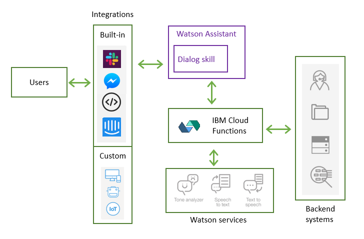

---

copyright:
  years: 2015, 2019
lastupdated: "2019-02-21"

subcollection: assistant

---

{:shortdesc: .shortdesc}
{:new_window: target="_blank"}
{:deprecated: .deprecated}
{:important: .important}
{:note: .note}
{:tip: .tip}
{:pre: .pre}
{:codeblock: .codeblock}
{:screen: .screen}
{:javascript: .ph data-hd-programlang='javascript'}
{:java: .ph data-hd-programlang='java'}
{:python: .ph data-hd-programlang='python'}
{:swift: .ph data-hd-programlang='swift'}

# 製品情報
{: #index}

{{site.data.keyword.conversationfull}} は、ビジネス・ニーズに合わせてカスタマイズできるコグニティブなボットとなり、これを複数のチャネルをまたいでデプロイすることで、お客様が必要とする場所とタイミングで支援できるようにします。
{: shortdesc}

## 処理の流れ
{: #index-how-it-works}

この図はアーキテクチャー全体を示します。

- ユーザーは、以下の**統合**ポイントのうち 1 つ以上を通じてアシスタントと対話します。

  - 既存のソーシャル・メディア・メッセージング・プラットフォーム (Slack や Facebook Messenger など) に直接公開するチャット・ボット。
  - IBM Cloud によってホストされるシンプルなチャット・ボット・ユーザー・インターフェース。
  - ユーザー自身が開発するカスタム・アプリケーション (モバイル・アプリや音声インターフェースを備えたロボットなど)。

- **アシスタント**は、ユーザー入力を受け取ってダイアログ・スキルにルーティングします。

- ダイアログ・**スキル**は、このユーザー入力を詳しく解釈してから、会話のフローを誘導して、応答するために必要な情報やユーザーの代わりにトランザクションを実行するために必要な情報を収集します。

## 実装
{: #index-mplementation}

ここではアシスタントを実装する方法について説明します。

- **ダイアログ・スキルを作成します**。直感的なグラフィカル・ツールを使用して、アシスタントとお客様の間の会話用のトレーニング・データとダイアログを定義します。

  トレーニング・データは次の成果物で構成されます。

  - **インテント**: ユーザーがサービスと対話したときに得ると予想される目標です。 ユーザー入力で識別可能なそれぞれの目標に対して 1 つのインテントを定義します。 例えば、店の営業時間についての質問に答える *store_hours* という名前のインテントを定義できます。 各インテントについて、「`何時に開店しますか?`」など、お客様が必要とする情報を尋ねるために、使用する可能性がある入力を反映したサンプル発話を追加します。

    または、IBM が提供する事前構築済みの**コンテンツ・カタログ**を使用して、お客様の一般的な目標に対処するデータの使用を開始します。

  - **ダイアログ**: ダイアログ・ツールを使用して、インテントを取り込むダイアログ・フローを構築します。ダイアログ・フローはツール内でグラフィカルなツリー構造で表されます。 サービスで扱う各インテントを処理するために、ブランチを追加できます。

  - **エンティティー**: 「エンティティー」はインテントのコンテキストを提供する用語またはオブジェクトを表します。 例えば、お客様が開店時間を知ろうとする店を区別するためにダイアログで役に立つ都市名などのエンティティーが考えられます。 エンティティーの追加後に、これらのエンティティーを使用するようにダイアログを更新します。ユーザー入力内で検出されたエンティティーに基づいて、考えられる多くの要求の組み合わせを処理するダイアログ・ノードを追加します。

    トレーニング・データを追加するにつれ、自然言語分類子が自動的にスキルに追加され、サービスがお客様の要求を聞き、応答しなければならないと指示されたタイプの要求を理解するためのトレーニングが行われます。

- **アシスタントを作成します**。

- **ダイアログ・スキルをアシスタントに追加します。**

- **アシスタントを統合します。**チャネル統合を作成して、構成済みのアシスタントをソーシャル・メディアまたはメッセージング・チャネルに直接デプロイします。

  デプロイしたアシスタントは、IBM のクラウド・コンピューティング・プラットフォームである {{site.data.keyword.cloud_notm}} によってホストされます。(詳しくは、[プラットフォームの概要 ](https://cloud.ibm.com/docs/overview/ibm-cloud#overview) を参照してください。)

これらの実装ステップについて詳しくは、以下のリンクを参照してください。

- [インテントの作成の概要](/docs/services/assistant?topic=assistant-intents#intents-described)
- [ダイアログの概要](/docs/services/assistant?topic=assistant-dialog-overview)
- [エンティティーの作成の概要](/docs/services/assistant?topic=assistant-entities#entities-described)
- [アシスタントの概要](/docs/services/assistant?topic=assistant-assistant-add)
- [統合の追加](/docs/services/assistant?topic=assistant-deploy-integration-add)

## ワークスペースの場所
{: #index-existing-customers}

旧バージョンのサービスで*ワークスペース* を作成した場合でも心配ありません。現在もそのワークスペースにアクセスできます。ワークスペースは、現在では*スキル* と呼ばれます。ワークスペースにアクセスするには、**「スキル (Skills)」**タブをクリックします。

## ブラウザーのサポート
{: #index-browser-support}

{{site.data.keyword.conversationshort}} サービス・ツールには、{{site.data.keyword.Bluemix_notm}} で必要なものと同じレベルのブラウザー・ソフトウェアが必要です。 詳しくは、{{site.data.keyword.Bluemix_notm}} の [前提条件 ](https://cloud.ibm.com/docs/overview/prereqs#browsers){: new_window} のトピックを参照してください。

## 言語サポート
{: #index-lang-support}

機能別の言語サポートの詳細情報は [サポートされる言語](/docs/services/assistant?topic=assistant-language-support)のトピックで説明されています。

## ご利用条件と特記事項
{: #index-notices}

サービスのご利用条件については、[IBM Cloud ご利用条件 ](/docs/overview/terms-of-use?topic=overview-terms) を参照してください。

## 次のステップ
{: #index-next-steps}

- このサービスの[使用を開始](/docs/services/assistant?topic=assistant-getting-started)します。
- [開発者向けリソース ](https://www.ibm.com/watson/developer-resources/){: new_window} のリストを表示します。

まだご不明な点がありますか? [IBM 営業部門 ](https://www-01.ibm.com/marketing/iwm/dre/signup?source=urx-20970){: new_window} にお問い合わせください。
