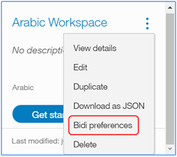
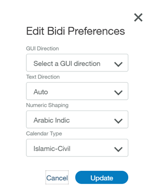

---

copyright:
  years: 2015, 2019
lastupdated: "2019-02-21"

subcollection: assistant

---

{:shortdesc: .shortdesc}
{:new_window: target="_blank"}
{:deprecated: .deprecated}
{:important: .important}
{:note: .note}
{:tip: .tip}
{:pre: .pre}
{:codeblock: .codeblock}
{:screen: .screen}
{:javascript: .ph data-hd-programlang='javascript'}
{:java: .ph data-hd-programlang='java'}
{:python: .ph data-hd-programlang='python'}
{:swift: .ph data-hd-programlang='swift'}

# サポートされる言語
{: #language-support}

{{site.data.keyword.conversationshort}} サービスでサポートされる言語をリストします。 サービスの各機能は、どの言語についても多かれ少なかれサポートされます。
{: shortdesc}

以下の表では、言語と機能のサポートのレベルを次のコードで示しています。

- **GA** - この機能はこの言語で一般提供されていて、サポートされています。 一般提供された後も、機能の更新は継続される可能性があることに注意してください。
- **ベータ** - この機能はベータ版でのみサポートされています。この言語での一般提供に向けてまだテスト中です。
- **NA** - この言語では機能を使用できないことを示します。

最初の表では、すべての機能のサポート・レベルを示しています。ただし、インテントとエンティティーに関する機能は 2 つ目と 3 つ目の表で示しています。

**表 1. 機能のサポート詳細**

| 言語 | **[院展と](/docs/services/assistant?topic=assistant-intents)**、 **[エンティティー](/docs/services/assistant?topic=assistant-entities)**、 **[ダイアログ](/docs/services/assistant?topic=assistant-dialog-build)**の定義 | **検索** |
|:---:|:---:|:---:|
| **英語 (en)**                   | GA | GA |
| **アラビア語 (ar)**                    | GA | NA |
| **中国語 (簡体字) (zh-cn)**   | GA | ベータ |
| **中国語 (繁体字) (zh-tw)**  | ベータ | ベータ |
| **チェコ語 (cs)**                     | GA | ベータ |
| **オランダ語 (nl)**                     | GA | ベータ |
| **フランス語 (fr)**                    | GA | ベータ |
| **ドイツ語 (de)**                    | GA | ベータ |
| **イタリア語 (it)**                   | GA | ベータ |
| **日本語 (ja)**                  | GA | ベータ |
| **韓国語 (ko)**                    | GA | ベータ |
| **ポルトガル語 (ブラジル) (pt-br)** | GA | ベータ |
| **スペイン語 (es)**                   | GA | ベータ |
{: caption="機能のサポート詳細" caption-side="top"}

**表 2. インテント機能のサポート詳細**

| 言語 | **[絶対スコアリングと「不適当としてマークを付ける (Mark as irrelevant)」](/docs/services/assistant?topic=assistant-intents#intents-mark-irrelevant)** | **[コンテンツ・カタログ](/docs/services/assistant?topic=assistant-catalog)** | **[ユーザー例の推奨](/docs/services/assistant?topic=assistant-intent-recommendations#intent-recommendations-get-example-recommendations)** |
|:---:|:---:|:---:|:---:|
| **英語 (en)**                   | GA | GA | ベータ |
| **アラビア語 (ar)**                    | ベータ | GA | NA |
| **中国語 (簡体字) (zh-cn)**   | GA | NA | NA |
| **中国語 (繁体字) (zh-tw)**  | ベータ | NA | NA |
| **チェコ語 (cs)**                     | GA | NA | NA |
| **オランダ語 (nl)**                     | GA | NA | NA |
| **フランス語 (fr)**                    | GA | GA | NA |
| **ドイツ語 (de)**                    | GA | GA | NA |
| **イタリア語 (it)**                   | GA | GA | NA |
| **日本語 (ja)**                  | GA | GA | NA |
| **韓国語 (ko)**                    | GA | NA | NA |
| **ポルトガル語 (ブラジル) (pt-br)** | GA | GA | NA |
| **スペイン語 (es)**                   | GA | GA | NA |
{: caption="インテント機能のサポート詳細" caption-side="top"}

**表 3. エンティティー機能のサポート詳細**

| 言語 | **システム・エンティティー ([数](/docs/services/assistant?topic=assistant-system-entities#system-entities-sys-number)、 [通貨](/docs/services/assistant?topic=assistant-system-entities#system-entities-sys-currency)、 [パーセンテージ](/docs/services/assistant?topic=assistant-system-entities#system-entities-sys-percentage)、 [日付、時刻](/docs/services/assistant?topic=assistant-system-entities#system-entities-sys-date-time))** | **[エンティティーのファジー・マッチング](/docs/services/assistant?topic=assistant-entities#entities-fuzzy-matching)** | **[コンテキスト・エンティティー](/docs/services/assistant?topic=assistant-entities#entities-create-annotation-based)** | **[同義語の推奨](/docs/services/assistant?topic=assistant-entities#entities-synonyms)**
|:---|:---:|:---:|:---:|:---:|
| **英語 (en)**                   | GA、ベータ ([場所](/docs/services/assistant?topic=assistant-system-entities#system-entities-sys-location)、[人物](/docs/services/assistant?topic=assistant-system-entities#system-entities-sys-person)) | GA | ベータ | GA |
| **アラビア語 (ar)**                    | ベータ | GA (つづりの誤りのみ) | NA | NA |
| **中国語 (簡体字) (zh-cn)**   | GA | NA | NA | NA |
| **中国語 (繁体字) (zh-tw)**  | ベータ | NA | NA | NA |
| **チェコ語 (cs)**                     | GA | GA (つづりの誤りのみ) | NA | NA |
| **オランダ語 (nl)**                     | GA | GA (つづりの誤りのみ) | NA | NA |
| **フランス語 (fr)**                    | GA | GA (つづりの誤りのみ) | NA | GA |
| **ドイツ語 (de)**                    | GA | GA (つづりの誤りのみ) | NA | NA |
| **イタリア語 (it)**                   | GA | GA (つづりの誤りのみ) | NA | NA |
| **日本語 (ja)**                  | GA | GA (つづりの誤りのみ) | NA | GA |
| **韓国語 (ko)**                    | GA | GA (つづりの誤りのみ) | NA | NA |
| **ポルトガル語 (ブラジル) (pt-br)** | GA | GA (つづりの誤りのみ) | NA | NA |
| **スペイン語 (es)**                   | GA | GA (つづりの誤りのみ) | NA | GA |
{: caption="エンティティー機能のサポート詳細" caption-side="top"}

**注意:** {{site.data.keyword.conversationshort}} サービスは上記のように複数の言語をサポートしますが、ツールのインターフェース自体 (説明、ラベルなど) は英語です。サポートされるすべての言語は、英語のインターフェースを通じて入力してトレーニングできます。

**GB18030 準拠**: GB18030 は、中国語市場で使用される拡張コード・ページを指定した中国語規格です。 中華人民共和国国家情報技術標準化技術委員会 (China National Information Technology Standardization Technical Committee) により、2001 年 9 月 1 日以降に中国語市場にリリースされるソフトウェア・アプリケーションは GB18030 対応であることが義務付けられていることから、このコード・ページ規格はソフトウェア業界にとって重要です。 {{site.data.keyword.conversationshort}} サービスはこのエンコードをサポートしており、GB18030 に準拠していることが認定されています。

## スキルの言語の変更
{: #language-support-change-language}

スキルを作成した後にその言語を変更することはできません。 スキルのサポート言語を変更する必要がある場合は、ユーザーがスキルをダウンロードする必要があります。 次に、生成された JSON ファイルをテキスト・エディターで編集して、`language` という JSON プロパティーを検索します。

`language` プロパティーは、スキルの元の言語に設定する必要があります。例えば、英語は `en` にする必要があります。 このプロパティーの値を必要な言語に変更します (フランス語は `fr`、ドイツ語は`de` など)。 JSON ファイルに変更を保存し、変更したファイルを {{site.data.keyword.conversationshort}} サービス・インスタンスにインポートします。

## 双方向言語の構成
{: #language-support-configure-bi-directional}

アラビア語などの双方向言語の場合は、それに合わせてスキルの設定を変更することができます。 スキル・タイルから*「アクション (Actions)」* ドロップダウン・メニューを選択して、**「双方向の設定 (Bidi preferences)」**を選択します (このオプションは、双方向言語が設定されたスキルのみで利用できます)。

スキルについて以下のオプションから選択します。

- **GUI の方向 (GUI Direction)**: グラフィカル・ユーザー・インターフェースのボタンやメニューなどの要素のレイアウトの方向を指定します。 `「LTR」` (左から右) または `RTL` (右から左) を選択します。 指定しない場合、ツールは Web ブラウザーの GUI の方向の設定に従います。
- **テキストの方向 (Text Direction)**: 入力されたテキストの方向を指定します。 `「LTR」` (左から右) または `「RTL」` (右から左) を選択するか、システムの設定に基づいてテキストの方向を自動的に選択する`「自動 (Auto)」`を選択します。 `「なし (None)」`オプションは、左から右にテキストを表示します。
- **数値のシェーピング (Numeric Shaping)**: 通常の数字を表示する場合に使用する数値形式を指定します。 `「公称 (Nominal)」`、`「アラビア - インド (Arabic-Indic)」`、または`「アラビア - ヨーロッパ (Arabic-European)」`から選択します。 `「なし (None)」`オプションは、西洋式の数字を表示します。
- **カレンダーのタイプ (Calendar Type)**: スキル UI で日付のフィルタリングを選択する方法を指定します。 `「イスラム暦 (一般) (Islamic-Civil)」`、`「イスラム暦 (表計算) (Islamic-Tabular)」`、`「イスラム暦 (ウンム・アルクラー) (Islamic-Umm al-Qura)」`、または `「グレゴリオ (Gregorian)」`を選択します。

  この設定は、「Try it out」パネルには適用されません。
  {: note}

選択を完了したら、**「更新 (Update)」**をクリックして保存し、スキル・タイルに戻ります。

## アクセント付き文字の処理
{: #language-support-accents}

会話の設定では、ユーザーは {{site.data.keyword.conversationshort}} サービスとの対話でアクセントを使用したり使用しなかったりします。 このため、インテント検出とエンティティー認識で、アクセントありとアクセントなしの両方のバージョンの単語が同じものとして処理されることがあります。

ただし、スペイン語などの一部の言語では、アクセントによってエンティティーの意味が変わることがあります。 このため、エンティティーの検出では、元のエンティティーに暗黙的にアクセントがある場合でも、サービスは同じエンティティーのアクセントなしのバージョンに一致させることができます。ただし、信頼度スコアは少し低くなります。

例えば、アクセントありの「barrió」という単語は動詞「barrer」(拭く) の過去形に相当しますが、サービスは「barrio」(近所) という単語にも一致させることができます。ただし、信頼度は少し低くなります。

システムは、完全一致のエンティティーでは、最も高い信頼度スコアを与えます。 例えば、`barrió` がトレーニング・セットに含まれていれば `barrio` は検出されません。また、`barrio` がトレーニング・セットに含まれていれば `barrió` は検出されません。

システムのトレーニングには、正しい文字とアクセントを使用する必要があります。 例えば、`barrió` を応答として想定している場合は、`barrió` をトレーニング・セットに入力してください。

アクセント・マーク以外にも、スペイン語の文字 `ñ` と文字 `n` による「uña」と「una」のような単語の使い方にも、同じことが当てはまります。 この場合、文字 `ñ` は単にアクセントが付いた `n` ではなく、スペイン語特有の別の文字です。

お客様が適切なアクセントを使用しなかったり、単語のつづりを誤ったりする (`ñ` の代わりに `n` を使用するなど) と考えられる場合は、ファジー・マッチングを有効にしたり、トレーニングのサンプルに明示的に含めたりすることができます。
