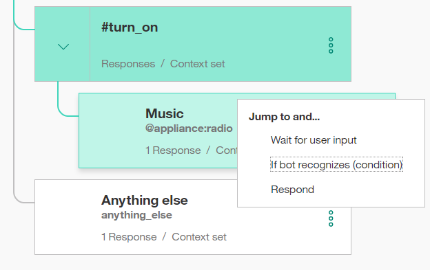
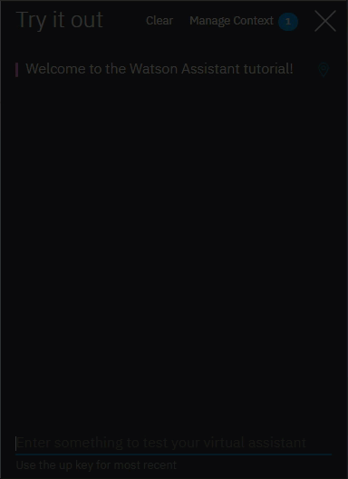

---

copyright:
  years: 2015, 2019
lastupdated: "2019-02-28"

subcollection: assistant

---

{:shortdesc: .shortdesc}
{:new_window: target="_blank"}
{:deprecated: .deprecated}
{:important: .important}
{:note: .note}
{:tip: .tip}
{:pre: .pre}
{:codeblock: .codeblock}
{:screen: .screen}
{:javascript: .ph data-hd-programlang='javascript'}
{:java: .ph data-hd-programlang='java'}
{:python: .ph data-hd-programlang='python'}
{:swift: .ph data-hd-programlang='swift'}
{:gif: data-image-type='gif'}

# チュートリアル: 自動車のダッシュボード・ダイアログの作成
{: #tutorial-car-dashboard}

このチュートリアルでは、{{site.data.keyword.conversationshort}} サービスを使用して、ユーザーが自動車のコグニティブ・ダッシュボードと対話するために役立つダイアログを作成します。
{: shortdesc}

## 学習目標
{: #car-dashboard-objectives}

このチュートリアルを完了すると、以下の方法について理解できます。

- エンティティーを定義する
- ダイアログを計画する
- ダイアログ内でノードと応答の条件を使用する

### 所要時間
{: #tutorial-car-dashboard-duration}

このチュートリアルを完了するには、およそ 2 時間から 3 時間かかります。

### 前提条件
{: #tutorial-car-dashboard-prereqs}

始めに、[開始チュートリアル](/docs/services/assistant?topic=assistant-getting-started)を完了します。

作成した {{site.data.keyword.conversationshort}} チュートリアル・スキルを使用して、開始演習の一部として作成した簡単なダイアログにノードを追加します。

## ステップ 1: インテントと例を追加する
{: #tutorial-car-dashboard-add-intents}

「インテント (Intents)」タブでインテントを追加します。 インテントとは、ユーザー入力で表現される目的または目標のことです。

1.  {{site.data.keyword.conversationshort}} チュートリアル・スキルの**「インテント (Intents)」**ページから、**「インテントの追加 (Add intent)」**をクリックします。
1.  次のインテント名を追加して、**「インテントの作成 (Create intent)」**をクリックします。

    ```
    turn_on
    ```
    {: codeblock}

    `#` が指定したインテント名の前に付加されます。 `#turn_on` インテントは、ユーザーがラジオ、ワイパー、ヘッドライトなどの装置をオンにすることを示します。
1.  **「ユーザーの例の追加 (Add user example)」**フィールドに次の発話を入力して、**「例の追加 (Add example)」**をクリックします。

    ```
    ライトが必要
    ```
    {: codeblock}

1.  Watson が `#turn_on` インテントを認識するために役立つように、次の 5 つの例をさらに追加します。

    ```
    何か曲をかける
    ラジオをつける
    スイッチをオン
    エアコンをオン
    エアコンをもっと強く
    ヘッドライトをつける
    ```
    {: codeblock}

1.  **「閉じる」**  アイコンをクリックしてから、`#turn_on` インテントの追加を完了します。

これで、追加したばかりの `#turn_on` インテントと、前提条件ステップとして完了した*概説チュートリアル*で追加した `#hello` インテントおよび `#goodbye` インテントの 3 つのインテントが作成されました。 各インテントには一連のサンプル発話があり、Watson がユーザー入力内にあるインテントを認識できるようトレーニングするのに役立ちます。

## ステップ 2: エンティティーを追加する
{: #tutorial-car-dashboard-add-entities}

エンティティー定義には、さまざまな応答をトリガーするために使用できる一連のエンティティー*値* が含まれます。 エンティティー値のそれぞれに、複数の*同義語* を含むことができます。同義語は、ユーザー入力で同じ値を指定するための異なる方法を定義します。

ユーザーがオンにしたいものを表す #turn_on インテントが含まれたユーザー入力内で出現する可能性がある各エンティティーを作成します。

1.  **「エンティティー (Entities)」**タブをクリックして「エンティティー (Entities)」ページを開きます。
1.  **「エンティティーの追加 (Add entity)」**をクリックします。
1.  次のエンティティー名を追加して、Enter キーを押します。

    ```
    appliance
    ```
    {: codeblock}

    `@` が指定したエンティティー名の前に付加されます。 `@appliance` エンティティーは、自動車内のユーザーがオンにしたい装置を表します。
1.  **「値名 (Value name)」**フィールドに次の値を追加します。

    ```
    ラジオ
    ```
    {: codeblock}

    この値は、ユーザーがオンにする可能性がある特定の装置を表します。
1.  **「同義語 (Synonyms)」**フィールドにラジオ装置のエンティティーを指定するための他の方法を追加します。 **Tab** キーを押して、フィールドにフォーカスを合わせ、以下の同義語を入力します。 個々の同義語を入力するごとに、**Enter** キーを押してください。

    ```
    音楽
    曲
    ```
    {: codeblock}

1.  **「値の追加 (Add value)」**をクリックして、`@appliance` エンティティーの `radio` 値の定義を完了します。
1.  その他のタイプのアプライアンスを追加します。

    - 値: `ヘッドライト`。 同義語: `ライト`.
    - 値: `エアコン`。 同義語: `エア` と `AC`。

1.  トグルをクリックして、`@appliance` エンティティーのファジー・マッチングを**オン**にします。
    この設定は、ここで使用する構文に正確には一致しないようにエンティティーが指定された場合でも、ユーザー入力内にあるエンティティーを意味していることをサービスが認識するために役立ちます。
1.  **「閉じる」**  アイコンをクリックしてから、`@appliance` エンティティーの追加を完了します。
1.  ステップ 2 から 8 を繰り返して、ファジー・マッチングをオンにし、次の各値と同義語を持つ `@genre` エンティティーを作成します。

    - 値: `クラシック`。 同義語: `交響曲`。
    - 値: `リズム・アンド・ブルース` 同義語: `R&B`。
    - 値: `ロック`。 同義語: `ロック & ロール`、`ロックンロール`、および`ポップ`。

`@appliance` (アシスタントがスイッチをオンにできる装置を表す) および `@genre` (ユーザーが聴くために選択できる音楽のジャンルを表す) という 2 つのエンティティーを定義しました。

ユーザーの入力を受け取ると、{{site.data.keyword.conversationshort}} サービスはインテントとエンティティーの両方を識別します。 これで、インテントとエンティティーを使用して正しい応答を選択するダイアログを定義できるようになりました。

## ステップ 3: 複雑なダイアログを作成する
{: #tutorial-car-dashboard-complex-dialog}

この複雑なダイアログ内で、上で定義した #turn_on インテントを処理するダイアログの分岐を作成します。

### ルート・ノードを #turn_on に追加する
{: #tutorial-car-dashboard-add-turn-on}

#turn_on インテントに応答するためのダイアログの分岐を作成します。 まず、そのルート・ノードを作成します。

1.  **#hello** ノードで「その他 (More)」アイコン  をクリックしてから、**「ノードを下に追加 (Add node below)」**を選択します。
1.  条件フィールドに `#turn_on` の入力を始めると、リストが表示され、そこからその完全なインテント名を選択します。
    この条件は、#turn_on インテントと一致するすべての入力によってトリガーされます。
1.  このノードには応答を入力しないでください。 ノード編集ビューを閉じるには、 をクリックします。

### シナリオ
{: #tutorial-car-dashboard-scenarios}

ダイアログでは、ユーザーがオンにしようとしている装置を判別する必要があります。 これを処理するために、追加の条件に基づいて複数の応答を作成します。

上で定義したインテントとエンティティーに基づいて、起こり得るシナリオは次の 3 つがあります。

**シナリオ 1**: ユーザーが音楽をかけたい場合。この場合、アシスタントはジャンルを尋ねる必要があります。

**シナリオ 2**: ユーザーが他の有効な装置をオンにしたい場合。この場合、アシスタントは要求された装置の名前をエコー出力して、その装置がオンに移行中であるというメッセージを表示します。

**シナリオ 3**: ユーザーが認識可能な装置名を指定しない場合。この場合、アシスタントは明確に指定するように求める必要があります。

これらのシナリオの条件をこの順番でチェックするノードを追加して、ダイアログが最も具体的な条件を最初に評価するようにします。

### シナリオ 1 を処理する
{: #tutorial-car-dashboard-address-scenario1}

ユーザーが音楽をかけたいというシナリオ 1 を処理するノードを追加します。 アシスタントは、応答で音楽のジャンルを尋ねる必要があります。

#### 装置のタイプが音楽用かどうかをチェックする下位ノードを追加する
{: #tutorial-car-dashboard-add-music-check}

1.  **#turn_on** ノードで「その他 (More)」アイコン  をクリックして、**「下位ノードを追加 (Add child node)」**を選択します。
1.  条件フィールドに「`@appliance:ラジオ`」と入力します。
    この条件は、@appliance エンティティーの値が「エンティティー (Entities)」タブで定義された「`ラジオ`」またはその同義語のいずれかの場合、true です。
1.  応答フィールドに、「`どんな種類の音楽を聴きたいですか?`」と入力します
1.  ノードに `Music` と名前を付けます。
1.  ノード編集ビューを閉じるには、 をクリックします。

#### #turn_on ノードから Music ノードへのジャンプを追加する
{: #tutorial-car-dashboard-add-jump-to-music}

それ以上ユーザー入力を要求しないで `#turn on` ノードから `Music` ノードへ直接ジャンプします。 このジャンプを行うために、**「ジャンプ先 (Jump to)」**アクションを使用できます。

1.  **#turn_on** ノードで「その他 (More)」アイコン  をクリックして、**「ジャンプ先 (Jump to)」**を選択します。
1.  **Music** 下位ノードを選択してから、**「ボットが認識する場合 (条件) (If bot recognizes (condition))」**を選択して Music ノードの条件を処理したいことを示します。



**「ジャンプ先 (Jump to)」**アクションを追加する前に、ターゲット・ノード (ジャンプ先ノード) を作成しておく必要があることに注意してください。

「ジャンプ先 (Jump to)」関係を作成すると、次に示すようにツリーにその新しい項目が表示されます。


#### 音楽ジャンルをチェックする下位ノードを追加する
{: #tutorial-car-dashboard-check-genre}

今度は、ユーザーが要求する音楽のタイプを処理するためのノードを追加します。

1.  **Music** ノードで「その他 (More)」アイコン  をクリックして、**「下位ノードを追加 (Add child node)」**を選択します。
    この下位ノードが評価されるのは、ユーザーが聴きたい音楽のタイプに関する質問に応答した場合だけです。 このノードの前にユーザー入力が必要になるため、**「ジャンプ先 (Jump to)」**アクションを使用する必要はありません。
1.  条件フィールドに `@genre` を追加します。  @genre エンティティーの有効な値が検出された場合は必ず、この条件は true です。
1.  応答として「`了解。@genre を演奏します`」と入力します。 この応答は、ユーザーが指定したジャンルの値を繰り返します。

#### ユーザー応答内の認識されていないジャンルのタイプを処理するノードを追加する
{: #tutorial-car-dashboard-catch-genre}

ユーザーが @genre で認識される値を指定しない場合に応答するためのノードを追加します。

1.  **@genre** ノードで「その他 (More)」アイコン  をクリックし、*「ノードを下に追加 (Add node below)」*を選択してピア・ノードを作成します。
1.  条件フィールドに `true` と入力します。
    true 条件は特別な条件です。 この条件は、ダイアログ・フローがこのノードに達した場合に、常に true に評価することを指定します。 (ユーザーが有効な @genre の値を指定した場合、このノードに達することはありません。)
1.  応答として「`すみませんが、分かりません。音楽は、クラシック、リズム・アンド・ブルース、またはロックをかけることができます。`」と入力します。

これにより、ユーザーが音楽をかけるように頼むケースのすべてが処理されます。

#### 音楽用のダイアログをテストする
{: #tutorial-car-dashboard-test-music}

1.   アイコンを選択して、チャット・ペインを開きます。
1.  「`音楽をかける`」と入力します。
    アシスタントは #turn_on インテントと「@appliance:音楽」エンティティーを認識し、応答で音楽のジャンルを尋ねます。

1.  有効な @genre の値 (例えば、`ロック`) を入力します。
    アシスタントは @genre エンティティーを認識し、対応する応答を行います。

    

1.  再度「`音楽をかける`」と入力します。ただし、今度はジャンルに無効な応答を指定します。 アシスタントは分からないと応答します。

### シナリオ 2 を処理する
{: #tutorial-car-dashboard-address-scenario2}

ユーザーが別の有効な装置をオンにすることを要求するというシナリオ 2 を処理するノードを追加します。 この場合、アシスタントは要求された装置の名前をエコー出力して、その装置がオンに移行中であるというメッセージを表示します。

#### 装置をチェックする下位ノードを追加する
{: #tutorial-car-dashboard-check-applicance}

ユーザーが @appliance の他の有効な値を指定した場合にトリガーされるノードを追加します。
@appliance の他の値については、アシスタントはそれ以上の入力を求める必要はなく、 肯定応答を返すだけです。

1.  **Music** ノードで「その他 (More)」アイコン  をクリックしてから、**「ノードを下に追加 (Add node below)」**を選択して、「@appliance:音楽」条件が評価された後に評価されるピア・ノードを作成します。
1.  ノード条件として `@appliance` を入力します。
    この条件は、ユーザー入力に @appliance エンティティーの「音楽」以外の認識される値が含まれている場合にトリガーされます。
1.  応答として「`了解。@appliance をオンにします`」と入力します。
    この応答は、ユーザーが指定した装置の値を繰り返します。

#### 他の装置でダイアログをテストする
{: #tutorial-car-dashboard-test-other-appliances}

1.   アイコンを選択して、チャット・ペインを開きます。
1.  `ライトをつける`と入力します。

    アシスタントは #turn_on インテントと「@appliance:ヘッドライト」エンティティーを認識し、「`了解。ヘッドライトをオンにします`」と応答します。

    

1.  `エアコンをオンにする`と入力します。

    アシスタントは #turn_on インテントと「@appliance:エアコン」エンティティーを認識し、「`了解。エアコンをオンにします`」と応答します。

1.  定義したサンプル発話とエンティティーの同義語に基づいて、サポートされるすべてのコマンドの各バリエーションを試してみてください。

### シナリオ 3 を処理する
{: #tutorial-car-dashboard-address-scenario3}

次は、ユーザーが有効な装置のタイプを指定しない場合にトリガーされるピア・ノードを追加します。

1.  **@appliance** ノードで「その他 (More)」アイコン  をクリックしてから、**「ノードを下に追加 (Add node below)」**を選択して、@appliance 条件が評価された後に評価されるピア・ノードを作成します。
1.  条件フィールドに `true` と入力します。
    (ユーザーが有効な @appliance の値を指定した場合、このノードに達することはありません。)
1.  応答として「`すみませんが、おっしゃったことをよく分かりません。ラジオ (音楽)、ヘッドライト、またはエアコンならオンにできます。`」と入力します。

#### さらにもう少しテストする
{: #tutorial-car-dashboard-test-more}

1.  さらに発話のバリエーションを試みて、ダイアログをテストします。

    アシスタントが正しいインテントを認識できない場合、チャット・ウィンドウから直接ボットをリトレーニングすることができます。 間違ったインテントの横にある矢印を選択して、リストから正しいインテントを選択します。

    {: gif}

必要に応じて、**「顧客サービス - サンプル (Customer Service - Sample)」**スキルを確認して、より長いダイアログと追加の機能でさらに増強された、同じユース・ケースを参照してください。

1.  ナビゲーション・メニューで**「スキルに戻る (Back to skills)」**ボタン  をクリックします。

1.  **「サンプルの追加 (Add a sample)」**をクリックします。

    サンプル・スキルがスキルのリストに追加されます。これは、アシスタントには関連付けられていません。

## 次のステップ
{: #tutorial-car-dashboard-deploy}

ダイアログ・スキルの作成とテストが完了したので、このスキルをお客様と共有できます。まずスキルをアシスタントに接続してからアシスタントをデプロイして、スキルをデプロイします。これを行う方法はいくつかあります。 詳しくは、[統合の追加](/docs/services/assistant?topic=assistant-deploy-integration-add)を参照してください。

[GitHub ](https://github.com/watson-developer-cloud/car-dashboard) から完全な自動車のダッシュボード・サンプル・アプリケーションのソース・コードにアクセスできます。
