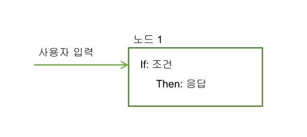
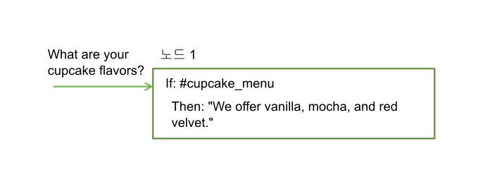
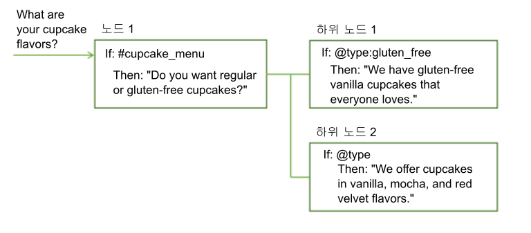
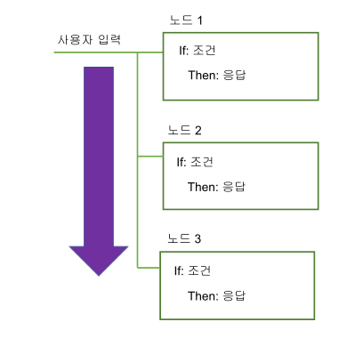

---

copyright:
  years: 2015, 2019
lastupdated: "2019-02-28"

subcollection: assistant

---

{:shortdesc: .shortdesc}
{:new_window: target="_blank"}
{:deprecated: .deprecated}
{:important: .important}
{:note: .note}
{:tip: .tip}
{:pre: .pre}
{:codeblock: .codeblock}
{:screen: .screen}
{:javascript: .ph data-hd-programlang='javascript'}
{:java: .ph data-hd-programlang='java'}
{:python: .ph data-hd-programlang='python'}
{:swift: .ph data-hd-programlang='swift'}
{:table: .aria-labeledby="caption"}

# 대화 개요
{: #dialog-overview}

대화는 사용자 입력에서 식별되는 인텐트와 애플리케이션의 컨텍스트를 사용하여 사용자와 상호작용하고 궁극적으로 유용한 응답을 제공합니다.
{: shortdesc}

대화는 응답(봇이 다시 말하는 내용)에 대한 인텐트(사용자가 말하는 내용)와 일치합니다. 응답은 `Where can I get some gas?`와 같은 질문에 대한 응답 또는 명령 실행(예: 라디오 켜기)일 수 있습니다. 인텐트와 엔티티가 올바른 응답을 식별하기에 충분한 정보가 될 수도 있고, 대화가 올바르게 응답하는 데 필요한 추가 입력을 사용자에게 요청할 수도 있습니다. 예를 들어, 사용자가 `Where can I get some food?`라고 질문하는 경우, 식당을 갈지 아니면 식료품점을 갈지, 먹고 갈지 아니면 포장해 갈지 등을 명확하게 하길 원할 수 있습니다. 텍스트 응답에서 세부사항을 질문하고 하나 이상의 하위 노드를 작성하여 새 입력을 처리할 수 있습니다.

<iframe class="embed-responsive-item" id="youtubeplayer" title="대화 개요" type="text/html" width="640" height="390" src="https://www.youtube.com/embed/XkhAMe9gSFU?rel=0" frameborder="0" webkitallowfullscreen mozallowfullscreen allowfullscreen> </iframe>

참고: 동영상은 15분 길이이며, 처음 5분은 노드를 추가하는 방법을 다룹니다.

대화는 {{site.data.keyword.conversationshort}} 도구에서 트리로 표시됩니다. 분기를 작성하여 대화에서 다룰 각 인텐트를 처리하십시오. 분기는 여러 노드로 구성됩니다.

## 대화 노드
{: #dialog-overview-nodes}

각 대화 노드에는 최소한 조건과 응답이 포함됩니다.



- 조건: 대화의 해당 노드를 트리거하기 위해 사용자 입력에 있어야 하는 정보를 지정합니다. 이 정보는 일반적으로 특정 인텐트입니다. 이는 엔티티 유형, 엔티티 값 또는 컨텍스트 변수 값일 수 있습니다. 자세한 정보는 [조건](#dialog-overview-conditions)을 참조하십시오.
- 응답: 서비스가 사용자에게 응답하는 데 사용하는 발화(utterance)입니다. 또한 이미지 또는 옵션 목록을 표시하거나 프로그래밍 방식의 조치를 트리거하도록 응답을 구성할 수 있습니다. 자세한 정보는 [응답](#dialog-overview-responses)을 참조하십시오.

노드가 if/then 구현/구축(Construction)을 가진 것으로 간주할 수 있습니다. 이 조건이 true이면 이 응답을 리턴합니다.

예를 들어, 서비스의 자연어 처리 기능이 사용자 입력에 `#cupcake-menu` 인텐트가 포함되어 있다고 판별하는 경우 다음 노드가 트리거됩니다. 노드가 트리거되면 서비스가 적절하게 응답합니다.



하나의 조건과 응답이 있는 단일 노드는 단순 사용자 요청을 처리할 수 있습니다. 하지만 대개 사용자는 복잡한 질문을 하거나 복잡한 태스크에 대한 도움을 원합니다. 사용자에게 서비스에 필요한 추가 정보를 제공하도록 요청하는 하위 노드를 추가할 수 있습니다.



## 대화 플로우
{: #dialog-overview-flow}

서비스는 사용자가 작성한 대화를 트리의 첫 번째 노드에서 마지막으로 처리합니다.



트리에서 아래로 이동하면서 서비스가 충족되는 조건을 찾으면 해당 노드를 트리거합니다. 그런 다음 하위 노드 조건에 대한 사용자 입력을 검사하는 트리거 노드를 따라 이동합니다. 하위 노드를 검사함에 따라 첫 번째 하위 노드에서 마지막까지 다시 이동합니다.

서비스는 대화 트리의 첫 번째 노드에서 마지막 노드까지, 트리거된 각 노드를 따라, 첫 번째에서 마지막 하위 노드까지, 트리거된 각 하위 노드를 따라 분기 트리의 마지막 노드에 도달할 때까지 계속 진행됩니다.


대화를 빌드하기 시작할 때, 포함할 분기 및 위치를 판별해야 합니다. 분기의 순서는 노드가 처음부터 마지막까지 평가되기 때문에 중요합니다. 조건이 입력과 일치하는 첫 번째 루트 노드가 사용됩니다. 트리에서 나중에 오는 노드는 트리거되지 않습니다.

서비스가 분기의 끝에 도달하거나 평가 중인 현재 하위 노드 세트에서 true로 평가되는 조건을 찾을 수 없으면 트리 기본으로 다시 이동합니다. 다시 한번, 서비스는 루트 노드의 첫 번째에서 마지막까지 처리합니다. 조건 중 하나라도 true로 평가되지 않으면 일반적으로 항상 true로 평가되는 특별한 `anything_else` 조건을 갖는 트리의 마지막 노드에서 응답이 리턴됩니다.

다음과 같은 방법으로 First-To-Last 플로우를 중단시킬 수 있습니다.

- 노드가 처리된 후 발생하는 것을 사용자 정의. 예를 들어, 다른 노드가 트리에서 앞의 위치에 있더라도 노드가 처리된 후 다른 노드로 직접 점프하도록 노드를 구성할 수 있습니다. 자세한 내용은 [다음에 수행할 작업 정의](#dialog-overview-jump-to)를 참조하십시오.
- 조건부 응답을 구성하여 다른 노드로 점프. 자세한 내용은 [조건부 응답](#dialog-overview-multiple)을 참조하십시오.
- 대화 노드에 대한 다이그레션(digression) 설정 구성. 다이그레션(digression)은 실행 중에 노드를 이동하는 방법에도 영향을 미칠 수 있습니다. 대부분의 노드로부터 다이그레션(digression)을 사용으로 설정하고 돌아가기를 구성하는 경우, 사용자는 한 노드에서 다른 노드로 점프하고 쉽게 다시 돌아갈 수 있습니다. 자세한 정보는 [다이그레션(digression)](/docs/services/assistant?topic=assistant-dialog-runtime#dialog-runtime-digressions)을 참조하십시오.

## 조건
{: #dialog-overview-conditions}

노드 조건은 해당 노드가 대화에서 사용되는지 여부를 판별합니다. 응답 조건은 사용자에게 리턴할 응답을 판별합니다.

- [조건 아티팩트](#dialog-overview-condition-artifacts)
- [특수 조건](#dialog-overview-special-conditions)
- [조건 구문 세부사항](#dialog-overview-condition-syntax)

조건에서 더 향상된 고급 조치를 수행하는 방법에 관한 팁은 [조건 사용 팁](/docs/services/assistant?topic=assistant-dialog-tips#dialog-tips-condition-usage-tips)을 참조하십시오.

### 조건 아티팩트
{: #dialog-overview-condition-artifacts}

다음 아티팩트 중 하나 이상을 임의 조합으로 사용하여 조건을 정의할 수 있습니다.

- **컨텍스트 변수**: 지정한 컨텍스트 변수 표현식이 true인 경우 노드가 사용됩니다. `$variable_name:value` 또는 `$variable_name == 'value'` 구문을 사용하십시오.

  노드 조건의 경우, 이 아티팩트 유형은 일반적으로 AND 또는 OR 연산자 및 다른 조건 값과 함께 사용됩니다. 사용자 입력에 있는 항목이 노드를 트리거해야 하기 때문입니다. 일치하는 컨텍스트 변수 값만으로는 이를 트리거하기에 충분하지 않습니다. 예를 들어, 사용자 입력 오브젝트가 컨텍스트 변수 값을 적절하게 설정하는 경우, 노드가 트리거됩니다.

  컨텍스트 변수값을 설정하는 동일한 대화 노드에서 컨텍스트 변수의 값에 따라 노드 조건을 정의하지 마십시오.
  {: tip}

  응답 조건의 경우 이 아티팩트 유형을 단독으로 사용할 수 있습니다. 특정 컨텍스트 변수 값을 기반으로 응답을 변경할 수 있습니다. 예를 들어, `$city:Boston`은 `$city` 컨텍스트 변수가 값(`Boston`)을 포함하고 있는지 검사합니다. 그런 경우, 응답이 리턴됩니다.
  
  컨텍스트 변수에 관한 자세한 정보는 [컨텍스트 변수](/docs/services/assistant?topic=assistant-dialog-runtime#dialog-runtime-context)를 참조하십시오.

- **엔티티**: 엔티티의 값이나 동의어가 사용자 입력에서 인식될 때 노드가 사용됩니다. `@entity_name` 구문을 사용하십시오. 예를 들어, `@city`는 사용자 입력에서 @city 엔티티에 대해 정의된 도시 이름이 있는지 여부를 검사합니다. 포함하고 있는 경우, 노드 또는 응답이 처리됩니다.

  엔티티의 값 또는 동의어가 인식되지 않는 경우를 처리하는 피어 노드를 작성하는 것을 고려하십시오.
  {: tip}

  엔티티에 대한 자세한 정보는 [엔티티 정의](/docs/services/assistant?topic=assistant-entities)를 참조하십시오.

- **엔티티 값**: 엔티티 값이 사용자 입력에서 발견되는 경우 노드가 사용됩니다. `@entity_name:value` 구문을 사용하여 동의어가 아닌 엔티티에 대한 정의된 값을 지정하십시오. 예: `@city:Boston`은 특정 도시 이름인 `Boston`이 사용자 입력에서 발견되었는지 여부를 확인합니다.

  엔티티에 대해 특정 값을 지정하지 않고 피어 노드에서 엔티티의 존재에 대해 검사하려면, 엔티티 존재 여부만 확인하는 피어 노드 전에 이 노드(특정 엔티티 값을 확인)를 배치해야 합니다. 그렇지 않은 경우, 이 노드는 평가되지 않습니다.
  {: tip}

  엔티티가 캡처 그룹이 있는 패턴 엔티티인 경우, 특정 그룹 값 일치에 대해 검사할 수 있습니다. 예를 들어, 다음 구문을 사용할 수 있습니다. `@us_phone.groups[1] == '617'`
  자세한 정보는 [입력에 패턴 엔티티 그룹을 저장 및 인식](/docs/services/assistant?topic=assistant-dialog-tips#dialog-tips-get-pattern-groups)을 참조하십시오.

- **인텐트**: 가장 단순한 조건은 단일 인텐트입니다. 이 노드는 서비스의 자연어 처리가 사용자의 입력을 평가한 후에 사용자 입력의 목적이 사전 정의된 인텐트에 맵핑되는 것으로 판별한 경우에 사용됩니다. `#intent_name` 구문을 사용하십시오. 예를 들어, `#weather`는 사용자 입력이 날씨 예보를 요청하는지 확인합니다. 그런 경우, `#weather` 인텐트 조건이 포함된 노드가 처리됩니다.

  인텐트에 대한 자세한 정보는 [인텐트 정의](/docs/services/assistant?topic=assistant-intents)를 참조하십시오.

- **특수 조건**: 공통 대화 기능을 수행하는 데 사용할 수 있는 서비스가 제공되는 조건입니다. 자세한 내용은 다음 섹션에서 **특별 조건**을 참조하십시오.

### 특수 조건
{: #dialog-overview-special-conditions}

| 조건 구문            | 설명        |
|----------------------|-------------|
| `anything_else`      | 사용자 입력이 다른 대화 노드와 일치하지 않는 경우에 처리하도록 대화의 끝에 이 조건을 사용할 수 있습니다. 이 조건을 통해 **Anything else** 노드가 트리거됩니다. |
| `conversation_start` | **welcome**과 같이 이 조건은 첫 번째 대화 턴(turn) 중에 true로 평가됩니다. **welcome**과 다른 점은 애플리케이션의 초기 요청이 사용자 입력을 포함하는지 여부에 관계없이 true라는 것입니다. **conversation_start** 조건이 있는 노드는 컨텍스트 변수를 초기화하거나 대화의 처음에 다른 태스크를 수행하는 데 사용할 수 있습니다. |
| `false`              | 이 조건은 항상 false로 평가됩니다. 개발 중인 분기의 맨 위에 이 조건을 사용하여 분기 사용을 방지하거나, 공통 기능을 제공하고 **점프** 조치의 대상으로만 사용되는 노드의 조건으로 이 조건을 사용할 수 있습니다. |
| `irrelevant`         | 이 조건은 사용자 입력이 {{site.data.keyword.conversationshort}} 서비스에서 적절하지 않음으로 판별되는 경우, true로 평가됩니다. |
| `true`               | 이 조건은 항상 true로 평가됩니다. 노드 또는 응답 목록의 끝에 이 조건을 사용하여 이전 조건과 일치하지 않은 응답을 발견할 수 있습니다. |
| `welcome`            | 애플리케이션의 초기 요청에 사용자 입력이 없는 경우에만 이 조건이 첫 번째 대화 턴 중에(대화가 시작될 때) true로 평가됩니다. 모든 후속 대화 턴에서는 false로 평가됩니다. 이 조건을 통해 **Welcome** 노드가 트리거됩니다. 일반적으로 이 조건의 노드는 사용자에게 인사를 할 때(예: `Welcome to our Pizza ordering app.`과 같은 메시지 표시) 사용됩니다. 이 노드는 Facebook 또는 Slack와 같은 채널을 통해 발생하는 상호작용 중에 처리되지 않습니다.|
{: caption="특수 조건" caption-side="top"}

### 조건 구문 세부사항
{: #dialog-overview-condition-syntax}

다음 구문 옵션 중 하나를 사용하여 조건에 올바른 표현식을 작성하십시오.

- 인텐트, 엔티티 및 컨텍스트 변수를 참조하는 단축 표기. [오브젝트 액세스 및 평가](/docs/services/assistant?topic=assistant-expression-language)를 참조하십시오.

- SpEL(Spring Expression) 언어. 런타임 시 오브젝트 그래프 조회 및 조작을 지원하는 표현식 언어입니다. 자세한 정보는 [SpEL(Spring Expression Language) 언어 ](http://docs.spring.io/spring/docs/current/spring-framework-reference/html/expressions.html){: new_window}를 참조하십시오.

정규식을 사용하여 조건에 대해 값을 검사할 수 있습니다.  예를 들어, 일치하는 문자열을 찾기 위해 `String.find` 메소드를 사용할 수 있습니다. 세부사항은 [메소드](/docs/services/assistant?topic=assistant-dialog-methods)를 참조하십시오.

## 응답
{: #dialog-overview-responses}

대화 응답은 사용자에게 응답하는 방법을 정의합니다.

다음과 같은 방법으로 응답할 수 있습니다.

- [단순 텍스트 응답](#dialog-overview-simple-text)
- [서식이 있는 응답](#dialog-overview-multimedia)
- [조건부 응답](#dialog-overview-multiple)

### 단순 텍스트 응답
{: #dialog-overview-simple-text}

텍스트 응답을 제공하려면 서비스에서 사용자에게 표시할 텍스트를 입력하십시오.


응답에 컨텍스트 변수값을 포함하려면 구문 `$variable-name`을 사용하여 지정하십시오. 자세한 정보는 [컨텍스트 변수](/docs/services/assistant?topic=assistant-dialog-runtime#dialog-runtime-context)를 참조하십시오. 예를 들어, 노드가 처리되기 전에 $user 컨텍스트 변수가 현재 사용자의 이름으로 설정되어 있음을 알고 있는 경우, 다음과 같이 노드의 텍스트 응답에서 이를 참조할 수 있습니다.

```
Hello $user
```
{: screen}

현재 사용자의 이름이 `Norman`인 경우, Norman에 표시되는 응답은 `Hello Norman`입니다.

텍스트 응답에 이러한 특수 문자 중 하나를 포함시키는 경우, 해당 문자 앞에 백슬래시(`\")를 추가하여 이를 이스케이프하십시오. JSON 편집기를 사용하는 경우, 이스케이프(`\\`)하려면 두 개의 백슬래시를 사용해야 합니다. 문자를 이스케이프하면 서비스가 이를 다음 아티팩트 유형 중 하나로 해석하지 못하게 합니다.

| 특수 문자         | 아티팩트 |예제     |
|-------------------|----------|---------|
| `$` | 컨텍스트 변수 | `The transaction fee is \$2.` |
| `@` | 엔티티 | `Send us your feedback at feedback\@example.com.` |
{: caption="응답에서 이스케이프할 특수 문자" caption-side="top"}

기본 제공 통합 기능은 다음의 마크 다운 구문 요소를 지원합니다.

| 형식       | 구문   | 예제    |
|------------|--------|---------|
| 기울임꼴 | `We're talking about *practice*.` | We're talking about *practice*. |
| 굵은체 | `There's **no** crying in baseball.` | There's **no** crying in baseball. |
| 하이퍼텍스트 링크 | `Contact us at [ibm.com](https://www.ibm.com).` | Contact us at [ibm.com ](https://www.ibm.com). |
{: caption="지원되는 마크 다운 구문" caption-side="top"}

"시험 사용" 분할창은 마크 다운 구문을 현재 지원하지 않습니다. "시험 사용" 분할창에서 렌더링되는 링크와 미리보기 링크 통합만 포함하려면 HTML 구문을 사용할 수 있습니다. 예: `Contact us at <a href="https://www.ibm.com">ibm.com</a>.` (예를 들어, 백슬래시 `\"`와 함께 인용 부호를 이스케이프하지 *마십시오*.) 그러나 HTML 구문이 다른 기본 제공 통합에서는 지원되지 않습니다.
{: note}

#### 간단한 응답에 대해 자세히 알아보기
{: #dialog-overview-variety}

- [다중 행 추가](#dialog-overview-multiline)
- [다양성 추가](#dialog-overview-add-variety)

#### 다중 행 추가
{: #dialog-overview-multiline}

단일 텍스트 응답이 캐리지 리턴으로 구분된 다중 행을 포함하도록 하려면 다음 단계를 수행하십시오.

1.  사용자에게 표시하려는 각 행을 자체 응답 변형 필드에 별도의 문장으로 추가하십시오. 예:

  <table>
  <caption>다중 행 응답</caption>
  <tr>
    <th>응답 변형</th>
  </tr>
  <tr>
    <td>Hi.</td>
  </tr>
  <tr>
    <td>How are you today?</td>
  </tr>
  </table>

1.  응답 변형 설정의 경우, **다중 행**을 선택하십시오.

    서식이 있는 응답 유형에 대한 지원을 서비스에 추가하기 전에 작성된 대화 스킬을 사용하는 경우, *다중 행* 옵션이 표시되지 않을 수 있습니다. 현재 노드 응답에 두 번째 텍스트 응답 유형을 추가합니다. 이 조치가 응답이 기본 JSON에 표시되는 방법을 변경합니다. 따라서 다중 행 옵션이 사용 가능하게 됩니다. 다중 행 변형 유형을 선택합니다. 이제 응답에 추가한 두 번째 텍스트 응답 유형을 삭제할 수 있습니다.
    {: note}

사용자에게 응답이 표시되면 다음과 같이 각 행에 하나씩 응답 변형이 표시됩니다.

```
Hi.
How are you today?
```
{: screen}

#### 다양성 추가
{: #dialog-overview-add-variety}

사용자가 자주 대화 서비스로 돌아가는 경우 매번 반복되는 동일한 인사와 응답을 원치 않을 수 있습니다. 대화 시 동일한 조건에서 여러 방식으로 응답할 수 있도록 응답의 *변형*을 추가할 수 있습니다.

이 예제에서 서비스가 상점 위치에 대한 질문에 응답하는 내용이 하나의 상호작용과 다음 상호작용에서 다릅니다.


순차적으로 또는 임의 순서로 응답 변형을 교체하도록 선택할 수 있습니다. 기본적으로 순서가 지정된 목록에서 선택되는 것처럼 응답이 순차적으로 교체됩니다.

개별 텍스트 응답이 리턴되는 순서를 변경하려면 다음 단계를 완료하십시오.

1.  응답의 각 변형을 자체 응답 변형 필드에 추가하십시오. 예:

  <table>
  <caption>응답 변형</caption>
  <tr>
    <th>응답 변형</th>
  </tr>
  <tr>
    <td>Hello.</td>
  </tr>
  <tr>
    <td>Hi.</td>
  </tr>
  <tr>
    <td>Howdy!</td>
  </tr>
  </table>

1.  응답 변형 설정의 경우 다음 설정 중 하나를 선택하십시오.

    - **sequential**: 시스템은 대화 노드가 처음 트리거될 때 첫 번째 응답 변형을 리턴하고, 노드가 두 번째로 트리거될 때는 두 번째 응답 변형을 노드에 변형을 정의한 대로 리턴합니다.

      노드가 처리될 때 다음 순서대로 응답 결과가 리턴됩니다.

      - 1회:

        ```
        Hello.
        ```
        {: screen}

      - 2회:

        ```
        Hi.
        ```
        {: screen}

      - 3회:
        ```
        Howdy!
        ```
        {: screen}

    - **random**: 시스템은 대화 노드가 처음 트리거될 때 변형 목록에서 텍스트 문자열을 무작위로 선택하고, 다음에는 다른 변형을 무작위로 선택하지만 연속적으로 동일한 텍스트 문자열을 반복하지 않습니다.

      노드가 처리될 때 응답이 리턴될 수 있는 순서의 예:

      - 1회:

        ```
        Howdy!
        ```
        {: screen}

      - 2회:

        ```
        Hi.
        ```
        {: screen}

      - 3회:

        ```
        Hello.
        ```
        {: screen}

### 서식이 있는 응답
{: #dialog-overview-multimedia}

멀티미디어 또는 대화식 요소(예: 이미지 또는 클릭 가능한 단추)로 응답을 리턴하여 애플리케이션의 상호작용 모델을 단순화하고 사용자 환경을 향상시킬 수 있습니다.

사용자에게 응답으로 리턴할 텍스트를 지정하는 기본 응답 유형인 **텍스트** 외에, 다음 응답 유형이 지원됩니다.

- **휴먼 에이전트에 연결**:  대화는 사용자가 지정하는 서비스(일반적으로 휴먼 에이전트 지원 티켓 큐를 관리하는 서비스)를 호출하여 대화를 사용자에게 전달합니다. 휴먼 에이전트에 제공할 사용자의 문제를 요약하는 메시지를 선택적으로 포함할 수 있습니다. 대화가 전송되고 있음을 설명하는 메시지를 사용자에게 표시하는 것은 외부 서비스의 책임입니다. 대화가 해당 통신 자체를 관리하지는 않습니다. "시험 사용" 분할창에서 이 응답 유형이 포함된 노드를 테스트하는 경우 대화 전송이 발생하지 않습니다. 테스트 배치에서 이 응답 유형을 사용하는 노드에 액세스하여 사용자가 이를 경험하는 방법을 확인해야 합니다.

  이 응답 유형은 플러스 또는 프리미엄 플랜의 서비스 인스턴스에서만 표시되며 Intercom 또는 사용자 정의 애플리케이션 통합 기능과만 지원됩니다.
  {: note}

- **이미지**: 응답에 이미지를 임베드합니다. 소스 이미지 파일은 어딘가에 호스팅되어야 하며 이 파일을 참조하는 데 사용할 수 있는 URL이 있어야 합니다. 이는 공용으로 액세스할 수 없는 디렉토리에 저장된 파일이 아니어야 합니다.
- **옵션**: 하나 이상의 옵션 목록을 추가합니다. 사용자가 옵션 중 하나를 클릭하면 연관된 사용자 입력 값이 서비스에 전송됩니다. 옵션이 렌더링되는 방법은 대화를 배치하는 위치에 따라 다를 수 있습니다. 예를 들어, 하나의 통합 채널에서 옵션은 클릭 가능한 단추로 표시되지만, 다른 채널에서는 드롭 다운 목록으로 표시될 수 있습니다.
- **중지**: 처리를 계속하기 전에 애플리케이션이 지정된 시간(밀리초) 동안 대기하도록 합니다. 대화가 응답을 입력하는 중임을 표시하도록 선택할 수 있습니다. 시간이 걸릴 수 있는 조치를 수행해야 하는 경우 이 응답 유형을 사용하십시오. 예를 들어, 상위 노드는 클라우드 함수 호출을 작성하고 하위 노드에 결과를 표시합니다. 이 응답 유형을 상위 노드에 대한 응답으로 사용하여 프로그래밍 방식의 호출에 완료할 시간을 제공한 후, 결과를 표시할 하위 노드로 이동할 수 있습니다. 이 응답 유형은 "시험 사용" 분할창에서 렌더링되지 않습니다. 테스트 배치에서 이 응답 유형을 사용하는 노드에 액세스하여 사용자가 이를 경험하는 방법을 확인해야 합니다.

#### 서식이 있는 응답 추가
{: #dialog-overview-multimedia-add}

서식이 있는 응답을 추가하려면 다음과 같은 단계를 완료하십시오.

1.  응답 필드에서 드롭 다운 메뉴를 클릭하여 응답 유형을 선택한 다음, 필수 정보를 입력하십시오.

    - **휴먼 에이전트에 연결**:  선택적으로, 대화가 전송되는 휴먼 에이전트와 공유할 메시지를 추가할 수 있습니다.

        이 응답 유형은 Intercom 및 사용자 정의 애플리케이션 통합에서만 지원됩니다. 사용자 정의 애플리케이션의 경우, 이 응답 유형이 트리거될 때를 인식하도록 클라이언트 애플리케이션을 프로그래밍해야 합니다.
        {: note}

    - **이미지**. 호스팅된 이미지 파일의 전체 URL을 **이미지 소스 필드**에 추가하십시오. 지정된 이미지는 .jpg, .gif 또는 .png 형식이어야 합니다. 이미지 파일은 URL로 공개적으로 주소 지정될 수 있는 위치에 저장해야 합니다.

        예: `https://www.example.com/assets/common/logo.png`.

        응답에 임베드된 이미지 위에 이미지 제목과 설명을 표시하려면 제공된 필드에 해당 정보를 추가하십시오.

        Slack 통합에는 제목이 필요합니다. 다른 통합 채널은 제목 또는 설명을 무시합니다.
        {: note}

    - **옵션**. 다음 단계를 완료하십시오.

      1.  **추가 옵션**을 클릭하십시오.
      1.  **목록 레이블** 필드에서 목록에 표시할 옵션을 입력하십시오. 레이블 길이는 64자 미만이어야 합니다.
      1.  해당 **값** 필드에서 이 옵션을 선택할 때 서비스에 전달할 사용자 입력을 입력하십시오. 값의 길이는 2,048자 미만이어야 합니다. (현재 제한사항은 64자 한계를 적용하지만, 처리 중입니다.)

          제출 시 올바른 인텐트를 트리거하는 값을 지정하십시오. 예를 들어, 이는 인텐트에 대한 훈련 데이터의 사용자 예일 수 있습니다.
      1.  목록에 더 많은 옵션을 추가하려면 이전 단계를 반복하십시오.
      1.  **제목** 필드에 목록 소개를 추가하십시오. 제목의 옵션 목록에서 선택할 수 있습니다.

          일부 통합 채널에는 제목이 표시되지 않습니다.
          {: note}

      1.  선택사항으로, **설명** 필드에 추가 정보를 추가하십시오. 지정된 경우, 설명은 제목 뒤 및 옵션 목록 앞에 표시됩니다.

      일부 통합 채널에는 설명이 표시되지 않습니다.
      {: note}

      예를 들어, 다음과 같은 응답을 생성할 수 있습니다.

        <table>
        <caption>응답 옵션</caption>
        <tr>
          <th>목록 제목</th>
          <th>목록 설명</th>
          <th>옵션 레이블</th>
          <th>클릭하면 사용자 입력이 제출됨</th>
        </tr>
        <tr>
          <td>보험 유형</td>
          <td>이 항목 중 보험에 가입할 항목이 무엇입니까?</td>
          <td></td>
          <td></td>
        </tr>
        <tr>
          <td></td>
          <td></td>
          <td>보트</td>
          <td>저는 보트 보험을 사고 싶습니다.</td>
        </tr>
        <tr>
          <td></td>
          <td></td>
          <td>자동차</td>
          <td>저는 자동차 보험을 사고 싶습니다.</td>
        </tr>
         <tr>
          <td></td>
          <td></td>
          <td>집</td>
          <td>저는 주택 보험을 사고 싶습니다.</td>
        </tr>
        </table>

    - **일시정지**. **기간** 필드에 일시정지의 지속 시간을 밀리초로 추가하십시오.

        이 값은 10,000밀리초를 초과할 수 없습니다. 일반적으로 사용자는 누군가가 응답을 입력하도록 8초(8,000 ms)를 기다립니다. 입력 표시기가 일시정지 중에 표시되지 않도록 하려면 **꺼짐**을 선택하십시오.

        일시정지가 끝났음을 명확히 표시하도록 일시정지 후 다른 응답 유형(예: 텍스트 응답 유형)을 추가하십시오.
        {: tip}

    - **텍스트**. 텍스트를 추가하여 텍스트 필드에 있는 사용자에게 리턴합니다. 선택적으로, 텍스트 응답에 대한 변형 설정을 선택하십시오. 자세한 내용은 [단순 텍스트 응답](#dialog-overview-simple-text)을 참조하십시오.

1.  다른 응답 유형을 현재 응답에 추가하려면 **응답 추가**를 클릭하십시오.

    사용자 조회에 더 풍부한 응답을 제공하기 위해 다중 응답 유형을 단일 응답에 추가할 수 있습니다. 예를 들어, 사용자가 상점 위치를 요청하는 경우 맵을 표시하고 사용자가 클릭하여 주소 세부사항을 가져올 수 있는 각 상점 위치에 대한 단추를 표시할 수 있습니다. 그와 같은 유형의 응답을 빌드하려면 이미지, 옵션 및 텍스트 응답 유형의 조합을 사용할 수 있습니다. 다른 예제는 대화를 일시정지하기 전에 사용자에게 경고할 수 있도록 일시정지 응답 유형 앞에 텍스트 응답 유형을 사용하는 것입니다.

    단일 응답에 5개 이상의 응답 유형을 추가할 수 없습니다. 의미: 대화 노드에 대해 세 가지 조건부 응답을 정의하는 경우, 각 조건부 응답에는 5개 이하의 응답 유형을 추가할 수 있습니다.
    {: note}

    단일 대화 노드에는 둘 이상의 **휴먼 에이전트에 연결** 응답을 포함할 수 없습니다.
    {: note}

1.  둘 이상의 응답 유형을 추가한 경우 위로 또는 아래로 화살표 **이동**을 클릭하여 서비스에서 처리할 순서대로 응답 유형을 배열할 수 있습니다.

### 조건부 응답
{: #dialog-overview-multiple}

단일 대화 노드는 여러 응답을 제공할 수 있으며, 각각 다른 조건으로 트리거합니다.  단일 노드에서 여러 시나리오를 처리하려면 이러한 방식을 사용하십시오.

<iframe class="embed-responsive-item" id="youtubeplayer1" title="조건부 응답 추가" type="text/html" width="640" height="390" src="https://www.youtube.com/embed/Q5_-f7_Iyvg?rel=0" frameborder="0" webkitallowfullscreen mozallowfullscreen allowfullscreen> </iframe>

노드에는 여전히 기본 조건이 있으며, 이 조건은 노드 사용 및 이 노드에 포함된 조건과 응답 처리를 위한 조건입니다.

이 예제에서 서비스는 사용자 위치에 대해 이전에 수집된 정보를 사용하여 해당 응답을 사용자 조정하고 사용자로부터 가장 가까운 상점에 대한 정보를 제공합니다. 사용자로부터 수집된 정보를 저장하는 방법에 대한 자세한 정보는 [컨텍스트 변수](/docs/services/assistant?topic=assistant-dialog-runtime#dialog-runtime-context)를 참조하십시오.


이 단일 노드는 이제 4개의 개별 노드에 해당하는 기능을 제공합니다.

조건부 응답을 노드에 추가하려면 다음과 같은 단계를 완료하십시오.

1.  **사용자 정의**를 클릭한 후, **다중 행 응답** 토글을 클릭하여 이를 **켜짐**으로 전환하십시오.

    노드 응답 섹션이 조건 및 응답 필드 쌍을 표시하도록 변경됩니다. 여기에 조건 및 응답을 추가할 수 있습니다.
1.  응답을 사용자 정의하려면 응답 옆에 있는 **응답 편집**  아이콘을 클릭하십시오.

    다음 태스크를 완료하려면 편집할 응답을 열어야 합니다.

    - **컨텍스트 업데이트**. 응답이 트리거될 때 컨텍스트 변수의 값을 변경하려면 컨텍스트 편집기에서 컨텍스트 값을 지정하십시오. 각 개별 조건부 응답에 대한 컨텍스트를 업데이트합니다. 모든 조건부 응답에 사용할 수 있는 공통 컨텍스트 편집기 또는 JSON 편집기는 없기 때문입니다.
    - **서식이 있는 응답 추가**. 둘 이상의 텍스트 응답을 추가하거나 단일 조건부 응답에 텍스트 응답이 아닌 응답 유형을 추가하려면 응답 편집 보기를 열어야 합니다.
    - **점프 구성**. 이 조건부 응답이 처리된 후 서비스가 다른 노드로 점프하도록 지시하려면 응답 편집 보기의 *마침* 섹션에서 **점프**를 선택하십시오. 서비스에서 다음에 처리할 노드를 식별하십시오. 자세한 정보는 [조치로 점프 구성](#dialog-overview-jump-to-config)을 참조하십시오.

      모든 조건부 응답이 처리될 때까지 노드에 대해 구성된 **점프** 조치가 처리되지 않습니다. 따라서 조건부 응답이 다른 노드로 점프하도록 구성되고 조건부 응답이 트리거되는 경우 노드에 대해 구성된 점프가 처리되지 않으므로 발생하지 않습니다.

1.  다른 조건부 응답을 추가하려면 **응답 추가**를 클릭하십시오.

노드 내 조건은 노드처럼 순서대로 평가됩니다.  조건부 응답이 올바른 순서로 나열되어 있는지 확인하십시오.  순서를 변경해야 하는 경우 조건 및 응답 쌍을 선택하고 표시된 화살표를 사용하여 목록에서 위아래로 이동하십시오.

## 다음 수행할 작업 정의
{: #dialog-overview-jump-to}

지정된 응답을 작성한 후 서비스가 다음 중 하나를 수행하도록 지시할 수 있습니다.

- **사용자 입력 대기**: 사용자가 응답이 유도하는 새 입력을 제공하기를 서비스가 기다립니다. 예를 들어, 응답이 사용자에게 예 또는 아니오로 답하는 질문을 할 수 있습니다. 대화는 사용자가 추가 입력을 제공할 때까지 진행되지 않습니다.
- **사용자 입력 건너뛰기**: 사용자 입력을 기다리지 않고 현재 노드의 첫 번째 하위 노드로 바로 이동하려면 이 옵션을 사용하십시오.

  이 옵션을 사용하려면 현재 노드에 최소한 한 개의 하위 노드가 있어야 합니다.
  {: note}

- **다른 대화 노드로 점프**: 대화가 전혀 다른 대화 노드로 바로 이동하게 하려면 이 옵션을 사용하십시오. 예를 들어, *점프* 조치를 사용하여 트리의 여러 위치에서 공통 대화 노드로 플로우를 라우팅할 수 있습니다.

  대상 노드를 사용하도록 점프 조치를 구성하려면 먼저 점프할 대상 노드가 있어야 합니다.
  {: note}

### 점프 조치 구성
{: #dialog-overview-jump-to-config}

다른 노드로 점프하도록 선택하는 경우, 다음 옵션 중 하나를 선택하여 대상 노드가 처리되는 시기를 지정하십시오.

- **조건**: 명령문이 선택한 대화 노드의 조건 섹션을 대상으로 지정하면 서비스가 먼저 대상으로 지정된 노드의 조건이 true로 평가되는지 여부를 검사합니다.
    - 조건이 true로 평가되면, 시스템은 대상 노드를 즉시 처리합니다.
    - 조건이 true로 평가되지 않는 경우, 시스템은 해당 조건을 평가하기 위하여 대상 노드의 다음 동위 노드로 이동하고, true로 평가되는 조건이 있는 대화 노드를 찾을 때까지 이 프로세스를 반복합니다.

    - 시스템이 모든 동위를 처리하고 어떤 조건도 true로 평가되지 않으면 기본 폴백 전략이 사용되며 대화는 대화 트리의 기본 레벨에 있는 노드를 평가합니다.

    조건을 대상으로 지정하면 대화 노드의 조건을 연결하는 데 유용합니다. 예를 들어, 입력에 `#turn_on`과 같은 인텐트가 있는지 여부를 먼저 검사하고, 인텐트가 있으면 입력에 `@lights`, `@radio` 또는 `@wipers` 등의 엔티티가 있는지 여부를 검사할 수 있습니다. 조건을 연결하면 큰 대화 트리를 구조화하는 데 도움이 됩니다.

    대화 트리의 현재 노드 위에 있는 노드로 이동하는 조건부 응답에서 점프를 구성할 때 이 옵션을 선택하지 마십시오. 그렇지 않은 경우, 무한 루프를 작성할 수 있습니다. 서비스가 이전 노드로 이동하여 조건을 확인하는 경우, 대화를 통해 마지막으로 현재 노드를 트리거한 동일한 사용자 입력이 평가되므로 false를 리턴할 수 있습니다. 서비스는 다음 동위로 이동하거나 다시 루트로 이동하여 해당 노드의 조건을 확인하고 이 노드를 다시 트리거하게 될 가능성이 높습니다. 즉, 프로세스가 자체적으로 반복됩니다.
    {: note}

- **응답**: 명령문이 선택한 대화 노드의 응답 섹션을 대상으로 지정하는 경우 즉시 실행됩니다. 즉, 시스템은 선택한 대화 노드의 조건을 평가하지 않으며 선택한 대화 노드의 응답을 즉시 처리합니다.

  응답을 대상으로 지정하면 여러 대화 노드를 함께 연결하는 데 유용합니다. 응답은 이 대화 노드의 조건이 true인 것처럼 처리됩니다. 선택한 대화 노드에 다른 **점프** 조치가 있는 경우에도 해당 조치가 즉시 실행됩니다.

- **사용자 입력 대기**: 사용자의 새 입력을 대기한 다음, 이동할 노드에서 이를 처리하기 시작합니다. 이 옵션은 소스 노드가 질문을 묻는 경우와, 예를 들어, 질문에 대한 사용자의 응답을 처리하기 위해 별도의 노드로 이동하려는 경우에 유용합니다.

## 자세한 정보

대화에서 사용되는 표현식 언어, 메소드, 시스템 엔티티 및 기타 유용한 세부사항에 대한 정보는 탐색 분할창에 있는 **참조** 섹션을 참조하십시오.

또한 API를 사용하여 노드를 추가하거나 대화를 편집할 수도 있습니다. 자세한 정보는 [API를 사용하여 대화 수정](/docs/services/assistant?topic=assistant-api-dialog-modify)을 참조하십시오.
