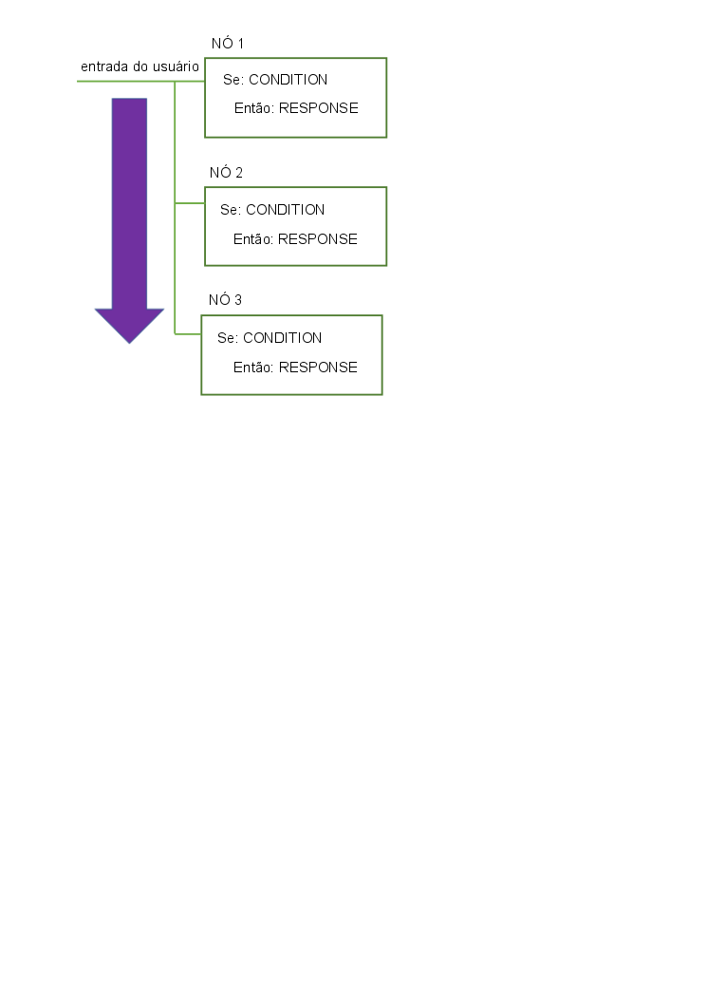
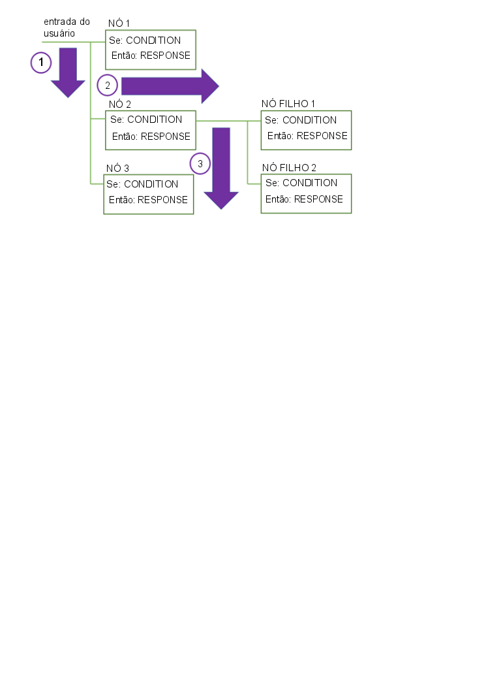

---

copyright:
  years: 2015, 2019
lastupdated: "2019-02-28"

subcollection: assistant

---

{:shortdesc: .shortdesc}
{:new_window: target="_blank"}
{:deprecated: .deprecated}
{:important: .important}
{:note: .note}
{:tip: .tip}
{:pre: .pre}
{:codeblock: .codeblock}
{:screen: .screen}
{:javascript: .ph data-hd-programlang='javascript'}
{:java: .ph data-hd-programlang='java'}
{:python: .ph data-hd-programlang='python'}
{:swift: .ph data-hd-programlang='swift'}
{:table: .aria-labeledby="caption"}

# Visão geral do diálogo
{: #dialog-overview}

O diálogo usa as intenções que são identificadas na entrada do usuário, além do contexto do aplicativo, para interagir com o usuário e, finalmente, fornecer uma resposta útil.
{: shortdesc}

O diálogo corresponde as intenções (o que os usuários dizem) com as respostas (o que o robô diz de volta). A resposta pode ser a resposta para uma pergunta como `Where can I get some gas?` ou a execução de um comando, como ligar o rádio. A intenção e a entidade podem ser informações suficientes para identificar a resposta correta, ou o diálogo pode pedir ao usuário uma entrada adicional, necessária para responder corretamente. Por exemplo, se um usuário pergunta `Where can I get some food?`, convém esclarecer se eles desejam um restaurante ou uma mercearia, jantar no local ou levar para viagem e assim por diante. É possível pedir mais detalhes em uma resposta de texto e criar um ou mais nós-filhos para processar a nova entrada.

<iframe class="embed-responsive-item" id="youtubeplayer" title="Visão geral do diálogo" type="text/html" width="640" height="390" src="https://www.youtube.com/embed/XkhAMe9gSFU?rel=0" frameborder="0" webkitallowfullscreen mozallowfullscreen allowfullscreen> </iframe>

Nota: o vídeo tem 15 minutos de duração; os primeiros 5 minutos cobrem como incluir um nó.

O diálogo é representado graficamente na ferramenta {{site.data.keyword.conversationshort}} como uma árvore. Crie uma ramificação para processar cada intenção que você deseja que sua conversa manipule. Uma ramificação é composta de múltiplos nós.

## Nós de diálogo
{: #dialog-overview-nodes}

Cada nó de diálogo contém, no mínimo, uma condição e uma resposta.


- Condição: Especifica as informações que devem estar presentes na entrada do usuário para que esse nó no diálogo seja acionado. As informações são geralmente uma intenção específica. Elas também podem ser um tipo de entidade, um valor de entidade ou um valor de variável de contexto. Consulte [Condições](#dialog-overview-conditions) para obter informações adicionais.
- Resposta: A elocução que o serviço usa para responder ao usuário. A resposta também pode ser configurada para mostrar uma imagem ou uma lista de opções ou para acionar ações programáticas. Consulte [Respostas](#dialog-overview-responses) para obter informações adicionais.

É possível pensar no nó como tendo uma construção if/then: se esta condição for verdadeira, então retornar essa resposta.

Por exemplo, o nó a seguir é acionado se a função de processamento de linguagem natural do serviço determina que a entrada do usuário contém a intenção `#cupcake-menu`. Como resultado do nó sendo acionado, o serviço responde com uma resposta apropriada.


Um nó único com uma condição e resposta pode manipular solicitações simples do usuário. Porém, mais frequentemente, os usuários têm perguntas mais sofisticadas ou desejam ajuda com tarefas mais complexas. É possível incluir nós-filhos que pedem para o usuário fornecer qualquer informação adicional que o serviço necessite.


## Fluxo de diálogo
{: #dialog-overview-flow}

O diálogo que você cria é processado pelo serviço do primeiro nó na árvore para o último.



À medida que ele viajar pela árvore, se o serviço localizar uma condição que foi atendida, ele acionará aquele nó. Em seguida, ele se move ao longo do nó acionado para verificar a entrada do usuário com relação a quaisquer condições do nó-filho. Conforme verifica os nós-filhos, ele se move novamente a partir do primeiro nó-filho para o último.

Os serviços continuam funcionando por meio da árvore de diálogo do primeiro ao último nó, junto a cada nó acionado, em seguida, do primeiro ao último nó-filho e junto a cada nó-filho acionado até atingir o último nó na ramificação que está seguindo.



Ao iniciar a construção do diálogo, deve-se determinar as ramificações a serem incluídas e onde colocá-las. A ordem das ramificações é importante porque os nós são avaliados da primeira à última. O primeiro nó raiz cuja condição corresponde à entrada é usado; quaisquer nós que vêm depois na árvore não são acionados.

Quando o serviço atinge o término de uma ramificação ou não pode localizar uma condição que é avaliada como true do conjunto atual de nós-filhos que estão sendo avaliados, ele salta de volta para a base da árvore. E mais uma vez, o serviço processa os nós raiz do primeiro ao último. Se nenhuma das condições é avaliada como true, a resposta do último nó na árvore, que geralmente tem uma condição especial `anything_else` que sempre é avaliada como true, é retornada.

É possível interromper o fluxo padrão do primeiro para o último das maneiras a seguir:

- Customizando o que acontece após um nó ser processado. Por exemplo, é possível configurar um nó para ir diretamente para outro nó após ele ser processado, mesmo se o outro nó está posicionado antes na árvore. Consulte [Definindo o que fazer em seguida](#dialog-overview-jump-to) para obter mais informações.
- Configurando respostas condicionais para ir para outros nós. Consulte  [ Respostas Condicionais ](#dialog-overview-multiple)  para obter mais informações.
- Definindo as configurações de digressão para os nós de diálogo. As digressões também podem afetar como os usuários se movem pelos nós no tempo de execução. Se você ativar digressões fora da maioria dos nós e configurar retornos, os usuários poderão ir de um nó para outro e voltar novamente de modo mais fácil. Veja [Digressões](/docs/services/assistant?topic=assistant-dialog-runtime#dialog-runtime-digressions) para obter mais informações.

## Condições
{: #dialog-overview-conditions}

Uma condição de nó determina se esse nó é usado na conversa. As condições de resposta determinam qual resposta retornar a um usuário.

- [Artefatos de condição](#dialog-overview-condition-artifacts)
- [Condições especiais](#dialog-overview-special-conditions)
- [Detalhes da sintaxe de condição](#dialog-overview-condition-syntax)

Para obter dicas sobre como executar ações mais avançadas em condições, consulte [Dicas de uso de condição](/docs/services/assistant?topic=assistant-dialog-tips#dialog-tips-condition-usage-tips).

### Artefatos de condição
{: #dialog-overview-condition-artifacts}

É possível usar um ou mais dos seguintes artefatos em qualquer combinação para definir uma condição:

- **Variável de contexto**: o nó é usado se a expressão da variável de contexto que você especifica é verdadeira. Use a sintaxe `$variable_name:value` ou `$variable_name == 'value'`.

  Para obter as condições do nó, esse tipo de artefato é geralmente usado com um operador AND ou OR e outro valor da condição. Isso é porque algo na entrada do usuário deve acionar o nó; o valor da variável de contexto que está sendo correspondido sozinho não é suficiente para acioná-lo. Se o objeto de entrada do usuário configurar o valor da variável de contexto de alguma forma, por exemplo, o nó será acionado.

  Não defina uma condição do nó com base no valor de uma variável de contexto no mesmo nó de diálogo no qual você configurou o valor da variável de contexto.
  {: tip}

  Para condições de resposta, esse tipo de artefato pode ser usado sozinho. É possível mudar a resposta com base em um valor específico da variável de contexto. Por exemplo, `$city:Boston` verifica se a variável de contexto `$city` contém o valor `Boston`. Se sim, a resposta será retornada.
  
  Para obter mais informações sobre variáveis de contexto, veja [Variáveis de contexto](/docs/services/assistant?topic=assistant-dialog-runtime#dialog-runtime-context).

- **Entidade**: O nó é usado quando qualquer valor ou sinônimo para a entidade é reconhecido na entrada do usuário. Use a sintaxe `@entity_name`. Por exemplo, `@city` verifica se algum dos nomes de cidades que são definidos para a entidade @city foram detectados na entrada do usuário. Se for assim, o nó ou a resposta será processada.

  Considere a criação de um nó de mesmo nível para manipular o caso em que nenhum dos valores ou sinônimos da entidade é reconhecido.
  {: tip}

  Para obter mais informações sobre entidades, veja [Definindo entidades](/docs/services/assistant?topic=assistant-entities).

- **Valor da entidade**: o nó é usado se o valor da entidade é detectado na entrada do usuário. Use a sintaxe `@entity_name:value` e especifique um valor definido para a entidade, não um sinônimo. Por exemplo: `@city:Boston` verifica se o nome da cidade específica, `Boston`, foi detectado na entrada do usuário.

  Se você verificar a presença da entidade, sem especificar um valor específico para ela, em um nó de mesmo nível, certifique-se de posicionar esse nó (que verifica um valor de entidade específico) antes do nó de mesmo nível que verifica somente a presença da entidade. Caso contrário, esse nó nunca será avaliado.
  {: tip}

  Se a entidade é uma entidade de padrão com grupos de captura, é possível verificar uma determinada correspondência de valor do grupo. Por exemplo, é possível usar a sintaxe: `@us_phone.groups[1] == '617'`
  Consulte [Armazenando e reconhecendo grupos de entidades padrão na entrada](/docs/services/assistant?topic=assistant-dialog-tips#dialog-tips-get-pattern-groups) para obter mais informações.

- **Intenção**: a condição mais simples é uma única intenção. O nó será usado se, depois que o processamento de linguagem natural do serviço avaliar a entrada do usuário, ele determinar que o propósito da entrada do usuário é mapeado para a intenção predefinida. Use a sintaxe `#intent_name`. Por exemplo, `#weather` verifica se a entrada do usuário está solicitando uma previsão meteorológica. Em caso positivo, o nó com a condição de intenção `#weather` é processado.

  Para obter mais informações sobre intenções, veja [Definindo intenções](/docs/services/assistant?topic=assistant-intents).

- **Condição especial**: condições que são fornecidas com o serviço que você pode usar para executar funções de diálogo comuns. Consulte a tabela **Condições especiais** na próxima seção para obter detalhes.

### Condições especiais
{: #dialog-overview-special-conditions}

| Sintaxe da condição     | Descrição |
|----------------------|-------------|
| `anything_else`      | É possível usar essa condição no final de um diálogo, para ser processada quando a entrada do usuário não corresponde a nenhum outro nó de diálogo. O nó **Qualquer outra coisa** é acionado por essa condição. |
| `conversation_start` | Como **welcome**, essa condição é avaliada como true durante a primeira rodada do diálogo. Diferentemente de **welcome**, é true se a solicitação inicial do aplicativo contém entrada do usuário ou não. Um nó com a condição **conversation_start** pode ser usado para inicializar variáveis de contexto ou executar outras tarefas no início do diálogo. |
| `false`              | Essa condição é sempre avaliada como false. Você pode usar isso no início de uma ramificação que está em desenvolvimento, para evitar que seja usada ou como a condição para um nó que fornece uma função comum e é usada somente como o destino de uma ação **Ir para**. |
| `irrelevant`         | Essa condição será avaliada como true se a entrada do usuário for determinada como irrelevante pelo serviço {{site.data.keyword.conversationshort}}. |
| `true`               | Essa condição é sempre avaliada como true. É possível usá-la no final de uma lista de nós ou respostas para capturar quaisquer respostas que não correspondam a nenhuma das condições anteriores. |
| `welcome`            | Essa condição é avaliada como true durante a primeira rodada do diálogo (quando a conversa começa), apenas se a solicitação inicial do aplicativo não contém nenhuma entrada do usuário. Ela é avaliada como false em todas as rodadas de diálogo subsequentes. O nó **Welcome** é acionado por essa condição. Geralmente, um nó com essa condição é usado para saudar o usuário, por exemplo, para exibir uma mensagem, como `Welcome to our Pizza ordering app.` Esse nó nunca é processado durante as interações que ocorrem por meio de canais como o Facebook ou o Slack.|
{: caption="Condições especiais" caption-side="top"}

### Detalhes da sintaxe de condição
{: #dialog-overview-condition-syntax}

Use uma dessas opções de sintaxe para criar expressões válidas em condições:

- Notações abreviadas para consultar intenções, entidades e variáveis de contexto. Consulte [Acessando e avaliando objetos](/docs/services/assistant?topic=assistant-expression-language).

- Linguagem Spring Expression (SpEL), que é uma linguagem de expressão que suporta a consulta e a manipulação de um gráfico do objeto no tempo de execução. Consulte [Linguagem Spring Expression Language (SpEL) ](http://docs.spring.io/spring/docs/current/spring-framework-reference/html/expressions.html){: new_window} para obter informações adicionais.

É possível usar expressões regulares para verificar valores com relação a uma condição.  Para localizar uma sequência correspondente, por exemplo, é possível usar o método `String.find`. Consulte [Métodos](/docs/services/assistant?topic=assistant-dialog-methods) para obter mais detalhes.

## Respostas
{: #dialog-overview-responses}

A resposta do diálogo define como responder ao usuário.

É possível responder das maneiras a seguir:

- [Resposta de texto simples](#dialog-overview-simple-text)
- [ Respostas rich ](#dialog-overview-multimedia)
- [Respostas condicionais](#dialog-overview-multiple)

### Resposta de texto simples
{: #dialog-overview-simple-text}

Se você deseja fornecer uma resposta de texto, simplesmente insira o texto que deseja que o serviço exiba para o usuário.


Para incluir um valor da variável de contexto na resposta, use a sintaxe `$variable_name` para especificá-lo. Veja [Variáveis de contexto](/docs/services/assistant?topic=assistant-dialog-runtime#dialog-runtime-context) para obter mais detalhes. Por exemplo, se você souber que a variável de contexto $user está configurada para o nome do usuário atual antes de um nó ser processado, será possível se referir a ele na resposta de texto do nó como esta:

```
Hello $user
```
{: screen}

Se o nome do usuário atual for `Norman`, a resposta exibida para Norman será `Hello Norman`.

Se você incluir um desses caracteres especiais em uma resposta de texto, escape-o incluindo uma barra invertida (``\`) na frente dele. Se você estiver usando o editor JSON, será necessário usar duas barras invertidas para escapar (``\\`). Escapar o caractere evita que o serviço interprete erroneamente como sendo um dos tipos de artefato a seguir:

| Caractere especial | Artefato | Exemplo |
|-------------------|----------|---------|
| `$` | Variável de contexto | `The transaction fee is \$2.` |
| `@` | Entidade | `Send us your feedback at feedback\@example.com.` |
{: caption="Caracteres especiais para escapar em respostas" caption-side="top"}

As integrações integradas suportam os elementos de sintaxe de Redução de preço a seguir:

| Formato | Sintaxe | Exemplo |
|------------|--------|---------|
| Itálico | `We're talking about *practice*.` | Estamos falando de  * prática *. |
| Bold | `There's **no** crying in baseball.` | Não há  ** não **  chorando no beisebol. |
| Link de hipertexto | `Contact us at [ibm.com](https://www.ibm.com).` |Entre em contato conosco em [ibm.com ](https://www.ibm.com). |
{: caption="Sintaxe de Marcação Suportada" caption-side="top"}

A área de janela "Experimente" não suporta a sintaxe de Redução de preço atualmente. Para incluir um link que é renderizado somente na área de janela "Experimente" e na integração do link de Visualização, é possível usar a sintaxe HTML. Por exemplo: `Contact us at <a href="https://www.ibm.com">ibm.com</a>.` (*Não* tente escapar as aspas com uma barra invertida `\"`, por exemplo.) No entanto, a sintaxe HTML não é suportada por nenhuma das outras integrações integradas.
{: note}

#### Saiba mais sobre respostas simples
{: #dialog-overview-variety}

- [ Incluindo múltiplas linhas ](#dialog-overview-multiline)
- [Incluindo variedade](#dialog-overview-add-variety)

#### Incluindo múltiplas linhas
{: #dialog-overview-multiline}

Se você desejar que uma única resposta de texto inclua múltiplas linhas separadas por retornos de linha, siga estas etapas:

1.  Inclua cada linha que você deseja mostrar para o usuário como uma sentença separada em seu próprio campo de variação de resposta. Por exemplo:

  <table>
  <caption>Resposta de linha múltipla</caption>
  <tr>
    <th>Variações de resposta</th>
  </tr>
  <tr>
    <td>Hi.</td>
  </tr>
  <tr>
    <td>Como você está hoje?</td>
  </tr>
  </table>

1.  Para a configuração de variação de resposta, escolha **multilinhas**.

    Se estiver usando uma qualificação de diálogo que foi criada antes de o suporte para os tipos de resposta ter sido incluído no serviço, você talvez não veja a opção *multilinhas*. Inclua um segundo tipo de resposta de texto na resposta do nó atual. Essa ação muda como a resposta é representada no JSON subjacente. Como resultado, a opção multilinhas se torna disponível. Escolha o tipo de variação multilinhas. Agora, é possível excluir o segundo tipo de resposta de texto que você incluiu na resposta.
    {: note}

Quando a resposta é mostrada para o usuário, ambas as variações de resposta são exibidas, uma em cada linha, como esta:

```
Hi.
Como você está hoje?
```
{: screen}

#### Incluindo variedade
{: #dialog-overview-add-variety}

Se seus usuários retornam ao seu serviço de conversa com frequência, eles podem ficar entediados de sempre ouvir as mesmas saudações e respostas.  É possível incluir *variações* para suas respostas para que sua conversa possa responder à mesma condição de diferentes maneiras.

Neste exemplo, a resposta que o serviço fornece em resposta a perguntas sobre locais da loja difere de uma interação para a outra:


É possível optar por alternar pelas variações de respostas sequencialmente ou em ordem aleatória. Por padrão, as respostas são alternadas sequencialmente, como se fossem escolhidas em uma lista ordenada.

Para mudar a sequência na qual as respostas individuais de texto são retornadas, conclua as etapas a seguir:

1.  Inclua cada variação da resposta em seu próprio campo de variação de resposta. Por exemplo:

  <table>
  <caption>Respostas Variadas</caption>
  <tr>
    <th>Variações de resposta</th>
  </tr>
  <tr>
    <td>Olá.</td>
  </tr>
  <tr>
    <td>Hi.</td>
  </tr>
  <tr>
    <td>Howdy!</td>
  </tr>
  </table>

1.  Para a configuração de variação de resposta, escolha uma das configurações a seguir:

    - **sequencial**: o sistema retorna a primeira variação de resposta na primeira vez que o nó de diálogo é acionado, a segunda variação de resposta na segunda vez em que o nó é acionado e assim por diante, na mesma ordem em que você define as variações no nó.

      Resulta em respostas sendo retornadas na ordem a seguir quando o nó é processado:

      - Primeira vez:

        ```
        Olá.
        ```
        {: screen}

      - Segunda vez:

        ```
        Hi.
        ```
        {: screen}

      - Terceira vez:
        ```
        Howdy!
        ```
        {: screen}

    - **aleatório**: o sistema seleciona aleatoriamente uma sequência de texto da lista de variações na primeira vez que o nó de diálogo é acionado e seleciona aleatoriamente outra variação na próxima vez, mas sem repetir a mesma sequência de texto consecutivamente.

      Exemplo da ordem em que as respostas podem ser retornadas quando o nó é processado:

      - Primeira vez:

        ```
        Howdy!
        ```
        {: screen}

      - Segunda vez:

        ```
        Hi.
        ```
        {: screen}

      - Terceira vez:

        ```
        Olá.
        ```
        {: screen}

### Respostas ricas
{: #dialog-overview-multimedia}

É possível retornar respostas com elementos interativos ou de multimídia, como imagens ou botões clicáveis, para simplificar o modelo de interação de seu aplicativo e aprimorar a experiência do usuário.

Além do tipo de resposta padrão de **Texto**, para o qual você especifica o texto a ser retornado para o usuário como uma resposta, os tipos de resposta a seguir são suportados:

- **Conectar-se ao agente humano**:  o diálogo chama um serviço que você designa, geralmente um serviço que gerencia as filas de chamados de suporte do agente humano, para passar a conversa para uma pessoa. É possível incluir, opcionalmente, uma mensagem que resume o problema do usuário para ser fornecida para o agente humano. É responsabilidade do serviço externo exibir uma mensagem que é mostrada ao usuário explicando que a conversa está sendo transferida. O diálogo não gerencia essa comunicação sozinho. A transferência de diálogo não ocorre quando você está testando nós com esse tipo de resposta na área de janela "Experimente". Deve-se acessar um nó que use esse tipo de resposta em uma implementação de teste para ver como será a experiência de seus usuários.

  Esse tipo de resposta é visível somente em instâncias de serviço para um plano Plus ou Premium e é suportado somente com integrações de aplicativos customizados ou Intercom.
  {: note}

- **Imagem**: integra uma imagem à resposta. O arquivo de imagem de origem deve ser hospedado em algum lugar e ter uma URL que você possa usar para referenciá-lo. Ele não pode ser um arquivo que esteja armazenado em um diretório que não está publicamente acessível.
- **Opção**: inclui uma lista de uma ou mais opções. Quando um usuário clica em uma das opções, um valor de entrada do usuário associado é enviado ao serviço. O modo como as opções são renderizadas pode ser diferente, dependendo de onde o diálogo é implementado. Por exemplo, em um canal de integração, as opções podem ser exibidas como botões clicáveis, mas em outro, elas podem ser exibidas como uma lista suspensa.
- **Pausar**: força o aplicativo a aguardar por um número especificado de milissegundos antes de continuar com o processamento. É possível escolher mostrar um indicador de que o diálogo está trabalhando na digitação de uma resposta. Use esse tipo de resposta se você precisar executar uma ação que possa levar algum tempo. Por exemplo, um nó pai faz uma chamada do Cloud Function e exibe o resultado em um nó-filho. É possível usar esse tipo de resposta como a resposta para o nó pai para dar tempo para a chamada programática ser concluída e, em seguida, ir para o nó-filho para mostrar o resultado. Esse tipo de resposta não é renderizado na área de janela "Experimente". Deve-se acessar um nó que use esse tipo de resposta em uma implementação de teste para ver como será a experiência de seus usuários.

#### Incluindo respostas ricas
{: #dialog-overview-multimedia-add}

Para incluir uma resposta rica, conclua as etapas a seguir:

1.  Clique no menu suspenso no campo de resposta para escolher um tipo de resposta e, em seguida, forneça quaisquer informações necessárias:

    - **Conectar-se ao agente humano**.  É possível incluir, opcionalmente, uma mensagem para compartilhar com o agente humano para o qual a conversa é transferida.

        Esse tipo de resposta é suportado somente com integrações de aplicativos customizados e Intercom. Para aplicativos customizados, deve-se programar o aplicativo cliente para reconhecer quando esse tipo de resposta é acionado.
        {: note}

    - **Imagem**. Inclua a URL completa no arquivo de imagem hospedado no campo **Origem da imagem**. A imagem deve estar no formato .jpg, .gif ou .png. O arquivo de imagem deve ser armazenado em um local que seja publicamente endereçável por URL.

        Por exemplo:  ` https://www.example.com/assets/common/logo.png `.

        Se desejar exibir um título e uma descrição da imagem acima da imagem integrada na resposta, inclua-os nos campos fornecidos.

        Integrações do Slack requerem um título. Outros canais de integração ignoram títulos ou descrições.
        {: note}

    - ** Opção **. Conclua as etapas a seguir:

      1.  Clique em  ** Incluir opção **.
      1.  No campo **Rótulo da lista**, insira a opção a ser exibida na lista. O rótulo deve ter menos de 64 caracteres de comprimento.
      1.  No campo **Valor** correspondente, insira a entrada do usuário para passar para o serviço quando essa opção estiver selecionada. O valor deve ter menos que 2.048 caracteres de comprimento. (Uma limitação atual aplica um limite de 64 caracteres, mas isso está sendo tratado.)

          Especifique um valor que você sabe que acionará a intenção correta quando ele for enviado. Por exemplo, pode ser um exemplo do usuário dos dados de treinamento para a intenção.
      1.  Repita as etapas anteriores para incluir mais opções na lista.
      1.  Inclua uma introdução de lista no campo **Título**. O título pode solicitar ao usuário para selecionar dentre a lista de opções.

          Alguns canais de integração não exibem o título.
          {: note}

      1.  Opcionalmente, inclua informações adicionais no campo **Descrição**. Se especificado, a descrição será exibida após o título e antes da lista de opções.

      Alguns canais de integração não exibem a descrição.
      {: note}

      Por exemplo, é possível construir uma resposta como esta:

        <table>
        <caption>Opções de resposta</caption>
        <tr>
          <th>Título da lista</th>
          <th>Descrição da Lista</th>
          <th>Rótulo da opção</th>
          <th>Entrada do usuário enviada quando clicada</th>
        </tr>
        <tr>
          <td>Tipos de Seguro</td>
          <td>Qual destes itens você deseja segurar?</td>
          <td></td>
          <td></td>
        </tr>
        <tr>
          <td></td>
          <td></td>
          <td>Barco</td>
          <td>Eu quero comprar um seguro de barco</td>
        </tr>
        <tr>
          <td></td>
          <td></td>
          <td>Carro</td>
          <td>Eu desejo comprar um seguro de carro</td>
        </tr>
         <tr>
          <td></td>
          <td></td>
          <td>Início</td>
          <td>Eu quero comprar um seguro para casa</td>
        </tr>
        </table>

    - ** Pausar **. Inclua o período de tempo para a pausa para durar como um número de milissegundos (ms) no campo **Duração**.

        O valor não pode exceder 10.000 ms. Os usuários estão geralmente dispostos a esperar cerca de 8 segundos (8.000 ms) para que alguém insira uma resposta. Para evitar que um indicador de digitação seja exibido durante a pausa, escolha **Desativado**.

        Inclua outro tipo de resposta, como um tipo de resposta de texto, após a pausa para denotar claramente que a pausa acabou.
        {: tip}

    - ** Texto **. Inclua o texto a ser retornado para o usuário no campo de texto. Opcionalmente, escolha uma configuração de variação para a resposta de texto. Consulte [Resposta de texto simples](#dialog-overview-simple-text) para obter mais detalhes.

1.  Clique em **Incluir resposta** para incluir outro tipo de resposta na resposta atual.

    Você pode desejar incluir múltiplos tipos de resposta em uma única resposta para fornecer uma resposta mais rica para uma consulta do usuário. Por exemplo, se um usuário solicitar locais de armazenamento, será possível mostrar um mapa e exibir um botão para cada local de armazenamento que o usuário pode clicar para obter detalhes do endereço. Para construir esse tipo de resposta, é possível usar uma combinação de imagem, opções, e tipos de resposta de texto. Outro exemplo é o uso de um tipo de resposta de texto antes de um tipo de resposta de pausa para que seja possível avisar os usuários antes de pausar o diálogo.

    Não é possível incluir mais que 5 tipos de resposta em uma única resposta. O que significa que, se você definir três respostas condicionais para um nó de diálogo, cada resposta condicional não poderá ter mais do que 5 tipos de resposta incluídos nela.
    {: note}

    Um único nó de diálogo não pode ter mais que uma resposta **Conectar-se ao agente humano**.
    {: note}

1.  Se você incluiu mais de um tipo de resposta, será possível clicar nas setas **Mover** para cima ou para baixo para organizar os tipos de resposta na ordem em que deseja que o serviço os processe.

### Respostas condicionais
{: #dialog-overview-multiple}

Um único nó de diálogo pode fornecer diferentes respostas, cada uma acionada por uma condição diferente.  Use essa abordagem para abordar cenários múltiplos em um único nó.

<iframe class="embed-responsive-item" id="youtubeplayer1" title="Incluindo respostas condicionais" type="text/html" width="640" height="390" src="https://www.youtube.com/embed/Q5_-f7_Iyvg?rel=0" frameborder="0" webkitallowfullscreen mozallowfullscreen allowfullscreen> </iframe>

O nó ainda tem uma condição principal, que é a condição para usar o nó e processar as condições e respostas que ele contém.

Neste exemplo, o serviço usa informações que ele coletou anteriormente sobre a localização do usuário para customizar sua resposta e fornecer informações sobre a loja mais próxima do usuário. Consulte [Variáveis de contexto](/docs/services/assistant?topic=assistant-dialog-runtime#dialog-runtime-context) para obter informações adicionais sobre como armazenar informações coletadas do usuário.


Esse nó único agora fornece a função equivalente de quatro nós separados.

Para incluir respostas condicionais em um nó, conclua as etapas a seguir:

1.  Clique em **Customizar** e, em seguida, clique na alternância **Múltiplas respostas** para mudá-la para **Ativado**.

    A seção de resposta do nó muda para mostrar um par de campos de condição e resposta. É possível incluir uma condição e uma resposta neles.
1.  Para customizar uma resposta mais adiante, clique no ícone **Editar resposta**  ao lado da resposta.

    Deve-se abrir a resposta para edição para concluir as tarefas a seguir:

    - ** Atualizar contexto **. Para mudar o valor de uma variável de contexto quando a resposta é acionada, especifique o valor de contexto no editor de contexto. Você atualiza o contexto para cada resposta condicional individual; não há nenhum editor de contexto comum ou editor JSON para todas as respostas condicionais.
    - ** Incluir respostas ricas **. Para incluir mais de uma resposta de texto ou para incluir tipos de resposta diferentes de respostas de texto para uma única resposta condicional, deve-se abrir a visualização de resposta de edição.
    - ** Configure um salto **. Para instruir o serviço a ir para um nó diferente após essa resposta condicional ser processada, selecione **Ir para** na seção *E finalmente* da visualização de edição de resposta. Identifique o nó que você deseja que o serviço processe em seguida. Consulte [Configurando a ação Ir para](#dialog-overview-jump-to-config) para obter mais informações.

      Uma ação **Ir para** que está configurada para o nó não é processada até que todas as respostas condicionais sejam processadas. Portanto, se uma resposta condicional estiver configurada para ir para outro nó e a resposta condicional for acionada, o salto configurado para o nó nunca será processado e, portanto, não ocorrerá.

1.  Clique em **Incluir resposta** para incluir outra resposta condicional.

As condições em um nó são avaliadas na ordem, assim como os nós.  Certifique-se de que as respostas condicionais estejam listadas na ordem correta. Se for necessário mudar a ordem, selecione um par de condição e resposta e mova-o para cima ou para baixo na lista usando as setas que são exibidas.

## Definindo o que fazer em seguida
{: #dialog-overview-jump-to}

Depois de fazer a resposta especificada, você pode instruir o serviço a fazer uma das seguintes coisas:

- **Aguardar entrada do usuário**: o serviço aguarda o usuário fornecer nova entrada que a resposta induz. Por exemplo, a resposta poderá fazer ao usuário uma pergunta de sim ou não. O diálogo não progredirá até que o usuário forneça mais entrada.
- **Ignorar entrada do usuário**: use esta opção quando desejar efetuar bypass aguardando a entrada do usuário e ir diretamente para o primeiro nó-filho do nó atual.

  O nó atual deve ter pelo menos um nó-filho para que essa opção fique disponível.
  {: note}

- **Ir para outro nó de diálogo**: use essa opção quando desejar que a conversa vá diretamente para um nó de diálogo totalmente diferente. É possível usar uma ação *Ir para* para rotear o fluxo para um nó de diálogo comum de múltiplos locais na árvore, por exemplo.

  O nó de destino para o qual você deseja ir deve existir antes de poder configurar a ação Ir para a fim de usá-lo.
  {: note}

### Configurando a ação Ir Para
{: #dialog-overview-jump-to-config}

Se você escolher ir para outro nó, especifique quando o nó de destino será processado escolhendo uma das opções a seguir:

- **Condição**: se a instrução destina-se à seção de condição do nó de diálogo selecionado, o serviço verifica primeiro se a condição do nó de destino é avaliada como true.
    - Se a condição é avaliada como true, o sistema processa o nó de destino imediatamente.
    - Se a condição não é avaliada como true, o sistema move para o próximo nó irmão do nó de destino para avaliar sua condição e repete esse processo até que localize um nó de diálogo com uma condição que seja avaliada como true.

    - Se o sistema processa todos os irmãos e nenhuma das condições é avaliada como true, a estratégia básica de fallback é usada e o diálogo avalia os nós no nível base da árvore de diálogo.

    Destinar a condição é útil para encadear as condições de nós de diálogo. Por exemplo, você pode desejar primeiro verificar se a entrada contém uma intenção, tal como `#turn_on` e, se contém, você pode desejar verificar se a entrada contém entidades, como `@lights`, `@radio` ou `@wipers`. O encadeamento das condições ajuda a estruturar árvores de diálogo maiores.

    Evite escolher essa opção ao configurar um salto de uma resposta condicional que irá para um nó situado acima do nó atual na árvore de diálogo. Caso contrário, um loop infinito poderá ser criado. Se o serviço for para o nó anterior e verificar sua condição, ele provavelmente retornará false porque a mesma entrada do usuário está sendo avaliada que acionou o nó atual da última vez por meio do diálogo. O serviço irá para o próximo irmão ou voltará para a raiz para verificar as condições nesses nós e provavelmente terminará acionando esse nó novamente, o que significa que o processo se repetirá.
    {: note}

- **Resposta**: se a instrução se destina à seção de resposta do nó de diálogo selecionado, ela é executada imediatamente. Ou seja, o sistema não avalia a condição do nó de diálogo selecionado; ele processa a resposta do nó de diálogo selecionado imediatamente.

  Destinar a resposta é útil para encadear vários nós de diálogo juntos. A resposta é processada como se a condição desse nó de diálogo fosse true. Se o nó de diálogo selecionado tiver outra ação **Ir para**, essa ação também será executada imediatamente.

- **Aguardar entrada do usuário**: aguarda uma nova entrada do usuário e, em seguida, começa a processá-la por meio do nó para o qual você houve o salto. Essa opção será útil se o nó de origem fizer uma pergunta, por exemplo, e você desejar ir para um nó separado para processar a resposta do usuário para a pergunta.

## Mais informações

Para obter informações sobre a linguagem de expressão usada pelo diálogo, além de métodos, entidades do sistema e outros detalhes úteis, veja a seção **Referência** na área de janela de navegação.

Também é possível usar a API para incluir nós ou, caso contrário, editar um diálogo. Consulte [Modificando um diálogo usando a API](/docs/services/assistant?topic=assistant-api-dialog-modify) para obter mais informações.
