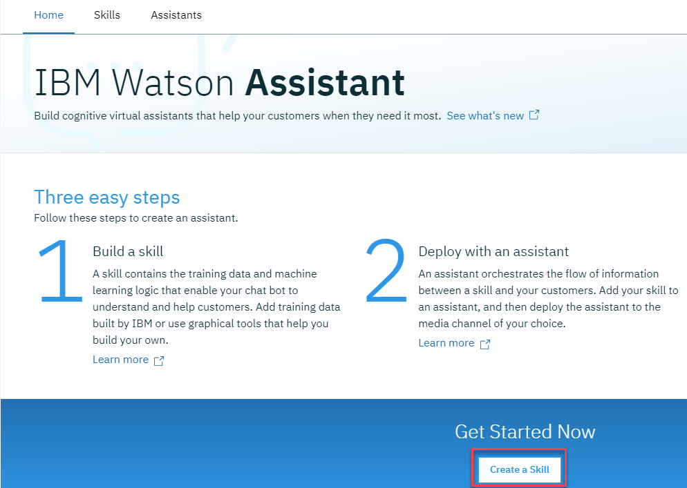
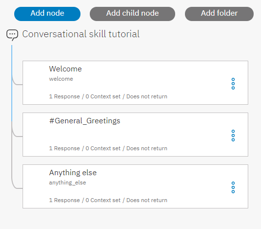
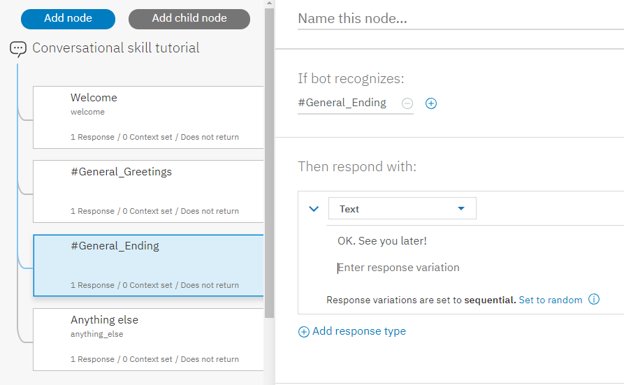
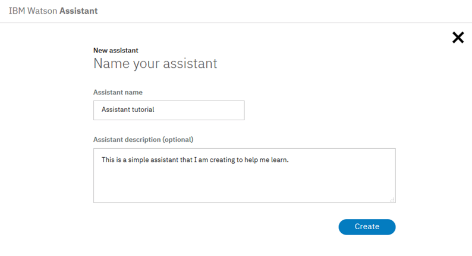

---

copyright:
  years: 2015, 2019
lastupdated: "2019-03-01"

subcollection: assistant

---

{:shortdesc: .shortdesc}
{:new_window: target="_blank"}
{:deprecated: .deprecated}
{:important: .important}
{:note: .note}
{:deprecated: .deprecated}
{:important: .important}
{:note: .note}
{:tip: .tip}
{:pre: .pre}
{:codeblock: .codeblock}
{:screen: .screen}
{:javascript: .ph data-hd-programlang='javascript'}
{:java: .ph data-hd-programlang='java'}
{:python: .ph data-hd-programlang='python'}
{:swift: .ph data-hd-programlang='swift'}
{:hide-dashboard: .hide-dashboard}
{:download: .download}
{:gif: data-image-type='gif'}

# 入门教程
{: #getting-started}

在本简短教程中，我们将介绍 {{site.data.keyword.conversationshort}} 工具，并完成创建第一个助手的过程。
{: shortdesc}

## 开始之前
{: #getting-started-prerequisites}
{: hide-dashboard}

首先，您需要一个服务实例。
{: hide-dashboard}

1.  {: hide-dashboard}转至 {{site.data.keyword.cloud_notm}}“目录”中的 [{{site.data.keyword.conversationshort}} ](https://cloud.ibm.com/catalog/services/watson-assistant) 页面。

    如果未选择其他资源组，服务实例将在**缺省**资源组中创建，并且日后*不能*更改。此组足以满足试用服务的目的。

    如果要创建实例以用于更稳健的用途，请了解有关[资源组 ](https://{DomainName}/docs/resources/bestpractice_rgs#bp_resourcegroups){: new_window} 的更多信息。
1.  {: hide-dashboard}注册免费的 {{site.data.keyword.cloud_notm}} 帐户或登录。
1.  {: hide-dashboard}单击**创建**。

## 步骤 1：打开工具
{: #getting-started-launch-tool}

创建 {{site.data.keyword.conversationshort}} 服务实例后，您将转至服务仪表板的**管理**页面。
{: hide-dashboard}

1.  单击**启动工具**。如果系统提示您登录到该工具，请提供您的 {{site.data.keyword.cloud_notm}} 凭证。

<!-- Remove this text after dedicated instances have the developer console: begin -->

{{site.data.keyword.Bluemix_dedicated_notm}}：从仪表板中选择服务实例以启动工具。

<!-- Remove this text after dedicated instances have the Developer Console: end -->

## 步骤 2：创建对话技能
{: #getting-started-add-skill}

在 {{site.data.keyword.conversationshort}} 工具中的第一步是创建技能。

*对话技能*是一个工件容器，工件用于定义助手可以与客户之间进行的会话流。

1.  在 {{site.data.keyword.conversationshort}} 工具的主页中，单击**创建技能**。

    

1.  单击**新建**。

    

1.  将技能命名为 `Conversational skill tutorial`。
1.  **可选**。如果计划构建的对话将使用英语以外的语言，请从列表中选择相应的语言。
1.  单击**创建**。

    

您会转至工具的“意向”页面上。

## 步骤 3：从内容目录添加意向
{: #getting-started-add-catalog}

通过从内容目录添加意向，向技能添加由 IBM 构建的训练数据。特别是，您将授予助手对**常规**内容目录的访问权，以便对话可以对用户进行问候以及结束与用户的会话。

1.  在 {{site.data.keyword.conversationshort}} 工具中，单击**内容目录**选项卡。
1.  在列表中找到**常规**，然后单击**添加到技能**。

    
1.  打开**意向**选项卡以查看已添加到训练数据中的意向和关联的示例发声。您可以识别出这些意向，因为每个意向名称都以前缀 `#General_` 开头。在下一步中，您将向对话添加 `#General_Greetings` 和 `#General_Ending` 意向。

    

您已通过从 {{site.data.keyword.IBM_notm}} 添加预构建的内容，成功地开始构建训练数据。

## 步骤 4：构建对话
{: #getting-started-build-dialog}

[对话](/docs/services/assistant?topic=assistant-dialog-overview)以逻辑树的形式定义会话流。对话会将意向（用户说的内容）与响应（机器人回复的内容）相匹配。树的每个节点都有一个根据用户输入进行触发的条件。

我们将创建一个简单的对话，用于处理问候和结束意向，每个意向通过单个节点处理。

### 添加开始节点

1.  在 {{site.data.keyword.conversationshort}} 工具中，单击**对话**选项卡。
1.  单击**创建**。您将看到两个节点：
    - **欢迎**：包含用户首次与助手进行交互时向用户显示的问候语。
    - **其他**：包含用于在无法识别用户输入时对用户进行回复的短语。

    
1.  单击**欢迎**节点以在编辑视图中将其打开。
1.  将缺省响应替换为文本：`欢迎使用 Watson Assistant 教程！`。

    
1.  单击  以关闭编辑视图。

您已创建由 `welcome` 条件触发的对话节点。（`welcome` 是一个特殊条件，作用类似于意向，但不以 `#` 开头。）新会话启动时，将触发此条件。节点指定新会话启动时，系统应该使用您添加到这第一个节点的响应部分中的欢迎消息进行响应。

### 测试开始节点

可以随时测试对话以验证对话。现在我们将测试对话。

- 单击  图标以打开“试用”窗格。您应该会看到欢迎消息。

### 添加节点以处理意向

现在，在`欢迎`节点和`其他`节点之间添加节点，用于处理意向。

1.  单击**欢迎**节点上的“更多”图标 ，然后选择**在下方添加节点**。
1.  在此节点的**输入条件**字段中输入 `#General_Greetings`。然后选择 **`#General_Greetings`** 选项。
1.  添加响应：`您好！`
1.  单击  以关闭编辑视图。

   

1.  单击此节点上的“更多”图标 ，然后选择**在下方添加节点**以创建对等节点。在对等节点中，指定 `#General_Ending` 作为条件，指定`好的，再会。`作为响应。

   

1.  单击  以关闭编辑视图。

   

### 测试意向识别

您已构建了一个简单的对话来识别并响应问候和结束输入。下面我们来看看效果如何。

1.  单击  图标以打开“试用”窗格。将再次显示欢迎消息。
1.  在窗格的底部，输入 `Hello`，然后按 Enter 键。输出指示已识别到 #hello 意向，并显示相应的响应（`您好。`）。
1.  请尝试进行以下输入：
    - `bye`
    - `howdy`
    - `see ya`
    - `good morning`
    - `sayonara`

{: gif}

即便您的输入与所包含的示例不完全匹配，{{site.data.keyword.watson}} 也可以识别到您的意向。此对话使用意向来识别用户输入的目的，而不考虑使用的措辞是否准确，然后以您指定的方式进行响应。

### 构建对话的结果

好了。您已创建具有两个意向的简单会话，并创建了一个对话来识别这两个意向。

## 步骤 5：创建助手
{: #getting-started-create-assistant}

[*助手*](/docs/services/assistant?topic=assistant-assistants)是一种认知机器人，可以向其添加技能，使其能够以有用的方式与客户进行交互。

1.  单击**助手**选项卡。
1.  单击**新建**。

    
1.  将助手命名为 `Watson Assistant 教程`。
1.  在“描述”字段中，输入`这是我要创建的样本助手，用于帮助我学习。`
1.  单击**创建**。

    

## 步骤 6：向助手添加技能
{: #getting-started-add-skill-to-assistant}

向已创建的助手添加构建的对话技能。

1.  在新助手页面中，单击**添加技能**。

    对于使用 {{site.data.keyword.conversationshort}} 服务的一般可用版本构建的任何工作空间，如果已创建或已被授予其开发者角色访问权，那么将看到这些工作空间在“技能”页面上作为会话技能列出。
    {: tip}

    
1.  选择向助手添加早先创建的技能。

## 步骤 7：集成助手
{: #getting-started-integrate-assistant}

既然您有一个可以参与简单会话交流的助手，请将其发布到公共 Web 页面，在此页面中可以对其进行测试。服务提供了称为“预览链接”的内置集成。创建此类型的集成时，它会将助手构建成由 IBM 品牌的 Web 页面托管的交谈窗口小部件。可以打开该 Web 页面并与助手交谈以进行测试。

1.  单击**助手**选项卡，找到已创建的助手 `Watson Assistant 教程`，然后将其打开。
1.  在*集成*区域中，单击**添加集成**。
1.  找到**预览链接**，然后单击**选择集成**。

1.  单击页面上显示的 URL。

    这将在新选项卡中打开该页面。
1.  对助手说`您好`，并观察助手的响应。您可以与可能希望试用您的助手的其他人共享该 URL。

## 后续步骤
{: #getting-started-next-steps}

本教程围绕一个简单的示例构建。对于真正的应用程序，您将需要定义一些更有意思的意向、一些实体以及同时使用意向和实体的更复杂对话。拥有经过完善的助手版本后，可以将其与客户使用的通道（如 Slack）进行集成。随着助手与客户之间的流量增加，可以使用**分析**选项卡中提供的工具来分析实际会话，并识别需要改进的方面。

- 完成后续教程以构建更高级的对话：
    - 使用[构建复杂对话](/docs/services/assistant?topic=assistant-tutorial)教程来添加标准节点。
    - 使用[添加带槽的节点](/docs/services/assistant?topic=assistant-tutorial-slots)教程来了解有关槽的信息。
- 查看更多[样本应用程序](/docs/services/assistant?topic=assistant-sample-apps)以获得启发。
