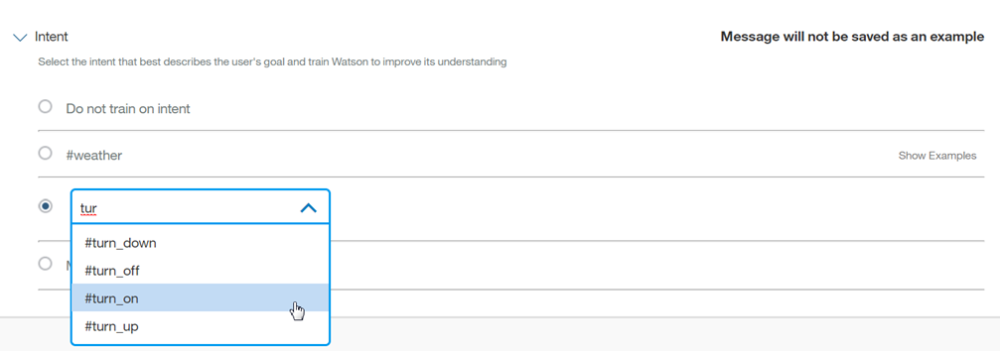

---

copyright:
  years: 2015, 2019
lastupdated: "2019-02-28"

subcollection: assistant

---

{:shortdesc: .shortdesc}
{:new_window: target="_blank"}
{:deprecated: .deprecated}
{:important: .important}
{:note: .note}
{:tip: .tip}
{:pre: .pre}
{:codeblock: .codeblock}
{:screen: .screen}
{:javascript: .ph data-hd-programlang='javascript'}
{:java: .ph data-hd-programlang='java'}
{:python: .ph data-hd-programlang='python'}
{:swift: .ph data-hd-programlang='swift'}

# 从会话中学习
{: #logs}

要打开用户与使用此对话技能的助手之间的消息列表，请选择导航栏中的**用户会话**。
{: shortdesc}

打开**用户会话**页面时，缺省视图将列出最后一天的结果，最新的结果最先列出。提供的信息包括：消息中使用的最热门意向 (#intent) 和任何识别到的实体 (@entity) 值，以及消息文本。对于未识别到的意向，显示的值为*不相关*。如果未识别到实体或未提供实体，那么显示的值为*找不到实体*。


值得注意的是，**用户会话**页面会显示用户与应用程序之间的*消息*总数。消息是用户向应用程序发送的单个发声。每个会话可能由多个消息组成。因此，此**用户会话**页面上的结果数与[概述](/docs/services/assistant?topic=assistant-logs-overview)页面上显示的会话数不同。

## 日志限制
{: #logs-limits}

保留消息的时间长度取决于 {{site.data.keyword.conversationshort}} 服务套餐：

  服务套餐                             |交谈消息保留时间
  ------------------------------------ | ------------------------------------
  高级                                 |最近 90 天
  增强版                               |最近 30 天
  标准                                 |最近 30 天
  Lite              |最近 7 天

## 过滤消息
{: #logs-filter-messages}

可以按*搜索用户语句*、*意向*、*实体*以及*最近* n *天*来过滤消息：

*搜索用户语句* - 在搜索栏中输入一个词。这将搜索用户的输入，但不会搜索应用程序的回复。

*意向* - 选择下拉菜单并在输入字段中输入意向，或者从填充的列表中进行选择。可以选择多个意向，这将使用任一所选意向（包括*不相关*）来过滤结果。


*实体* - 选择下拉菜单并在输入字段中输入实体名称，或者从填充的列表中进行选择。可以选择多个实体，这将按任一所选实体来过滤结果。如果按意向*和*实体进行过滤，那么结果将包含同时具有这两种值的消息。还可以使用*找不到实体*来过滤结果。


更新消息可能需要一些时间。请在用户与应用程序交互之后等待至少 30 分钟，然后再尝试过滤该内容。

## 查看单个消息
{: #logs-see-message}

可以展开每个消息条目，以查看用户在整个会话中所说的内容，以及应用程序是如何回答的。要执行此操作，请选择**打开会话**。这将自动转至该会话中的所选消息。

每个会话顶部显示的时间会经过本地化，以反映出浏览器的时区。这可能与通过 API 调用查看同一会话日志时显示的时间戳记不同；API 日志调用始终以 UTC 显示。


然后，可以选择显示所选消息的分类。


## 跨助手进行改进
{: #logs-deploy-id}

创建对话技能是一个迭代性过程。在开发技能时，使用*试用*窗格可验证服务是否能识别到测试输入中的正确意向和实体，然后根据需要进行更正。

在“用户会话”页面中，可以分析用于部署技能的助手与用户之间的实际交互。根据这些交互，可以进行更正，以提高对话技能识别意向和实体的准确性。很难确切知道用户将*如何*提问或者他们可能提交哪些随机消息，因此请务必经常分析实际会话以改进对话技能。

对于包含多个助手的 {{site.data.keyword.conversationshort}} 实例，有时使用一个助手的对话技能中的消息数据来改进同一个实例中另一个助手使用的对话技能可能会非常有用。

 如果您是 {{site.data.keyword.conversationshort}} 高端套餐用户，那么可以选择将实例配置为允许访问跨不同高端实例的助手中的日志数据。

例如，假设您有一个名为 *HelpDesk* 的 {{site.data.keyword.conversationshort}} 实例。在 HelpDesk 实例中，您可能同时拥有 Production 助手和 Development 助手。在 Development 助手的对话技能中工作时，可以使用 Production 助手消息中的日志来改进 Development 助手的对话技能。

随后在 Development 助手的对话技能中进行的任何编辑，都只会影响 Development 助手的对话技能，尽管您使用的是发送到 Production 助手的消息中的数据。

与此类似，如果创建了多个技能版本，那么您可能希望使用一个版本中的消息数据来改进另一个版本的训练数据。

### 选取数据源
{: #logs-pick-data-source}

术语*数据源*是指通过客户与用于部署对话技能的助手或定制应用程序之间的会话而汇集的日志。

打开*分析*选项卡时，会显示与当前对话技能的用户交互所生成的度量值。如果客户尚未部署并使用当前技能，那么不会显示任何度量值。

要使用添加到其他助手或定制应用程序（即已与客户进行交互的助手或定制应用程序）的对话技能或技能版本中的消息数据来填充度量值，请完成以下步骤：

1.  单击**数据源**字段以查看具有您可能要使用的日志数据的助手列表。

    该列表包含已部署且您有权访问的助手。有关该选项的更多信息，请参阅[*显示部署标识*说明](#logs-deployment-id-explained)。

1.  选择数据源。

这将显示所选数据源的统计信息。

请注意，该列表不包含技能版本。要获取与特定技能版本关联的数据，您必须知道部署的助手使用特定技能版本的时间范围。可以选择助手作为数据源，然后按相应日期来过滤度量数据。

### *显示部署标识*说明
{: #logs-deployment-id-explained}

使用 V1 版本 API 的应用程序必须在使用 `/message` API 发送的每条消息中指定部署标识。此标识用于标识从中发出调用的已部署应用程序。“分析”页面可以使用此部署标识来检索并显示与特定实时应用程序关联的日志。

对于使用 V2 版本 API 的助手或定制应用程序，服务会自动在每个 /message 调用中包含系统标识和技能标识，因此可以按助手名称（而不使用部署标识）来选择数据源。

要添加部署标识，V1 API 用户应在 [context ](https://cloud.ibm.com/apidocs/assistant?curl=#get-response-to-user-input){: new_window} 的 metadata 中包含 deployment 属性，如以下示例中所示：

```json
"context" : {
            "metadata" : {
       "deployment": "HelpDesk-Production"
  }
}
```
{: codeblock}

## 改进训练数据
{: #logs-fix-data}

使用从真实用户会话中获得的洞察来更正与对话技能关联的模型。

如果使用其他数据源中的数据，那么对模型所做的任何改进都仅应用于当前对话技能。**数据源**字段显示用于改进此对话技能的消息的源，而页面顶部显示要向其应用更改的对话技能。

### 更正意向
{: #logs-correct-intent}

1.  要更正意向，请选择所选 #intent 旁边的 “编辑”图标。
1.  从提供的列表中，选择此输入的正确意向。
    - 在输入字段中开始输入，这将过滤意向列表。
    - 还可以从此菜单中选择**标记为不相关**。（有关更多信息，请参阅[标记为不相关](/docs/services/assistant?topic=assistant-intents#intents-mark-irrelevant)。）或者，可以选择**不对意向进行训练**，这样此消息就不会保存为训练示例。

    
1.  选择**保存**。

    

    {{site.data.keyword.conversationshort}} 服务支持将用户输入作为示例*按原样*添加到意向。如果在意向训练数据中使用 @entity 引用作为示例，并且要保存的用户消息包含训练数据中的实体值或同义词，那么稍后必须编辑该消息。保存后，在“意向”页面中编辑该消息以替换它所引用的实体。有关更多信息，请参阅[直接将 @Entity 作为意向示例引用](/docs/services/assistant?topic=assistant-intents#intents-entity-as-example)。
    {: tip}

### 添加实体值或同义词
{: #logs-add-entity}

1.  要添加实体值或同义词，请选择所选 @entity 旁边的 “编辑”图标。
1.  选择**添加实体**。

    
1.  现在，在带下划线的用户输入中选择一个词或短语。

    
1.  选择一个实体以将突出显示的短语添加为其值。
    - 在输入字段中开始输入，这将过滤实体和值的列表。
    - 要将突出显示的短语添加为现有值的同义词，请从下拉列表中选择 `@entity:value`。

    
1.  选择**保存**。

    
