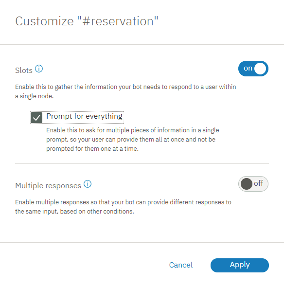
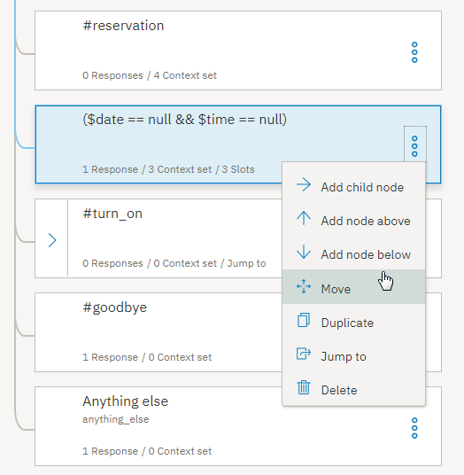

---

copyright:
  years: 2015, 2019
lastupdated: "2019-02-21"

subcollection: assistant

---

{:shortdesc: .shortdesc}
{:new_window: target="_blank"}
{:deprecated: .deprecated}
{:important: .important}
{:note: .note}
{:tip: .tip}
{:pre: .pre}
{:codeblock: .codeblock}
{:screen: .screen}
{:javascript: .ph data-hd-programlang='javascript'}
{:java: .ph data-hd-programlang='java'}
{:python: .ph data-hd-programlang='python'}
{:swift: .ph data-hd-programlang='swift'}

# 教程：改进带槽的节点
{: #tutorial-slots-complex}

在本教程中，您将增强一个带槽的简单节点的功能，此节点用于收集餐厅预订所需的信息。
{: shortdesc}

## 学习目标
{: #tutorial-slots-complex-objectives}

完成本教程后，您将了解如何执行以下操作：

- 测试带槽的节点
- 添加用于处理常见用户交互的槽响应条件
- 预测并处理不相关的用户输入
- 处理意外的用户响应

### 持续时间
{: #tutorial-slots-complex-duration}

完成本教程大约需要 2 到 3 个小时。

### 先决条件
{: #tutorial-slots-complex-prereqs}

开始之前，请先完成[向对话添加带槽的节点](/docs/services/assistant?topic=assistant-tutorial-slots)。在开始本教程之前，您必须完成第一个槽教程，因为您将基于在第一个教程中创建的带槽的节点来构建内容。

## 步骤 1：改进响应格式
{: #tutorial-slots-complex-fix-format}

保存日期和时间系统实体值时，这些值会转换成标准格式。这种标准格式在对值执行计算时非常有用，但您可能并不希望向用户公开这种格式重新设置。在此步骤中，您将重新设置对话引用的日期 (`2017-12-29`) 和时间 (`17:00:00`) 值的格式。

1.  要重新设置 $date 上下文变量值的格式，请单击 @sys-date 槽的**编辑响应**  图标。

1.  从**更多**  菜单中，选择**打开 JSON 编辑器**，然后编辑用于定义该上下文变量的 JSON。添加用于重新设置日期格式的方法，以便将 `2017-12-29` 值转换为星期几的完整拼写，后跟月份和日期的完整拼写。按如下所示编辑 JSON：

    ```json
    {
      "context": {
   "date": "<? @sys-date.reformatDateTime('EEEE, MMMM d') ?>"
      }
    }
    ```
    {: codeblock}

    EEEE 指示您希望完整拼写星期几。例如，如果使用 3 个 E (EEE)，那么星期几将简写为 Fri 而不是 Friday（举例来说）。MMMM 指示您希望完整拼写月份。同样，如果仅使用 3 个 M (MMM)，那么月份会简写为 Dec 而不是 December。

1.  单击**保存**。

1.  要将 $time 上下文变量中存储时间值的格式更改为使用小时和分钟并指示“上午”或“下午”，请单击 @sys-time 槽的**编辑响应**  图标。

1.  从**更多**  菜单中，选择**打开 JSON 编辑器**，然后编辑用于定义该上下文变量的 JSON，使其内容如下所示：

    ```json
    {
      "context": {
   "time": "<? @sys-time.reformatDateTime('h:mm a') ?>"
      }
    }
    ```
    {: codeblock}

1.  单击**保存**。

1.  再次测试节点。打开“试用”窗格，然后单击**清除**以删除先前测试带槽的节点时指定的槽上下文变量值。要查看所做更改的影响，请使用以下脚本：

    <table>
    <caption>脚本详细信息</caption>
    <tr>
      <th>说话者</th>
      <th>发声</th>
    </tr>
    <tr>
      <td>您</td>
      <td>我要订位</td>
    </tr>
    <tr>
      <td>Watson</td>
      <td>您要订哪天？</td>
    </tr>
    <tr>
      <td>您</td>
      <td>周五</td>
    </tr>
    <tr>
      <td>Watson</td>
      <td>您要订在几点？</td>
    </tr>
    <tr>
      <td>您</td>
      <td>下午 5 点</td>
    </tr>
    <tr>
      <td>Watson</td>
      <td>几位就餐？</td>
    </tr>
    <tr>
      <td>您</td>
      <td>6 位</td>
    </tr>
    </table>

    此时 Watson 的响应是：`好。我将为您订位，6 位，12 月 29 日周五下午 5 点。`

对话在其响应中引用上下文变量值时，说明您已成功改进了对话使用的格式。现在，该对话使用 `12 月 29 日周五`，而不使用更技术性的表示 `2017-12-29`。同时，该对话使用`下午 5:00`，而不使用 `17:00:00`。要了解可以用于日期和时间值的其他 SpEL 方法，请参阅[处理值的方法](/docs/services/assistant?topic=assistant-dialog-methods#dialog-methods-date-time)。

## 步骤 2：一次询问所有信息
{: #tutorial-slots-complex-ask-for-everything}

现在，您已经多次测试了对话，您可能已经注意到，一次只能回答一个槽提示可能有点烦人。为了避免用户一次只能提供一条信息的情况，您可以预先要求提供您需要的所有信息。这样用户就有机会在单次输入中提供全部或部分信息。

带槽的节点设计为查找并保存用户在当前节点处理过程中提供的所有槽值。您可以通过让用户知道要指定哪些值来帮助用户利用该设计。

在此步骤中，您将学习如何一次提示提供所有信息。

1.  从带槽的主节点中，单击**定制**。

1.  选中**提示提供所有信息**复选框以启用初始提示，然后单击**应用**。

   

1.  返回节点编辑视图，向下滚动到新添加的**如果未预填充任何槽，请首先询问此问题**字段。为该节点添加以下初始提示：`我可以为您订位。请告诉我预订的日期和时间，以及有几位。`

1.  单击  以关闭节点编辑视图。

1.  在“试用”窗格中测试此更改。打开该窗格，然后单击**清除**以清空先前测试中的槽上下文变量值。

1.  输入：`我要订位。`

    现在，对话会响应：`我可以为您订位。请告诉我预订的日期和时间，以及有几位。`

1.  输入：`订在周六。2 位，晚上 8 点`

    对话的响应是：`好。我将为您订位，2 位，周六晚上 8 点。`

    

如果用户在其初始输入中提供了一个槽值，那么不会显示要求提供所有信息的提示。例如，用户的初始输入可能是：`我要预订在本周五晚上。`在这种情况下，由于您不想询问用户已经提供的信息（在本示例中是指日期`周五`），因此会跳过初始提示。该对话将改为显示下一个空槽的提示。
{: note}

## 步骤 3：正确处理零
{: #tutorial-slots-complex-recognize-zero}

在槽条件中使用 `sys-number` 系统实体时，服务不会正确处理零。服务会将您为槽定义的上下文变量设置为 false，而不是将其设置为 0。因此，槽不会认为它已满，而会反复提示用户输入数字，直到用户指定了非零的数字为止。

1.  测试节点，以便更好地理解问题。打开“试用”窗格，然后单击**清除**以删除先前测试带槽的节点时指定的槽上下文变量值。请使用以下脚本：

    <table>
    <caption>脚本详细信息</caption>
    <tr>
      <th>说话者</th>
      <th>发声</th>
    </tr>
    <tr>
      <td>您</td>
      <td>我要订位</td>
    </tr>
    <tr>
      <td>Watson</td>
      <td>我可以为您订位。请告诉我预订的日期和时间，以及有几位。</td>
    </tr>
    <tr>
      <td>您</td>
      <td>我们想要在 5 月 23 日晚上 8 点就餐。就餐人数是 0 位。</td>
    </tr>
    <tr>
      <td>Watson</td>
      <td>几位就餐？</td>
    </tr>
    <tr>
      <td>您</td>
      <td>0 </td>
    </tr>
    <tr>
      <td>Watson</td>
      <td>几位就餐？</td>
    </tr>
    </table>

    在指定非 0 的数字之前，您将陷入此循环中。

1.  要确保槽能够正确处理零，请将槽条件从 `@sys-number` 更改为 `@sys-number || @sys-number:0`。

1.  单击槽的**编辑响应**  图标。

1.  创建上下文变量时，系统会自动使用为槽条件指定的相同表达式。但是，上下文变量必须仅保存数字。编辑以上下文变量形式保存的值，以从中除去 `OR` 运算符。从**更多**  菜单中，选择**打开 JSON 编辑器**，然后编辑用于定义该上下文变量的 JSON。将变量从 `"guests":"@sys-number || @sys-number:0"` 更改为使用以下语法：

    ```json
    {
      "context": {
   "guests": "@sys-number"
      }
    }
    ```
    {: codeblock}

1.  单击**保存**。

1.  再次测试节点。打开“试用”窗格，然后单击**清除**以删除先前测试带槽的节点时指定的槽上下文变量值。要查看所做更改的影响，请使用以下脚本：

    <table>
    <caption>脚本详细信息</caption>
    <tr>
      <th>说话者</th>
      <th>发声</th>
    </tr>
    <tr>
      <td>您</td>
      <td>我要订位</td>
    </tr>
    <tr>
      <td>Watson</td>
      <td>我可以为您订位。请告诉我预订的日期和时间，以及有几位。</td>
    </tr>
    <tr>
      <td>您</td>
      <td>我们想要在 5 月 23 日晚上 8 点就餐。就餐人数是 0 位。</td>
    </tr>
    </table>

    此时 Watson 的响应是：`好。我将为您订位，0 位，5 月 23 日星期三晚上 8 点。`

您已成功设置数字槽的格式，现在它可以正确处理零了。另外，您可能不希望节点接受零作为有效的就餐人数。在下一步中，您将了解如何验证用户指定的值。

## 步骤 4：验证用户输入
{: #tutorial-slots-complex-slot-conditions}

到目前为止，我们一直假定用户将为槽提供适用的值类型。但在现实中并不总是如此。您可以通过向槽添加条件响应，从而考虑用户可能提供无效值的情况。在此步骤中，您将使用条件槽响应来执行以下任务：

- 确保请求的日期不是过去的时间。
- 检查请求的预订时间是否在接待时段内。
- 确认用户的输入。
- 确保所提供的就餐人数大于零。
- 指示您要将一个值替换为另一个值。

要验证用户输入，请完成以下步骤：

1.  在带槽的节点的编辑视图中，单击 `@sys-date` 槽的**编辑槽**  图标。

1.  从*配置槽 1* 标题中的**选项**  菜单中，选择**启用条件响应**。

1.  在**已找到**部分中，通过单击**编辑响应**  图标来添加条件响应。

1.  添加以下条件和响应以检查用户指定的日期是否位于今天之前：

    <table>
    <caption>槽 1 条件响应 1 详细信息</caption>
    <tr>
      <th>条件</th>
      <th>响应</th>
      <th>操作</th>
    </tr>
    <tr>
      <td>`@sys-date.before(now())`</td>
      <td>您不能预订过去的日期。</td>
      <td>清除槽并重新提示</td>
    </tr>
    </table>

1.  添加将在用户提供有效日期时显示的第二个条件响应。通过此类型的简单确认，用户可知道自己的响应已得到理解。

    <table>
    <caption>槽 1 条件响应 2 详细信息</caption>
    <tr>
      <th>条件</th>
      <th>响应</th>
      <th>操作</th>
    </tr>
    <tr>
      <td>`true`</td>
      <td>那就是 $date</td>
      <td>离开</td>
    </tr>
    </table>

1.  在带槽的节点的编辑视图中，单击 `@sys-time` 槽的**编辑槽**  图标。

1.  从*配置槽 2* 标题中的**选项**  菜单中，选择**启用条件响应**。

1.  在**已找到**部分中，通过单击**编辑响应**  图标来添加条件响应。

1.  添加以下条件和响应以检查用户指定的时间是否位于允许的时段内：

    <table>
    <caption>槽 2 条件响应详细信息</caption>
    <tr>
      <th>条件</th>
      <th>响应</th>
      <th>操作</th>
    </tr>
    <tr>
      <td>`@sys-time.after('21:00:00')`</td>
      <td>我们最晚接待时间是晚上 9 点。</td>
      <td>清除槽并重新提示</td>
    </tr>
    <tr>
      <td>`@sys-time.before('09:00:00')`</td>
      <td>我们最早接待时间是上午 9 点。</td>
      <td>清除槽并重新提示</td>
    </tr>
    </table>

1.  添加将在用户提供适用时段内有效时间时显示的第三个条件响应。通过此类型的简单确认，用户可知道自己的响应已得到理解。

    <table>
    <caption>槽 2 条件响应 3 详细信息</caption>
    <tr>
      <th>条件</th>
      <th>响应</th>
      <th>操作</th>
    </tr>
    <tr>
      <td>`true`</td>
      <td>好，预订时间为 $time。</td>
      <td>离开</td>
    </tr>
    </table>

1.  编辑 @sys-number 槽，以通过以下方式验证用户提供的值：

    - 检查所指定的就餐人数大于零。
    - 预测并处理用户更改就餐人数的情况。

      如果在处理带槽的节点的过程中，用户在任何时刻更改了槽值，那么相应的槽上下文变量值会更新。但是，让用户知道将替换值会非常有用，这既向用户提供明确的反馈，也让用户有机会在更改有误的情况下加以纠正。 

1.  在带槽的节点的编辑视图中，单击 `@sys-number` 槽的**编辑槽**  图标。

1.  从*配置槽 3* 标题中的**选项**  菜单中，选择**启用条件响应**。

1.  在**已找到**部分中，通过单击  图标来添加条件响应，然后添加以下条件和响应：

    <table>
    <caption>槽 3 条件响应详细信息</caption>
    <tr>
      <th>条件</th>
      <th>响应</th>
      <th>操作</th>
    </tr>
    <tr>
      <td>`entities['sys-number']?.value == 0`</td>
      <td>请指定大于 0 的数字。</td>
      <td>清除槽并重新提示</td>
    </tr>
    <tr>
      <td>`(event.previous_value != null) && (event.previous_value != event.current_value)`</td>
      <td>好，更新就餐人数，`<? event.previous_value ?>` 位改为 `<? event.current_value ?>`.</td>
      <td>离开</td>
    </tr>
    <tr>
      <td>`true`</td>
      <td>好的。预订的就餐人数是 $guests 位。</td>
      <td>离开</td>
    </tr>
    </table>

## 步骤 5：添加确认槽
{: #tutorial-slots-complex-confirmation-slot}

您可能需要将对话设计为调用外部预订系统，并实际为系统中的用户进行预订。在应用程序执行此操作之前，您可能希望向用户确认对话已正确理解预订的详细信息。可以通过向节点添加确认槽来完成此操作。

1.  确认槽期望用户的回答为“是”或“否”。您必须培训对话，使其能够首先识别用户输入中的“是”或“否”意向。

1.  单击**意向**选项卡以返回到“意向”页面。添加以下意向和示例发声。

- `#yes`

   ```json
   是
   没错
   这正是我想要的
   请预订
   是的，请预订。
   好
   没问题。
   ```
   {: screen}

   

- `#no`

   ```json
   否
   不，谢谢。
   请勿预订。
   请不要预订！
   这根本不是我想要的
   绝对不是。
   不对
   ```
   {: screen}

   

1.  返回到**对话**选项卡，然后单击以编辑带槽的节点。单击**添加槽**以添加第 4 个槽，然后为其指定以下值：

    <table>
    <caption>确认槽详细信息</caption>
    <tr>
      <th>检查对象</th>
      <th>另存为</th>
      <th>如果不存在，请询问</th>
    </tr>
    <tr>
      <td>`(#yes || #no) && slot_in_focus`</td>
      <td>$confirmation</td>
      <td>我将为您订位，$guests 位，$date $time。可以下单了吗？</td>
    </tr>
    </table>

    此条件检查任一回答。您将使用条件槽响应，根据用户的回答为“是”还是“否”来指定接下来发生的情况。`slot_in_focus` 属性强制使此条件的范围仅适用于当前槽。此设置防止用户可能做出的与 `#yes` 或 `#no` 意向可能匹配的随机语句触发此槽。

    例如，用户可能正在回答就餐人数槽，并说了类似于以下内容的话：`是的，会有 5 位就餐。`您不希望使用此响应中包含的`是`意外地填充确认槽。通过将 `slot_in_focus` 属性添加到条件中，仅当用户在具体回答此槽的提示时，才会将用户指示的“是”或“否”应用于此槽。

1.  单击**编辑槽**  图标。从*配置槽 4* 标题中的**选项**  菜单中，选择**启用条件响应**。

1.  在**已找到**提示中，添加一个条件，用于检查“否”响应 (`#no`)。请使用响应：`好的。我们从头来。这次我会尽力跟上。`否则，可以假定用户确认了预订详细信息，并继续进行预订。

    找到了 `#no` 意向时，还必须将先前保存的上下文变量重置为 null，以便可以再次要求提供信息。可以使用 JSON 编辑器重置上下文变量值。单击刚才添加的条件响应的**编辑响应**  图标。从**选项**  菜单中，单击**打开 JSON 编辑器**。添加一个 `context` 块，用于将槽上下文变量设置为 `null`，如下所示。

    ```json
    {
      "output":{
                "text": {
     "values": [
       "好的。我们从头来。这次我会尽力跟上。"
          ]
        }
      },
  "context":{
    "date": null,
        "time": null,
        "guests": null
      }
    }
    ```
    {: codeblock}

1.  单击**返回**，然后单击**保存**。

1.  再次单击确认槽的**编辑槽**  图标。在**找不到**提示中，澄清您希望用户提供“是”或“否”回答。添加具有以下值的响应。

    <table>
    <caption>“找不到”响应详细信息</caption>
    <tr>
      <th>条件</th>
      <th>响应</th>
    </tr>
    <tr>
      <td>`true`</td>
      <td>回答“是”指示您希望按原样预订，回答“否”指示您不希望按原样预订。</td>
    </tr>
    </table>

1.  单击**保存**。

1.  现在，您已有槽值的确认响应，并且您一次询问了所有信息，您可能会注意到在显示确认槽响应之前，会先显示单个槽响应，这对于用户可能显得重复。编辑槽的“已找到”响应，以阻止这些响应在特定条件下显示。

1.  将 @sys-date 槽中最后一个条件响应的 JSON 片段中指定的 `true` 条件替换为 `!($time && $guests)`。例如：

    <table>
    <caption>槽 1 条件响应 2 详细信息</caption>
    <tr>
      <th>条件</th>
      <th>响应</th>
      <th>操作</th>
    </tr>
    <tr>
      <td>`!($time && $guests)`</td>
      <td>那就是 $date</td>
      <td>离开</td>
    </tr>
    </table>

1.  将 @sys-time 槽中最后一个条件响应的 JSON 片段中指定的 `true` 条件替换为 `!($date && $guests)`。例如：

    <table>
    <caption>槽 2 条件响应 3 详细信息</caption>
    <tr>
      <th>条件</th>
      <th>响应</th>
      <th>操作</th>
    </tr>
    <tr>
      <td>`!($date && $guests)`</td>
      <td>好，预订时间为 $time。</td>
      <td>离开</td>
    </tr>
    </table>

1.  将 @sys-number 槽中最后一个条件响应的 JSON 片段中指定的 `true` 条件替换为 `!($date && $time)`。例如：

    <table>
    <caption>槽 3 条件响应 2 详细信息</caption>
    <tr>
      <th>条件</th>
      <th>响应</th>
      <th>操作</th>
    </tr>
    <tr>
      <td>`!($date && $time)`</td>
      <td>好的。预订的就餐人数是 $guests 位。</td>
      <td>离开</td>
    </tr>
    </table>

如果日后添加更多槽，那么必须编辑这些条件以说明其他槽的关联上下文变量。如果未包含确认槽，可以仅指定 `!all_slots_filled`，并且无论日后添加多少槽，它都始终保持有效。

## 步骤 6：重置槽上下文变量值
{: #tutorial-slots-complex-reset-variables}

您可能已经注意到，在每次测试之前，都必须清除先前测试期间创建的上下文变量值。必须这样做的原因是，带槽的节点仅会提示用户提供该节点认为缺少的信息。如果槽上下文变量全部填充为有效值，那么不会显示任何提示。这也同样适用于运行时的对话。您必须在对话中构建一种机制，通过该机制可将槽上下文变量重置为 null，以便这些槽可以由下一个用户重新填充。为此，您将向带槽的节点添加父节点，用于将上下文变量设置为 null。

1.  在对话的树形视图中，单击带槽的节点上的**更多**  图标，然后选择**在上方添加节点**。

1.  将 `#reservation` 指定为新节点的条件。（这与带槽的节点使用的条件相同，但您将在此过程的后面更改带槽的节点的条件。）

1.  单击节点响应旁边的**选项**  图标，然后单击**打开 JSON 编辑器**。为带槽的节点中定义的每个槽上下文变量添加一个条目，并将其设置为 `null`。

    ```json
    {
      "context": {
   "date": null,
        "time": null,
        "guests": null,
        "confirmation": null
      },
      "output": {}
    }
    ```
    {: codeblock}

    

1.  单击以编辑另一个 #reservation 节点，即先前所创建并向其添加了槽的节点。

1.  将节点条件从 `#reservation` 更改为 `($date == null && $time == null)`，然后通过单击  以关闭节点编辑视图。

1.  单击带槽的节点上的**更多**  图标，然后选择**移动**。

    

1.  选择 `#reservation` 节点作为移至位置目标，然后从菜单中选择**作为子节点**。

1.  单击以编辑 `#reservation` 节点。在*最后*部分中，将操作从*等待用户输入*更改为**跳过用户输入**。

    

    用户输入与 `#reservation` 意向匹配时，会触发该节点。这会将槽上下文变量都设置为 null，然后对话直接跳转至带槽的节点以进行处理。

## 步骤 7：为用户提供退出过程的方法
{: #tutorial-slots-complex-handler}

添加带槽的节点具有强大的功能，因为用户可以一直顺利地提供您需要的信息，使您能够为用户提供有意义的响应或代表用户执行操作。但是，有时用户正在提供预订详细信息，但中途决定不继续预订了。您必须为用户提供一种方法来正常退出该过程。为此，可以添加一个槽处理程序，用于检测用户退出过程的想法，并退出节点而不保存收集的任何值。

1.  您必须培训对话，使其能够首先识别用户输入中的 #exit 意向。

1.  单击**意向**选项卡以返回到“意向”页面。添加具有以下示例发声的 #exit 意向。

    ```json
    我想停止预订
    退出！
    取消此过程
    我改变主意了。我不想预订了。
    停止预订
    稍等，请取消此预订。
    算了。
    ```
    {: screen}

    

1.  通过单击**对话**选项卡来返回到对话。单击以打开带槽的节点，然后单击**管理处理程序**。

    

1.  向字段添加以下值。

    <table>
    <caption>节点级别的处理程序详细信息</caption>
    <tr>
      <th>条件</th>
      <th>响应</th>
      <th>操作</th>
    </tr>
    <tr>
      <td>`#exit`</td>
      <td>好，停止预订。不会进行任何预订。</td>
      <td>跳至响应</td>
    </tr>
    </table>

    **跳至响应**操作直接跳转至节点级别的响应，而不显示与其余任何未填充槽关联的提示。

1.  单击**返回**，然后单击**保存**。

1.  现在，您需要编辑节点级别的响应，使其可识别用户何时想要退出过程而不进行预订。为节点添加条件响应。

    在带槽的节点的编辑视图中，单击**定制**，单击**多个响应**切换开关以将其**开启**，然后单击**应用**。

    

1.  向下滚动到带槽的节点的响应部分，然后单击**添加响应**。

1.  向字段添加以下值。

    <table>
    <caption>节点级别的条件响应详细信息</caption>
    <tr>
      <th>条件</th>
      <th>响应</th>
    </tr>
    <tr>
      <td>`has_skipped_slots`</td>
      <td>期待下一次帮您预订。祝您生活愉快。</td>
    </tr>
    </table>

    `has_skipped_slots` 条件会检查槽节点的属性，以查看是否跳过了任何槽。`#exit` 处理程序会跳过其余所有槽而直接转至节点响应。因此，`has_skipped_slots` 属性出现时，您就会知道触发了 `#exit` 意向，并且对话可以显示替代响应。

    如果将多个槽配置为跳过其他槽，或者将另一个节点级别的事件处理程序配置为跳过槽，那么必须使用其他方法来检查是否触发了 #exit 意向。有关可执行此操作的替代方法，请参阅[处理请求以退出过程](/docs/services/assistant?topic=assistant-dialog-slots#dialog-slots-node-level-handler)。
    {: note}

1.  您希望服务在显示标准的节点级别响应之前，先检查 `has_skipped_slots` 属性。请将 `has_skipped_slots` 条件响应上移，使其在原始条件响应之前进行处理，否则此响应将永远不会触发。为此，请单击刚才添加的响应，使用**向上箭头**将其上移，然后单击**保存**。

1.  在“试用”窗格中使用以下脚本来测试此更改。

    <table>
    <caption>脚本详细信息</caption>
    <tr>
      <th>说话者</th>
      <th>发声</th>
    </tr>
    <tr>
      <td>您</td>
      <td>我要订位</td>
    </tr>
    <tr>
      <td>Watson</td>
      <td>我可以为您订位。请告诉我预订的日期和时间，以及有几位。</td>
    </tr>
    <tr>
      <td>您</td>
      <td>5 位</td>
    </tr>
    <tr>
      <td>Watson</td>
      <td>好的。预订的就餐人数是 5 位。您要订哪天？</td>
    </tr>
    <tr>
      <td>您</td>
      <td>算了</td>
    </tr>
    <tr>
      <td>Watson</td>
      <td>好，停止预订。不会进行任何预订。期待下一次帮您预订。祝您生活愉快。</td>
    </tr>
    </table>

## 步骤 8：在用户多次尝试提供有效值失败时应用有效值

在某些情况下，用户可能未理解您询问的内容。他们可能会反复用错误类型的值进行响应。为了计划应对这种可能性，可以向槽添加计数器，并且在用户尝试提供有效值 3 次失败后，您可以代表用户将值应用于槽，然后离开。

对于 $time 信息，您将定义在用户没有提供有效时间时显示的跟进语句。

1.  创建一个上下文变量，用于跟踪用户提供的值与槽所期望的值类型不匹配的次数。您希望在处理带槽的节点之前，先对该上下文变量初始化并将其设置为 0，以便将其添加到父 `#reservation` 节点。

1.  单击以编辑 `#reservation` 节点。单击响应部分中的**选项**  图标，然后选择**打开 JSON 编辑器**，以打开与节点响应关联的 JSON 编辑器。在现有 `"context"` 块底部的 `confirmation` 变量下面添加名为 `counter` 的上下文变量。将 `counter` 变量设置为 `0`。

       ```json
       {
         "context": {
   "date": null,
           "time": null,
           "guests": null,
           "confirmation": null,
           "counter": 0
         },
         "output": {}
       }
       ```
       {: codeblock}

1.  在树形视图中，展开 `#reservation` 节点，然后单击以编辑带槽的节点。 

1.  单击 `@sys-time` 槽的**编辑槽**  图标。

1.  从*配置槽 2* 标题中的**选项**  菜单中，选择**启用条件响应**。

1.  在**找不到**部分中，添加条件响应。

    <table>
    <caption>“找不到”响应详细信息</caption>
    <tr>
      <th>条件</th>
      <th>响应</th>
    </tr>
    <tr>
      <td>`true`</td>
      <td>请指定要就餐的时间。餐厅接待时间是上午 9 点至晚上 9 点。</td>
    </tr>
    </table>

1.  每次触发此响应时，将 `counter` 变量加 1。请记住，仅当用户未提供有效时间值时，才会触发此响应。单击**编辑响应**  图标。

1.  单击**选项**  图标，然后选择**打开 JSON 编辑器**。添加以下上下文变量定义。

    ```json
    {
      "output": {
    "text": {
     "values": [
       "请指定要就餐的时间。
              餐厅接待时间是上午 9 点至晚上 9 点。"
          ]
        }
      },
"context": {
   "counter": "<? context['counter'] + 1 ?>"
      }
    }
    ```
    {: codeblock}

    此表达式将当前 counter 计数器加 1。

1.  单击**返回**，然后单击**保存**。

1.  通过单击**编辑槽**  图标，重新打开 @sys-time 槽。

    您将向**找不到**部分添加第二个条件响应，用于检查计数器是否大于 1，这指示用户之前提供了 3 次无效响应。在这种情况下，对话会代表用户将时间值指定为常用晚餐预约时间 - 晚上 8 点。别担心；触发确认槽时，用户将有机会更改此时间值。单击**添加响应**。

1.  添加以下条件和响应。

    <table>
    <caption>“找不到”响应详细信息</caption>
    <tr>
      <th>条件</th>
      <th>响应</th>
    </tr>
    <tr>
      <td>`$counter > 1`</td>
      <td>您似乎不知道该选择什么时间。我将为您预订晚上 8 点。</td>
    </tr>
    </table>

    必须将 $time 变量设置为晚上 8 点，所以请单击**编辑响应**  图标。选择**打开 JSON 编辑器**，添加以下上下文变量定义，然后单击**返回**。

    ```json
    {
      "output": {
    "text": {
     "values": [
       "您似乎不知道该选择什么时间。
              我将为您预订晚上 8 点。"
          ]
        }
      },
"context": {
   "time": "<? '20:00:00'.reformatDateTime('h:mm a') ?>"
      }
    }
    ```
    {: codeblock}

1.  刚才添加的条件响应的条件比第一个条件响应使用的 true 条件更精确。您必须移动此响应，使其位于原始条件响应之前，否则此响应将永远不会触发。单击刚才添加的响应，使用向上箭头将其上移，然后单击**保存**。

1.  使用以下脚本测试更改。

|说话者|发声|
|---------|-----------|
|您|我要订位|
|Watson|我可以为您订位。请告诉我预订的日期和时间，以及有几位。|
|您|明天|
|Watson|那就是 12 月 29 日周五。您要订在几点？|
|您|橙色|
|Watson|请指定要就餐的时间。餐厅接待时间是上午 9 点至晚上 9 点。|
|您|粉色|
|Watson|请指定要就餐的时间。餐厅接待时间是上午 9 点至晚上 9 点。|
|您|紫色|
|Watson|您似乎不知道该选择什么时间。我将为您预订晚上 8 点。几位就餐？|

## 步骤 9：连接到外部服务
{: #tutorial-slots-complex-action}

现在，对话可以收集并确认用户的预订详细信息，您可以调用外部服务以在餐厅系统中实际订位，或者通过多餐厅在线预订服务订位。有关更多详细信息，请参阅[从对话节点发起程序化调用](/docs/services/assistant?topic=assistant-dialog-actions)。

在调用预订服务的逻辑中，请确保检查是否存在 `has_skipped_slots`，如果存在，请不要继续预订。

### 摘要
{: #tutorial-slots-complex-summary}

在本教程中，您测试了一个带槽的节点并进行了更改，以优化该节点与真实用户的交互方式。有关此主题的更多信息，请参阅[使用槽收集信息](/docs/services/assistant?topic=assistant-dialog-slots)。

## 后续步骤
{: #tutorial-slots-complex-deploy}

要部署对话技能，请先将对话技能连接到助手，然后部署助手。有多种方式可以执行此操作。有关更多详细信息，请参阅[添加集成](/docs/services/assistant?topic=assistant-deploy-integration-add)。
