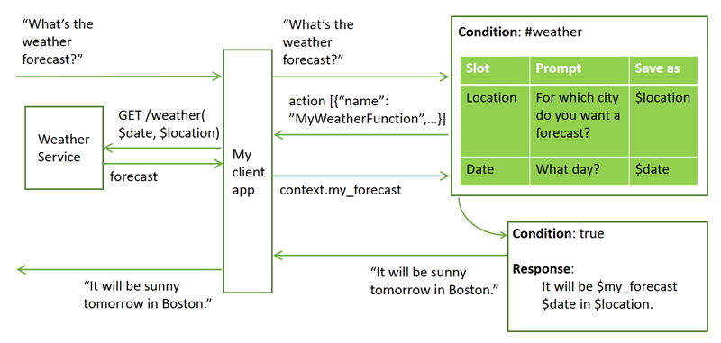
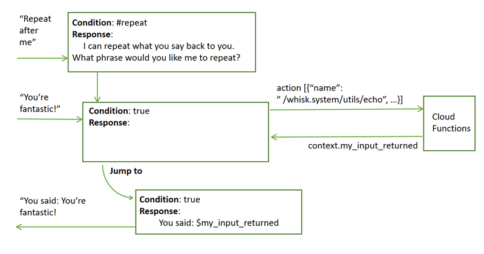

---

copyright:
  years: 2015, 2019
lastupdated: "2019-02-21"

subcollection: assistant

---

{:shortdesc: .shortdesc}
{:new_window: target="_blank"}
{:deprecated: .deprecated}
{:important: .important}
{:note: .note}
{:tip: .tip}
{:pre: .pre}
{:codeblock: .codeblock}
{:screen: .screen}
{:javascript: .ph data-hd-programlang='javascript'}
{:java: .ph data-hd-programlang='java'}
{:python: .ph data-hd-programlang='python'}
{:swift: .ph data-hd-programlang='swift'}

# 從對話節點進行程式化呼叫 
{: #dialog-actions}

定義可對外部應用程式或服務進行程式化呼叫的動作，並在對話開啟內進行處理的過程中取回結果。
{: shortdesc}

您可以使用外部服務來執行下列類型的事物：
- 驗證您從使用者收集的資訊。
- 對使用者輸入執行運算或字串操作，因為這些使用者輸入太過複雜，以致支援的 SpEL 表示式方法無法處理它們。
- 與外部 Web 服務互動以取得資訊。例如，您可以從空中交通服務查看班機預計抵達的時間，或從氣象服務取得天氣預報。
- 將要求傳送至外部應用程式（例如餐廳預約網站），以代表使用者完成簡單交易。

<iframe class="embed-responsive-item" id="youtubeplayer" title="呼叫 IBM Cloud Functions" type="text/html" width="640" height="390" src="https://www.youtube.com/embed/y0A6X-KNoB8?rel=0" frameborder="0" webkitallowfullscreen mozallowfullscreen allowfullscreen> </iframe>

當您定義程式化呼叫時，請選擇下列其中一種類型：

- **client**：以外部用戶端應用程式可以瞭解的標準化格式定義程式化呼叫。您的用戶端應用程式必須使用所提供的資訊來執行程式化呼叫或功能，並將結果傳回至對話。這種類型的呼叫基本上會告知對話在這裡暫停，並等待用戶端應用程式執行某些動作。用戶端應用程式執行的程式可以是您選擇的任何程式。請務必根據稍後概述的 JSON 格式化規則，來指定呼叫名稱和參數詳細資料，以及錯誤訊息變數名稱。

- **cloud_function**：直接呼叫 {{site.data.keyword.openwhisk_short}} 動作，並將結果傳回至對話。您必須提供一個 {{site.data.keyword.openwhisk_short}} 鑑別金鑰來搭配呼叫。（此類型以前命名為 **server**。繼續支援 **server** 類型。）

- **web_action**：呼叫 {{site.data.keyword.openwhisk_short}} Web 動作。Web 動作是標註的 {{site.data.keyword.openwhisk_short}} 動作，開發人員可以用來設計後端邏輯的程式，而 Web 應用程式可以匿名存取此後端邏輯，無需 {{site.data.keyword.openwhisk_short}} 鑑別金鑰。雖然不需要鑑別，但會採用下列方式來保護 Web 動作的安全：

  - 使用 Web 動作特有的鑑別記號，且動作擁有者可以隨時撤銷或變更此鑑別記號
  - 傳遞您的 {{site.data.keyword.openwhisk_short}} 認證

所有 {{site.data.keyword.openwhisk_short}} 動作類型（web_action 及 cloud_function 或 server）都會產生成本。啟動動作的成本，由擁有在動作呼叫中指定之認證的人員支付。如需詳細資料，請參閱[定價 ](https://cloud.ibm.com/openwhisk/learn/pricing){: new_window}。{{site.data.keyword.openwhisk_short}} 不服務會區分測試期間從「試用」窗格進行的呼叫，以及正式作業期間從應用程式進行的呼叫。因此，測試期間所進行的呼叫可能會產生費用。
{: note}

## 程序
{: #dialog-actions-call}

若要從對話節點進行程式化呼叫，請完成下列步驟：

1.  在您要從中進行程式化呼叫的對話節點中，開啟 JSON 編輯器。

    - 若要進行在評估節點回應之後執行的程式化呼叫，請針對節點回應開啟 JSON 編輯器。

      

      如果節點的**多個回應**設定是**開啟**，則您必須按一下**編輯回應**  圖示，才會顯示**選項**  功能表。

      

    如果您要在同一次對話內，顯示或進一步處理外部服務的回應，則必須新增執行這項作業的第二個節點，並從這個節點跳過去。{: tip}

    - 若要進行個別空位可使用的呼叫，請按一下空位的**編輯空位** 圖示 ，然後執行下列其中一個事項：

      - 若要進行在將空位條件評估為 true 之後執行的程式化呼叫，請開啟與空位條件相關聯的 JSON 編輯器。

        

      - 若要進行在順利填入空位之後執行的程式化呼叫，請開啟與「找到」回應相關聯的 JSON 編輯器。若要這樣做，請從空位的**選項**  功能表中按一下**啟用條件式回應**。針對「找到」回應，按一下**編輯回應**  圖示。從「找到」回應的**選項**  功能表中，按一下**開啟 JSON 編輯器**。

        

1.  使用下列語法來定義程式化呼叫。

    ```json
    {
      "context": {
   "variable_name" : "variable_value"
      },
      "actions": [
        {
          "name":"<actionName>",
          "type":"client | cloud_function | server | web_action",
          "parameters": {
            "<parameter_name>":"<parameter_value>",
            "<parameter_name>":"<parameter_value>"
          },
          "result_variable": "<result_variable_name>",
          "credentials": "<reference_to_credentials>"
        }
      ],
      "output": {
        "text": "response text"
      }
    }
    ```
    {: codeblock}

    `actions` 陣列指定要從對話進行的程式化呼叫。它最多可以定義五個不同的程式化呼叫。在 JSON 陣列中指定下列名稱/值配對：

    - `<actionName>`：必要。要呼叫的動作或服務的名稱。名稱長度不得超過 256 個字元。

       - 針對 client 動作類型，以您要的任何語法指定名稱。目標是指定用戶端應用程式將辨識及知道如何處理的名稱。

          例如：`calculateRate`

       - 若為 cloud_function（或 server）及 web_action 類型，請使用此語法來提供動作的完整名稱：`/<namespace>/[<package-name>]/<action name>`

         - 如果標準動作是套件的一部分，則需要 `<package-name>` 資訊。否則，不需要套件名稱。
         - 如果 Web 動作是套件的一部分，則需要 `<package-name>` 資訊。否則，需要套件名稱 `default`，此名稱適用於沒有套件名稱的 Web 動作。
         - 如果您要呼叫動作序列，則請指定 `<sequence name>` 來取代 `<action name>`。
         - 使用者定義動作的名稱空間語法一般如下：`<myIBMCloudOrganizationID>_<myIBMCloudSpace>`。例如：`/jdoeorg_prod10/search flights`
         - 使用 {{site.data.keyword.openwhisk_short}} 所提供的動作通常會有名稱空間：`whisk.system`，請先驗證名稱空間以便確定。例如：`/whisk.system/weather/forecast`

           如需詳細資料，請參閱 [IBM Cloud Functions 命名準則 ](https://cloud.ibm.com/docs/openwhisk/openwhisk_reference#openwhisk_entities)。

    - `<type>`：指出要進行的呼叫類型。請從下列類型中進行選擇：

      - **client**：以外部用戶端應用程式瞭解的標準化格式傳送訊息回應及程式化呼叫資訊。您的用戶端應用程式必須使用所提供的資訊來執行程式化呼叫或功能，並將結果傳回至對話。回應內文中的 JSON 物件指定要呼叫的服務或函數、任何要與呼叫一起傳遞的關聯參數，以及要傳回的結果格式。

      - **cloud_function**：直接呼叫 {{site.data.keyword.openwhisk_short}} 動作（一個以上）。您必須使用 {{site.data.keyword.openwhisk}} 個別定義動作本身。如需相關資訊，請參閱[建立動作](#dialog-actions-create)。（此類型以前命名為 **server**。繼續支援 **server** 類型。）

      - **web_action**：直接呼叫 {{site.data.keyword.openwhisk_short}} Web 動作（一個以上）。您必須使用 {{site.data.keyword.openwhisk}} 個別定義 Web 動作本身。如需相關資訊，請參閱[建立動作](#dialog-actions-create)。

      指定類型是選用的。預設值為 `client`。

    - `<action_parameters>`：外部程式所預期的所有參數，指定為 JSON 物件。只有在外部程式需要參數時，才需要參數。

    - `<result_variable_name>`：用來參照外部服務或程式所傳回的 JSON 物件的名稱。結果會新增至 /message 回應的環境定義區段。換言之，結果會儲存為環境定義變數，以顯示在節點回應中，或由稍後觸發的對話節點進行存取。環境定義變數的任何現有值都會改寫為動作所傳回的值。您可以使用下列語法來指定 `result_variable_name`：

      - `my_result`
      - `$my_result`

      名稱的長度不能超過 64 個字元。變數名稱不得包含下列字元：括弧 `()`、方括弧 (`[]`)、單引號 (`'`)、引號 (`"`) 或反斜線 (`\`)。

      如果您要將結果儲存至 /message 回應的輸出或輸入區段，則可以新增下列其中一個位置關鍵字，作為 `result_variable_name` 的字首：

       - `output.`：將結果新增至 /message 回應的輸出區段。例如，`output.my_result`。
       - `input.`：將結果新增至 /message 回應的輸入區段。例如，`input.my_result`。

      您也可以指定 `context.` 位置關鍵字字首。例如，`context.my_result`。不過，您不需要這樣做，因為結果依預設會新增至環境定義。

      您可以在變數名稱中包含句點，以建立巢狀 JSON 物件。例如，您可以定義這些變數，從天氣服務的兩個不同要求中，擷取今天及明天的天氣預報結果：

      - `context.weather.today`
      - `context.weather.tomorrow`

      結果（`temp` 及 `rain` 參數值）會以下列結構儲存在環境定義中：

      ```json
      {
        "weather": {
          "today": {
            "temp": "20",
            "rain": "30"
          },
          "tomorrow": {
            "temp": "23",
            "rain": "80"
          }
        }
      }
      ```
      {: codeblock}

      如果單一 JSON 動作陣列中的多個動作將其程式化呼叫結果新增至相同的環境定義變數，則環境定義的更新順序會有關：

      1.  如果您在陣列中有 server（cloud_function 或 web_action）與 client 動作的組合，則服務會先處理 server 類型（cloud_function 或 web_action）動作。因此，陣列中的最後一個 client 類型動作所計算的環境定義變數值會改寫任何 server 類型動作針對它所計算的值。

      1.  根據動作類型，陣列中動作的定義順序可決定環境定義變數值的設定順序。陣列中最後一個動作所傳回的環境定義變數值會改寫任何其他動作所計算的值。

    - `<reference_to_credentials>`：在其中儲存 {{site.data.keyword.openwhisk_short}} 認證的物件名稱。僅 server 或 cloud_function 類型需要動作。

      這些認證用來存取在其上執行動作的 {{site.data.keyword.openwhisk_short}} 實例。這些不是您的 {{site.data.keyword.Bluemix_notm}} 認證。

      若要探索認證，請完成下列步驟：
      1.  移至 [{{site.data.keyword.openwhisk_short}} API 金鑰 ](https://cloud.ibm.com/openwhisk/learn/api-key){: new_window} 頁面。

          - 如果您尚未建立帳戶，請這樣做。
          - 如果您未登入，請登入。

      1.  按一下**顯示鑑別金鑰**圖示 ，以顯示認證。冒號 (:) 前面的區段是您的使用者 ID。冒號後面的區段是您的密碼。

      會向擁有這些認證的人員收取動作執行所產生的任何費用。
      {: note}

      當您使用內建的整合來部署助理時，沒有任何方式可將認證傳遞至對話。您必須將它們儲存為對話節點中的環境定義變數值，它將會在進行程式化呼叫本身之前觸發。因此，可在代表技能的 JSON 檔案中看到認證，任何人只要可以存取您的技能，即可下載這些認證。
      {: important}

      您可以將環境定義變數巢狀於訊息環境定義的 $private 區段內，以避免將資訊儲存至 Watson 日誌。例如：`$private.my_credentials`。不過，將認證儲存在專用物件中時，僅將其隱藏在日誌中。資訊仍會儲存在基礎 JSON 物件中。不容許將此資訊公開給用戶端應用程式。

      請考慮使用下列其中一種方法來保護認證：

      - 如果使用自訂用戶端應用程式，請實作架構來防止用戶端應用程式直接呼叫 API。例如，使用應用程式伺服器來呼叫 {{site.data.keyword.conversationshort}} API REST 端點，並只將 JSON 輸出物件從應用程式伺服器傳遞至用戶端應用程式。
      - 使用無需鑑別的 Web 動作。
      - 利用 Web 動作特有的記號來鑑別呼叫，以限制曝光。

      您定義的認證物件必須包含有效的 {{site.data.keyword.openwhisk_short}} 認證。指定它們的方式會有所不同，取決於管理服務的位置，以及該位置中實例使用的鑑別方法。這些方法包括：

      ```json
      {
        "user":"5tj3b41j-bf3j-5d92-24g9-4a7769ab12af",
        "password":"y65gqSTSRzqE..."
      }
      ```
      {: codeblock}

      或

      ```json
      {
        "api_key":"user:password"
      }
      ```
      {: codeblock}

      測試對話時，您可以從工具的「試用」窗格中按一下**管理環境定義**，以使用實際 {{site.data.keyword.openwhisk_short}} 使用者名稱和密碼值來暫時設定 `$private.my_credentials` 環境定義變數。

      

      {{site.data.keyword.openwhisk_short}} 不會區分測試期間從「試用」窗格進行的呼叫，以及正式作業期間從應用程式進行的呼叫。測試期間所進行的呼叫可能會產生費用。
      {: note}

## 建立動作
{: #dialog-actions-create}

如果您選擇定義動作或 Web 動作類型程式化呼叫，則必須先在 {{site.data.keyword.openwhisk}} 中建立它，才能從對話中進行呼叫。如果您要定義 client 類型程式化呼叫，則請跳過此程序。

**位置限制**：目前，您只能從於達拉斯、法蘭克福、倫敦及華盛頓特區等位置的資料中心所管理的 {{site.data.keyword.conversationshort}} 服務實例呼叫 {{site.data.keyword.openwhisk_short}} 動作。{{site.data.keyword.conversationshort}} 服務僅使用在相同位置管理的 {{site.data.keyword.openwhisk_short}} 實例。它不會檢查在其他位置管理的 {{site.data.keyword.openwhisk_short}} 實例。因此，舉例而言，如果在華盛頓特區管理的 {{site.data.keyword.openwhisk_short}} 實例中定義動作，請不要從達拉斯管理的 {{site.data.keyword.conversationshort}} 服務實例呼叫動作。請牢記，在 2018 年 12 月 13 日之前建立於倫敦的 {{site.data.keyword.conversationshort}} 服務實例已同步至達拉斯資料中心。這類實例只能尋找也在達拉斯管理的 {{site.data.keyword.openwhisk_short}} 動作。
{: important}

**時間限制**：只使用 **cloud_function**、**server** 及 **web_action** 類型，來進行您知道可在 **5 秒內**傳回的呼叫。如果個別服務呼叫比該時間久，則 {{site.data.keyword.openwhisk_short}} 要求會逾時。而且，如果您的對話對外部服務進行多次呼叫，則容許呼叫完成的總時間量是 7 秒。如果前三次的呼叫各在 2 秒內完成，而第四次超過 1 秒，則會停止第四次呼叫，而且呼叫的錯誤訊息指出呼叫未完成。對於您需要呼叫但較不具效率的服務，請透過用戶端應用程式來管理呼叫，並以個別步驟將資訊傳遞給對話。

若要建立 {{site.data.keyword.openwhisk_short}} 動作，請完成下列步驟：

1.  移至[線上 {{site.data.keyword.openwhisk_short}} 編輯器 ](https://cloud.ibm.com/openwhisk/create){: new_window}，在這裡，您可以直接在瀏覽器中撰寫程式碼。

    您也可以安裝[指令行介面 ](https://cloud.ibm.com/openwhisk/learn/cli){: new_window}，它可讓您使用在本端撰寫的程式碼來定義動作。

1.  建立下列其中一種類型的動作：

    - **{{site.data.keyword.openwhisk_short}} 動作**：如需詳細資料，請參閱[建立及呼叫動作 ](/docs/openwhisk?topic=cloud-functions-openwhisk_actions){: new_window}。
    - **{{site.data.keyword.openwhisk_short}} Web 動作**：如需詳細資料，請參閱[建立 Web 動作 ](/docs/openwhisk?topic=cloud-functions-openwhisk_webactions){: new_window}。

    請記住下列提示：

    - 參閱 [{{site.data.keyword.openwhisk_short}} 動作範例 ](https://cloud.ibm.com/docs/openwhisk/openwhisk_actions#openwhisk_apicall_action){: new_window}，以查看如何呼叫外部服務。
    - 若要進行對 Watson 服務的呼叫，請針對您要使用的語言使用 [Watson Developer Cloud SDK ](https://github.com/watson-developer-cloud){: new_window}。
    - 確定 {{site.data.keyword.openwhisk_short}} 動作接受任何輸入參數作為 JSON 物件，並傳回任何輸出作為 JSON 物件。
    - 如果您要使用 Node.js 來撰寫 {{site.data.keyword.openwhisk_short}} 動作，請確定使用 `Promise` 進行非同步處理。也請確定從 `main` 函數傳回最終結果。

    或者，您也可以建立動作序列。{: tip}

## 處理錯誤
{: #dialog-actions-handle-errors}

如果 {{site.data.keyword.openwhisk_short}} 動作發生錯誤，則會將錯誤訊息傳回至對話，並儲存為名為 `cloud_functions_call_error` 的回應變數的內容。例如，如果 {{site.data.keyword.openwhisk_short}} 動作無法取得來自外部服務的回應，或 Cloud Function 動作失敗，則可能會發生錯誤。如果未提供 Cloud Function 認證或其不正確，則會傳回錯誤。此環境定義變數僅適用於 server 動作；在用戶端應用程式中，請考慮建立類似的物件，來擷取錯誤資訊，並將它當作環境定義變數傳回至對話。

您可以設定對話節點回應的條件，以先檢查錯誤。例如，您可以將此表示式新增至回應條件，確定只有在未發生錯誤時，才會顯示參照 {{site.data.keyword.openwhisk_short}} 動作結果的回應：

```bash
  $forecast_result.cloud_functions_call_error == null
```
{: codeblock}

針對 client 類型程式化呼叫，您可以定義環境定義變數（例如 `action_error`）來傳遞錯誤處理的相關資訊。您可以將它當作結果變數的一部分傳回至服務。然後，藉由定義回應條件，只在未發生錯誤時才顯示回應，如下所示：

```bash
  $forecast_result.action_error == null
```
{: codeblock}

## Client 呼叫範例
{: #dialog-actions-client-example}

下列範例顯示外部天氣服務呼叫的可能結構。它會新增至與節點回應相關聯的 JSON 編輯器。在觸發節點層次回應時，空位已收集並儲存來自使用者的日期及位置資訊。此範例假設將呼叫的服務會有名為 `/weather` 的端點，而且接受 `location` 及 `date` 參數，並傳回 JSON 物件 `{"forecast": "<value>"}`。

``` json
{
  "actions": [
    {
      "name": "MyWeatherFunction",
      "type": "client",
      "parameters": {
        "date": "$date",
        "location": "$location"
      },
      "result_variable": "context.my_forecast"
    }
  ]
}
```
{: codeblock}

通常，只有在需要新使用者輸入時（例如執行母項之後，以及執行它的其中一個子節點之前），服務才會從 POST /message 要求傳回至用戶端。不過，如果您將 client 動作新增至節點，則在評估之後，服務一律會傳回至用戶端，以傳回動作呼叫的結果。為了避免在不應該輸入時等待使用者輸入（例如，針對配置成直接跳至子節點的節點），服務會將下列值新增至訊息環境定義：

```json
  {
    "context": {
      "skip_user_input": true
    }
  }
```
{: codeblock}

如果您要用戶端執行動作，但不想要取得使用者輸入，則可以遵循相同的慣例，並將 `skip_user_input` 環境定義變數新增至母節點，以與用戶端應用程式進行通訊。

您的用戶端應用程式應該一律檢查環境定義上的 `skip_user_input` 變數。如果存在的話，則會知道不要要求來自使用者的新輸入，而是執行動作，並將其結果新增至訊息，然後將它傳遞回服務。新的 POST 訊息要求應該包含前一個 POST 訊息回應所傳回的訊息（即環境定義、輸入、目的、實體及選用的輸出區段），且它應該包含從程式化呼叫所傳回的結果，而不是定義要進行的程式化呼叫的 JSON 物件。

在此節點之後跳至的子節點中，新增回應來顯示使用者：

``` json
{
  "output": {
    "text": {
      "values": [
        "It will be $my_forecast $date.literal in $location.literal."
      ]
    }
  }
```
{: codeblock}

下圖說明如何使用 client 呼叫來取得天氣預報資訊，並將它傳回給使用者。



## IBM Cloud Functions 動作呼叫範例
{: #dialog-actions-server-example}

下列範例顯示 {{site.data.keyword.openwhisk_short}} 動作呼叫的可能結構。此範例顯示如何使用 {{site.data.keyword.openwhisk_short}} `echo` 動作，這個動作定義於服務所提供的 [Utilities package ](https://cloud.ibm.com/docs/openwhisk/openwhisk_actions#openwhisk_create_action_sequence){: new_window} 中。動作會接受並傳回字串。

``` json
{
  "actions": [
    {
      "name": "/whisk.system/utils/echo",
      "type":"cloud_function",
      "parameters": {
        "message": "<?input.text?>"
      },
      "result_variable": "context.my_input_returned",
      "credentials":"$private.my_credentials"
    }
  ]
}
```
{: codeblock}

後續對話節點現在可以存取 `context.my_input_returned` 變數中所儲存的 {{site.data.keyword.openwhisk_short}} 動作輸出。

``` json
 {
  "output": {
    "text": {
      "values": [
        "Your input was: $my_input_returned."
      ]
    }
  }
}
```
{: codeblock}

下圖使用呼叫內建 {{site.data.keyword.openwhisk_short}} echo 服務的簡單範例，來說明如何呼叫 {{site.data.keyword.openwhisk_short}} 動作。它會要求使用者輸入，並將它傳遞至 echo 服務。echo 服務會傳回向使用者顯示的相同文字。



### Echo 動作範例
{: #dialog-actions-echo-example}

若要查看具有已設定成呼叫 {{site.data.keyword.openwhisk_short}} 內建 Echo 動作之對話的對話技能，請完成下列步驟：

1.  下載 [CloudFunctionsEcho.json ](https://raw.githubusercontent.com/watson-developer-cloud/community/master/watson-assistant/cloud-functions-echo.json){: new_window} 檔案。
1.  將 JSON 檔案匯入為新的對話技能。
1.  檢閱對話，以查看如何指定 Echo 動作呼叫。
1.  從「試用」窗格中，按一下**管理環境定義**，然後將環境定義變數（暫時）設為 {{site.data.keyword.openwhisk_short}} 使用者名稱及密碼。

    ```json
    $private.my_credentials
    {
      "user":"<your-CF-instance-username>",
      "password":"<your-CF-instance-password>"
    }
    ```
    {: codeblock}

    或

    ```json
    $private.my_credentials
    {
      "api_key":"user:password"
    }
    ```
    {: codeblock}

1.  輸入某些輸入資訊，以測試對話。

    服務將使用 {{site.data.keyword.openwhisk_short}} Echo 動作來重複您輸回給您的任何資訊。

## IBM Cloud Functions Web 動作呼叫範例
{: #dialog-actions-web-action-example}

下列範例顯示呼叫 Web 動作看起來可能像什麼。此範例顯示如何將使用者名稱傳遞至簡單的問候語服務。此服務會傳回依名稱處理使用者的問候語。

  ``` json
  {
    "actions": [
        {
      "name": "jdoe@example.com_sales/default/hello",
        "type":"web_action",
        "parameters": {
          "name": "<? context['name'] ?>"
        },
        "result_variable": "context.greet_user",
        "credentials": "<See below>"
      }
    ]
  }
  ```
  {: codeblock}

  其中 `"credentials"` 是以下列其中一種方式指定：

  - 無鑑別：

    ```json
    "credentials": null
    ```
    {: screen}

  - 使用您的 {{site.data.keyword.openwhisk_short}} 認證進行鑑別

    ```json
    "credentials": "$private.my_credentials"
    ```
    {: screen}

    其中 `$private.my_credentials` 定義如下：

    ```json
    $private.my_credentials
    {
      "user":"<your-CF-instance-username>",
      "password":"<your-CF-instance-password>"
    }
    ```
    {: screen}

    或 

    ```json
    $private.my_credentials
    {
      "api_key":"username:password"
    }
    ```
    {: screen}
  
  - 使用 Web 動作特有的記號進行鑑別

    ```json
    "credentials": "$private.my_credentials"
    ```
    {: screen}

    其中 `$private.my_credentials` 定義如下：

    ```json
    $private.my_credentials
    {
      "web_action_key":"<action-secret>"
    }
    ```
    {: screen}

後續對話節點現在可以存取 `context.greet_user` 變數中所儲存的 Web 動作輸出。

``` json
 {
  "output": {
    "text": {
      "values": [
        "$greet_user"
      ]
    }
  }
}
```
{: codeblock}

## 進階 IBM Cloud Functions 動作呼叫範例
{: #dialog-actions-advanced-example}

您可以在單一對話流程內呼叫多個動作。實際上，您可以在單一對話節點的一個 `actions` JSON 物件內呼叫最多五個動作。不過，`actions` JSON 陣列中所定義的任何 server 類型動作全部都會平行處理。因此，您無法呼叫某個 server 類型動作，並將其結果傳遞至相同 `actions` 區塊中的第二個 server 類型動作。依特定順序呼叫 server 動作的最佳方式是使用 {{site.data.keyword.openwhisk_short}} 序列。在執行時，此方式較為快速，因為對話只需要進行一個外部呼叫，就可以完成多個動作。若要使用序列，只需要在 `actions` 區塊定義中參照序列名稱，而不要參照動作名稱。或者，您也可以從某個節點呼叫第一個 server 類型動作，並跳至呼叫下一個 server 類型動作的子節點。

如果您定義的某一個 `actions` 陣列混合包含 client 類型及 server 類型動作，則執行對話節點時，除非處理所有 server 類型動作之後，否則不會將 client 動作傳送給用戶端。
{: tip}

下列範例顯示 {{site.data.keyword.openwhisk_short}} 動作呼叫的可能結構。

此範例顯示如何使用 {{site.data.keyword.openwhisk_short}} 動作來呼叫接受城市名稱並傳回所提供位置之緯度及經度座標的外部服務。

``` json
{
  "actions": [
        {
      "name": "/jdoeorg_prod/get coordinates",
      "type":"cloud_function",
      "parameters": {
        "location": "$location"
      },
      "result_variable": "context.my_coordinates",
      "credentials":"$private.my_credentials"
    }
  ]
}
```
{: codeblock}

`$my_coordinates` 環境定義變數會儲存 `get coordinates` 服務所傳回的兩個值，如下所示：

```json
{
 "lat":"42.3611",
 "long":"-71.0571"
}
```
{: codeblock}

此範例顯示如何使用 {{site.data.keyword.openwhisk_short}} `forecast` 動作，這個動作定義於 {{site.data.keyword.openwhisk_short}} 服務所提供的 [Weather package ](https://cloud.ibm.com/docs/openwhisk/openwhisk_weather#openwhisk_catalog_weather){: new_window} 中。此動作需要有緯度及經度座標與時段。它會傳回具有所指定位置在指定時段的預報資訊的 JSON 物件。先前動作所傳回的座標指定為 `$my_coordinates.lat` 及 `$my_coordinates.long`。

``` json
{
  "actions": [
    {
      "name": "/whisk.system/weather/forecast",
      "type":"cloud_function",
      "parameters": {
        "latitude": "$my_coordinates.lat",
        "longitude": "$my_coordinates.long",
        "timePeriod": "$period",
        "username": "$private.my_weather_service.username",
        "password": "$private.my_weather_service.password"
      },
      "result_variable": "context.forecasts",
      "credentials":"$private.my_credentials"
    }
  ]
}
```
{: codeblock}

使用者名稱和密碼會被列為參數。其唯一存在原因是這個特定動作需要它們；它們合起來會定義所提供動作在後端呼叫之外部天氣服務所需的認證。它們與 IBM Cloud Function 帳戶認證不同。請採取步驟，一併將這些認證都保持為專用。
{: note}

後續對話節點現在可以存取 `context.forecasts` 變數中所儲存的 {{site.data.keyword.openwhisk_short}} 動作輸出。

``` json
 {
  "output": {
    "text": {
      "values": [
        "For the next $period in $location, you can expect $forecasts."
      ]
    }
  }
}
```
{: codeblock}

下圖說明複雜互動。使用者詢問天氣預報。對話節點中的空位會提示使用者輸入位置及時段資訊。若要呼叫 {{site.data.keyword.openwhisk_short}} 預報服務，您必須提供地理座標。因此，對話會將要求傳送至 {{site.data.keyword.openwhisk_short}} 服務，接著將它傳遞至傳回座標資訊的外部服務，以先取得使用者所提供位置的緯度及經度詳細資料。在後續節點中，對話會將新取得的座標資訊以及它取自使用者的時段資訊傳送至 {{site.data.keyword.openwhisk_short}} 內建預報服務，以取得預報詳細資料。然後，對話會顯示 {{site.data.keyword.openwhisk_short}} 預報服務所提供的預報結果來回答使用者問題。


