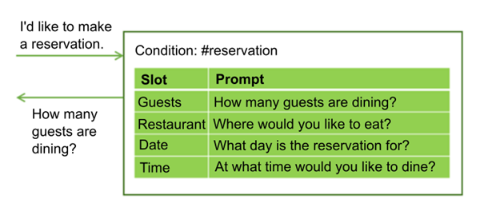
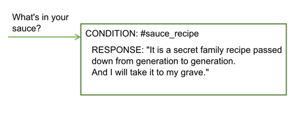

---

copyright:
  years: 2015, 2019
lastupdated: "2019-02-28"

subcollection: assistant

---

{:shortdesc: .shortdesc}
{:new_window: target="_blank"}
{:deprecated: .deprecated}
{:important: .important}
{:note: .note}
{:tip: .tip}
{:pre: .pre}
{:codeblock: .codeblock}
{:screen: .screen}
{:javascript: .ph data-hd-programlang='javascript'}
{:java: .ph data-hd-programlang='java'}
{:python: .ph data-hd-programlang='python'}
{:swift: .ph data-hd-programlang='swift'}
{:table: .aria-labeledby="caption"}

# 使用空位收集資訊
{: #dialog-slots}

在對話節點中新增空位，以向該節點內的使用者收集多個資訊片段。空位會依使用者速度來收集資訊。系統會儲存使用者事先提供的詳細資料，而且服務只會要求他們未提供的詳細資料。

<iframe class="embed-responsive-item" id="youtubeplayer" title="新增空位至節點" type="text/html" width="640" height="390" src="https://www.youtube.com/embed/kMLyKfmO9wI?rel=0" frameborder="0" webkitallowfullscreen mozallowfullscreen allowfullscreen> </iframe>

## 為什麼新增空位？
{: #dialog-slots-why}

使用空位可取得您精確回應使用者之前所需的資訊。例如，如果使用者詢問作業時數，但時數會依商店位置而不同，所以您可以在回答之前詢問他們打算造訪哪個商店位置的相關後續問題。然後，您可以新增將所提供位置資訊列入考量的回應條件。


空位可協助您收集完成使用者複雜作業所需的多個資訊片段（例如預約晚餐）。



使用者可以一次提供多個空位的值。例如，輸入可能包含此資訊：`There will be 6 of us dining at 7 PM.`。此輸入包含兩個遺漏的必要值：訪客數及預約時間。服務可辨識並儲存這兩個項目，各自在其對應空位中。然後，服務會顯示與下一個空位相關聯的提示。


空位可讓服務回答後續問題，而不需要重新建立使用者目標。例如，使用者可能會詢問天氣預報，然後詢問另一個位置或不同日期之天氣的相關後續問題。如果您在空位中儲存必要的預報變數（例如位置及日期），則在使用者使用新變數值詢問後續問題時，可以將空位值改寫為提供的新值，並提供反映新資訊的回應。（如需如何從對話呼叫外部服務的相關資訊，請參閱[從對話節點進行程式化呼叫](/docs/services/assistant?topic=assistant-dialog-actions)。）


使用空位會在使用者與服務之間產生更自然的對話流程，而且與嘗試使用許多個別節點來收集資訊比起來，可讓您更輕鬆地進行管理。

## 新增空位
{: #dialog-slots-add}

1.  識別您要收集的資訊單元。例如，若要為某人訂購披薩，您可能要收集下列資訊：

    - 送餐時間
    - 大小

1.  如果您尚未開始建立對話，請遵循[建立對話](/docs/services/assistant?topic=assistant-dialog-build)中的指示來建立對話。

1.  從對話節點編輯視圖中，按一下**自訂**，然後按一下**空位**旁的切換開關予以**開啟**。

    如需**提示輸入所有資訊**勾選框的相關資訊，請參閱[一次詢問所有資訊](#dialog-slots-prompt-for-everything)。

1.  **新增每一個必要資訊單元的空位**。針對每一個空位，指定下列詳細資料：

    - **檢查**：識別您要從使用者對空位提示的回應中擷取的資訊類型。在大部分情況下，您可以檢查實體值。實際上，所顯示的條件建置器會建議您可以檢查的實體。不過，您也可以檢查目的；只需要將目的名稱鍵入欄位中即可。您可以在這裡使用 AND 及 OR 運算子，來定義更複雜的條件。

      *檢查* 值最開始是用作條件，但之後會變成您在*另存為* 欄位中所命名的環境定義變數值。它同時指定**要檢查哪些項目**以及**要儲存哪些內容**。如果您要變更值的儲存方式，請將重新格式化值的表示式新增至*檢查* 欄位。{: important}

      例如，如果實體是型樣實體（例如 `@email`），則在新增實體名稱之後，請在它後面加上 `.literal`。新增 `.literal`，表示您想要擷取使用者所輸入的確切文字，並根據型樣將其識別為電子郵件位址。

      在某些情況下，您可能想要使用表示式來擷取值，但不想將表示式套用至儲存的內容。在這類情況下，您可以使用*檢查* 欄位中的某個值來擷取值，然後開啟 JSON 編輯器來變更環境定義變數的值，因此會儲存其他內容。如需範例，請參閱[正確地處理零](/docs/services/assistant?topic=assistant-tutorial-slots-complex#tutorial-slots-complex-recognize-zero)。

      結束 JSON 編輯器時，您在 JSON 編輯器中對空位的環境定義變數值所做的任何編輯，都不會反映在**檢查**欄位中。而且，在使用 JSON 編輯器來編輯值之後，如果您在任何時間按一下**檢查**欄位，使其成為焦點，則會遺失您所做的變更。{: important}

      避免在*檢查* 欄位中檢查環境定義變數值。因為您檢查的值也是所儲存的值，因此，在條件中使用環境定義變數會導致非預期的行為。

    - **另存為**：提供環境定義變數的名稱，以在其中儲存使用者對空位提示的回應中的感興趣值。

       請不要在對話中重複使用在別處使用的環境定義變數。如果環境定義變數已有值，則不會顯示空位的提示。只有在空位的環境定義變數是空值時，才會顯示該空位的提示。

    - **提示**：撰寫陳述式，以向使用者取得您需要的資訊片段。在顯示此提示之後，交談會暫停，而且服務會等待使用者回應。

    - 如果您要根據使用者是否提供回應起始空位提示所需的資訊來顯示不同的後續陳述，則可以編輯空位（按一下**編輯空位**  圖示），然後定義後續陳述：

      - **找到**：在使用者提供預期的資訊之後顯示。

      - **找不到**：如果不瞭解使用者所提供的資訊，或未以預期的格式提供資訊，則會顯示。如果已順利填入空位，或空位處理程式瞭解並處理使用者輸入，則永遠不會顯示此陳述。

      如需如何定義「找到」及「找不到」回應之條件及關聯動作的相關資訊，請參閱[新增「找到」及「找不到」回應的條件](#dialog-slots-handler-next-steps)。

    此表格顯示用於協助使用者訂披薩之節點的範例空位值，方法是收集披薩大小及送餐時間這兩部分的資訊。

    <table>
    <caption>訂披薩的範例空位</caption>
    <tr>
      <th>檢查</th>
      <th>另存為</th>
      <th>提示</th>
      <th>找到時的後續</th>
      <th>找不到時的後續</th>
    </tr>
    <tr>
      <td>@size</td>
      <td>$size</td>
      <td>What size pizza would you like?</td>
      <td>$size it is.</td>
      <td>What size did you want? We have small, medium, and large.</td>
    </tr>
    <tr>
      <td>@sys-time</td>
      <td>$time</td>
      <td>When do you need the pizza by?</td>
      <td>For delivery by $time.</td>
      <td>What time did you want it delivered? We need at least a half hour to prepare it.</td>
    </tr>
    </table>

1.  **將空位設為選用，或在特定情況下予以停用**。您可以使用下列方式選擇性地配置空位：

    - **選用**：若要將空位設為選用，請新增沒有提示的空位。服務不會向使用者詢問這項資訊，但會在使用者輸入中尋找資訊，並儲存使用者所提供的值。例如，您可以新增一個空位，用來在使用者指定任何飲食限制資訊時擷取這些資訊。不過，您不會想要詢問所有使用者的飲食資訊，因為大部分情況都不相關。

       <table>
       <caption>選用空位</caption>
       <tr>
          <th>資訊</th>
          <th>檢查</th>
          <th>另存為</th>
       </tr>
       <tr>
          <td>Wheat restriction</td>
          <td>@dietary</td>
          <td>$dietary</td>
      </tr>
      </table>

          如果您將空位設為選用，則只有在使用有意義的文字表達時，才會參照其在節點層次回應文字中的環境定義變數，即使未提供空位的任何值。例如，您可以使用 `I am ordering a $size $dietary pizza for delivery at $time.` 這類摘要陳述。不論是否提供 `gluten-free` 或 `dairy-free` 這類飲食限制資訊，產生的文字都有其意義。結果是 `I am ordering a large gluten-free pizza for delivery at 3:00PM.`，或者是 `I am ordering a large pizza for delivery at 3:00PM.`。
      {: tip}

    - **條件式**：如果您只要在特定情況下才啟用空位，則可以在其中新增條件。例如，如果空位 1 詢問會議開始時間、空位 2 擷取會議持續時間，而空位 3 擷取結束時間，則只有在未提供空位 2 的值時，才可能要啟用空位 3（並詢問會議結束時間）。若要將空位設為條件式，請編輯空位，然後從**其他**  功能表中選取**啟用條件**。請定義必須符合才能啟用空位的條件。

      您可以設定先前空位中環境定義變數值的條件，因為空位的列出順序就是其評估順序。不過，在評估此空位時，只有您可確認的空位環境定義變數的條件才會包含值。例如，先前的空位必須是必要的空位。{: tip}
1.  **追蹤使用者**。
    您可以選擇性地定義空位處理程式，以提供使用者可能在互動期間詢問偏離節點用途之問題的回應。

    例如，使用者可能會詢問紅醬食譜或食材取得位置。若要處理這類離題問題，請按一下**管理處理程式**鏈結，然後新增每一個預期問題的條件及回應。

    

    回應離題問題之後，會顯示與現行空位相關聯的提示。

    在顯示節點層次回應之前，如果使用者所提供的輸入在對話節點流程期間的任何時間符合空位處理程式條件，則會觸發此條件。請參閱[處理結束處理程序的要求](#dialog-slots-node-level-handler)，以取得使用空位處理程式的其他方法。
1.  **新增節點層次回應**。
    除非已填入所有必要空位，否則不會執行節點層次回應。您可以新增回應，以彙總所收集的資訊。例如，`A $size pizza is scheduled for delivery at $time. Enjoy!`

    如果您要根據特定條件來定義不同的回應，請按一下**自訂**，然後按一下**多個回應**切換開關予以**開啟**。如需條件式回應的相關資訊，請參閱[條件式回應](/docs/services/assistant?topic=assistant-dialog-overview#dialog-overview-multiple)。
1.  **新增用於重設空位環境定義變數的邏輯**。
    當您向使用者收集每個空位的回答時，會將它們儲存在環境定義變數。您可以使用環境定義變數，將資訊傳遞給另一個節點或是傳遞給應用程式或外部服務，以供使用。不過，傳遞資訊之後，您必須將環境定義變數設為空值來重設節點，使其可重新開始收集資訊。您無法將現行節點內的環境定義變數設為空值，因為在填入必要空位之前，服務不會結束節點。相反地，請考慮使用下列其中一種方法：

    - 新增將變數設為空值之外部應用程式的處理。
    - 新增將變數設為空值的子節點。
    - 插入將變數設為空值的母節點，然後跳至含有空位的節點。

試試看！請遵循逐步[指導教學](/docs/services/assistant?topic=assistant-tutorial-slots)。

## 空位用法提示
{: #dialog-slots-tips}

下列空位內容可協助您在空位環境定義變數中檢查及設定值。

|內容內容               |說明        |
|------------------------|-------------|
|`all_slots_filled`     |只有在已經設定節點中所有空位的所有環境定義變數時，才評估為 true。如需用法範例，請參閱[防止在不需要時顯示「找到」回應](#dialog-slots-stifle-found-responses)。|
|`event.current_value`  |此空位之環境定義變數的現行值。如需此內容及 event.previous_value 內容的用法範例，請參閱[取代空位環境定義變數值](#dialog-slots-found-handler-event-properties)。|
|`event.previous_value` |此空位之環境定義變數的先前值。|
|`has_skipped_slots`    |已處理配置可跳過空位之下一步選項的任何空位或空位處理程式時為 true。如需空位處理程式之下一步選項的相關資訊，請參閱[新增「找到」及「找不到」回應的條件](#slot-handler-next-steps)，如需空位處理程式之下一步選項的相關資訊，請參閱[處理結束處理程序的要求](#dialog-slots-node-level-handler)。|
|`slot_in_focus`        |只強制將空位條件套用至現行空位。如需詳細資料，請參閱[取得確認](#dialog-slots-get-confirmation)。|
{: caption="空位內容" caption-side="top"}

請考慮使用這些方式來處理一般作業。

- [一次詢問所有資訊](#dialog-slots-prompt-for-everything)
- [擷取多個值](#dialog-slots-multiple-entity-values)
- [重新格式化值](#dialog-slots-reformat-values)
- [處理零](#dialog-slots-zero)
- [取得確認](#dialog-slots-get-confirmation)
- [取代空位環境定義變數值](#dialog-slots-found-handler-event-properties)
- [避免數字混淆](#dialog-slots-avoid-number-confusion)
- [新增「找到」及「找不到」回應的條件](#dialog-slots-handler-next-steps)
- [在多次失敗的嘗試之後繼續](#dialog-slots-stop-trying-after-3)
- [防止在不需要時顯示「找到」回應](#dialog-slots-stifle-found-responses)
- [處理結束處理程序的要求](#dialog-slots-node-level-handler)

### 一次詢問所有資訊
{: #dialog-slots-prompt-for-everything}

包含整個節點的起始提示，以清楚告知使用者您希望他們提供的資訊單元。顯示此提示會先讓使用者有機會一次提供所有詳細資料，而不需要等待提示一次輸入一個資訊片段。

例如，因為客戶想要訂披薩而觸發節點時，您可以回應初步提示 `I can take your pizza order. Tell me what size pizza you want and the time that you want it delivered.`。

只要使用者在起始要求中提供這項資訊的一個片段，就不會顯示提示。例如，起始輸入可能是 `I want to order a large pizza.`。服務分析輸入時，會將 `large` 辨識為披薩大小，並將提供的值填入**大小**空位。因為已填入其中一個空位，所以它不會顯示起始提示，以避免再次詢問披薩大小資訊。反之，會針對遺漏資訊的任何其餘空位顯示提示。

從您已啟用「空位」特性的「自訂」窗格中，選取**提示輸入所有資訊**勾選框，以啟用起始提示。此設定會將**如果未預先填入任何空位，請先詢問此資訊**欄位新增至節點，您可以在其中指定用於提示使用者輸入所有資訊的文字。

### 擷取多個值
{: #dialog-slots-multiple-entity-values}

您可以要求項目清單，並將它們儲存在一個空位。

例如，您可能想要詢問使用者的披薩是否要加上配料。若要這麼做，請定義一個實體 (@toppings) 及其接受值（pepperoni、cheese、mushroom 等）。請新增向使用者詢問配料的空位。請使用實體類型的 values 內容來擷取多個值（如果已提供的話）。

<table>
<caption>多值空位</caption>
<tr>
  <th>檢查</th>
  <th>另存為</th>
  <th>提示</th>
  <th>找到時的後續</th>
  <th>找不到時的後續</th>
</tr>
<tr>
  <td>@toppings.values</td>
  <td>$toppings</td>
  <td>Any toppings on that?</td>
  <td>Great addition.</td>
  <td>What toppings would you like? We offer ...</td>
</tr>
</table>

若稍後要參照使用者指定的配料，請使用 `<? $entity-name.join(',') ?>` 語法列出 toppings 陣列中的每一個項目，並使用逗點區隔值。例如，`I am ordering you a $size pizza with <? $toppings.join(',') ?> for delivery by $time.`

### 重新格式化值
{: #dialog-slots-reformat-values}

因為您會向使用者詢問資訊，並且需要參照他們在回應中的輸入，所以請考慮重新格式化這些值，以較友善的格式顯示這些值。

例如，以 `hh:mm:ss` 格式儲存時間值。您可以在儲存時間值時對該空位使用 JSON 編輯器來重新格式化時間值，以改為使用 `hour:minutes AM/PM` 格式：

```json
{
  "context":{
    "time": "<? @sys-time.reformatDateTime('h:mm a') ?>"
  }
}
```
{: codeblock}

如需其他重新格式化構想，請參閱[表示式語言方法](/docs/services/assistant?topic=assistant-dialog-methods)。

### 處理零
{: #dialog-slots-zero}

在空位條件中使用 `@sys-number`，有助於擷取使用者在其輸入中指定的任何數值。不過，當使用者指定數字零 (0) 時，它不會如預期般進行作業。不將零視為有效數值，此條件將它評估為 false，而服務會再次提示使用者輸入數值。若要防止此行為，請在空位條件中檢查 `@sys-number` 或 `@sys-number:0`。

若要確保檢查數值提及項目的空位條件正確地處理零，請完成下列步驟：

1.  新增 `@sys-number || @sys-number:0` 到空位條件欄位，然後提供環境定義變數名稱和文字提示。
1.  按一下**編輯回應**  圖示。
1.  按一下**其他**  功能表，然後選取**開啟 JSON 編輯器**。
1.  更新現在具有以下語法的環境定義變數：`"number":"@sys-number || @sys-number:0"`，僅指定 `@sys-number`。

    ```json
    {
          "context":{
      "number":"@sys-number"
      }
    }
    ```
    {: codeblock}

如果您不想接受零作為數值，則可以針對空位新增條件式回應以檢查零，並告知使用者必須提供大於零的數字。但是，在提供作為輸入時，空位條件能夠辨識零是非常重要的。

### 取得確認
{: #dialog-slots-get-confirmation}

在其他空位後面新增一個空位，要求使用者確認您所收集的資訊正確且完整。這個空位可以尋找符合 #yes 或 #no 目的的回應。

<table>
<caption>確認空位</caption>
<tr>
  <th>檢查</th>
  <th>另存為</th>
  <th>提示</th>
  <th>找到時的後續</th>
  <th>找不到時的後續</th>
</tr>
<tr>
  <td>#yes || #no</td>
  <td>$confirmation</td>
  <td>I'm going to order you a `$size` pizza for delivery at `$time`. Should I go ahead?</td>
  <td>Your pizza is on its way!</td>
  <td>see *Complex response*</td>
</tr>
</table>

**複雜回應**：因為使用者可能在對話期間的其他時間包含肯定或負面陳述 (*Oh yes, we want the pizza delivered at 5pm*) 或 (*no guests tonight, let's make it a small*)，所以請使用 `slot_in_focus` 內容，在空位條件中清楚指出您只要尋找這個空位之提示的 Yes 或 No 回應。

```json
(#yes || #no) && slot_in_focus
```
{: codeblock}

`slot_in_focus` 內容一律會評估為布林值（true 或 false）。只需要將它包含在您要有布林結果的條件中。例如，不要在空位條件中使用它來檢查實體類型，然後儲存實體值。
{: tip}

在**找不到**提示中，釐清您預期使用者提供 Yes 或 No 的答案。

```json
{
  "output":{
    "text": {
      "values": [
        "Respond with Yes to indicate that you want the order to
         be placed as-is, or No to indicate that you do not."
      ]
    }
  }
}
```
{: codeblock}

在**找到**提示中，新增條件以檢查 No 回應 (#no)。找到時，請重新詢問所有資訊，並重設先前儲存的環境定義變數。

```json
{
  "conditions": "#no",
  "output":{
    "text": {
      "values": [
        "Let's try this again. Tell me what size pizza you want and the time..."
      ]
    }
  },
  "context":{
    "size": null,
    "time": null,
    "confirmation": null
  }
}
```
{: codeblock}

### 取代空位環境定義變數值
{: #dialog-slots-found-handler-event-properties}

在使用者結束含空位的節點之前的任何時間，如果使用者提供新的空位值，則會將新值儲存在空位環境定義變數，並取代先前指定的值。您的對話可以明確地確認這項取代是使用針對「找到」條件所定義的特殊內容所進行：

- `event.previous_value`：此空位之環境定義變數的先前值。
- `event.current_value`：此空位之環境定義變數的現行值。

例如，您的對話詢問目的地城市來進行航班預定。使用者提供 `Paris`。您會將 $destination 空位環境定義變數設為 *Paris*。然後，使用者說：`Oh wait. I want to fly to Madrid instead.`。如果您如下設定「找到」條件，則對話可以得體的處理這類型的變更。

使用者回應時，如果找到 @destination：

```json
Condition: (event.previous_value != null) &&
           (event.previous_value != event.current_value)
    Response: Ok, updating destination from
    <? event.previous_value ?> to <? event.current_value ?>.
Response: Ok, destination is $destination.
```
{: codeblock}

此空位配置可讓您的對話反應使用者的目的地變更，方法是表明 `Ok, updating the destination from Paris to Madrid.`

### 避免數字混淆
{: #dialog-slots-avoid-number-confusion}

使用者提供的部分值可以識別為多個實體類型。

例如，您可能有兩個空位來儲存相同類型的值（例如到達日期及出發日期）。請建置空位條件的邏輯，來區分這類不同的類似值。

此外，服務可以在單一使用者輸入中辨識到多個實體類型。例如，使用者提供貨幣時，會將貨幣同時辨識為 @sys-currency 及 @sys-number 實體類型。請在*試用* 窗格中執行一些測試，以瞭解系統如何解譯不同的使用者輸入，以及建置條件的邏輯，避免可能的錯誤解譯。

在空位特性特有的邏輯中，於單一使用者輸入中辨識到兩個系統實體時，會使用跨距較大的系統實體。例如，即使 {{site.data.keyword.conversationshort}} 服務在文字中同時辨識到 @sys-date (05022017) 及 @sys-number (2) 實體，但如果使用者輸入 *May 2*，則只會登錄跨距較大的系統實體 (@sys-date)，並將其套用至空位。
{: tip}

對於在使用者輸入中辨識到的每個實體，只能填入一個空位。因此，如果您有兩個空位正在尋找類似的值，它們的放置位置為，擷取較長字串的空位在擷取較短字串的空位上方。例如，如果某個空位使用類似 `GR1234` 的語法來擷取產品 ID (`@id`)，而另一個空位擷取數值 (`@number`)，例如 `1234`，則將擷取 ID 的空位放在擷取數值的空位上方。否則，當使用者輸入包含 ID（例如 `BR3344`）時，`@number` 空位可能將它宣告為數值參照，並使用 `3344` 填入 `$number` 環境定義變數。不過，該值更可能是產品 ID 參照，其應作為 `BR3344`，儲存在 `@id` 空位的 `$id` 環境定義變數中。

### 新增「找到」及「找不到」回應的條件
{: #dialog-slots-handler-next-steps}

針對每一個空位，您可以使用具有關聯動作的條件式回應，協助您向使用者擷取所需的資訊。若要這樣做，請遵循下列步驟：

1.  針對要新增條件式「找到」及「找不到」回應的空位，按一下**編輯空位**  圖示。
1.  從**其他**  功能表中，選取**啟用條件式回應**。
1.  輸入在符合條件時要顯示的條件及回應。

    **「找到」範例**：空位預期是晚餐預約時間。您可以在*檢查* 欄位中使用 @sys-time 進行擷取。例如，若要避免儲存無效的時間，您可以新增條件式回應，以檢查提供的時間是否比餐廳最後入座時間還要早。`@sys-time.after('21:00:00')` 對應的回應可能如下：*Our last seating is at 9PM.*

    **「找不到」範例**：空位預期是 @location 實體，而此實體接受連鎖餐廳有餐廳的一組特定城市。「找不到」條件可能會在使用者指定有效的城市但其中一個連鎖餐廳沒有場地時檢查 @sys-location。對應的回應可能是 *We have no restaurants in that location.*

1.  如果您要自訂在符合條件時接下來會發生什麼情況，然後按一下**編輯回應**  圖示。

    針對「找到」回應（在使用者所提供的值符合「檢查」欄位中所指定的值類型時顯示），您可以選擇下列其中一個動作來執行下一步：

      - **繼續（預設值）**：指示服務在顯示回應之後移至下一個空位。在關聯的回應中，確保瞭解使用者的輸入。例如，*Ok. You want to schedule it for $date.*
      - **清除空位並重新提示**：如果您要在*檢查* 欄位中使用可挑選錯誤值的實體，請新增可捕捉任何可能錯誤解譯的條件，以及使用此動作來清除現行空位值並提示輸入正確值。
      - **跳到回應**：符合您定義的條件時，如果不再需要於此節點上填入任何其餘空位，請選擇此動作來跳過其餘空位並接著直接移至節點層次回應。例如，您可以新增條件，以檢查使用者年齡是否小於 16 歲。如果是，您可能會跳過詢問有關使用者駕駛記錄問題的其餘空位。

    針對「找不到」回應（在使用者未提供有效值時顯示），您可以選擇下列其中一個動作來執行：

      - **等待使用者輸入（預設值）**：暫停交談，而且服務會等待使用者回應。在最簡單的情況下，您在這裡指定的文字可以更明確地陳述您需要使用者提供的資訊類型。如果您搭配使用此動作與條件式回應，則請務必使用條件式回應，改為清楚地陳述使用者答案的錯誤，以及預期他們提供的資訊。
      - **重新提示**：在顯示「找不到」回應之後，服務會重複空位重新提示，並等待使用者回應。如果您搭配使用此動作與條件式回應，則回應只會說明使用者所提供答案的錯誤。它不需要重申您要使用者提供的資訊類型，因為空位提示一般會予以說明。

        如果您選擇此選項，則請考慮至少新增一個「找不到」回應變異，這樣使用者就不會多次看到完全相同的文字。請在這時使用不同的文字向使用者說明您需要他們提供的資訊及其格式。
        {: tip}

      - **跳過此空位**：指示服務停止嘗試填入現行空位，而是移至下一個空位的提示。此選項適用於您要將空位設為選用並顯示要求使用者提供資訊之提示的空位。例如，您的 @seating 實體可能會擷取餐廳入座喜好設定（例如 *outside*、*near the fireplace*、*private* 等等）。您可以新增空位，使用 *Do you have any seating preferences?* 提示使用者，並檢查 `@seating.values`。如果提供有效的回應，則會將喜好設定資訊儲存至 `$seating_preferences`。不過，透過選擇此動作作為「找不到」回應的下一步，如果使用者未提供此空位的有效值，則您會指示服務停止嘗試填入該空位。
      - **跳到回應**：符合您定義的條件時，如果不再需要於此節點上填入任何其餘空位，請選擇此動作來跳過其餘空位並接著直接移至節點層次回應。例如，在擷取單程航班資訊之後，如果空位提示為 *Are you buying round trip tickets?*，則「找不到」條件可以檢查 #No。如果找到 #No，請改為使用此選項來跳過可擷取回程航班相關資訊的其餘空位，並直接移至節點層次回應。

    按**上一步**，以回到空位的編輯視圖。
1.  若要新增另一個條件式回應，請按一下**新增回應**，然後輸入要在符合條件時顯示的條件及回應。

    請務必至少新增一個不管怎樣都會顯示的回應。您可以讓此 catchall 回應的條件欄位保留空白。此服務會自動將 `true` 特殊條件移入空白條件欄位中。

1.  按一下**儲存**以儲存變更、關閉空位的編輯視圖，並回到節點的編輯視圖。

### 在多次失敗的嘗試之後繼續
{: #dialog-slots-stop-trying-after-3}

如果使用者在數次嘗試之後還是無法正確地回答，則您可以使用「找不到」條件式回應，提供方法讓使用者結束空位。在 catchall 回應中，開啟 JSON 編輯器，以新增將記錄「找不到」回應傳回次數的計數器環境定義變數。在先前的節點中，請務必將起始計數器環境定義變數值設為 0。

在此範例中，服務會詢問披薩大小。它先讓使用者有 3 次錯誤回答問題的機會，再為使用者將大小 (medium) 套用至變數。（您可以包含確認空位，在要求使用者確認訂單資訊時，他們都可以在其中更正大小。）

檢查：@size
另存為：$size
Not found catchall 條件：

```json
{
  "output": {
    "text": {
      "values": [
        "What size did you want? We have small, medium, and large."],
      "selection_policy": "sequential"
    }
  },
"context": {
   "counter": "<? context['counter'] + 1 ?>"
  }
}
```
{: codeblock}

若要在 3 次嘗試之後以不同方式回應，請新增另一個「找不到」條件，如下所示：
```json
{
  "conditions": "$counter > 1",
  "output": {
    "text": {
      "values": [
        "We will bring you a size medium pizza."
      ]
    }
  },
"context": {
   "size": "medium"
  }
  ```
  {: codeblock}

這個 Not found 條件比 Not found catchall 條件更精確，其預設為 `true`。因此，您必須移動此回應，讓它在原始條件式回應之前，或永遠不予觸發。請選取條件式回應，並使用上移鍵將它上移。

### 防止在不需要時顯示「找到」回應
{: #dialog-slots-stifle-found-responses}

如果您指定多個空位的「找到」回應，則使用者一次提供多個空位的值時，就會顯示至少一個空位的「找到」回應。您可能想要傳回所有空位的「找到」回應，或根本不傳回。

若要防止顯示「找到」回應，您可以對每一個「找到」回應執行下列其中一個動作：

- 新增回應的條件，以在填入特定空位時防止顯示回應。例如，您可以新增 `!($size && $time)` 這類條件，防止在同時提供 $size 及 $time 環境定義變數時顯示回應。
- 新增回應的 `!all_slots_filled` 條件。此設定會在填入所有空位時防止顯示回應。如果您要包括確認空位，請不要使用此方式。確認空位也是一個空位，而且您一般會防止在填入確認空位本身之前顯示「找到」回應。

### 處理結束處理程序的要求
{: #dialog-slots-node-level-handler}

新增至少一個空位處理程式，以在使用者想要結束節點時辨識它。

例如，在收集資訊來預約寵物美容的節點中，您可以新增條件設為 #cancel 目的的處理程式，其會辨識這類話語：<q>Forget it. I changed my mind.</q>

1.  在處理程式的 JSON 編輯器中，填入所有含虛擬值的空位環境定義變數，以防止節點繼續詢問任何遺漏的項目。在處理程式回應中，新增 `Ok, we'll stop there. No appointment will be scheduled.` 這類訊息。
1.  從下列選項中，選擇您希望服務接著採取的動作：

    - **重新提示（預設值）**：顯示使用者在詢問離題問題之前所使用之空位的提示。
    - **跳過現行空位**：顯示與使用者在詢問離題問題之前所使用之空位之後的空位相關聯的提示。而且服務不會再進一步嘗試填入已跳過的空位。
    - **跳到回應**：跳過所有其餘空位的提示，包括使用者在詢問離題問題之前所使用的空位。

1.  在節點層次回應中，新增條件以檢查其中一個空位環境定義變數中的虛擬值。如果找到，則顯示 `If you decide to make an appointment later, I'm here to help.` 這類最終訊息。如果找不到，它會顯示節點的標準摘要訊息，例如 `I am making a grooming appointment for your $animal at $time on $date.`。

下列 JSON 範例定義披薩範例的處理程式。請注意，如前所述，環境定義變數全部都會設為虛擬值。實際上，`$size` 環境定義變數會設為 `dummy`。此 $size 值會觸發節點層次回應，以顯示適當的訊息並結束空位節點。

```json
{
"conditions": "#cancel",
 "output": {
   "text": {
     "values": [
       "Ok, we'll stop there. No pizza delivery will be scheduled."
     ],
    "selection_policy": "sequential"
    }
  },
"context": {
   "time": "12:00:00",
   "size": "dummy",
   "confirmation":"true"
}
}
```
{: codeblock}

**重要事項**：請考慮在此條件之前評估的條件中所用的邏輯，以建置不同的條件。收到使用者輸入時，會依下列順序評估條件：

- 現行空位層次「找到」條件。
- 依列出順序的空位處理程式。
- 如果容許脫離，則會檢查根層次節點條件的相符項（但對話樹狀結構根目錄或根資料夾中最後的 `anything else` 節點除外）。
- 現行空位層次「找不到」條件。
- 最後的 `anything else` 節點條件。

將一律評估為 true 的條件（例如 `true` 或 `anything_else` 特殊條件）新增為空位處理程式時，請小心。根據空位，如果空位處理程式評估為 true，則會完全跳過「找不到」條件。因此，使用一律評估為 true 的空位處理程式，可有效地防止評估每個空位的「找不到」條件。
{: tip}

例如，您可以為所有動物美容，但貓除外。在「動物」空位中，您可能很想使用下列空位條件，防止將 `cat` 儲存在「動物」空位：

```json
Check for @animal && !@animal:cat, then save it as $animal.
```
{: codeblock}

而且，若要讓使用者知道您不接受貓，您可以在「動物」空位的「找不到」條件中指定下列值：

```json
If @animal:cat then, "I'm sorry. We do not groom cats."
```
{: codeblock}

邏輯上，如果您也定義 #exit 空位處理程式，則在指定條件評估順序時，可能永遠不會觸發這個「找不到」條件。相反地，您可以使用此空位條件：

```json
Check for @animal, then save it as $animal.
```
{: codeblock}

而且，若要處理可能的 `cat` 回應，請將此值新增至「找到」條件：

```json
If @animal:cat then, "I'm sorry. We do not groom cats."
```
{: codeblock}

在「找到」條件的 JSON 編輯器中，重設 $animal 環境定義變數值，因為它目前設為 cat，但不應該如此設定。

```json
{
  "output":{
    "text": {
      "values": [
        "I'm sorry. We do not groom cats."
      ]
    }
  },
  "context":{
    "animal": null
  }
}
```
{: codeblock}

## 空位範例
{: #dialog-slots-examples}

若要存取用於實作不同常用空位使用情境的 JSON 檔案，請跳至 GitHub 中的社群[交談儲存庫 ](https://github.com/watson-developer-cloud/community/tree/master/watson-assistant){: new_window}。

若要探索範例，請下載其中一個範例 JSON 檔案，然後將它匯入為新的對話技能。在「對話」標籤中，您可以檢閱對話節點，以查看如何實作空位來處理不同的使用案例。
