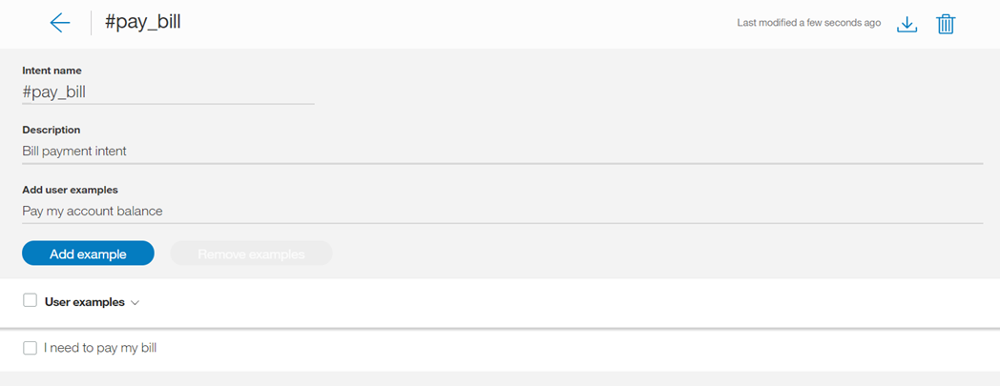
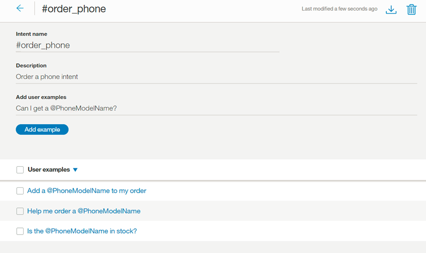

---

copyright:
  years: 2015, 2019
lastupdated: "2019-02-28"

subcollection: assistant

---

{:shortdesc: .shortdesc}
{:new_window: target="_blank"}
{:deprecated: .deprecated}
{:important: .important}
{:note: .note}
{:tip: .tip}
{:pre: .pre}
{:codeblock: .codeblock}
{:screen: .screen}
{:javascript: .ph data-hd-programlang='javascript'}
{:java: .ph data-hd-programlang='java'}
{:python: .ph data-hd-programlang='python'}
{:swift: .ph data-hd-programlang='swift'}

# 定義目的
{: #intents}

***目的*** 是以客戶輸入表示的用途或目標，例如回答問題或處理帳單付款。藉由辨識以客戶輸入表示的目的，{{site.data.keyword.conversationshort}} 服務可以選擇正確的對話流程來回應它。
{: shortdesc}

<iframe class="embed-responsive-item" id="youtubeplayer" title="使用目的" type="text/html" width="640" height="390" src="https://www.youtube.com/embed/OPdOCUPGMIQ" frameborder="0" webkitallowfullscreen mozallowfullscreen allowfullscreen> </iframe>

## 目的建立概觀
{: #intents-described}

- 規劃應用程式的目的。

  請考量客戶可能要執行的作業，以及您要應用程式能夠自行處理的內容。例如，您可能想要應用程式協助客戶進行購買。如果是這樣，您可以新增 `#buy_something` 目的。（目的名稱前面附加了 `#`，有助於將它明確地識別為目的。）

- 教導 Watson 您的目的。

  一旦決定要應用程式為您的客戶處理哪些商業要求之後，您必須教導 Watson 這些要求的相關資訊。對於每個商業目標（例如 `#buy_something`），您必須至少提供 10 個話語範例，您的客戶一般會使用該話語來指出他們的目標。例如，`I want to make a purchase.`。
  
  理想情況下，尋找可從現有商業程序中擷取的實際使用者話語範例。使用者範例應針對您的特定業務進行自訂。例如，如果您是保險公司，您的使用者範例可能類似於：`I want to buy a new XYZ insurance plan.`。
  
  服務會使用您提供的範例來建置機器學習模型，其可辨識相同及相似類型的話語，然後將該模型對映至適當的目的。

從幾個目的開始，然後在您反覆擴展應用程式範圍時測試這些目的。

## 建立目的
{: #intents-create-task}

使用 {{site.data.keyword.conversationshort}} 工具來建立目的。

1.  在 {{site.data.keyword.conversationshort}} 工具中，開啟您的對話技能。技能會在**目的**頁面中開啟。

1.  選取**建立新的項目**。

1.  在**目的名稱**欄位中，鍵入目的的名稱。
    - 目的名稱可以包含字母（Unicode 形式）、數字、底線、連字號及句點。
    - 名稱不得包含 `..` 或任何只有句點的其他字串。
    - 目的名稱不得包含空格，且不得超過 128 個字元。下列是目的名稱的範例：
        - `#weather_conditions`
        - `#pay_bill`
        - `#escalate_to_agent`

    工具會自動在目的名稱中包括 `#` 字元，因此您不需要新增。
    {: tip}

    在**說明**欄位中，新增目的說明。

1.  選取**建立目的**，以儲存目的名稱。

    

1.  接下來，在**新增使用者範例**欄位中，鍵入目的的使用者範例文字。範例可以是任何字串，長度最多為 1024 個字元。下列是 `#pay_bill` 目的範例：
    - `I need to pay my bill.`
    - `Pay my account balance`
    - `make a payment`

    針對客戶提出的實際支援要求，若要新增從中發掘出的使用者範例，請參閱[從日誌檔新增範例](#intents-intent-recommendations)。

    若要瞭解在使用者範例中併入實體參考資料的影響，請參閱[如何處理實體參考資料](#intents-entity-references)。{: tip}

    當應用程式與服務互動時，可以在 URL 中公開目的名稱及範例文字。請不要在這些構件中包含機密或個人資訊。{: important}

1.  按一下**新增範例**，以儲存範例。

1.  重複相同的處理程序來新增其他範例。您可以在兩個範例之間進行定位。針對每一個目的，至少提供 5 個範例。您提供的範例越多，應用程式就可以越精確。

    若要取得建立使用者範例的協助，請參閱[取得目的使用者範例建議](/docs/services/assistant?topic=assistant-intent-recommendations#intent-recommendations-get-example-recommendations)。

1.  當您完成新增範例時，請按一下 ，以完成建立目的。

系統會開始根據您新增的目的及使用者範例自行訓練。

## 如何處理實體參考資料
{: #intents-entity-references}

當您在使用者範例中包含實體提及項目時，機器學習模型會在以下情境中以不同方式使用資訊：

- [參照目的範例中的實體值及同義字](#intents-related-entities)
- [已註釋的提及項目](#intents-annotated-mentions)
- [直接參照目的範例中的實體名稱](#intents-entity-as-example)

### 參照目的範例中的實體值及同義字
{: #intents-related-entities}

如果您已定義或計劃要定義與此目的相關的實體，請在部分範例中提及實體值或同義字。這麼做有助於建立目的與實體之間的關係。這層關係很薄弱，但會通知模型。



*重要事項*：

  - 目的範例資料應該是一般使用者將提供的具代表性及一般資料。範例可能收集自實際使用者資料或特定領域的專家。具代表性且精確的資料本質十分重要。
  - 訓練及測試資料（僅適用於評估）應該反映目的在實際使用時的分佈。一般而言，較常使用的目的相對會有較多的範例，而且回應涵蓋面較佳。
  - 您可以在範例文字中包含標點符號，只要標點符號是自然地出現。如果您認為部分使用者會以包含標點符號的範例來表示其目的，但部分使用者不會，則請包含兩種版本。一般而言，涵蓋的型樣類型愈多，回應就愈佳。

### 已註釋的提及項目
{: #intents-annotated-mentions}

定義實體時，您可以直接從現有目的使用者範例中註釋實體的提及項目。目的分類模型*不會* 使用目的與實體之間以這種方式識別的關係。不過，當您將提及項目新增至實體時，它也會新增至該實體作為新值。此外，當您將提及項目新增至現有實體值時，也會將它新增至該實體值作為新同義字。目的分類會使用目的使用者範例中的這些字典參照類型，來建立目的與實體之間的微弱參照。


如需環境定義實體的相關資訊，請參閱[新增環境定義實體](/docs/services/assistant?topic=assistant-entities#entities-create-annotation-based)。

### 直接參照目的範例中的實體名稱
{: #intents-entity-as-example}

這是一個進階方法，如果使用的話，必須一致地使用。
{: note}

您可以選擇直接參照目的範例中的實體。例如，假設您的實體稱為 `@PhoneModelName`，其包含值 *Galaxy S8*、*Moto Z2*、*LG G6* 及 *Google Pixel 2*。當您建立目的（例如 `#order_phone`）時，就可以提供訓練資料，如下所示：

- 我可以取得 `@PhoneModelName` 嗎？
- 協助我訂購 `@PhoneModelName`。
- `@PhoneModelName` 有現貨嗎？
- 將 `@PhoneModelName` 新增至我的訂單。



目前，您只能直接參照您所定義的同義字實體（會忽略型樣值）。您不可以使用[系統實體](/docs/services/assistant?topic=assistant-system-entities)。

如果您選擇在訓練資料的*任何位置* 將實體參照為目的範例（例如，`@PhoneModelName`），則會抵消在目的範例的其他位置使用直接參照的值（例如，*Galaxy S8*）。所有目的會接著使用 entity-as-an-intent-example 方法。您不能僅針對特定目的套用此方法。
{: important}

實際上，這表示如果您先前根據直接參照 (*Galaxy S8*) 訓練過大部分目的，而現在只將實體參照 (`@PhoneModelName`) 用於一個目的，則此變更會影響先前的訓練。如果您選擇使用 `@Entity` 參照，則必須將所有先前的直接參照取代為 `@Entity` 參照。

定義一個範例目的，內含已定義 10 個值的 `@Entity`，**不**等於指定該範例目的 10 次。{{site.data.keyword.conversationshort}} 服務不會將那麼多的負擔加到這一個範例目的語法上。

## 測試目的
{: #intents-test}

完成建立新的目的之後，您就可以測試系統來查看它是否如預期辨識您的目的。

1.  在 {{site.data.keyword.conversationshort}} 工具中，按一下  圖示。

1.  在*試用* 窗格中，輸入問題或其他字串，然後按 Enter 鍵，查看已辨識的目的。如果辨識到錯誤的目的，您可以將此文字當作範例新增至正確的目的，來改善模型。

    如果您最近在技能中進行變更，可能會看到一則訊息，指出仍在重新訓練系統。如果您看到此訊息，請等到訓練完成之後再進行測試：
    {: tip}

    

    回應指出從您的輸入中辨識到的目的。

    

1.  如果系統無法辨識正確的目的，您可以予以更正。若要更正辨識到的目的，請選取顯示的目的，然後從清單中選取正確的目的。提交更正之後，系統會自動重新訓練自己以納入新資料。

    

1.  如果輸入與應用程式中的任何目的無關，您可以選取顯示的目的，然後按一下**標示為不相關**，來教導服務。

    

    *標示為不相關*
    {: #intents-mark-irrelevant}

    並非所有語言都支援*標示為不相關* 選項。如需詳細資料，請參閱[支援的語言](/docs/services/assistant?topic=assistant-language-support)。

    **重要事項**：標示為不相關的目的會在 JSON 工作區中儲存為反例，並併入為訓練資料的一部分。在將輸入指定為不相關之前，請務必確定。

      - 稍後無法在工具中存取或變更輸入。
      - 當輸入被識別為不相關時，要逆轉識別結果的唯一方法是，在*試用* 窗格中再次使用相同的輸入，但這次將其指派給一個目的。

如果未正確地辨識您的目的，請考量進行下列類型的變更：

- 將無法辨識的文字當作範例新增至正確的目的。
- 將現有範例從某個目的移至另一個目的。
- 請考量您的目的是否太類似，並視情況重新定義。

## 絕對評分
{: #intents-absolute-scoring}

{{site.data.keyword.conversationshort}} 服務會單獨對每個目的的信任進行評分，而不是相對於其他目的。此方法可增加彈性；可以偵測單一使用者輸入中的多個目的。這也表示系統可能根本不傳回目的。如果最高目的的信任評分很低（小於 0.2），則最高目的會併入 API 所傳回的目的陣列中，但是不會觸發條件為該目的的任何節點。如果您要偵測「偵測不到任何信任評分良好的目的」的狀況，請在您的對話節點中使用 `irrelevant` 特殊條件。如需相關資訊，請參閱[特殊條件](/docs/services/assistant?topic=assistant-dialog-overview#dialog-overview-special-conditions)。

隨著目的信任評分的變更，您的對話可能需要重組。例如，如果對話節點在其條件中使用一個目的，而該目的的信任評分開始一致地掉到 0.2 以下，則會停止處理此對話節點。如果信任評分變更，對話的行為也會變更。

## 目的限制
{: #intents-limits}

您可以建立的目的及範例數目，取決於您的 {{site.data.keyword.conversationshort}} 服務方案：

|服務方案                             | 每個技能的目的數 | 每個技能的範例數 |
|------------------|------------------:|-------------------:|
|超值                                 |2,000 |25,000 |
|加值              |2,000 |25,000 |
|標準                                 |2,000 |25,000 |
|精簡              |100 |25,000 |
{: caption="服務方案詳細資料" caption-side="top"}

## 編輯目的
{: #intents-edit}

您可以按一下清單中的任何目的，以開啟它來進行編輯。您可以進行下列變更：

- 重新命名目的。
- 刪除目的。
- 新增、編輯或刪除範例。
- 將範例移至不同的目的。

您可以按 Tab 鍵從目的名稱移至每個範例，並視需要編輯範例。

若要移動或刪除範例，請按一下相關聯的勾選框，然後按一下**移動**或**刪除**。

  

## 搜尋目的
{: #intents-search}

使用「搜尋」特性，尋找使用者範例、目的名稱及說明。

1.  從**目的**頁面，按一下「搜尋」圖示。

    

1.  輸入搜尋詞彙或詞組。

    

顯示包含搜尋詞彙及對應範例的目的。

  

## 匯出目的
{: #intents-export}

您可以將若干目的匯出至 CSV 檔案，然後針對另一個 {{site.data.keyword.conversationshort}} 應用程式匯入及重複使用它們。

1.  從**目的**頁面，從清單中選取您要的目的，然後按一下**匯出**。

    

## 匯入目的及範例
{: #intents-import}

如果您有大量目的，則可能會發現從逗點區隔值 (CSV) 檔案匯入它們更為容易，而不需要在 {{site.data.keyword.conversationshort}} 工具中逐一定義它們。請務必從檔案所包含的使用者範例中，移除所有個人資料。

或者，您可以上傳具有原始使用者話語的檔案（例如，從客服中心日誌），並讓服務從資料中尋找使用者範例的候選項。如需相關資訊，請參閱[從日誌檔新增範例](/docs/services/assistant?topic=assistant-intent-recommendations#intent-recommendations-get-example-recommendations)。此特性僅適用於「加值」或「超值」方案使用者。

1.  將目的及實體收集到 CSV 檔案，或將它們從試算表匯出至 CSV 檔案。檔案中每一行的必要格式如下：

    ```
    <example>,<intent>
    ```
    {: screen}

    其中 `<example>` 是使用者範例的文字，而 `<intent>` 是您要範例比對的目的名稱。例如：

    ```
    Tell me the current weather conditions.,weather_conditions
    Is it raining?,weather_conditions
    What's the temperature?,weather_conditions
    Where is your nearest location?,find_location
    Do you have a store in Raleigh?,find_location
    ```
    {: screen}

    **重要事項：**儲存含 UTF-8 編碼且沒有位元組順序標記 (BOM) 的 CSV 檔案。

1.  從**目的**頁面，按一下*匯入* 圖示 ，然後拖曳檔案，或瀏覽以從電腦中選取檔案。

    

    **重要事項：**CSV 檔案大小上限為 10MB。如果您的 CSV 檔案較大，請考慮將它分割為多個檔案，並分別進行匯入。

    檔案會進行驗證並匯入，而且系統會開始對新資料訓練它自己。

您可以在**目的**標籤上檢視匯入的目的及對應的範例。您可能需要重新整理頁面才能看到新的目的及範例。

## 解決目的衝突 
{: #intents-resolve-conflicts}

此特性僅適用於「加值」或「超值」使用者。
{: tip}

*個別* 目的中，當有兩個以上目的範例非常類似，以致於讓 {{site.data.keyword.conversationshort}} 混淆，不知要使用哪個目的時，{{site.data.keyword.conversationshort}} 應用程式即會偵測到衝突。

若要解決衝突，請執行下列動作：

1.  從**目的**頁面中，檢閱有衝突的任何目的。

    

    切換**僅顯示衝突**切換開關，以查看僅包含有衝突目的的清單。{: tip}

    

1.  開啟目的衝突。針對造成衝突的目的範例，按一下**解決衝突**。

    

1.  現在，您可以選擇將衝突範例移至另一個目的，或者選擇刪除整個衝突範例。

    在此情況下，`Cancel my order` 及 `I want to cancel my order` 這兩個範例會同時出現在 `#cancel` 目的及 `#eCommerce_Cancel_Product_Order` 目的中。

    

    其他使用者範例是訓練範例，不一定發生衝突，但類似發生衝突的範例。顯示它們來提供環境定義，以協助解決衝突。

1.  選取 `Cancel  my order` 及 `I want to cancel my order` 這兩個範例，然後將其從 `#cancel` 目的移至 `#eCommerce_Cancel_Product_Order` 目的：

    

1.  當決定要放置範例的位置時，請尋找具有同義或幾乎同義之範例的目的。

    盡可能保持每個目的的相異性，並聚焦於一個目標。如果您有兩個目的有多個重疊的使用者範例，可能您不需要兩個個別目的。您可以移動或刪除不直接重疊至某個目的的使用者範例，然後刪除另一個使用者範例。{: tip}

    選取 `#cancel` 目的中的其他範例，然後予以刪除：

    

1.  按一下**提交**按鈕，以解決衝突：

    

    *重設* 選項可讓您開始在目的之間移動衝突範例。*取消* 會讓您返回目的頁面。

您已解決衝突，可以繼續檢閱其他有衝突的目的。

觀看此視訊以進一步瞭解。

<iframe class="embed-responsive-item" id="youtubeplayer0" title="「目的衝突解決」概觀" type="text/html" width="640" height="390" src="https://www.youtube.com/embed/9gQtjCBxjdc?rel=0" frameborder="0" webkitallowfullscreen mozallowfullscreen allowfullscreen> </iframe>

## 刪除目的
{: #intents-delete}

您可以選取一些要刪除的目的。

**重要事項**：藉由刪除目的，您也會刪除所有關聯的範例，稍後無法擷取這些項目。所有參照這些目的的對話節點都必須手動更新成不再參照已刪除的內容。

1.  從**目的**頁面，從清單中選取您要的目的，然後按一下**刪除**。

    
