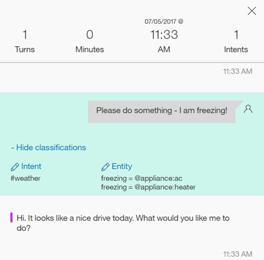

---

copyright:
  years: 2015, 2019
lastupdated: "2019-02-28"

subcollection: assistant

---

{:shortdesc: .shortdesc}
{:new_window: target="_blank"}
{:deprecated: .deprecated}
{:important: .important}
{:note: .note}
{:tip: .tip}
{:pre: .pre}
{:codeblock: .codeblock}
{:screen: .screen}
{:javascript: .ph data-hd-programlang='javascript'}
{:java: .ph data-hd-programlang='java'}
{:python: .ph data-hd-programlang='python'}
{:swift: .ph data-hd-programlang='swift'}

# 從交談中學習
{: #logs}

若要開啟使用者與使用此對話技能的助理之間的訊息清單，請在導覽列中選取**使用者交談**。
{: shortdesc}

當您開啟**使用者交談**頁面時，預設視圖會列出最後一天的結果，最新的結果會先列出。提供訊息中使用的最高目的 (#intent) 和任何辨識到的實體 (@entity) 值，以及訊息文字。針對未辨識的目的，顯示的值是*不相關*。如果未辨識某實體，或尚未提供該實體，則顯示的值是*找不到任何實體*。


請務必注意，**使用者交談**頁面會顯示使用者與應用程式之間的*訊息* 總數。訊息是使用者傳送至應用程式的單一話語。每個交談可能都是由多則訊息組成。因此，此**使用者交談**頁面上的結果數與[概觀](/docs/services/assistant?topic=assistant-logs-overview)頁面上所顯示的交談次數不同。

## 日誌限制
{: #logs-limits}

保留訊息的時間長度，取決於您的 {{site.data.keyword.conversationshort}} 服務方案：

  服務方案                             |聊天訊息保留
  ------------------------------------ | ------------------------------------
  超值                                 |過去 90 天
  加值                                 |過去 30 天
  標準                                 |過去 30 天
  精簡              |過去 7 天

## 過濾訊息
{: #logs-filter-messages}

您可以依*搜尋使用者陳述式*、*目的*、*實體* 及*過去* n *天* 來過濾訊息：

*搜尋使用者陳述式* - 在搜尋列中鍵入字組。這會搜尋使用者的輸入，但不會搜尋應用程式的回覆。

*目的* - 選取下拉功能表，然後在輸入欄位中鍵入目的，或從移入的清單中進行選擇。您可以選取多個目的，以使用任何選取的目的來過濾結果（包括*不相關*）。


*實體* - 選取下拉功能表，然後在輸入欄位中鍵入實體名稱，或從移入的清單中進行選擇。您可以選取多個實體，以依任何選取的實體來過濾結果。如果您依目的*及* 實體過濾，則結果將包含具有這兩個值的訊息。您也可以使用*找不到任何實體* 來過濾結果。


更新訊息需要一些時間。在使用者與應用程式進行互動之後，請至少等待 30 分鐘，再嘗試過濾該內容。

## 檢視個別訊息
{: #logs-see-message}

您可以展開每個訊息項目，以查看使用者在整個交談中談論的內容，以及應用程式如何回答。若要這麼做，請選取**開啟交談**。會自動將您帶到您在該交談內選取的訊息。

在每個交談頂端顯示的時間已本地化，以反映瀏覽器的時區。如果您透過 API 呼叫檢閱相同的交談日誌，這可能與所顯示的時間戳記不同；API 日誌呼叫一律以 UTC 顯示。


然後，您可以選擇顯示所選取訊息的分類。



## 跨助理改善
{: #logs-deploy-id}

建立對話技能是一個反覆運算的處理程序。當您開發技能時，請使用*試用* 窗格來驗證服務辨識測試輸入中的正確目的和實體，並視需要進行更正。

從「使用者交談」頁面，您可以分析用來部署技能的助理與使用者之間的實際互動。您可以根據那些互動來進行更正，以改善對話技能辨識目的和實體的正確性。您很難確切瞭解使用者會*如何* 詢問問題，或他們可能提出的隨機訊息，因此，重點是要經常分析實際交談來改善對話技能。

對於包含多個助理的 {{site.data.keyword.conversationshort}} 實例，有時使用某個助理的對話技能中的訊息資料來改善同一個實例內另一個助理所使用的對話技能會很有幫助。

如果您是「{{site.data.keyword.conversationshort}} 超值」使用者，您的實例可以選擇性地配置成容許跨不同的超值實例來存取助理的日誌資料。

例如，假設您有名為 *HelpDesk* 的 {{site.data.keyword.conversationshort}} 實例。在 HelpDesk 實例中，您可能同時有「正式作業」助理及「開發」助理。在針對「開發」助理的對話技能工作時，您可以使用「正式作業」助理訊息中的日誌，來改善「開發」助理的對話技能。

任何您在「開發」助理的對話技能內進行的編輯，只會影響「開發」助理的對話技能，即使您是使用傳送至「正式作業」助理之訊息中的資料。

同樣地，如果您建立多個技能版本，您可能要使用來自某個版本的訊息資料來改善另一個版本的訓練資料。

### 挑選資料來源
{: #logs-pick-data-source}

*資料來源* 一詞是指透過客戶與已部署對話技能的助理或自訂應用程式之間的交談所編譯的日誌。

當您開啟*分析* 標籤時，會顯示使用者與現行對話技能互動所產生的度量。如果客戶尚未部署及使用現行技能，則不會顯示任何度量。

若要從新增至不同的助理或自訂應用程式（其與客戶互動）的對話技能或技能版本中，將訊息資料移入度量中，請完成下列步驟：

1.  按一下**資料來源**欄位，以查看含有您想要使用之日誌資料的助理清單。

    此清單包括已部署且您可存取的助理。如需該選項的相關資訊，請參閱[*顯示部署 ID*（解釋）](#logs-deployment-id-explained)。

1.  選擇資料來源。

顯示所選取資料來源的統計資訊。

請注意，此清單不包含技能版本。若要取得與特定技能版本相關聯的資料，您必須知道已部署助理使用特定技能版本的時間範圍。您可以選取助理作為資料來源，然後依適當的日期來過濾度量資料。

### *顯示部署 ID*（解釋）
{: #logs-deployment-id-explained}

使用第 1 版 API 的應用程式，必須在使用 `/message` API 傳送的每一則訊息中指定部署 ID。這個 ID 識別從中發出呼叫的已部署應用程式。「分析」頁面可以使用此部署 ID 來擷取及顯示與特定即時應用程式相關聯的日誌。

對於使用第 2 版 API 的助理或自訂應用程式，該服務會隨著每個 /message 呼叫自動包含一個系統 ID 和技能 ID，因此您可以依助理名稱來選擇資料來源，而不必使用部署 ID。

第 1 版 API 使用者要新增部署 ID 時，請在 [context ](https://cloud.ibm.com/apidocs/assistant?curl=#get-response-to-user-input){: new_window} 的 metadata 內包含部署內容，如此範例所示：

```json
"context" : {
            "metadata" : {
       "deployment": "HelpDesk-Production"
  }
}
```
{: codeblock}

## 進行訓練資料改善
{: #logs-fix-data}

使用來自實際使用者交談的見解，來更正與對話技能相關聯的模型。

如果您使用另一個資料來源中的資料，則您對模型所做的任何改善，都只會套用至現行對話技能。**資料來源**欄位顯示您用來改善此對話技能的訊息來源，該頁面頂端顯示您要套用變更的對話技能。

### 更正目的
{: #logs-correct-intent}

1.  若要更正目的，請選取所選擇 #intent 旁的  編輯圖示。
1.  從提供的清單中，選取此輸入的正確目的。
    - 開始在輸入欄位中鍵入，並過濾目的清單。
    - 您也可以從此功能表中選擇**標示為不相關**。（如需相關資訊，請參閱[標示為不相關](/docs/services/assistant?topic=assistant-intents#intents-mark-irrelevant)。）或者，您可以選擇**不對目的進行訓練**，如此就不會儲存此訊息作為訓練的範例。

    
1.  選取**儲存**。

    

    {{site.data.keyword.conversationshort}} 服務支援*依現狀* 將使用者輸入以範例形式新增至目的。如果您要在目的訓練資料中以範例形式使用 @entity 參照，而且您要儲存的使用者訊息包含訓練資料中的實體值或同義字，則稍後您必須編輯該訊息。在儲存之後，請從「目的」頁面編輯訊息，以取代它所參照的實體。如需相關資訊，請參閱[將 @Entity 直接參照為目的範例](/docs/services/assistant?topic=assistant-intents#intents-entity-as-example)。{: tip}

### 新增實體值或同義字
{: #logs-add-entity}

1.  若要新增實體值或同義字，請選取所選擇 @entity 旁的  編輯圖示。
1.  選取**新增實體**。

    
1.  現在，選取畫底線的使用者輸入中的字組或詞組。

    
1.  選擇將所強調顯示的詞組作為值新增至其中的實體。
    - 開始在輸入欄位中鍵入，並過濾實體及值清單。
    - 若要新增所強調顯示的詞組作為現有值的同義字，請從下拉清單中選擇 `@entity:value`。

    
1.  選取**儲存**。

    
